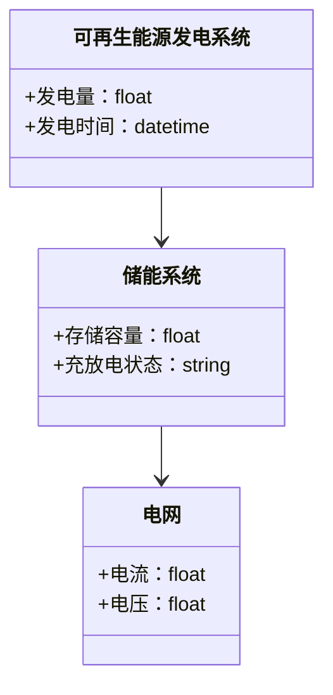
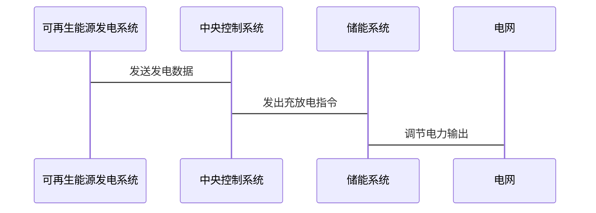

                 


# 可再生能源存储解决方案的市场潜力

## 关键词：可再生能源、储能技术、电池储能、氢能储能、市场潜力

## 摘要：随着全球能源结构的转型和可再生能源的快速发展，储能技术在能源系统中的作用日益重要。本文深入分析了可再生能源存储的核心技术、算法原理、系统架构及市场潜力，探讨了各种储能技术的优缺点，并通过实际案例展示了储能技术的应用前景。

---

# 第一部分：可再生能源存储解决方案的背景与市场潜力

## 第1章：可再生能源存储的背景与问题背景

### 1.1 可再生能源存储的背景

#### 1.1.1 可再生能源的快速发展
全球能源结构正从化石能源向可再生能源转型，太阳能、风能在发电量中的占比逐年增加。然而，可再生能源的不稳定性问题亟待解决，储能技术成为关键。

#### 1.1.2 可再生能源存储的重要性
可再生能源的间歇性导致电网波动，储能技术能够平衡供需，提高电网稳定性，减少能源浪费。

#### 1.1.3 可再生能源存储的全球发展趋势
全球储能市场增长迅速，预计到2030年，储能容量将大幅增加，尤其是电池储能和氢能储能技术的成熟推动了市场扩张。

### 1.2 问题背景与问题描述

#### 1.2.1 可再生能源的不稳定性
太阳能和风能的波动性导致电力供应不稳定，影响电网运行。

#### 1.2.2 可再生能源存储在能源系统中的作用
储能技术能够调节电力供需，优化能源利用，减少弃风弃光现象。

#### 1.2.3 当前储能技术的瓶颈与挑战
现有技术如铅酸电池成本高、循环寿命有限，钠离子电池和固态电池等新技术正在研发，但面临技术成熟度和成本问题。

### 1.3 可再生能源存储的市场潜力

#### 1.3.1 全球储能市场的现状
全球储能市场增长迅速，2023年市场规模约为300亿美元，预计年均增长20%。

#### 1.3.2 可再生能源存储的市场需求
随着可再生能源发电占比增加，储能需求激增，尤其是在电网调频、削峰填谷等领域。

#### 1.3.3 市场潜力与未来发展趋势
未来，储能技术将向高效、低成本、长寿命方向发展，电池储能和氢能储能将成为主流。

### 1.4 核心概念与边界

#### 1.4.1 可再生能源存储的核心概念
储能系统通过物理或化学方法存储能量，在需要时释放，解决可再生能源的间歇性问题。

#### 1.4.2 可再生能源存储的边界与外延
储能系统与电网、发电系统、用户端相连，影响能源系统的整体运行。

#### 1.4.3 可再生能源存储系统的核心要素组成
主要包括能量采集、存储设备、能量管理模块、控制系统等部分。

---

## 第2章：可再生能源存储的核心技术与解决方案

### 2.1 可再生能源存储的核心技术

#### 2.1.1 电池储能技术
电池储能是当前最成熟的储能技术，包括铅酸电池、锂离子电池、钠离子电池等。

#### 2.1.2 氢能储能技术
通过电解水制氢，储存氢气，再通过燃料电池发电，适合大规模储能。

#### 2.1.3 热储能技术
利用熔融盐或相变材料储存热能，适用于集中式可再生能源电站。

### 2.2 各种存储技术的优缺点对比

#### 2.2.1 电池储能的优势与局限性
优势：高效率、响应快、易于部署；局限性：成本高、循环寿命有限、原材料资源问题。

#### 2.2.2 氢能储能的优势与局限性
优势：能量密度高、适合大规模储能；局限性：技术成熟度低、成本高。

#### 2.2.3 热储能的优势与局限性
优势：适合集中式储能、稳定性好；局限性：响应速度慢、应用场景有限。

### 2.3 可再生能源存储解决方案的架构

#### 2.3.1 储能系统的整体架构
包括输入端（可再生能源）、存储设备、能量管理系统、输出端（电网或用户）。

#### 2.3.2 储能系统的功能模块划分
能量采集模块、存储模块、管理模块、控制模块。

#### 2.3.3 储能系统的优化策略
包括能量分配优化、成本最小化、效率最大化。

### 2.4 核心概念与联系

#### 2.4.1 核心概念原理
储能系统通过能量转换和存储，平衡电力供需，优化能源利用。

#### 2.4.2 核心概念属性特征对比表格
| 技术 | 优点 | 缺点 |
|------|------|------|
| 电池储能 | 高效、灵活 | 成本高、寿命有限 |
| 氢能储能 | 大规模、稳定 | 成熟度低、成本高 |
| 热储能 | 高容量、稳定 | 响应慢、应用有限 |

#### 2.4.3 ER实体关系图架构的 Mermaid 流程图
```mermaid
erd
    太阳能发电系统
    风力发电系统
    储能系统
    电网
    用户
    太阳能发电系统 --> 储能系统
    风力发电系统 --> 储能系统
    储能系统 --> 电网
    储能系统 --> 用户
```

---

## 第3章：可再生能源存储技术的算法原理

### 3.1 算法原理概述

#### 3.1.1 储能系统能量管理算法
优化能量存储和释放策略，确保系统高效运行。

#### 3.1.2 储能系统优化算法
通过数学建模和优化方法，降低储能成本，提高效率。

#### 3.1.3 储能系统预测算法
利用天气预测和负荷预测，优化储能容量和运行策略。

### 3.2 算法原理的 Mermaid 流程图

#### 3.2.1 抽水蓄能算法的 Mermaid 流程图
```mermaid
flow
    direction LR
    step1 --> step2 --> step3 --> step4
    step1 给出预测负荷
    step2 计算所需调节功率
    step3 调节水泵运行
    step4 实现电网功率平衡
```

#### 3.2.2 钠离子电池储能算法的 Mermaid 流程图
```mermaid
flow
    direction LR
    step1 --> step2 --> step3
    step1 采集电池参数
    step2 优化充放电策略
    step3 实现能量平衡
```

### 3.3 算法原理的数学模型与公式

#### 3.3.1 能量转换效率公式
$$ \text{效率} = \frac{\text{输出能量}}{\text{输入能量}} \times 100\% $$

#### 3.3.2 储能系统成本模型
$$ C = C_{\text{设备}} + C_{\text{安装}} + C_{\text{维护}} $$

---

## 第4章：可再生能源存储系统的系统分析与架构设计

### 4.1 问题场景介绍
以智能电网项目为例，分析储能系统的应用场景和需求。

### 4.2 系统功能设计

#### 4.2.1 领域模型 Mermaid 类图


### 4.3 系统架构设计

#### 4.3.1 系统架构 Mermaid 图


### 4.4 系统接口设计

#### 4.4.1 接口设计
储能系统与电网、发电系统之间的接口协议，如Modbus、HTTP等。

### 4.5 系统交互 Mermaid 序列图



---

## 第5章：可再生能源存储技术的项目实战

### 5.1 项目介绍
以智能电网项目为例，展示储能系统的实际应用。

### 5.2 核心代码实现

#### 5.2.1 环境配置
Python 3.9以上，安装numpy、pandas库。

#### 5.2.2 核心代码实现
```python
import numpy as np

def calculate_efficiency(input_energy, output_energy):
    return (output_energy / input_energy) * 100

# 示例数据
input_energy = 100  # kWh
output_energy = 85   # kWh

efficiency = calculate_efficiency(input_energy, output_energy)
print(f"能量转换效率为：{efficiency}%")
```

#### 5.2.3 代码应用解读与分析
上述代码计算电池储能的能量转换效率，帮助优化储能系统设计。

### 5.3 实际案例分析与详细讲解剖析
分析智能电网项目的储能容量设计、成本优化和系统运行效率。

### 5.4 项目小结
项目展示了储能技术在智能电网中的应用，验证了算法的有效性。

---

## 第6章：最佳实践、小结、注意事项与拓展阅读

### 6.1 小结
本文全面分析了可再生能源存储的技术、市场和应用前景，强调了储能技术的重要性。

### 6.2 注意事项
选择储能技术时需考虑成本、效率、技术成熟度和应用场景。

### 6.3 拓展阅读
建议读者进一步研究钠离子电池、固态电池和氢储能技术的发展。

---

## 作者：AI天才研究院 & 禅与计算机程序设计艺术

---

通过以上内容，我们详细探讨了可再生能源存储的技术与市场潜力，为读者提供了全面的视角和深入的技术分析。

