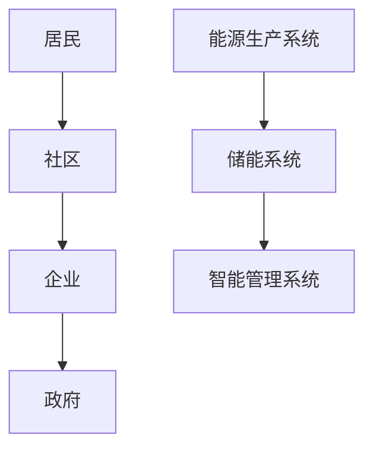
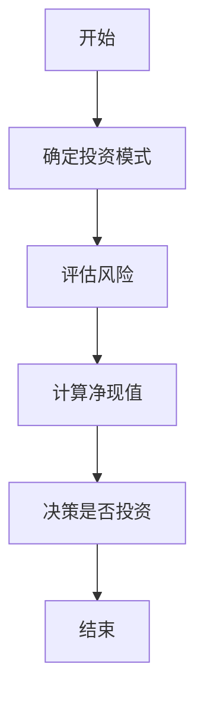

                 


# 可再生能源社区项目的投资模式研究

> 关键词：可再生能源、社区项目、投资模式、能源转型、可持续发展

> 摘要：本文旨在研究可再生能源社区项目的投资模式，分析其核心概念、模式分类、算法原理、系统架构及实际应用案例。通过对比不同投资模式的优缺点，探讨可再生能源社区项目在当前能源转型背景下的投资策略和优化方向。文章结合理论分析与实际案例，提出了一套可再生能源社区项目的投资评估模型，并给出了系统的架构设计和优化建议。

---

## 第一部分: 可再生能源社区项目投资模式的背景与概念

### 第1章: 可再生能源社区项目的背景与现状

#### 1.1 可再生能源的发展背景

##### 1.1.1 全球能源结构转型的背景
全球能源结构正经历从化石能源向可再生能源的重大转型。随着气候变化和环境问题的加剧，各国政府和企业都在积极寻求绿色能源替代方案。可再生能源（如太阳能、风能、生物质能等）因其清洁、可持续的特点，成为全球能源转型的核心方向。

##### 1.1.2 可再生能源的重要性与发展趋势
可再生能源不仅是应对气候变化的关键手段，也是实现能源安全和可持续发展的重要途径。近年来，全球可再生能源装机容量快速增长，特别是在欧洲、中国和美国等主要经济体，可再生能源占比显著提升。

##### 1.1.3 社区可再生能源项目的兴起
社区可再生能源项目是指在社区层面（如居民区、商业区）建设分布式可再生能源系统，例如屋顶太阳能、社区级风力发电等。这类项目不仅能够减少碳排放，还能为社区提供稳定的能源供应，增强社区的能源自主性。

#### 1.2 可再生能源社区项目的定义与特点

##### 1.2.1 可再生能源社区项目的定义
可再生能源社区项目是指在社区范围内，通过分布式能源系统（如太阳能电池板、风力发电设备等）为社区提供绿色能源的项目。这些项目通常由社区居民、企业或地方政府共同参与投资和运营。

##### 1.2.2 社区可再生能源的核心特点
1. **分布式能源**：项目规模较小，通常分散在社区内。
2. **多利益相关者**：涉及居民、企业和政府等多方参与。
3. **本地化管理**：社区项目通常由社区自主管理或委托第三方运营。
4. **环保与经济效益结合**：既能减少碳排放，又能为投资者带来经济收益。

##### 1.2.3 可再生能源社区项目与传统能源的区别
| 特性                | 可再生能源社区项目                | 传统能源项目                |
|---------------------|-----------------------------------|-----------------------------|
| 投资主体            | 社区居民、企业、政府              | 通常是大型能源企业          |
| 能源来源            | 太阳能、风能、生物质能            | 石油、天然气、煤炭          |
| 管理模式            | 分布式、社区化管理                | 中央化、集中式管理          |
| 环境影响            | 低碳或零碳排放                   | 高碳排放                   |

#### 1.3 可再生能源社区项目的投资背景

##### 1.3.1 投资背景与驱动因素
1. **政策支持**：各国政府纷纷出台政策支持可再生能源发展，例如税收优惠、补贴等。
2. **环保需求**：企业和居民对绿色能源的需求日益增长。
3. **能源成本**：可再生能源技术进步使得成本逐步下降，具备投资可行性。

##### 1.3.2 政策支持与市场环境
许多国家和地区通过立法、财政补贴等手段鼓励可再生能源社区项目的发展。例如，德国的“可再生能源法”明确规定了对分布式能源项目的补贴政策。

##### 1.3.3 投资模式的多样性与复杂性
可再生能源社区项目的投资模式多种多样，包括居民共同投资、企业主导投资、政府与社会资本合作（PPP）等。每种模式都有其优缺点，需要根据具体情况选择合适的模式。

---

## 第2章: 可再生能源社区项目的核心概念与体系

### 2.1 可再生能源社区项目的概念体系

#### 2.1.1 核心概念与构成要素
可再生能源社区项目的核心概念包括：
1. **分布式能源系统**：如屋顶太阳能、社区级储能系统。
2. **多利益相关者参与**：居民、企业和政府共同参与投资和运营。
3. **本地化能源管理**：通过智能电网实现社区内能源的优化分配。

#### 2.1.2 概念体系的结构化分析
可再生能源社区项目是一个复杂的系统工程，涉及技术、经济、政策等多个维度。其结构化分析如下：
1. **技术层面**：分布式能源系统的设计与优化。
2. **经济层面**：投资模式的选择与成本收益分析。
3. **政策层面**：政府政策的支持与监管。

#### 2.1.3 核心概念的属性特征对比（表格形式）

| 概念              | 技术特征          | 经济特征          | 政策特征          |
|-------------------|-------------------|-------------------|-------------------|
| 分布式能源系统    | 系统规模小        | 投资成本低        | 需政策支持        |
| 多利益相关者      | 涉及多方参与       | 分配收益复杂       | 需明确权责划分      |
| 本地化管理        | 管理灵活          | 成本分摊困难       | 政策执行难度大      |

### 2.2 可再生能源社区项目的模式分类

#### 2.2.1 项目类型与分类标准
可再生能源社区项目可以根据投资主体、运营模式和技术类型进行分类。常见的分类标准包括：
1. **投资主体**：居民主导、企业主导、政府主导。
2. **运营模式**：独立运营、合作运营。
3. **技术类型**：太阳能、风能、生物质能。

#### 2.2.2 不同模式的优缺点对比（表格形式）

| 模式              | 优点                      | 缺点                      |
|-------------------|---------------------------|---------------------------|
| 居民共同投资      | 群体性强，资金分散        | 管理复杂，协调难度大      |
| 企业主导投资      | 资金充足，管理专业        | 社区参与度低              |
| 政府与社会资本合作 | 政策支持，风险分担        | 过程复杂，审批周期长      |

#### 2.2.3 模式的边界与外延
可再生能源社区项目的模式边界主要体现在投资主体和运营范围上。外延则涉及技术选择、政策支持和社区参与度等多个方面。

### 2.3 可再生能源社区项目的系统架构

#### 2.3.1 项目系统构成
可再生能源社区项目通常包括以下几个核心模块：
1. **能源生产系统**：如太阳能电池板、风力发电机。
2. **储能系统**：用于储存多余的能量，供后续使用。
3. **智能管理系统**：通过智能电网实现能源的优化分配和监控。

#### 2.3.2 核心模块与功能
1. **能源生产模块**：负责将可再生能源转化为电能。
2. **储能模块**：储存多余的能量，确保能源供应的稳定性。
3. **智能管理模块**：实时监控能源生产和消耗情况，优化能源分配。

#### 2.3.3 系统架构的ER实体关系图（Mermaid流程图）



---

## 第3章: 可再生能源社区项目投资模式的分析框架

### 3.1 投资模式的分类与选择

#### 3.1.1 传统投资模式与创新模式的对比
1. **传统模式**：单一主体投资，例如企业独自投资建设可再生能源项目。
2. **创新模式**：多方合作投资，例如居民与企业共同投资。

#### 3.1.2 不同模式的适用场景与特点
| 模式              | 适用场景          | 特点                      |
|-------------------|-------------------|---------------------------|
| 单一主体投资      | 企业资金充足       | 管理简单，风险集中        |
| 多方合作投资      | 社区资金有限       | 群体性强，风险分散        |

#### 3.1.3 投资模式选择的决策框架
选择投资模式时，需要综合考虑资金、风险、收益和政策支持等因素。以下是一个简化的决策框架：

1. **资金来源**：如果资金充足，可以选择企业主导模式。
2. **风险偏好**：如果风险偏好较低，可以选择多方合作模式。
3. **政策支持**：如果有政府政策支持，可以选择PPP模式。

### 3.2 投资模式的数学模型与公式

#### 3.2.1 投资收益计算模型
投资收益可以通过净现值（NPV）来衡量：

$$ NPV = \sum_{t=0}^{n} \frac{C_t}{(1 + r)^t} $$

其中，\( C_t \) 是第 \( t \) 年的净现金流，\( r \) 是折现率，\( n \) 是项目周期。

#### 3.2.2 风险评估公式
风险评估可以通过概率加权法进行：

$$ R = \sum_{i=1}^{n} P_i \times I_i $$

其中，\( R \) 是风险值，\( P_i \) 是第 \( i \) 种风险发生的概率，\( I_i \) 是第 \( i \) 种风险的影响程度。

#### 3.2.3 投资回报率的数学表达式
$$ ROI = \frac{净收益}{投资成本} \times 100\% $$

### 3.3 投资模式的算法原理

#### 3.3.1 投资模式评估算法流程（Mermaid流程图）



#### 3.3.2 算法实现的Python代码

```python
def calculate_NPV(cash_flows, discount_rate):
    npv = 0
    for t, cash_flow in enumerate(cash_flows):
        npv += cash_flow / (1 + discount_rate) ** t
    return npv

# 示例数据
cash_flows = [100, 200, -150, 100]
discount_rate = 0.1

npv = calculate_NPV(cash_flows, discount_rate)
print("净现值为:", npv)
```

---

## 结论与展望

可再生能源社区项目的投资模式研究对实现能源转型和可持续发展具有重要意义。本文通过分析可再生能源社区项目的背景、核心概念、模式分类、算法原理和系统架构，提出了一个完整的投资评估框架。未来的研究可以进一步探讨技术创新和政策优化对可再生能源社区项目的影响，为能源转型提供更多的理论支持和实践指导。

---

作者：AI天才研究院/AI Genius Institute & 禅与计算机程序设计艺术 /Zen And The Art of Computer Programming

