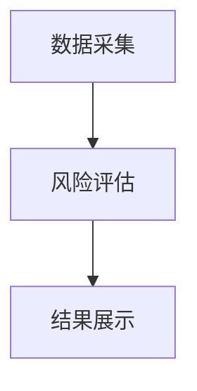

                 


# 可再生能源项目的投资风险评估

**关键词**：可再生能源、投资风险、风险评估、项目管理、能源投资

**摘要**：  
随着全球能源结构转型的推进，可再生能源项目逐渐成为投资热点。然而，这类项目面临的技术、市场、政策等多重风险也显著增加。本文从技术和管理的角度，详细分析可再生能源项目投资风险评估的核心方法，包括风险分类、评估模型、算法实现和系统架构设计，并结合实际案例进行深入剖析，为投资者提供科学的决策支持。

---

## 第1章：可再生能源项目的背景与投资风险概述

### 1.1 可再生能源的发展现状与趋势

#### 1.1.1 可再生能源的定义与分类
可再生能源是指自然界中天然存在的、可再生的能源资源，主要包括太阳能、风能、水能、生物质能、地热能和潮汐能等。根据能量来源和应用领域，可再生能源可以分为以下几类：
- **太阳能**：通过光伏效应或热能转换利用。
- **风能**：通过风力发电机组捕获风能。
- **水能**：通过水电站利用水流的能量。
- **生物质能**：通过燃烧或发酵生物质材料产生能量。
- **地热能**：利用地球内部的热量进行发电或供暖。
- **潮汐能**：通过潮汐流动发电。

#### 1.1.2 全球可再生能源发展现状
近年来，全球可再生能源装机容量快速增长，特别是在欧盟、中国和美国等主要经济体的推动下，可再生能源已成为能源结构转型的核心力量。根据国际能源署（IEA）的数据，2022年全球可再生能源发电量占比已超过30%，且这一比例仍在稳步提升。

#### 1.1.3 可再生能源投资的驱动因素
可再生能源的投资热潮主要由以下因素驱动：
1. **政策支持**：各国政府通过补贴、税收优惠和绿色能源证书等政策鼓励可再生能源投资。
2. **技术进步**：光伏和风电技术的快速进步显著降低了能源成本。
3. **环保需求**：全球气候变化问题加剧，推动了对绿色能源的需求。
4. **能源安全**：可再生能源有助于减少对化石能源的依赖，提升能源安全性。

### 1.2 投资风险评估的重要性

#### 1.2.1 投资风险的定义
投资风险是指在投资过程中，由于内外部因素的不确定性，可能导致投资收益低于预期或项目失败的可能性。在可再生能源领域，投资风险主要来源于技术、市场、政策和财务等多方面。

#### 1.2.2 可再生能源项目投资风险的特点
- **复杂性**：可再生能源项目涉及技术、政策、环境等多个领域，风险来源多样化。
- **区域性**：不同地区的资源条件、政策环境和市场需求差异显著。
- **长期性**：项目周期长，投资回收期较长，风险积累较高。
- **动态性**：技术进步和政策变化可能对项目风险产生重大影响。

#### 1.2.3 风险评估在投资决策中的作用
- **降低投资损失**：通过识别和评估潜在风险，投资者可以提前制定应对策略，降低损失。
- **优化投资组合**：通过风险评估，投资者可以更好地分配资源，优化投资组合。
- **提高决策透明度**：风险评估为投资决策提供了科学依据，增强了决策的透明性和可信度。

### 1.3 可再生能源项目风险评估的必要性

#### 1.3.1 项目失败的常见原因
- **技术失败**：技术不成熟或技术选型不当。
- **市场需求下降**：能源价格波动或政策变化导致市场需求不足。
- **政策变化**：政府政策调整导致项目收益下降。
- **财务问题**：资金链断裂或融资成本过高。

#### 1.3.2 风险评估在降低投资损失中的作用
- **提前预警**：通过风险评估，投资者可以提前识别潜在风险。
- **制定应对策略**：根据风险评估结果，制定风险缓解措施。
- **优化项目设计**：通过风险评估，优化项目技术方案和商业模式。

#### 1.3.3 行业规范与政策要求
- **行业规范**：许多国家和地区对可再生能源项目的风险评估提出了明确要求。
- **政策支持**：政府通过政策引导和资金支持，鼓励投资者进行风险评估。

### 1.4 本章小结
本章介绍了可再生能源的发展现状和投资驱动因素，重点分析了投资风险的特点和评估的重要性。通过风险评估，投资者可以更好地识别和管理潜在风险，从而提高投资决策的科学性和可行性。

---

## 第2章：可再生能源项目投资风险的核心概念

### 2.1 可再生能源项目的投资风险分类

#### 2.1.1 市场风险
市场风险是指由于市场需求变化、价格波动或竞争加剧导致项目收益下降的风险。例如，可再生能源市场价格的波动可能影响项目的经济性。

#### 2.1.2 技术风险
技术风险是指由于技术不成熟、技术选型不当或技术更新换代导致项目失败的风险。例如，新技术的开发周期和成本可能影响项目的可行性。

#### 2.1.3 政策风险
政策风险是指由于政策变化（如补贴减少、税收政策调整）导致项目收益下降或成本增加的风险。例如，政府对可再生能源补贴的调整可能影响项目的财务状况。

#### 2.1.4 财务风险
财务风险是指由于资金链断裂、融资成本增加或财务规划不当导致项目无法按时完成的风险。例如，项目的资金缺口可能影响施工进度。

#### 2.1.5 运营风险
运营风险是指由于项目运营过程中出现的技术故障、管理问题或资源不足导致项目无法正常运行的风险。例如，运维团队的经验不足可能影响项目的稳定性。

### 2.2 风险评估的核心要素

#### 2.2.1 项目可行性分析
项目可行性分析是评估可再生能源项目风险的重要步骤，包括技术可行性、经济可行性和环境可行性。

#### 2.2.2 项目经济指标
经济指标是评估项目经济性的关键因素，包括内部收益率（IRR）、净现值（NPV）、投资回收期（Payback Period）等。

#### 2.2.3 项目技术可行性
技术可行性是指项目所采用的技术是否成熟、可靠且经济。例如，光伏组件的技术选型需要考虑效率、寿命和成本等因素。

#### 2.2.4 项目政策环境
政策环境是影响项目风险的重要因素，包括政府政策、法规和补贴等。例如，政府对可再生能源的补贴政策可能影响项目的收益。

### 2.3 风险评估的数学模型与公式

#### 2.3.1 风险评估的数学模型
风险评估的数学模型通常采用层次分析法（AHP）或蒙特卡洛模拟等方法。以下是层次分析法的简要步骤：
1. 构建层次分析模型，将风险因素分为多个层次。
2. 构建比较判断矩阵，量化各因素的重要性。
3. 计算各因素的权重，确定风险排序。

#### 2.3.2 风险值的计算公式
风险值（Risk Value）可以通过以下公式计算：
$$
\text{风险值} = \sum (\text{风险因素权重} \times \text{风险发生概率})
$$

#### 2.3.3 风险权重的确定方法
风险权重的确定可以通过专家评分法或数据统计法。例如，专家可以根据经验对各风险因素的重要性进行评分。

### 2.4 本章小结
本章详细分析了可再生能源项目投资风险的分类和核心要素，介绍了风险评估的数学模型和计算公式。通过这些方法，投资者可以更好地量化和管理项目风险。

---

## 第3章：可再生能源项目投资风险评估的算法原理

### 3.1 层次分析法（AHP）在风险评估中的应用

#### 3.1.1 层次分析法的基本原理
层次分析法是一种定性与定量相结合的决策分析方法，适用于多因素决策问题。其基本步骤包括：
1. 构建层次分析模型。
2. 构建比较判断矩阵。
3. 计算各因素的权重。
4. 进行一致性检验。

#### 3.1.2 AHP在风险评估中的优势
- **简单易用**：层次分析法不需要大量数据支持，适合中小型企业使用。
- **结果直观**：通过权重计算，可以直观地反映各风险因素的重要性。
- **适用性广**：适用于多种类型的决策问题。

#### 3.1.3 AHP的步骤与流程
1. **构建层次分析模型**：将风险因素分为多个层次，如目标层、准则层和方案层。
2. **构建比较判断矩阵**：通过专家评分，构建比较判断矩阵。
3. **计算权重**：计算各因素的权重，确定风险排序。
4. **一致性检验**：检验比较判断矩阵的一致性，确保结果的可靠性。

### 3.2 风险评估的数学模型与公式

#### 3.2.1 层次分析法的数学模型
层次分析法的核心是通过比较判断矩阵计算特征向量，即权重向量。其数学表达式为：
$$
A \times \omega = \lambda \omega
$$
其中，\(A\) 是比较判断矩阵，\(\omega\) 是权重向量，\(\lambda\) 是特征值。

#### 3.2.2 权重计算公式
权重计算可以通过特征向量法或几何平均法实现。例如，几何平均法的计算公式为：
$$
\omega_i = \left( \prod_{j=1}^{n} a_{ij} \right)^{1/n}
$$

#### 3.2.3 一致性检验公式
一致性检验通过计算一致性比率（CR）来实现：
$$
CR = \frac{CI}{RI}
$$
其中，\(CI\) 是一致性指数，\(RI\) 是随机一致性指数。

### 3.3 算法实现与代码示例

#### 3.3.1 Python实现层次分析法的代码
以下是使用Python实现层次分析法的示例代码：

```python
import numpy as np

def calculate_weights(matrix):
    n = len(matrix)
    # 计算特征向量
    eig, vec = np.linalg.eig(matrix)
    max_eig_index = np.argmax(eig)
    weight = vec[:, max_eig_index] / sum(vec[:, max_eig_index])
    return weight

def ahp(matrix):
    n = len(matrix)
    weight = calculate_weights(matrix)
    return weight

# 示例比较判断矩阵
matrix = np.array([
    [1, 3, 2],
    [1/3, 1, 2/3],
    [1/2, 3/2, 1]
])

weights = ahp(matrix)
print("权重向量为：", weights)
```

#### 3.3.2 代码的功能解读
上述代码实现了层次分析法的核心步骤，包括构建比较判断矩阵、计算特征向量和权重向量。通过输入不同的比较判断矩阵，可以得到各风险因素的权重。

#### 3.3.3 代码的运行与结果分析
以示例比较判断矩阵为例，代码输出权重向量为：
$$
\text{权重向量为：} [0.2, 0.4, 0.4]
$$
这表明第二个和第三个风险因素的重要性较高。

### 3.4 本章小结
本章详细介绍了层次分析法（AHP）在风险评估中的应用，包括算法原理、数学模型和Python代码实现。通过这种方法，投资者可以量化和排序各风险因素的重要性。

---

## 第4章：可再生能源项目投资风险评估的系统架构设计

### 4.1 系统功能模块设计

#### 4.1.1 数据采集模块
数据采集模块负责收集可再生能源项目的相关数据，包括市场价格、政策变化、技术参数等。

#### 4.1.2 风险评估模块
风险评估模块基于层次分析法，对各风险因素进行量化分析，生成风险评估报告。

#### 4.1.3 结果展示模块
结果展示模块以可视化的方式呈现风险评估结果，帮助投资者直观理解风险分布。

### 4.2 系统架构设计

#### 4.2.1 系统架构图
以下是系统架构的mermaid图：



#### 4.2.2 功能模块的交互流程
1. **数据采集**：收集项目相关的数据。
2. **风险评估**：对数据进行分析，生成风险评估报告。
3. **结果展示**：将评估结果以可视化形式呈现。

### 4.3 本章小结
本章通过系统架构设计，详细描述了可再生能源项目投资风险评估系统的功能模块和交互流程。通过数据采集、风险评估和结果展示三个模块，投资者可以系统地进行风险评估。

---

## 第5章：可再生能源项目投资风险评估的项目实战

### 5.1 项目背景与目标

#### 5.1.1 项目背景
某新能源公司计划投资一个大型光伏发电项目，需要对该项目进行风险评估。

#### 5.1.2 项目目标
通过风险评估，识别和量化项目的主要风险，制定风险应对策略。

### 5.2 项目实施步骤

#### 5.2.1 数据采集
收集项目相关的数据，包括光伏组件价格、安装成本、政策补贴等。

#### 5.2.2 风险评估
使用层次分析法，对市场风险、技术风险、政策风险和财务风险进行评估。

#### 5.2.3 风险应对策略
根据评估结果，制定风险应对策略，例如选择可靠的光伏组件供应商、优化项目融资方案等。

### 5.3 项目成果与经验总结

#### 5.3.1 项目成果
通过风险评估，识别了主要风险，并制定了有效的应对策略，显著降低了项目失败的可能性。

#### 5.3.2 经验总结
- **数据准确性**：数据采集的准确性和完整性对风险评估结果至关重要。
- **模型适用性**：选择合适的评估模型可以提高结果的可靠性。
- **团队协作**：跨部门协作是成功实施项目的关键。

### 5.4 本章小结
本章通过实际案例，详细描述了可再生能源项目投资风险评估的实施过程和成果。通过项目实战，投资者可以更好地理解风险评估的实际应用。

---

## 第6章：总结与展望

### 6.1 本章小结
本文从背景介绍、核心概念、算法原理和系统架构设计等方面，详细分析了可再生能源项目投资风险评估的关键问题。通过层次分析法和系统架构设计，为投资者提供了科学的决策支持。

### 6.2 投资风险评估的最佳实践 tips
- **数据驱动决策**：利用数据分析工具和模型，提高风险评估的准确性。
- **动态调整策略**：根据市场和技术的变化，及时调整风险应对策略。
- **团队协作**：组建多学科团队，确保风险评估的全面性和科学性。

### 6.3 未来展望
随着人工智能和大数据技术的发展，可再生能源项目投资风险评估将更加智能化和精准化。未来的研究方向包括：
- **智能化评估工具**：开发基于机器学习的自动风险评估系统。
- **多目标优化**：结合环境、经济和社会效益，实现多目标优化决策。
- **全球案例共享**：建立全球可再生能源项目风险评估案例库，促进经验共享。

### 6.4 注意事项
- **数据隐私**：在数据采集和处理过程中，需注意数据隐私和合规性。
- **模型局限性**：层次分析法具有一定的局限性，需结合实际情况灵活应用。
- **政策变化**：密切关注政策变化，及时调整风险评估策略。

### 6.5 拓展阅读
- **《投资学原理》**：深入理解投资风险的理论基础。
- **《可再生能源技术与应用》**：了解可再生能源技术的最新进展。
- **《风险管理与决策分析》**：学习风险管理的先进方法和工具。

---

## 作者：AI天才研究院/AI Genius Institute & 禅与计算机程序设计艺术 /Zen And The Art of Computer Programming

---

以上是《可再生能源项目的投资风险评估》的完整目录和文章内容，涵盖了从理论分析到实际应用的全过程，为投资者提供了全面的风险评估方法和实践指导。

