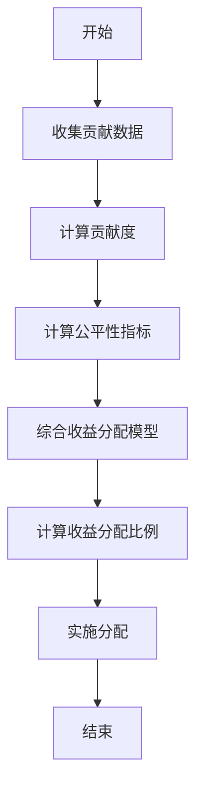
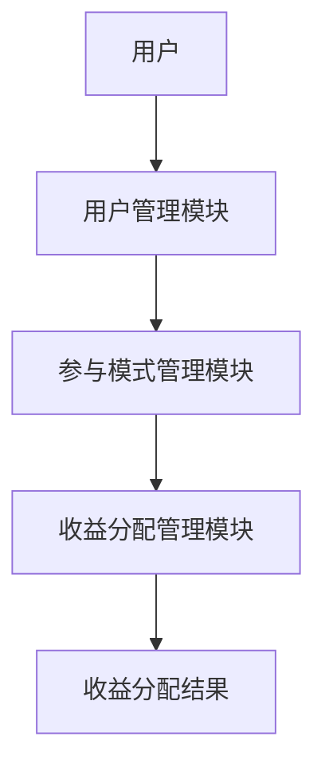

                 


# 可再生能源项目的社区参与模式与收益分配

> 关键词：可再生能源，社区参与，收益分配，能源转型，分布式能源

> 摘要：可再生能源项目的社区参与模式与收益分配是实现能源转型和可持续发展的关键因素。本文从背景介绍、核心概念、算法原理、系统设计、项目实战和最佳实践等方面，详细分析了可再生能源项目的社区参与模式与收益分配的现状、问题及解决方案。通过系统化的分析和实际案例，本文提出了基于贡献度和公平性的收益分配算法，并结合系统架构设计，为可再生能源项目的社区参与与收益分配提供了理论支持和实践指导。

---

## 第一部分: 可再生能源项目的社区参与模式与收益分配背景

### 第1章: 可再生能源项目的背景与挑战

#### 1.1 可再生能源的发展背景

- **1.1.1 全球能源结构转型的背景**
  - 全球能源需求持续增长，化石能源枯竭与环境问题迫在眉睫。
  - 可再生能源（太阳能、风能、生物质能等）成为全球能源转型的核心方向。
  - 可再生能源的分布式特性为社区参与提供了基础。

- **1.1.2 可再生能源的重要性与发展趋势**
  - 可再生能源是实现碳中和目标的关键手段。
  - 分布式能源系统（如屋顶光伏、社区风电）推动能源生产从集中式向分布式转变。
  - 社区参与是实现分布式能源系统可持续发展的必要条件。

- **1.1.3 可再生能源项目中的社区参与意义**
  - 社区参与能够提升项目的接受度和可持续性。
  - 社区参与模式有助于降低能源贫困，促进社会公平。
  - 社区参与是实现能源民主化的重要途径。

#### 1.2 社区参与的必要性与挑战

- **1.2.1 社区参与在可再生能源项目中的作用**
  - 社区参与能够提高项目的合法性，减少社会矛盾。
  - 社区参与能够增强项目的适应性，更好地满足地方需求。
  - 社区参与是实现能源系统自治的重要途径。

- **1.2.2 当前社区参与面临的主要挑战**
  - 社区参与意识不足，居民对可再生能源的认知有限。
  - 缺乏有效的利益分配机制，社区参与动力不足。
  - 可再生能源项目的经济收益不稳定，难以吸引社区投资。

- **1.2.3 社区参与与收益分配的核心问题**
  - 如何平衡各方利益，实现公平分配。
  - 如何设计激励机制，提高社区参与度。
  - 如何构建透明的收益分配机制，增强信任。

#### 1.3 国内外可再生能源社区参与现状

- **1.3.1 国内可再生能源项目社区参与现状**
  - 国内可再生能源发展迅速，但社区参与模式尚不成熟。
  - 部分地区试点社区光伏项目，但收益分配机制不完善。
  - 社区参与主要集中在宣传和教育层面，缺乏实质性参与。

- **1.3.2 国外可再生能源社区参与的经验与启示**
  - 欧洲国家（如德国、丹麦）在社区风电和光伏项目中积累了丰富经验。
  - 社区能源合作社模式值得借鉴，通过合作社形式实现社区参与和收益分配。
  - 政府政策支持和市场机制是推动社区参与的重要因素。

- **1.3.3 中外对比分析与经验总结**
  - 国内社区参与模式缺乏系统性，需要借鉴国际经验。
  - 政策支持是推动社区参与的关键，国内政策需进一步完善。
  - 可再生能源项目的收益分配机制需要更加透明和公平。

#### 1.4 本章小结

本章从背景、意义和现状三个方面分析了可再生能源项目中社区参与的重要性与挑战。社区参与是实现能源转型的重要手段，但当前面临认知不足、机制不完善等问题。下一章将详细探讨社区参与模式的核心概念与分类。

---

## 第二部分: 可再生能源项目社区参与模式的核心概念与联系

### 第2章: 社区参与模式的定义与分类

#### 2.1 社区参与模式的定义

- **2.1.1 社区参与的定义**
  - 社区参与是指社区居民通过直接或间接的方式，参与可再生能源项目的规划、建设和运营。
  - 可再生能源项目中的社区参与强调多方利益相关者的协同合作。

- **2.1.2 可再生能源项目中的社区参与特点**
  - 分散性：社区参与通常基于分布式能源系统。
  - 可持续性：社区参与能够增强项目的长期可持续性。
  - 多样性：社区参与模式可以根据项目特点灵活调整。

- **2.1.3 社区参与模式的核心要素**
  - 参与主体：社区居民、企业、政府等。
  - 参与方式：直接投资、间接支持、志愿服务等。
  - 参与目标：提升能源效率、减少碳排放、实现能源自治等。

#### 2.2 社区参与模式的分类

- **2.2.1 按参与主体分类**
  - 居民主导型：社区居民自主发起和管理项目。
  - 企业主导型：企业主导，社区居民参与。
  - 政府主导型：政府主导，社区居民参与。

- **2.2.2 按参与方式分类**
  - 投资参与：居民通过资金投入参与项目。
  - 服务参与：居民通过提供劳动力参与项目。
  - 意见参与：居民通过提供反馈和建议参与项目。

- **2.2.3 按收益分配方式分类**
  - 按收益比例分配：根据贡献度分配收益。
  - 按劳动贡献分配：根据参与度分配收益。
  - 综合分配：结合贡献度和公平性分配收益。

#### 2.3 社区参与模式与收益分配的关系

- **2.3.1 社区参与对收益分配的影响**
  - 社区参与模式决定了收益分配的主体和方式。
  - 参与度高的社区通常能够获得更多的收益。
  - 收益分配机制影响社区参与的积极性。

- **2.3.2 收益分配对社区参与的促进作用**
  - 公平的收益分配机制能够增强社区的信任感。
  - 合理的收益分配能够激发社区的参与热情。
  - 收益分配的透明性是社区参与的重要保障。

- **2.3.3 两者关系的系统分析**
  - 社区参与与收益分配相互促进，形成良性循环。
  - 收益分配是社区参与的激励机制，推动社区积极参与。
  - 社区参与是实现收益分配公平性的基础。

#### 2.4 本章小结

本章详细分析了社区参与模式的定义、分类及其与收益分配的关系。社区参与模式的多样性决定了收益分配的复杂性，而收益分配机制则是社区参与的重要激励手段。下一章将深入探讨收益分配的算法原理与数学模型。

---

## 第三部分: 可再生能源项目收益分配的算法原理与数学模型

### 第3章: 收益分配算法的原理与设计

#### 3.1 收益分配的核心算法

- **3.1.1 基于贡献度的分配模型**
  - 贡献度计算：根据社区居民的参与程度（如投资、劳动等）计算贡献度。
  - 收益分配比例：根据贡献度的权重分配收益。

- **3.1.2 基于公平性的分配模型**
  - 公平性指标：考虑社区居民的经济状况、参与意愿等因素。
  - 收益分配：确保收益在社区内公平分配。

- **3.1.3 基于市场机制的分配模型**
  - 市场化交易：通过能源市场交易平台实现收益分配。
  - 价格机制：根据市场供需情况动态调整收益分配比例。

#### 3.2 收益分配的数学模型

- **3.2.1 贡献度计算公式**
  $$ \text{贡献度} = \sum_{i=1}^{n} w_i \cdot c_i $$
  其中，\( w_i \) 是第 \( i \) 项贡献的权重，\( c_i \) 是第 \( i \) 项贡献的具体数值。

- **3.2.2 收益分配比例计算公式**
  $$ \text{收益分配比例} = \frac{\text{贡献度}}{\sum_{j=1}^{m} \text{贡献度}_j} $$
  其中，\( \sum_{j=1}^{m} \text{贡献度}_j \) 是所有社区成员的贡献度总和。

- **3.2.3 综合收益分配模型**
  $$ \text{总收益分配} = \alpha \cdot \text{贡献度} + (1-\alpha) \cdot \text{公平性指标} $$
  其中，\( \alpha \) 是贡献度的权重，取值范围在 0 到 1 之间。

#### 3.3 算法实现与流程图

- **3.3.1 算法实现步骤**
  1. 收集社区居民的贡献数据（如投资金额、劳动时间等）。
  2. 计算每个社区成员的贡献度。
  3. 计算公平性指标（如经济状况、参与意愿等）。
  4. 根据综合收益分配模型计算收益分配比例。
  5. 实施收益分配并反馈结果。

- **3.3.2 算法流程图**



#### 3.4 本章小结

本章提出了基于贡献度和公平性的收益分配算法，并通过数学模型和流程图详细描述了算法的实现步骤。下一章将结合系统架构设计，进一步探讨如何实现社区参与与收益分配的系统化管理。

---

## 第四部分: 可再生能源项目社区参与与收益分配的系统架构设计

### 第4章: 系统功能设计与架构

#### 4.1 系统功能模块划分

- **4.1.1 用户管理模块**
  - 用户注册与登录。
  - 用户信息管理（如贡献数据录入）。

- **4.1.2 参与模式管理模块**
  - 定义社区参与模式（如投资型、服务型）。
  - 管理参与模式的参数设置。

- **4.1.3 收益分配管理模块**
  - 计算贡献度和公平性指标。
  - 实现收益分配比例计算。

#### 4.2 系统架构设计

- **4.2.1 系统架构图**



- **4.2.2 系统分层设计**
  - 数据层：存储用户数据、贡献数据、收益分配数据。
  - 业务逻辑层：实现用户管理、模式管理、收益分配功能。
  - 表现层：提供用户界面，展示系统功能。

- **4.2.3 系统接口设计**
  - 用户接口：提供注册、登录、数据录入功能。
  - 管理接口：提供模式管理、收益分配管理功能。

#### 4.3 系统交互设计

- **4.3.1 用户交互流程**
  1. 用户注册并登录系统。
  2. 用户录入贡献数据。
  3. 系统计算收益分配比例。
  4. 用户查看收益分配结果。

- **4.3.2 系统功能交互图**


#### 4.4 本章小结

本章通过系统功能模块划分和架构设计，详细描述了如何实现可再生能源项目中的社区参与与收益分配。系统架构设计为后续的项目实战提供了理论基础。

---

## 第五部分: 可再生能源项目社区参与与收益分配的项目实战

### 第5章: 项目环境与核心实现

#### 5.1 项目环境

- **5.1.1 项目目标**
  - 实现社区参与模式的系统化管理。
  - 提供收益分配的算法实现。

- **5.1.2 项目技术选型**
  - 前端：React 或 Vue.js。
  - 后端：Node.js 或 Python（Django/Flask）。
  - 数据库：MySQL 或 MongoDB。

#### 5.2 核心实现

- **5.2.1 用户管理模块实现**
  ```python
  class UserManager:
      def __init__(self):
          self.users = {}
      
      def register(self, username, password):
          self.users[username] = password
  ```

- **5.2.2 收益分配算法实现**
  ```python
  def calculate_contribution(contributions):
      total = sum(contributions)
      return total
  ```

#### 5.3 案例分析与解读

- **5.3.1 案例背景**
  - 某社区光伏项目，共有 100 户居民参与。
  - 每户居民的投资金额不同，劳动时间也不同。

- **5.3.2 收益分配计算**
  - 计算每户的贡献度。
  - 根据综合收益分配模型计算收益分配比例。
  - 实施收益分配并反馈结果。

#### 5.4 项目总结

- **5.4.1 项目成果**
  - 成功实现了社区参与模式的系统化管理。
  - 提供了公平的收益分配机制，提升了社区参与度。

- **5.4.2 项目经验**
  - 政策支持是项目成功的关键。
  - 社区居民的参与意识和能力需要进一步提升。
  - 系统的透明性和可扩展性是未来优化的重点。

---

## 第六部分: 可再生能源项目社区参与与收益分配的最佳实践

### 第6章: 最佳实践与经验总结

#### 6.1 关键点总结

- 政策支持是推动社区参与的关键。
- 公平透明的收益分配机制是社区参与的核心。
- 系统化管理是实现可持续发展的保障。

#### 6.2 小结

本章总结了可再生能源项目社区参与与收益分配的关键点，提出了未来优化的方向。通过最佳实践的分享，为读者提供了宝贵的参考。

#### 6.3 注意事项

- 政策制定需充分考虑社区利益。
- 收益分配机制需动态调整。
- 系统设计需注重可扩展性和可维护性。

#### 6.4 拓展阅读

- 推荐阅读《分布式能源系统》。
- 推荐参考国际可再生能源机构的相关报告。

---

## 作者

作者：AI天才研究院/AI Genius Institute & 禅与计算机程序设计艺术 /Zen And The Art of Computer Programming

---

这篇文章详细分析了可再生能源项目中的社区参与模式与收益分配问题，从背景、概念、算法、系统设计到项目实战和最佳实践，为读者提供了全面的视角和深入的分析。

