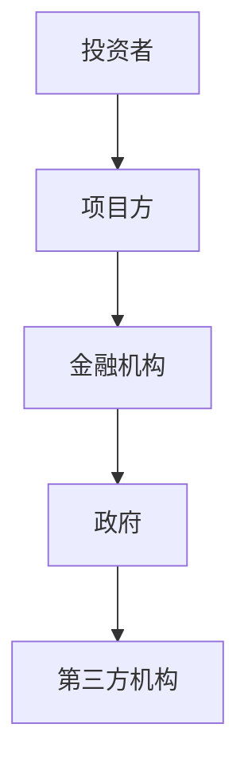
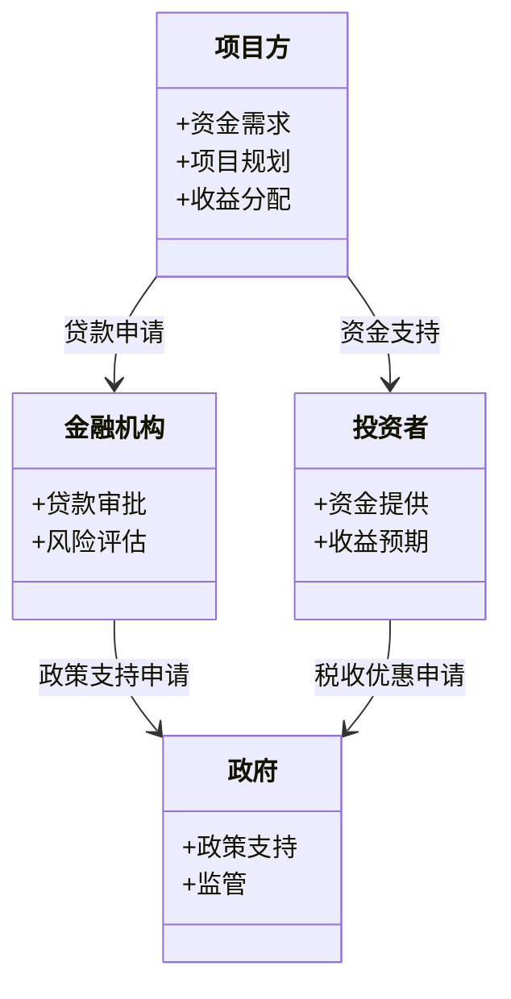
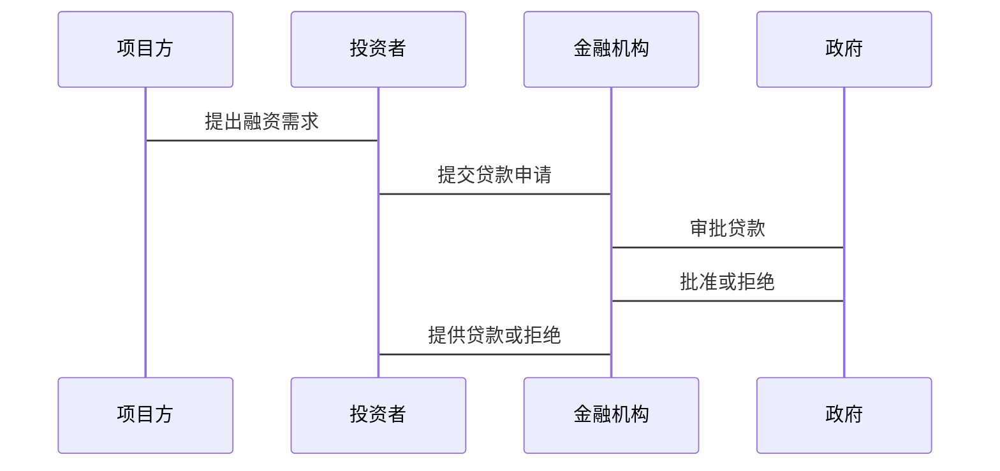

                 


# 可再生能源项目融资模式的创新与风险

## 关键词：可再生能源、项目融资、创新模式、风险管理、绿色金融

## 摘要

随着全球能源结构转型的加速，可再生能源项目在能源生产和消费领域的重要性日益凸显。然而，可再生能源项目的开发和运营需要大量资金支持，传统的融资模式在效率和风险控制上已难以满足行业需求。本文深入分析了可再生能源项目融资模式的创新方向及其潜在风险，探讨了如何通过创新的融资策略来推动行业可持续发展。文章从背景、核心概念、创新模式、风险管理、系统架构等多维度展开，结合实际案例和系统设计，为读者提供了一套完整的解决方案。

---

## 第一部分：可再生能源项目融资模式的背景与发展

### 第1章：可再生能源与融资模式概述

#### 1.1 可再生能源的全球发展现状
- **全球能源转型的背景**：随着气候变化问题的加剧，全球能源结构正在从化石能源向可再生能源转型。国际社会通过《巴黎协定》等多边协议，推动各国减少碳排放，大力发展可再生能源。
- **可再生能源的特点与优势**：可再生能源具有清洁、可持续、分布广泛的特点，主要包括太阳能、风能、水能、生物质能等。其优势在于减少碳排放、降低能源价格波动风险，且资源分布广泛，适合分布式能源系统。
- **融资的重要性**：可再生能源项目的开发需要大量资金支持，尤其是前期投入大、回收周期长的特点，决定了融资是项目成功的关键。

#### 1.2 融资模式的定义与分类
- **融资模式的基本概念**：融资模式是指资金筹集的方式和结构，包括债务融资、股权融资、混合融资等多种形式。在可再生能源领域，融资模式的选择直接影响项目的可行性和收益。
- **传统融资模式与创新融资模式的对比**：传统融资模式以银行贷款为主，风险集中在项目方和金融机构。创新融资模式则引入社会资本、机构投资者等多元资金来源，通过资产证券化、公私合作（PPP）等方式分散风险。
- **可再生能源项目融资的核心要素**：包括项目技术可行性、收益能力、政策支持、融资结构优化等。

#### 1.3 可再生能源项目融资的重要性
- **融资在可再生能源项目中的作用**：融资是可再生能源项目从规划到实施的关键环节，决定了项目的规模、技术选择和运营模式。
- **融资模式创新对行业发展的推动**：通过创新融资模式，可以降低项目门槛，吸引更多社会资本进入可再生能源领域，推动行业快速发展。
- **融资风险的特征与影响**：可再生能源项目面临技术风险、市场风险、政策风险等多重挑战，融资模式的选择需要充分考虑这些因素。

### 第2章：可再生能源项目的融资需求与挑战

#### 2.1 可再生能源项目的资金需求特点
- **项目投资周期长**：可再生能源项目通常需要数年时间进行规划、审批和建设，资金需求具有长期性。
- **资金需求量大**：大型可再生能源项目（如海上风电、大型光伏电站）的投资额往往在数十亿元人民币以上，资金需求量大。
- **资金来源的多样性**：由于项目风险较高，单一的资金来源难以满足需求，需要通过多元化的融资渠道吸引资金。

#### 2.2 融资模式创新的必要性
- **传统融资模式的局限性**：传统融资模式以银行贷款为主，风险集中，且审批流程复杂，难以满足可再生能源项目的多样化需求。
- **可再生能源行业的特殊性要求**：可再生能源项目具有较强的公益性和技术不确定性，需要通过创新融资模式降低风险，吸引投资者。
- **创新融资模式的市场需求**：随着可再生能源市场的扩大，投资者对创新融资模式的需求日益增长，尤其是在风险分担和收益共享方面。

#### 2.3 融资模式创新的边界与外延
- **创新融资模式的适用场景**：适用于大规模、长期性的可再生能源项目，尤其是那些具有稳定收益和政策支持的项目。
- **创新与风险的平衡**：创新融资模式需要在风险可控的前提下进行，避免过度创新导致的系统性风险。
- **创新融资模式的未来发展趋势**：随着技术进步和政策支持，创新融资模式将更加多样化，例如绿色债券、碳金融等。

### 第3章：可再生能源项目融资模式的核心概念与联系

#### 3.1 核心概念原理
- **可再生能源项目的资金流动机制**：资金从投资者流向项目方，通过项目收益再分配给投资者。这一过程中，融资模式决定了资金的流动效率和风险分担机制。
- **创新融资模式的运作原理**：通过引入多元资金来源和创新的金融工具（如资产证券化、保险机制）来降低融资成本，提高资金使用效率。
- **风险管理的核心作用**：通过风险评估和管理，降低融资过程中的不确定性，确保项目顺利实施。

#### 3.2 核心概念属性特征对比表
| 概念 | 属性 | 特征 |
|------|------|------|
| 传统融资模式 | 资金来源 | 银行贷款为主，资金来源单一 |
| 传统融资模式 | 风险分担 | 项目方承担主要风险 |
| 创新融资模式 | 资金来源 | 多元化，包括社会资本、机构投资者等 |
| 创新融资模式 | 风险分担 | 风险分散，通过金融工具降低风险 |

#### 3.3 ER实体关系图


---

## 第二部分：可再生能源项目融资模式的创新与实践

### 第4章：创新融资模式的分类与分析

#### 4.1 主流创新融资模式
- **公私合作模式（PPP）**：通过政府和社会资本合作，降低项目风险，提高资金使用效率。例如，政府提供政策支持，社会资本负责建设和运营，风险由双方分担。
- **资产证券化模式（ABS）**：将可再生能源项目的未来收益打包成金融资产，通过证券化方式吸引投资者。这种方式可以将流动性较低的资产转化为高流动性证券，降低融资成本。
- **绿色债券模式**：发行专门用于可再生能源项目的绿色债券，投资者通过债券收益获得回报，同时支持绿色产业发展。
- **众筹模式**：通过互联网平台吸引小额投资者参与项目融资，适用于中小型可再生能源项目。

#### 4.2 各种融资模式的优缺点对比
| 模式 | 优点 | 缺点 |
|------|------|------|
| PPP | 风险分散、资源优化配置 | 运作复杂、周期长 |
| ABS | 资金流动性高、吸引机构投资者 | 依赖项目收益，风险较高 |
| 绿色债券 | 成本低、政策支持 | 投资者收益有限 |
| 众筹 | 门槛低、参与度高 | 规模有限、风险控制难 |

### 第5章：创新融资模式的系统分析与设计

#### 5.1 系统功能设计
- **领域模型设计**：通过领域模型（mermaid类图）展示可再生能源项目的各个组成部分及其关系。


- **系统架构设计**：通过架构图（mermaid架构图）展示系统的整体结构。


- **系统接口设计**：包括项目方与金融机构的接口、金融机构与政府的接口等。
- **系统交互设计**：通过序列图展示各方在融资过程中的交互流程。


### 第6章：创新融资模式的数学模型与算法原理

#### 6.1 项目现金流分析
- **数学模型**：通过净现值（NPV）和内部收益率（IRR）等指标评估项目的可行性。
$$ \text{NPV} = \sum_{t=0}^{n} \frac{C_t}{(1 + r)^t} $$
其中，\( C_t \) 是第 \( t \) 年的现金流，\( r \) 是贴现率。

- **算法原理**：通过现金流的贴现计算，评估项目的经济可行性。如果 \( NPV > 0 \)，项目具有投资价值。

#### 6.2 风险评估模型
- **风险矩阵**：通过风险发生概率和影响程度矩阵，评估项目风险。
| 风险因素 | 高 | 中 | 低 |
|----------|---|---|---|
| 技术风险 | 高 | 中 | 低 |
| 市场风险 | 中 | 中 | 低 |
| 政策风险 | 低 | 中 | 高 |

- **数学模型**：通过加权平均法计算综合风险指数。
$$ \text{综合风险指数} = \sum (\text{风险因素权重} \times \text{风险等级}) $$

### 第7章：项目实战与案例分析

#### 7.1 环境安装与系统实现
- **环境安装**：搭建可再生能源项目融资分析系统，包括数据采集、分析模块和可视化模块。
- **核心实现源代码**：以下是一个简单的现金流计算示例代码：
```python
def calculate_npv(cash_flows, discount_rate):
    npv = 0
    for t, cash_flow in enumerate(cash_flows):
        npv += cash_flow / (1 + discount_rate) ** t
    return npv

# 示例数据
cash_flows = [ -100, 50, 60, 70 ]
discount_rate = 0.1

print(f"净现值：{calculate_npv(cash_flows, discount_rate)}")
```

#### 7.2 实际案例分析
- **案例介绍**：某大型光伏电站项目，总投资额为50亿元，计划通过PPP模式融资。
- **系统分析**：通过领域模型和系统架构图分析项目的融资流程。
- **风险控制**：利用风险评估模型识别主要风险因素，并制定应对策略。

---

## 第三部分：总结与展望

### 第8章：总结与小结
- **核心内容回顾**：本文从背景、核心概念、创新模式、风险管理等多维度分析了可再生能源项目的融资模式。
- **创新点总结**：通过引入创新融资模式，如PPP、ABS、绿色债券等，解决了传统融资模式的局限性，提高了融资效率和风险控制能力。
- **未来展望**：随着技术进步和政策支持，创新融资模式将更加多样化，绿色金融和碳金融将在可再生能源领域发挥更大作用。

### 第9章：最佳实践与注意事项
- **最佳实践**：选择合适的融资模式需要综合考虑项目特点、资金需求、风险承受能力等因素。
- **小结**：创新融资模式是推动可再生能源发展的关键，但需要在风险可控的前提下进行。

### 第10章：附录
- **附录A**：可再生能源项目融资模式的数学模型公式
- **附录B**：系统架构图和领域模型图
- **附录C**：案例分析详细数据

---

## 作者：AI天才研究院 & 禅与计算机程序设计艺术

---

以上是《可再生能源项目融资模式的创新与风险》的完整目录和文章内容，涵盖了从背景到实践的各个方面，结合了技术分析和实际案例，为读者提供了全面的视角和深入的见解。

