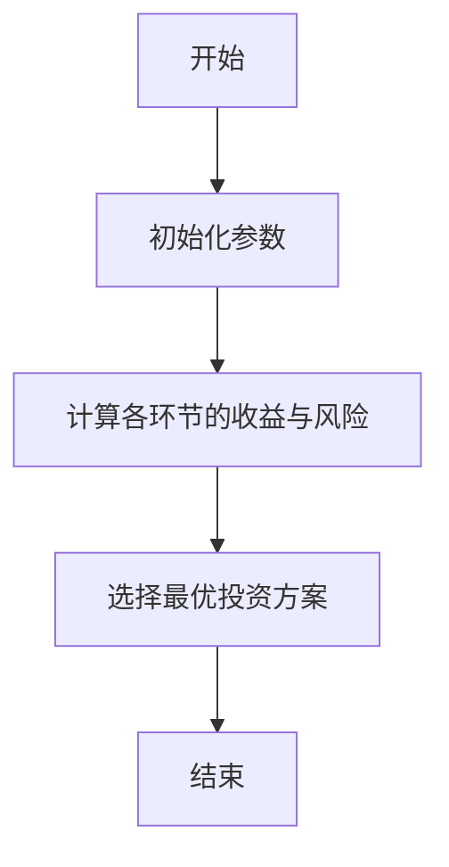
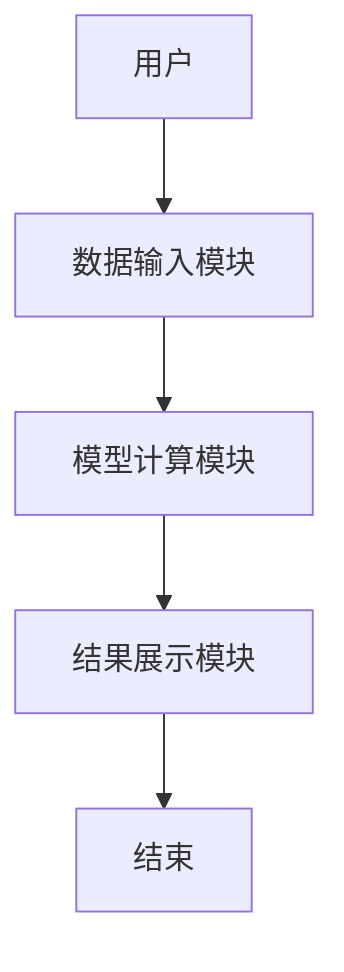

                 


# 可持续农业实践与相关产业链投资

## 关键词：可持续农业，产业链投资，优化模型，系统架构，算法实现

## 摘要：  
随着全球人口增长、资源短缺和环境问题的加剧，可持续农业成为实现粮食安全和环境保护的重要途径。本文从可持续农业的核心概念出发，详细探讨其与产业链投资的结合，分析优化模型与算法实现，并结合实际案例，为读者提供系统化的解决方案和投资建议。

---

# 第一部分: 可持续农业实践与相关产业链投资概述

## 第1章: 可持续农业的背景与概念

### 1.1 可持续农业的定义与特点  
可持续农业是一种在满足当前需求的同时，不破坏未来世代资源利用的农业模式。其特点包括生态友好、经济高效和社会公平。  

#### 1.1.1 可持续农业的核心概念  
可持续农业注重生态系统的健康，强调资源的高效利用和减少对外部输入的依赖。  

#### 1.1.2 可持续农业与传统农业的对比  
| 对比维度 | 可持续农业 | 传统农业 |
|----------|------------|-----------|
| 资源利用 | 循环利用 | 单一输入 |
| 环境影响 | 低污染 | 高污染 |
| 经济效益 | 长期收益 | 短期收益 |

#### 1.1.3 可持续农业的三大支柱  
1. **生态可持续性**：保护土壤、水资源和生物多样性。  
2. **经济可持续性**：实现农民增收和农业企业盈利。  
3. **社会可持续性**：改善农民生活条件，促进社会稳定。  

### 1.2 可持续农业的背景与问题背景  
#### 1.2.1 当前农业面临的环境与资源挑战  
- 土地退化：土壤侵蚀、盐碱化等问题。  
- 水资源短缺：农业用水占全球总用水量的70%以上。  
- 污染问题：化肥、农药的过度使用导致水体富营养化。  

#### 1.2.2 可持续农业的必要性与重要性  
- 应对气候变化：减少温室气体排放，提高碳汇能力。  
- 保障粮食安全：确保全球人口的粮食需求。  
- 提高资源效率：减少对不可再生资源的依赖。  

#### 1.2.3 可持续农业的边界与外延  
可持续农业不仅关注农业生产，还包括加工、销售和消费等环节，形成完整的产业链。  

### 1.3 可持续农业产业链的构成  
#### 1.3.1 农业生产链的结构  
- **生产环节**：种植、养殖。  
- **加工环节**：农产品的加工与包装。  
- **销售环节**：直接销售或通过电商平台。  

#### 1.3.2 产业链各环节的相互关系  
- 生产环节影响加工成本。  
- 加工环节决定产品的市场竞争力。  
- 销售环节反馈市场需求，指导生产调整。  

#### 1.3.3 产业链的外部影响因素  
- 政策支持：政府补贴、税收优惠。  
- 技术创新：农业物联网、精准农业。  
- 市场需求：消费者对绿色产品的偏好。  

### 1.4 本章小结  
本章介绍了可持续农业的定义、特点及其与传统农业的区别，分析了当前农业面临的挑战和可持续农业的重要性，并探讨了产业链的构成与相互关系。

---

# 第二部分: 可持续农业的核心概念与联系

## 第2章: 可持续农业的核心要素与系统模型

### 2.1 可持续农业的核心要素与系统模型  
#### 2.1.1 可持续农业的核心要素  
- **生态要素**：土壤、水资源、生物多样性。  
- **经济要素**：农民收入、企业利润、市场稳定性。  
- **社会要素**：农民生活改善、社会稳定、就业机会。  

#### 2.1.2 可持续农业的系统模型  
系统模型通过整合生态、经济和社会要素，优化农业生产的资源配置。  

#### 2.1.3 系统模型的数学表达  
$$最大化目标函数：Maximize\ Z = a \cdot 资源利用效率 + b \cdot 经济收益 + c \cdot 社会效益$$  
$$约束条件：$$  
$$d \cdot 资源消耗 ≤ 资源总量$$  
$$e \cdot 经济投入 ≤ 预算上限$$  

### 2.2 可持续农业的产业链核心要素对比  
#### 2.2.1 产业链各环节的核心要素对比  
- 生产环节：资源利用效率。  
- 加工环节：产品附加值。  
- 销售环节：市场竞争力。  

#### 2.2.2 产业链核心要素的特征分析  
| 要素 | 特征 |  
|------|------|  
| 资源利用效率 | 高效性 |  
| 产品附加值 | 可持续性 |  
| 市场竞争力 | 竞争力 |  

#### 2.2.3 产业链核心要素的权重分析  
通过层次分析法（AHP），确定各要素的权重，为投资决策提供依据。  

### 2.3 本章小结  
本章分析了可持续农业的核心要素，构建了系统模型，并通过对比分析产业链各环节的核心要素，为后续的投资决策提供了理论基础。

---

# 第三部分: 可持续农业产业链投资的算法与模型

## 第3章: 可持续农业产业链投资的优化模型

### 3.1 可持续农业产业链投资的优化目标  
#### 3.1.1 投资收益最大化  
通过优化资源配置，实现投资收益的最大化。  

#### 3.1.2 投资风险最小化  
通过风险评估模型，降低投资风险。  

#### 3.1.3 投资的可持续性目标  
确保投资对环境、社会和经济的长期影响。  

### 3.2 可持续农业产业链投资的优化模型  
#### 3.2.1 线性规划模型  
$$最大化目标函数：Maximize\ Z = \sum_{i=1}^{n} c_i x_i$$  
$$约束条件：$$  
$$\sum_{i=1}^{n} a_{ij} x_i ≤ b_j,\ j=1,2,…,m$$  
$$x_i ≥ 0$$  

#### 3.2.2 非线性规划模型  
$$最大化目标函数：Maximize\ Z = \sum_{i=1}^{n} c_i x_i^2$$  
$$约束条件：$$  
$$\sum_{i=1}^{n} a_{ij} x_i ≤ b_j,\ j=1,2,…,m$$  
$$x_i ≥ 0$$  

#### 3.2.3 动态规划模型  
通过分阶段决策，优化投资方案。  

### 3.3 可持续农业产业链投资的算法实现  
#### 3.3.1 算法步骤  
1. 确定目标函数和约束条件。  
2. 选择优化算法（如线性规划、动态规划）。  
3. 实现算法并求解。  
4. 验证结果并调整参数。  

#### 3.3.2 算法流程图  


#### 3.3.3 算法实现的Python代码示例  
```python
import numpy as np
from scipy.optimize import linprog

# 定义目标函数
c = [-5, -4, -3]

# 定义约束条件
A = [[2, 1, 0], [0, 3, 1]]
b = [15, 8]

# 线性规划求解
result = linprog(c, A_ub=A, b_ub=b, bounds=(0, None), method='highs')

# 输出结果
print("最优解：", result.x)
print("最大值：", -result.fun)
```

---

## 第4章: 可持续农业产业链投资的系统架构设计

### 4.1 系统架构设计  
#### 4.1.1 应用场景介绍  
系统用于优化可持续农业产业链的投资决策。  

#### 4.1.2 系统功能设计  
- 数据输入模块：用户输入资源、成本和市场需求数据。  
- 模型计算模块：优化算法求解最优投资方案。  
- 结果展示模块：可视化投资方案和效益分析。  

#### 4.1.3 系统架构图  


---

## 第5章: 可持续农业产业链投资的项目实战

### 5.1 环境安装与配置  
安装Python和相关库（如NumPy、SciPy）。  

### 5.2 核心功能实现  
实现优化模型和算法的代码，进行测试和验证。  

### 5.3 案例分析  
以某农业企业为例，分析投资方案的优化结果，并讨论其经济效益和社会效益。  

---

## 第6章: 总结与展望

### 6.1 总结  
本文详细探讨了可持续农业的核心概念、优化模型和系统架构，并结合实际案例，展示了投资方案的优化过程。  

### 6.2 展望  
未来，可持续农业的投资将更加依赖于技术创新和数据驱动的决策支持系统。

---

## 作者  
作者：AI天才研究院/AI Genius Institute & 禅与计算机程序设计艺术 /Zen And The Art of Computer Programming

---

希望这篇文章能够为读者提供关于可持续农业实践与相关产业链投资的全面视角，并为实际投资决策提供参考。

