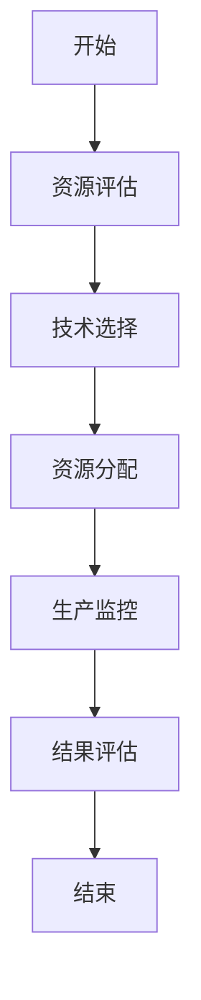
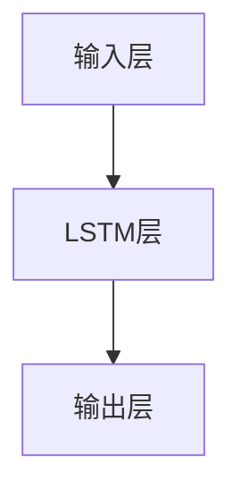
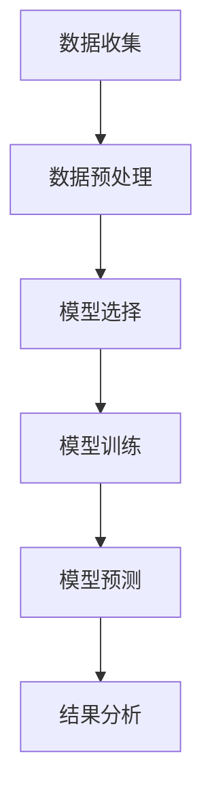
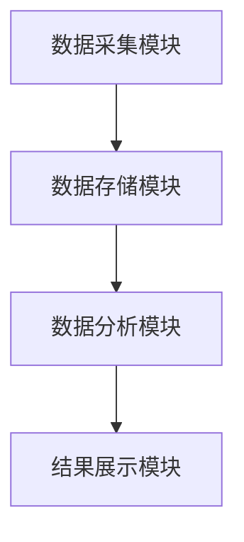

                 


# 可持续农业技术的全球市场规模预测

> 关键词：可持续农业，市场规模预测，技术应用，数据驱动，人工智能，机器学习

> 摘要：本文通过对可持续农业技术的背景、核心概念、算法原理、系统架构、项目实战以及最佳实践的详细分析，预测全球可持续农业技术市场的规模，并提出相关见解和建议。文章结合实际案例，深入探讨了技术在农业中的应用及其对市场规模的影响，为相关领域的研究和实践提供了理论支持和实践指导。

---

## 第1章: 可持续农业技术的背景与问题背景

### 1.1 可持续农业技术的定义与核心要素

#### 1.1.1 可持续农业技术的定义
可持续农业技术是指通过技术手段实现农业生产的可持续性，包括资源高效利用、环境友好、经济效益最大化等方面的技术。其核心目标是在满足当前农业需求的同时，不损害后代发展的可能性。

#### 1.1.2 可持续农业的核心要素
可持续农业的核心要素包括：
- **资源高效利用**：最大化利用水、土地、能源等资源。
- **环境保护**：减少对环境的污染和破坏。
- **经济效益**：提高农业生产效率，降低成本。
- **社会公平**：确保农业发展成果惠及更多人群。

#### 1.1.3 可持续农业与传统农业的对比
| 方面       | 可持续农业                 | 传统农业                   |
|------------|--------------------------|---------------------------|
| 资源利用   | 高效，循环利用           | 低效，资源浪费             |
| 环境影响   | 小，环境友好             | 大，可能导致生态破坏       |
| 经济效益   | 高，长期可持续           | 低，依赖外部输入           |
| 社会影响   | 公平，惠及更多人         | 可能加剧资源分配不均       |

---

### 1.2 全球农业面临的挑战与问题背景

#### 1.2.1 全球人口增长与粮食需求
全球人口预计将在2050年达到90亿，粮食需求将增长60%以上，传统农业模式难以满足这一需求。

#### 1.2.2 环境问题对农业的影响
- 土地退化：全球约25%的土地面临荒漠化风险。
- 水资源短缺：农业用水占全球总用水量的70%。
- 气候变化：极端天气事件频发，影响农业生产稳定性。

#### 1.2.3 农业资源的可持续性问题
- **土壤健康**：过度耕作导致土壤肥力下降。
- **水资源**：农业灌溉导致水资源枯竭。
- **能源消耗**：传统农业依赖化石能源，导致碳排放增加。

---

### 1.3 可持续农业技术的解决方案

#### 1.3.1 技术在农业中的作用
- 提高农业生产效率。
- 优化资源利用。
- 减少环境负担。

#### 1.3.2 可持续农业技术的核心目标
- 实现资源的高效利用。
- 降低农业生产对环境的影响。
- 提高农民收入，促进农业可持续发展。

#### 1.3.3 可持续农业技术的边界与外延
- **边界**：技术必须在经济可行、环境友好的前提下实现。
- **外延**：涵盖农业生产的全过程，包括种植、养殖、加工等环节。

---

## 第2章: 可持续农业技术的核心概念与联系

### 2.1 可持续农业技术的核心概念

#### 2.1.1 农业技术的分类与特点
农业技术可以分为以下几类：
- **传统技术**：如手工耕作、简单灌溉。
- **现代技术**：如精准农业、智能农业。

#### 2.1.2 可持续农业技术的属性特征
- **高效性**：资源利用效率高。
- **环境友好性**：减少污染。
- **经济性**：降低成本，提高收益。

#### 2.1.3 核心概念之间的关系
- 技术是手段，可持续性是目标。
- 各类技术相互关联，共同推动农业可持续发展。

---

### 2.2 可持续农业技术的核心原理

#### 2.2.1 技术原理概述
可持续农业技术的核心原理包括：
- 循环利用资源。
- 减少对环境的依赖。
- 提高生产效率。

#### 2.2.2 技术原理的数学模型
可持续农业技术的资源利用效率可以用以下公式表示：
$$
\text{资源利用效率} = \frac{\text{产出}}{\text{资源消耗}}
$$

#### 2.2.3 技术原理的流程图展示


---

### 2.3 可持续农业技术的实体关系图

#### 2.3.1 ER实体关系图的构建
```mermaid
entity Farmer {
  id
  name
}

entity Technology {
  id
  name
  description
}

entity Resource {
  id
  name
  quantity
}

Farmer -[拥有]-> Technology
Technology -[使用]-> Resource
```

---

## 第3章: 可持续农业技术的市场规模预测算法原理

### 3.1 市场规模预测的核心算法

#### 3.1.1 时间序列分析
时间序列分析是一种基于历史数据预测未来趋势的方法。

#### 3.1.2 机器学习模型
机器学习模型（如随机森林、支持向量机）可以用于市场规模预测。

#### 3.1.3 深度学习模型
深度学习模型（如LSTM）适用于处理复杂的时序数据。

---

### 3.2 算法原理的详细讲解

#### 3.2.1 时间序列分析的数学模型
时间序列分析的常用模型是ARIMA（自回归积分滑动平均模型）：
$$
ARIMA(p, d, q)
$$

其中：
- \( p \)：自回归阶数。
- \( d \)：差分阶数。
- \( q \)：移动平均阶数。

---

#### 3.2.2 机器学习模型的训练过程
1. 数据预处理：清洗、归一化。
2. 特征提取：选择相关特征。
3. 模型训练：使用训练数据拟合模型。
4. 模型验证：使用验证集调整参数。
5. 模型预测：使用测试数据预测市场规模。

---

#### 3.2.3 深度学习模型的网络结构
LSTM网络结构：


---

### 3.3 算法流程图展示

#### 3.3.1 时间序列分析的流程图


---

## 第4章: 可持续农业技术的市场规模预测系统分析与架构设计

### 4.1 系统分析与问题场景介绍

#### 4.1.1 系统目标
预测全球可持续农业技术的市场规模。

#### 4.1.2 系统功能需求
- 数据采集：收集农业相关数据。
- 数据分析：处理数据并预测市场规模。
- 结果展示：以可视化形式呈现预测结果。

#### 4.1.3 系统边界与范围
系统仅关注市场规模预测，不涉及具体技术实现。

---

### 4.2 系统架构设计

#### 4.2.1 系统架构的模块划分
- 数据采集模块：负责数据的收集与存储。
- 数据分析模块：负责数据的处理与预测。
- 结果展示模块：负责预测结果的可视化。

#### 4.2.2 系统架构的详细设计


---

### 4.3 系统接口设计

#### 4.3.1 系统接口的定义
- 数据接口：数据采集模块与存储模块之间的接口。
- 分析接口：数据分析模块与结果展示模块之间的接口。

#### 4.3.2 系统接口的交互流程
1. 数据采集模块接收外部数据。
2. 数据存储模块存储数据。
3. 数据分析模块处理数据并生成预测结果。
4. 结果展示模块展示预测结果。

---

## 第5章: 可持续农业技术的市场规模预测项目实战

### 5.1 项目介绍

#### 5.1.1 项目背景
本项目旨在预测全球可持续农业技术的市场规模。

#### 5.1.2 项目目标
通过数据分析和建模，预测未来5年的市场规模。

---

### 5.2 系统核心实现源代码

#### 5.2.1 环境安装
- Python 3.8+
- NumPy、Pandas、Scikit-learn

#### 5.2.2 核心代码实现
```python
import pandas as pd
from sklearn.model_selection import train_test_split
from sklearn.ensemble import RandomForestRegressor

# 数据加载
data = pd.read_csv('agriculture_data.csv')

# 数据预处理
X = data.drop('size', axis=1)
y = data['size']

# 数据分割
X_train, X_test, y_train, y_test = train_test_split(X, y, test_size=0.2)

# 模型训练
model = RandomForestRegressor(n_estimators=100)
model.fit(X_train, y_train)

# 模型预测
y_pred = model.predict(X_test)

# 结果评估
print('预测结果:', y_pred)
```

---

## 第6章: 可持续农业技术的市场规模预测最佳实践

### 6.1 小结
- 可持续农业技术是未来农业发展的关键。
- 技术的应用可以显著提高资源利用效率。

### 6.2 注意事项
- 数据的准确性和完整性对预测结果至关重要。
- 模型的选择应根据具体问题进行调整。

### 6.3 拓展阅读
- 《可持续农业技术的创新与应用》
- 《人工智能在农业中的应用》

---

## 作者：AI天才研究院/AI Genius Institute & 禅与计算机程序设计艺术 /Zen And The Art of Computer Programming

---

以上是文章的详细目录和部分正文内容，涵盖了从背景分析、核心概念、算法原理到系统设计和项目实战的全过程。通过逐步分析和具体案例的展示，本文为读者提供了全面的可持续农业技术市场规模预测的视角和方法。

