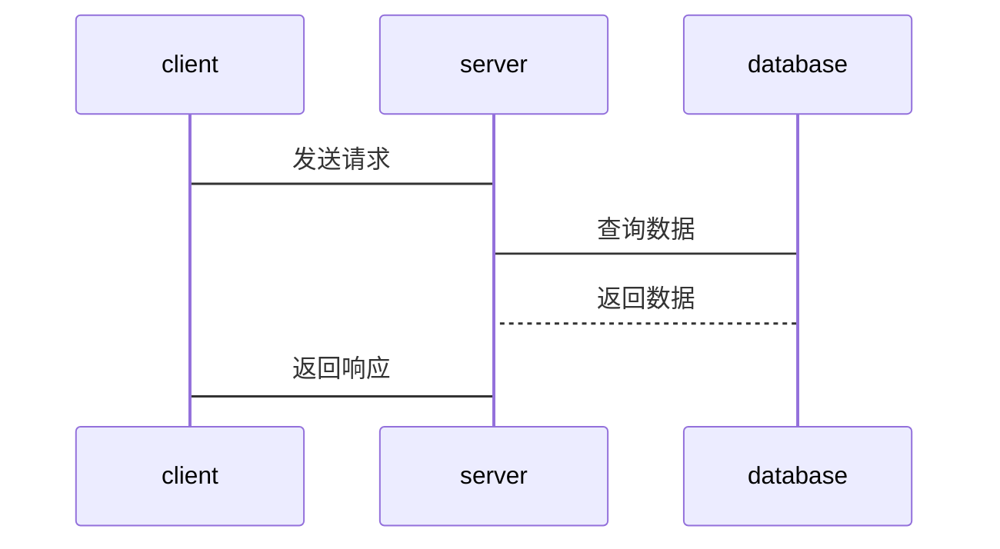

                 


---

# 可持续农业科技公司的市场前景预测

> **关键词**: 可持续农业、科技公司、市场前景、技术应用、系统架构

> **摘要**: 本文探讨了可持续农业科技公司在市场中的前景，分析了其技术应用、系统架构及实际案例，旨在为科技公司高管、农业从业者、投资者及技术爱好者提供深度见解。

---

# 第1章: 可持续农业与科技公司的概述

## 1.1 可持续农业的定义与特征

### 1.1.1 可持续农业的定义
可持续农业是一种旨在满足当前需求的同时，不损害后代需求的生产方式。它强调资源的高效利用和环境保护，避免过度消耗自然资源。

### 1.1.2 可持续农业的核心特征
- **环境友好**: 减少污染，保护生态系统。
- **资源高效**: 优化水、土地和能源的使用。
- **经济可行**: 确保农民能够持续盈利。
- **社会公平**: 促进农村发展，提高农民生活水平。

### 1.1.3 可持续农业与传统农业的区别
| 特征       | 可持续农业                | 传统农业                 |
|------------|---------------------------|--------------------------|
| 资源利用    | 高效，减少浪费            | 低效，资源过度使用        |
| 环境影响    | 低，注重生态保护          | 高，可能破坏生态系统      |
| 经济效益    | 可持续，长期稳定          | 可能波动，依赖外部支持    |

### 1.1.4 可持续农业的重要性
通过可持续农业，我们可以确保粮食安全，减少环境压力，并促进农村地区的可持续发展。

## 1.2 科技公司在农业中的角色

### 1.2.1 科技公司与农业的结合
科技公司通过技术创新，如人工智能、大数据和物联网，推动农业现代化。

### 1.2.2 科技公司对农业的推动作用
- 提高生产效率
- 优化资源利用
- 创新农业模式

### 1.2.3 科技公司面临的挑战
- 技术成本高
- 市场接受度低
- 政策支持不足

## 1.3 可持续农业科技公司的定义

### 1.3.1 可持续农业科技公司的定义
可持续农业科技公司是指利用先进技术，推动农业可持续发展的企业。

### 1.3.2 可持续农业科技公司的核心目标
- 实现农业高效生产
- 保护环境
- 提高农民收入

### 1.3.3 可持续农业科技公司的边界与外延
可持续农业科技公司不仅限于技术应用，还包括农业模式的创新和管理方式的优化。

---

# 第2章: 可持续农业科技公司的核心概念

## 2.1 可持续农业科技公司的核心概念

### 2.1.1 可持续性
可持续性是公司发展的基石，涵盖环境、经济和社会三个方面。

### 2.1.2 农业科技
农业科技是公司的技术基础，包括AI、大数据和物联网等。

### 2.1.3 企业责任
公司需承担社会责任，推动可持续发展。

## 2.2 核心概念的属性对比

### 2.2.1 可持续性与效率的对比
| 维度   | 可持续性                  | 效率                   |
|--------|--------------------------|------------------------|
| 短期目标| 长期稳定                  | 当前最大化             |
| 资源消耗| 节约                     | 可能过度               |
| 风险   | 较低                     | 较高                   |

### 2.2.2 农业科技与传统农业的对比
| 特征       | 农业科技                | 传统农业                 |
|------------|---------------------------|--------------------------|
| 技术水平    | 高，依赖创新             | 低，依赖传统方法         |
| 生产效率    | 高，资源利用高效         | 中等，资源利用低效       |
| 环境影响    | 低，注重生态保护         | 高，可能破坏环境         |

## 2.3 ER实体关系图

```mermaid
erd
    entity 可持续农业科技公司 {
        key: ID
        attributes: 企业名称, 法人代表, 注册资本, 经营范围
    }
    entity 农业科技 {
        key: ID
        attributes: 技术类型, 应用场景, 研发能力
    }
    entity 可持续性 {
        key: ID
        attributes: 环境影响, 社会影响, 经济效益
    }
    可持续农业科技公司 --> 农业科技: 实施的农业科技
    可持续农业科技公司 --> 可持续性: 达成的可持续目标
```

---

# 第3章: 可持续农业科技公司的技术分析

## 3.1 可持续农业科技公司的技术应用

### 3.1.1 人工智能在农业中的应用
AI用于作物监测、病虫害预测和产量优化。

### 3.1.2 大数据的应用
大数据分析气候数据和市场趋势，帮助决策。

### 3.1.3 物联网的应用
物联网设备监测土壤湿度和温湿度，实现精准农业。

## 3.2 可持续农业科技公司的预测模型

### 3.2.1 预测模型的构建
预测模型基于机器学习，结合历史数据和环境因素。

### 3.2.2 算法原理
预测模型使用回归分析，公式为：
$$ y = \beta_0 + \beta_1x_1 + \beta_2x_2 + \epsilon $$

### 3.2.3 代码实现

```python
import pandas as pd
from sklearn.linear_model import LinearRegression

# 数据加载
data = pd.read_csv('agriculture.csv')

# 模型训练
model = LinearRegression()
model.fit(data[['temperature', 'rainfall']], data['yield'])

# 预测结果
predicted_yield = model.predict(data[['temperature', 'rainfall']])
```

---

# 第4章: 可持续农业科技公司的系统架构设计

## 4.1 系统功能设计

### 4.1.1 功能模块
- 数据采集模块
- 数据分析模块
- 决策支持模块

## 4.2 系统架构设计


## 4.3 系统接口设计

### 4.3.1 接口描述
- 前端与后端通过REST API交互。
- 数据库通过ORM进行数据持久化。

## 4.4 系统交互流程



---

# 第5章: 可持续农业科技公司的项目实战

## 5.1 智能温室系统案例分析

### 5.1.1 系统环境安装
安装Python、Django框架和传感器设备。

### 5.1.2 核心代码实现

```python
import RPi.GPIO as GPIO
import time

# 设置GPIO模式
GPIO.setmode(GPIO.BCM)

# 定义引脚
sensor_pin = 4
led_pin = 17

# 初始化引脚
GPIO.setup(sensor_pin, GPIO.IN)
GPIO.setup(led_pin, GPIO.OUT)

while True:
    if GPIO.input(sensor_pin) == 1:
        GPIO.output(led_pin, GPIO.HIGH)
    else:
        GPIO.output(led_pin, GPIO.LOW)
    time.sleep(1)
```

### 5.1.3 系统运行结果
系统实现了环境监测和自动控制，提高了温室效率。

---

# 第6章: 可持续农业科技公司的市场与未来展望

## 6.1 市场现状分析

### 6.1.1 行业规模
全球可持续农业科技市场规模预计年增长15%。

## 6.2 未来趋势预测

### 6.2.1 技术进步
AI和大数据将更广泛地应用于农业。

### 6.2.2 政策支持
政府将提供更多支持，推动行业的发展。

### 6.2.3 投资机会
投资者将更关注可持续农业科技公司。

---

# 总结

可持续农业科技公司通过技术创新推动农业发展，市场前景广阔。本文详细分析了技术应用、系统架构和实际案例，为读者提供了全面的视角。

---

**作者：AI天才研究院/AI Genius Institute & 禅与计算机程序设计艺术 /Zen And The Art of Computer Programming**

