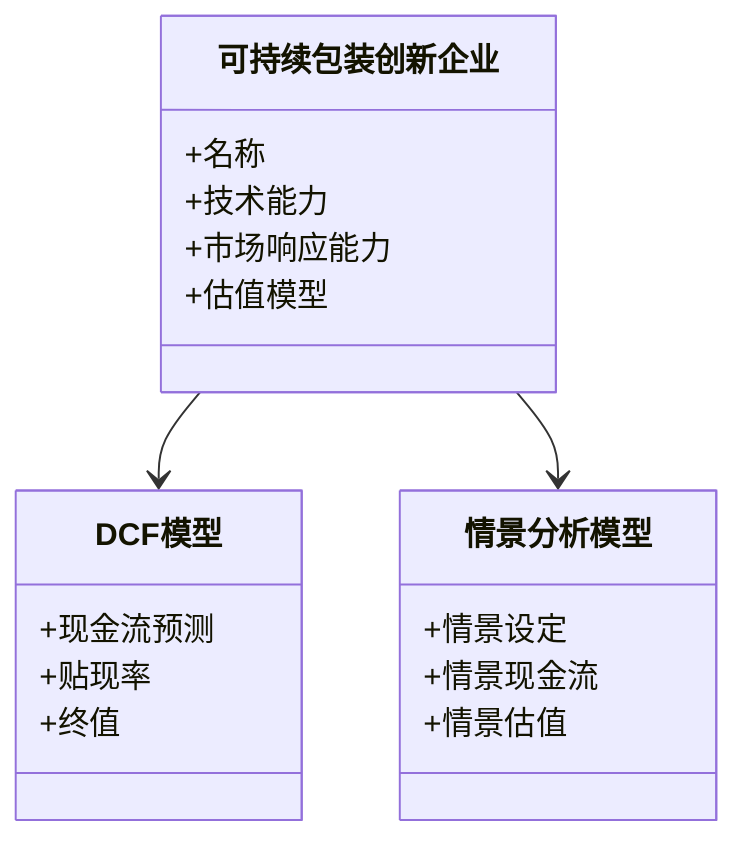
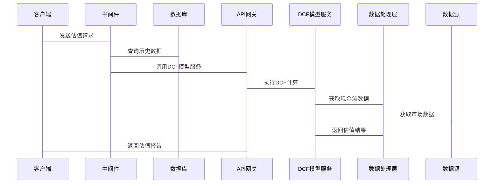

                 


# 可持续包装创新企业的市场估值方法

> 关键词：可持续包装，创新企业，市场估值，DCF模型，循环经济，环保技术

> 摘要：本文深入探讨了可持续包装创新企业的市场估值方法，分析了其核心概念、市场定位及估值模型，并结合实际案例进行了详细解读。文章从背景介绍、核心概念、估值方法、系统分析、项目实战等多维度展开，为读者提供了全面的视角和实用的工具。

---

## 第一部分：可持续包装创新企业的背景与概念

### 第1章：可持续包装创新企业的背景与问题背景

#### 1.1 可持续包装创新企业的定义与背景

##### 1.1.1 可持续包装的定义
可持续包装是指在材料选择、生产过程、使用阶段和废弃处理等全生命周期中，尽量减少对环境的影响，同时具备可回收、可降解或可重复使用特性的包装形式。

##### 1.1.2 创新企业在包装行业的地位
创新企业通过技术研发和模式创新，推动包装行业向绿色化、智能化和高效化方向发展，是包装行业转型升级的核心驱动力。

##### 1.1.3 可持续包装与创新企业的结合
可持续包装与创新企业的结合体现在技术创新、商业模式创新和资源效率提升三个方面。创新企业通过技术突破和模式创新，推动包装行业实现可持续发展。

#### 1.2 可持续包装创新企业的问题背景

##### 1.2.1 包装行业面临的环境问题
传统包装行业存在资源浪费、环境污染、碳排放高等问题，亟需通过技术创新和模式创新实现绿色转型。

##### 1.2.2 创新企业在包装行业的机遇与挑战
创新企业面临政策支持、市场认可度提升的机遇，但也面临技术瓶颈、成本压力和市场竞争的挑战。

##### 1.2.3 可持续包装与企业价值的关系
可持续包装不仅关乎环境保护，还与企业长期价值创造密切相关。通过可持续包装创新，企业可以提升品牌价值、降低运营成本并开拓新兴市场。

#### 1.3 可持续包装创新企业的核心概念

##### 1.3.1 可持续包装的核心要素
可持续包装的核心要素包括：可回收性、可降解性、可重复使用性、低环境影响和资源效率。

##### 1.3.2 创新企业的核心能力
创新企业的核心能力包括：技术创新能力、产品设计能力、市场响应能力和供应链管理能力。

##### 1.3.3 可持续包装与企业估值的关联性
可持续包装创新企业的市场估值与其技术创新能力、商业模式创新和市场认可度密切相关。

---

## 第二部分：可持续包装创新企业的核心概念与联系

### 第2章：可持续包装创新企业的核心概念与联系

#### 2.1 可持续包装的核心概念

##### 2.1.1 环境友好型包装材料
环境友好型包装材料包括可降解材料、可再生材料和可回收材料，如PLA、淀粉基材料和再生纸。

##### 2.1.2 循环经济模式
循环经济模式强调包装材料的闭环循环，通过设计、生产、使用和回收实现资源的高效利用。

##### 2.1.3 包装技术创新
包装技术创新包括新型材料开发、智能包装技术（如温控包装、智能传感器）和数字包装技术（如二维码溯源）。

#### 2.2 创新企业的核心能力

##### 2.2.1 技术创新能力
技术创新能力是创新企业的核心竞争力，体现在材料研发、工艺优化和设备创新等方面。

##### 2.2.2 产品设计能力
产品设计能力决定了包装的用户体验和功能性，创新企业通过人性化设计和功能优化提升市场竞争力。

##### 2.2.3 市场响应能力
市场响应能力是指企业快速适应市场变化的能力，包括产品迭代、市场推广和客户关系管理。

#### 2.3 可持续包装与企业估值的关系

##### 2.3.1 可持续包装对企业价值的影响
可持续包装创新企业通过降低环境影响和资源消耗，提升企业形象和市场竞争力，从而增加企业价值。

##### 2.3.2 创新能力与企业估值的正相关性
企业的创新能力越强，市场估值越高，因为技术创新和模式创新能够带来更高的利润率和市场份额。

##### 2.3.3 环境因素对企业估值的长期影响
环境因素对企业的长期估值具有重要影响，可持续包装创新企业能够通过降低环境风险提升企业价值。

#### 2.4 核心概念对比分析

##### 2.4.1 可持续包装与传统包装的对比
| 特性                | 可持续包装             | 传统包装             |
|---------------------|-----------------------|----------------------|
| 材料                | 可降解、可再生         | 常规材料             |
| 环境影响            | 低环境影响             | 高环境影响           |
| 成本                | 较高                   | 较低                 |
| 市场需求            | 高（环保需求）         | 一般                 |

##### 2.4.2 创新企业与传统企业的对比
| 特性                | 创新企业              | 传统企业             |
|---------------------|----------------------|----------------------|
| 技术能力            | 强                    | 弱                  |
| 市场响应能力        | 强                    | 弱                  |
| 估值                | 高                    | 低                  |

##### 2.4.3 环境因素与经济因素的对比
| 特性                | 环境因素              | 经济因素             |
|---------------------|----------------------|----------------------|
| 影响                | 长期影响              | 短期影响             |
| 重要性              | 高                    | 高                  |
| 估值影响            | 高                    | 中                  |

---

## 第三部分：可持续包装创新企业的市场估值方法

### 第3章：可持续包装创新企业的市场估值方法

#### 3.1 企业价值评估的基本原理

##### 3.1.1 企业价值的定义
企业价值是指企业在持续经营条件下，所有资产的公平市场价值，包括股东权益、债权权益等。

##### 3.1.2 企业价值评估的常用方法
- **绝对估值法**：如现金流贴现模型（DCF）。
- **相对估值法**：如市盈率法、市净率法。
- **情景分析法**：通过不同情景下的企业价值进行比较。

##### 3.1.3 可持续包装创新企业的特殊性
可持续包装创新企业具有较高的技术门槛和市场不确定性，需要结合技术创新能力和市场潜力进行估值。

#### 3.2 可持续包装创新企业的估值模型

##### 3.2.1 现金流贴现模型（DCF）
现金流贴现模型是通过预测企业未来现金流并将其贴现到现值，以评估企业价值。

- **公式**：$$企业价值 = \sum_{t=1}^{n} \frac{CF_t}{(1+r)^t} + \frac{TV}{(1+r)^n}$$
- **步骤**：
  1. 预测未来现金流。
  2. 确定贴现率。
  3. 计算未来现金流的现值。
  4. 加上终值的现值，得到企业价值。

##### 3.2.2 情景分析法
情景分析法通过构建不同情景（如最佳情景、最差情景、基本情景）下的企业价值，评估企业的潜在价值范围。

##### 3.2.3 市盈率与市净率法
- **市盈率法**：$$P/E = \frac{股票价格}{每股收益}$$
- **市净率法**：$$P/B = \frac{股票价格}{每股净资产}$$

#### 3.3 可持续包装创新企业的估值模型

##### 3.3.1 DCF模型在可持续包装创新企业的应用
以一家专注于可降解材料研发的创新企业为例，假设其未来5年的现金流如下：

| 年份 | 现金流（万元） |
|------|----------------|
| 2024 | 100            |
| 2025 | 150            |
| 2026 | 200            |
| 2027 | 250            |
| 2028 | 300            |

贴现率假设为8%。

$$企业价值 = \frac{100}{1.08^1} + \frac{150}{1.08^2} + \frac{200}{1.08^3} + \frac{250}{1.08^4} + \frac{300}{1.08^5} + \frac{350}{1.08^5}$$

##### 3.3.2 情景分析法的应用
- **最佳情景**：市场需求增长超预期，企业收入增长20%。
- **基本情景**：市场需求稳定，收入增长10%。
- **最差情景**：市场需求低于预期，收入增长5%。

##### 3.3.3 市盈率与市净率法的应用
- **市盈率法**：假设行业平均市盈率为20，企业净利润为500万元，则股票合理价格为：
  $$股票价格 = 20 \times 500 = 10000万元$$
- **市净率法**：假设企业净资产为8000万元，行业平均市净率为3，则股票合理价格为：
  $$股票价格 = 3 \times 8000 = 24000万元$$

#### 3.4 可持续包装创新企业的

---

## 第四部分：系统分析与架构设计方案

### 第4章：系统分析与架构设计方案

#### 4.1 问题场景介绍
假设我们正在为一家专注于智能包装解决方案的创新企业设计一个市场估值系统。

#### 4.2 系统功能设计

##### 4.2.1 领域模型（Mermaid 类图）


#### 4.3 系统架构设计（Mermaid 架构图）


#### 4.4 系统接口设计
- **输入接口**：接受企业的财务数据和市场数据。
- **输出接口**：生成企业估值报告和可视化图表。

#### 4.5 系统交互（Mermaid 序列图）


---

## 第五部分：项目实战

### 第5章：项目实战

#### 5.1 环境安装
- **工具**：Python 3.8+, Pandas, NumPy, Matplotlib。
- **安装命令**：
  ```bash
  pip install pandas numpy matplotlib
  ```

#### 5.2 系统核心实现源代码

##### 5.2.1 DCF模型实现
```python
import pandas as pd
import numpy as np

def dcfvaluation(enterprise_info):
    # 输入参数
    revenue = enterprise_info['revenue']
    growth_rate = enterprise_info['growth_rate']
    wacc = enterprise_info['wacc']
    horizon = 5
    terminal_value_growth = 0.02

    # 预测现金流
    cf = []
    for i in range(horizon):
        cf.append(revenue * (1 + growth_rate)**i)
        revenue = revenue * (1 + growth_rate)

    # 终值
    terminal_value = cf[-1] * (1 + terminal_value_growth) / (wacc - terminal_value_growth)
    cf.append(terminal_value)

    # 贴现现金流
    discounted_cf = [cf[i] / (1 + wacc)**i for i in range(len(cf))]
    total_value = sum(discounted_cf)

    return total_value

enterprise_info = {
    'revenue': 100,
    'growth_rate': 0.2,
    'wacc': 0.08
}

valuation = dcfvaluation(enterprise_info)
print(f"企业估值为：{valuation:.2f}万元")
```

#### 5.3 代码应用解读与分析
- **输入参数**：企业收入、增长率和加权平均资本成本。
- **输出结果**：企业估值。

#### 5.4 实际案例分析
以一家年收入为100万元，年增长率为20%，加权平均资本成本为8%的可持续包装创新企业为例，计算其企业估值。

#### 5.5 项目小结
通过DCF模型实现企业的市场估值，能够帮助企业更好地理解其价值创造过程，并为投资决策提供科学依据。

---

## 第六部分：总结与展望

### 第6章：总结与展望

#### 6.1 本章总结
本文从可持续包装创新企业的市场估值方法出发，结合理论分析和实际案例，详细探讨了企业价值评估的核心概念、方法和实现路径。

#### 6.2 未来展望
未来，随着技术进步和市场需求的变化，可持续包装创新企业的估值方法将更加多元化和智能化，企业需要持续创新以保持竞争优势。

---

## 作者信息

作者：AI天才研究院/AI Genius Institute & 禅与计算机程序设计艺术/Zen And The Art of Computer Programming

