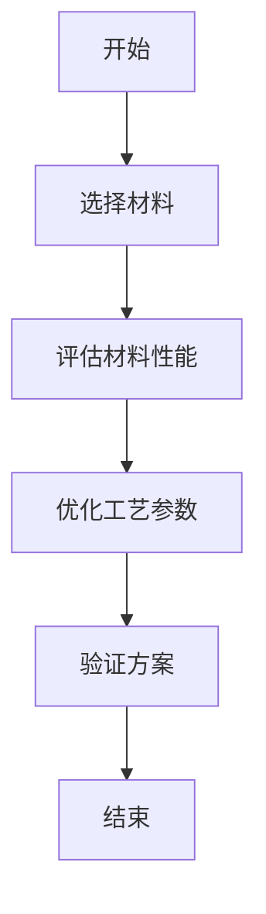

                 


# 可持续包装解决方案提供商的投资价值

## 关键词：可持续包装，投资价值，包装解决方案，技术分析，商业模式，风险管理

## 摘要：  
可持续包装解决方案提供商的投资价值在当前环保趋势下备受关注。本文系统分析了可持续包装的核心概念、技术原理、市场现状、投资价值、商业模式、风险管理和未来趋势。通过技术分析和案例研究，揭示了可持续包装解决方案的潜力和挑战，为投资者提供了全面的投资策略和风险管理建议。

---

# 第1章: 可持续包装解决方案的背景与问题背景

## 1.1 可持续包装的定义与核心概念

### 1.1.1 可持续包装的定义  
可持续包装是指在整个生命周期中，从原材料获取、生产、使用到废弃处理，尽可能减少对环境的影响，同时具备可回收性、可降解性或可重复使用性的包装解决方案。

### 1.1.2 可持续包装的核心要素  
- **材料选择**：使用可再生、可降解或可回收的材料，如生物基塑料、纸质材料等。  
- **生产过程**：采用节能、减排的生产工艺，减少资源消耗和环境污染。  
- **设计优化**：通过创新设计减少材料用量，同时提高包装的保护性能。  
- **废弃处理**：确保包装废弃物能够被有效地回收或降解，减少对环境的负担。  

### 1.1.3 可持续包装的背景与问题背景  
随着全球环境问题的加剧，包装行业对环境的影响日益显著。传统包装材料（如塑料）的大量使用导致资源枯竭、环境污染和生态破坏。消费者环保意识的提升和政策法规的推动，使得企业必须寻找更环保的包装解决方案。

### 1.1.4 可持续包装的边界与外延  
可持续包装的边界包括材料选择、生产工艺、设计优化和废弃处理；外延则涉及从生产到消费的整个链条，涵盖包装的全生命周期管理。

---

## 1.2 可持续包装的现状与挑战

### 1.2.1 全球包装行业的现状分析  
全球包装市场规模庞大，传统包装材料占据主导地位，但其对环境的负面影响日益显著。

### 1.2.2 可持续包装的市场需求  
消费者对环保产品的需求增长，推动了可持续包装的市场需求，尤其是在食品、饮料和日用品行业。

### 1.2.3 可持续包装技术的局限性  
- **技术成熟度**：部分可持续包装技术尚未完全成熟，如生物基材料的成本较高且性能不稳定。  
- **成本问题**：可持续包装的初始成本高于传统包装，限制了其广泛应用。  

### 1.2.4 可持续包装的行业痛点  
- **技术壁垒**：企业转型需要投入大量资源，技术门槛较高。  
- **消费者认知**：部分消费者对可持续包装的认知不足，影响市场需求。  

---

## 1.3 可持续包装的技术与市场趋势

### 1.3.1 可持续包装技术的演进  
从传统塑料包装到可降解材料包装，再到智能包装技术的应用，可持续包装技术不断演进。

### 1.3.2 可持续包装的市场驱动因素  
- **消费者需求**：环保意识推动消费者选择可持续包装产品。  
- **政策法规**：政府出台相关政策，推动企业采用可持续包装。  
- **技术创新**：新材料和新工艺的出现，降低了可持续包装的成本。  

### 1.3.3 可持续包装的未来趋势  
未来，可持续包装将更加智能化、可回收化和低成本化，同时应用场景将更加广泛。

---

## 1.4 可持续包装的驱动因素

### 1.4.1 环境保护驱动  
全球环境问题加剧，推动企业采用可持续包装以减少环境影响。

### 1.4.2 消费者需求驱动  
消费者对环保产品的偏好，成为推动可持续包装发展的重要动力。

### 1.4.3 政策法规驱动  
政府通过制定法规，限制传统包装的使用，推动可持续包装的普及。

### 1.4.4 技术进步驱动  
新材料和新工艺的出现，为可持续包装提供了技术支撑。

---

# 第2章: 可持续包装解决方案的核心概念与联系

## 2.1 可持续包装的核心技术原理

### 2.1.1 可持续包装材料的技术原理  
- **生物基材料**：如聚乳酸（PLA）和聚乙醇酸（PGA），由可再生资源（如淀粉）制成，可降解且无毒。  
- **可降解材料**：通过化学降解或生物降解，减少对环境的污染。  
- **可回收材料**：如再生塑料和再生纸，减少资源浪费。  

### 2.1.2 可持续包装工艺的技术原理  
- **节能工艺**：采用低能耗、低排放的生产方式，减少对环境的影响。  
- **循环经济模式**：通过回收和再利用，延长包装材料的生命周期。  

### 2.1.3 可持续包装设计的技术原理  
- **轻量化设计**：通过优化设计减少材料用量，同时保证包装的保护性能。  
- **智能设计**：如智能包装，能够监测产品状态（如温度、湿度），提升产品质量和消费者体验。  

---

## 2.2 可持续包装解决方案的核心要素对比

### 2.2.1 材料属性对比  
| 属性         | 传统包装材料 | 可持续包装材料 |
|--------------|--------------|----------------|
| 环境影响     | 高           | 低             |
| 可降解性     | 低           | 高             |
| 成本          | 低           | 中/高         |

### 2.2.2 工艺流程对比  
| 工艺步骤       | 传统工艺       | 可持续工艺       |
|----------------|----------------|-----------------|
| 原材料选择     | 常规塑料       | 生物基材料       |
| 生产过程       | 高能耗         | 低能耗           |
| 废弃处理       | 难降解         | 易降解           |

### 2.2.3 成本效益对比  
- **传统包装**：初始成本低，但环境成本高。  
- **可持续包装**：初始成本高，但长期环境和运营成本低。  

### 2.2.4 环境影响对比  
- **传统包装**：大量使用不可降解材料，导致环境污染。  
- **可持续包装**：减少环境污染，促进资源循环利用。  

---

## 2.3 可持续包装解决方案的ER实体关系图

```mermaid
erDiagram
    actor 投资者 {
        <属性> 投资金额
        <属性> 投资期限
        <属性> 投资回报率
    }
    actor 包装企业 {
        <属性> 企业规模
        <属性> 企业类型
        <属性> 企业地理位置
    }
    actor 消费者 {
        <属性> 消费行为
        <属性> 消费者偏好
        <属性> 消费者教育水平
    }
    actor 政府 {
        <属性> 政策法规
        <属性> 监管力度
        <属性> 财政支持
    }
    投资者 --> 包装企业 : 投资
    包装企业 --> 消费者 : 提供可持续包装产品
    政府 --> 包装企业 : 制定政策
    消费者 --> 政府 : 影响政策制定
```

---

# 第3章: 可持续包装解决方案的投资价值分析

## 3.1 可持续包装市场的投资价值分析

### 3.1.1 市场规模  
全球包装市场规模庞大，可持续包装市场的增长潜力巨大，尤其是在食品、饮料和日用品行业。

### 3.1.2 市场驱动因素  
- **消费者需求**：环保意识推动可持续包装需求增长。  
- **政策法规**：政府出台相关政策，推动企业采用可持续包装。  
- **技术进步**：新材料和新工艺的出现，降低了可持续包装的成本。  

### 3.1.3 市场风险  
- **技术风险**：可持续包装技术尚未完全成熟，存在技术瓶颈。  
- **市场风险**：消费者认知不足可能导致市场需求低于预期。  
- **政策风险**：政策变化可能影响市场发展。  

### 3.1.4 市场机会  
- **技术创新**：新材料和新工艺的应用将带来新的市场机会。  
- **政策支持**：政府政策将为可持续包装市场提供支持。  

---

## 3.2 可持续包装技术的投资价值分析

### 3.2.1 技术成熟度  
部分可持续包装技术尚未完全成熟，如生物基材料的性能和成本问题。

### 3.2.2 技术进步  
未来，随着技术的进步，可持续包装技术的成本将降低，性能将提升。

### 3.2.3 技术应用  
可持续包装技术在食品、饮料和日用品行业的应用潜力巨大。

---

## 3.3 可持续包装企业的投资价值分析

### 3.3.1 企业规模  
大企业具有更强的技术研发和市场推广能力，投资价值较高。

### 3.3.2 企业类型  
制造企业更易于转型为可持续包装企业，而服务企业的转型成本较高。

### 3.3.3 企业地理位置  
地理位置对企业市场进入和成本影响较大，靠近消费市场的企业更具优势。

---

## 3.4 可持续包装投资的风险与收益

### 3.4.1 投资风险  
- **市场风险**：市场需求低于预期。  
- **技术风险**：技术不成熟导致成本增加。  
- **政策风险**：政策变化影响市场发展。  
- **财务风险**：初始投资成本高，回报周期长。  

### 3.4.2 投资收益  
- **直接收益**：通过降低成本和提高效率获得收益。  
- **间接收益**：通过提升品牌形象和市场竞争力获得额外收益。  

### 3.4.3 风险管理  
- **多元化投资**：分散投资以降低风险。  
- **技术合作**：与技术领先的企业合作，降低技术风险。  
- **政策跟踪**：密切关注政策变化，及时调整投资策略。  

---

# 第4章: 可持续包装解决方案的技术分析

## 4.1 可持续包装技术的算法原理

### 4.1.1 算法概述  
可持续包装技术的优化可以通过算法实现，例如包装材料的选择优化和工艺流程的优化。

### 4.1.2 算法实现  


### 4.1.3 算法实现代码  
```python
def optimize_packaging材料选择(materials):
    best_material = None
    best_cost = float('inf')
    best_environmentalImpact = float('inf')
    
    for material in materials:
        cost = 计算成本(material)
        environmentalImpact = 计算环境影响(material)
        if cost < best_cost and environmentalImpact < best_environmentalImpact:
            best_material = material
            best_cost = cost
            best_environmentalImpact = environmentalImpact
    
    return best_material
```

---

## 4.2 可持续包装技术的数学模型

### 4.2.1 数学模型概述  
通过数学模型描述包装材料的降解过程，如：

$$ 环境影响 = f(材料类型, 生产工艺, 废弃处理方式) $$

### 4.2.2 数学模型实现  
$$ 成本 = a \times 材料成本 + b \times 生产成本 + c \times 废弃处理成本 $$

---

## 4.3 可持续包装技术的系统架构设计

### 4.3.1 系统架构概述  
使用Mermaid图展示系统的整体架构：


---

# 第5章: 可持续包装解决方案的商业模式与商业生态

## 5.1 可持续包装解决方案的商业模式

### 5.1.1 直接销售模式  
企业直接向消费者或企业销售可持续包装产品。

### 5.1.2 订阅模式  
通过订阅制提供可持续包装服务，按月收费。

### 5.1.3 服务模式  
提供包装设计、生产和回收的全流程服务。

---

## 5.2 可持续包装解决方案的商业生态

### 5.2.1 商业生态概述  
可持续包装解决方案的商业生态包括供应商、制造商、分销商、消费者和政府。

### 5.2.2 生态系统的互动  
使用Mermaid图展示生态系统中的互动关系：

```mermaid
graph TD
    投资者 --> 包装企业 : 投资
    包装企业 --> 消费者 : 提供包装
    消费者 --> 政府 : 影响政策
    政府 --> 包装企业 : 制定政策
```

---

## 5.3 可持续包装解决方案的成功案例

### 5.3.1 案例分析  
以某食品企业为例，通过采用可降解包装材料，降低了环境影响，并提升了品牌形象。

---

# 第6章: 可持续包装解决方案的投资策略与风险管理

## 6.1 可持续包装解决方案的投资策略

### 6.1.1 分阶段投资策略  
- **早期投资**：投资于技术创新和市场开拓。  
- **成长期投资**：投资于具有市场潜力的可持续包装企业。  
- **成熟期投资**：投资于市场领先的可持续包装企业。  

### 6.1.2 投资组合管理  
通过多元化投资降低风险，提高收益。

---

## 6.2 可持续包装解决方案的风险管理

### 6.2.1 风险识别  
- **技术风险**：技术不成熟可能导致成本增加。  
- **市场风险**：市场需求低于预期。  
- **政策风险**：政策变化影响市场发展。  

### 6.2.2 风险评估  
评估每个风险的可能性和影响程度，制定应对策略。

### 6.2.3 风险监控  
建立监控机制，及时发现和应对潜在风险。

---

# 第7章: 可持续包装解决方案的未来趋势与挑战

## 7.1 可持续包装解决方案的未来趋势

### 7.1.1 技术创新  
未来，可持续包装技术将更加智能化和低成本化，如智能包装和纳米材料的应用。

### 7.1.2 市场扩展  
随着消费者环保意识的提升，可持续包装市场将向新兴市场扩展。

### 7.1.3 政策变化  
政府将出台更多政策支持可持续包装的发展，推动行业转型。

---

## 7.2 可持续包装解决方案的挑战

### 7.2.1 技术挑战  
- **材料性能**：进一步提升材料的降解性和稳定性。  
- **成本问题**：降低可持续包装的初始成本。  

### 7.2.2 市场挑战  
- **消费者认知**：提升消费者对可持续包装的认知和接受度。  
- **市场竞争**：市场竞争加剧，企业需要不断创新以保持竞争优势。  

### 7.2.3 政策挑战  
- **政策执行**：政策执行力度和一致性可能影响市场发展。  
- **政策变化**：政策变化的不确定性可能增加投资风险。  

---

# 第8章: 结论与展望

## 8.1 可持续包装解决方案的总结  
可持续包装解决方案的投资价值显著，技术进步和市场需求推动了其快速发展。

## 8.2 可持续包装解决方案的未来展望  
未来，可持续包装技术将进一步创新，市场将更加成熟，投资价值将不断提升。

## 8.3 致谢与参考文献  
感谢所有参与研究和写作的人员，参考文献包括行业报告、学术论文和技术资料。

---

# 作者：AI天才研究院/AI Genius Institute & 禅与计算机程序设计艺术 /Zen And The Art of Computer Programming

