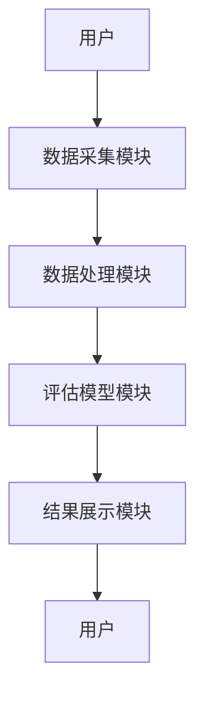

                 


# 可持续发展创新的专利价值评估方法

> 关键词：可持续发展，专利价值评估，创新，知识产权，技术评估

> 摘要：本文探讨了在可持续发展视角下，如何对专利价值进行创新性评估。通过分析现有专利评估方法的局限性，提出了结合技术、经济和社会价值的多维度评估模型，并详细介绍了模型的构建过程、数学公式、算法实现及实际应用场景。文章还结合项目实战，给出了具体的实现步骤和案例分析，为企业的专利管理和创新决策提供了实用的指导。

---

## 第一部分: 可持续发展创新的专利价值评估背景与概述

### 第1章: 可持续发展与专利价值评估的背景

#### 1.1 可持续发展的概念与重要性

- **1.1.1 可持续发展的定义与内涵**
  可持续发展是指在满足当代人需求的同时，不损害后代人满足其需求的能力。它强调经济、社会和环境的协调发展。

- **1.1.2 可持续发展与创新的关系**
  创新是推动可持续发展的核心动力。专利作为创新的保护形式，其价值直接关系到企业的可持续发展能力。

- **1.1.3 专利在创新中的核心作用**
  专利不仅是技术保护的工具，更是企业竞争力的体现。通过专利，企业可以保护其创新成果，获得市场优势。

#### 1.2 专利价值评估的意义

- **1.2.1 专利价值评估的定义**
  专利价值评估是对专利的技术、经济和社会价值进行量化的过程，旨在为企业决策提供支持。

- **1.2.2 专利价值评估在企业中的应用**
  专利评估可以帮助企业识别核心专利资产，优化研发投资，提升市场竞争力。

- **1.2.3 可持续发展视角下的专利价值评估**
  在可持续发展视角下，专利评估需要考虑其对环境、社会和经济的综合影响，而不仅仅是技术或经济价值。

### 第2章: 专利价值评估的现状与挑战

#### 2.1 现有专利价值评估方法的概述

- **2.1.1 基于经济指标的评估方法**
  主要关注专利的市场价值和经济收益，如收入、利润等。

- **2.1.2 基于技术指标的评估方法**
  侧重于专利的技术先进性、创新性和可实施性。

- **2.1.3 基于市场指标的评估方法**
  结合市场需求、竞争状况和技术成熟度进行评估。

#### 2.2 可持续发展视角下的专利评估挑战

- **2.2.1 环境、社会和治理（ESG）因素的引入**
  专利评估需要考虑其对环境的影响、社会责任履行情况等。

- **2.2.2 知识产权保护与绿色创新的平衡**
  绿色创新强调环保和可持续性，但专利保护可能限制技术的开放性，如何平衡是一个挑战。

- **2.2.3 全球化背景下的专利价值评估复杂性**
  不同国家的专利制度、市场环境和法律差异增加了评估的复杂性。

---

## 第二部分: 专利价值评估的核心概念与理论框架

### 第3章: 专利价值评估的核心概念

#### 3.1 专利价值评估的维度

- **3.1.1 技术价值维度**
  包括专利的技术创新性、技术复杂度和可扩展性。

- **3.1.2 经济价值维度**
  包括专利的市场价值、收入潜力和投资回报率。

- **3.1.3 社会价值维度**
  包括专利对社会福祉、环境保护和就业的促进作用。

#### 3.2 可持续发展创新的专利评估模型

- **3.2.1 模型的构成要素**
  技术、经济和社会价值的综合评估。

- **3.2.2 模型的逻辑关系**
  通过权重分配，将各维度的价值综合起来，得出整体专利价值。

- **3.2.3 模型的适用范围**
  适用于绿色技术、环保产品和可持续发展领域的专利评估。

### 第4章: 专利价值评估的核心理论与方法

#### 4.1 专利价值评估的理论基础

- **4.1.1 经济学理论**
  基于市场供需和价值理论，分析专利的经济价值。

- **4.1.2 知识管理理论**
  专利作为知识资产，其价值与知识管理密切相关。

- **4.1.3 可持续发展理论**
  强调专利对环境、社会和经济的综合影响。

#### 4.2 专利价值评估的主要方法

- **4.2.1 文本挖掘与语义分析**
  利用自然语言处理技术，分析专利文本中的技术关键词和创新点。

- **4.2.2 技术生命周期分析**
  根据专利的技术生命周期阶段，评估其市场价值和未来潜力。

- **4.2.3 组合评估方法**
  结合定性和定量分析，对专利进行多维度评估。

---

## 第三部分: 可持续发展创新的专利价值评估模型与算法

### 第5章: 可持续发展创新的专利价值评估模型

#### 5.1 模型的构建过程

- **5.1.1 数据收集与预处理**
  收集专利文本、技术指标、市场数据和社会影响力数据。

- **5.1.2 模型的设计与选择**
  根据数据特点和评估目标，选择合适的评估模型（如层次分析法或机器学习模型）。

- **5.1.3 模型的验证与优化**
  使用验证数据对模型进行调优，确保评估结果的准确性和可靠性。

#### 5.2 模型的数学表达

- **5.2.1 技术价值的计算公式**
  $$ V_t = \sum_{i=1}^{n} w_i \cdot x_i $$
  其中，$w_i$ 是第i个技术指标的权重，$x_i$ 是第i个技术指标的得分。

- **5.2.2 经济价值的计算公式**
  $$ V_e = \sum_{j=1}^{m} w_j \cdot y_j $$
  其中，$w_j$ 是第j个经济指标的权重，$y_j$ 是第j个经济指标的得分。

- **5.2.3 社会价值的计算公式**
  $$ V_s = \sum_{k=1}^{p} w_k \cdot z_k $$
  其中，$w_k$ 是第k个社会指标的权重，$z_k$ 是第k个社会指标的得分。

#### 5.3 综合评估公式

$$ V_p = \alpha V_t + \beta V_e + \gamma V_s $$
其中，$\alpha$、$\beta$ 和 $\gamma$ 是各维度的权重，且 $\alpha + \beta + \gamma = 1$。

---

### 第6章: 项目实战与系统实现

#### 6.1 项目背景与目标

- 开发一个基于可持续发展视角的专利价值评估系统，为企业提供科学的专利管理工具。

#### 6.2 系统功能设计

- 数据采集模块：收集专利文本、技术指标、市场数据和社会影响力数据。
- 模型计算模块：实现技术、经济和社会价值的计算。
- 结果展示模块：以图表形式展示评估结果，并提供可视化报告。

#### 6.3 系统架构设计



#### 6.4 核心代码实现

```python
import numpy as np
from sklearn.metrics import pairwise_distances

def calculate_technical_value(patents):
    # 计算技术价值
    return np.mean([patent.technical_score for patent in patents])

def calculate_economic_value(patents):
    # 计算经济价值
    return np.mean([patent.economic_score for patent in patents])

def calculate_social_value(patents):
    # 计算社会价值
    return np.mean([patent.social_score for patent in patents])

def calculate_total_value(patents, alpha=0.4, beta=0.3, gamma=0.3):
    # 综合评估价值
    tv = calculate_technical_value(patents)
    ev = calculate_economic_value(patents)
    sv = calculate_social_value(patents)
    return alpha * tv + beta * ev + gamma * sv
```

#### 6.5 案例分析与结果解读

- 案例：某环保技术专利的评估
  - 技术价值：0.85
  - 经济价值：0.70
  - 社会价值：0.90
  - 综合价值：$$ 0.4 \times 0.85 + 0.3 \times 0.70 + 0.3 \times 0.90 = 0.85 $$

---

### 第7章: 总结与展望

- **小结**
  本文提出了一个基于可持续发展视角的专利价值评估模型，并通过实际案例验证了模型的有效性。

- **注意事项**
  - 数据质量对评估结果有直接影响，需确保数据的准确性和完整性。
  - 权重的设置需根据具体应用场景调整，以反映不同维度的重要性。

- **拓展阅读**
  - 《专利分析与评估》
  - 《可持续发展与创新管理》

---

作者：AI天才研究院 & 禅与计算机程序设计艺术

