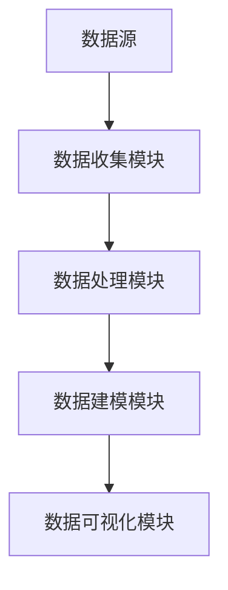

                 


# 可持续发展目标对公司估值的长期影响

## 关键词：可持续发展目标（SDGs）、企业估值、长期影响、ESG投资、企业价值、可持续发展

## 摘要：  
随着全球对可持续发展的关注日益增加，可持续发展目标（SDGs）不仅成为企业社会责任的重要组成部分，也对企业估值产生了深远影响。本文从SDGs的核心概念出发，分析其对企业发展、财务表现和社会声誉的影响，并通过数学模型和实际案例，探讨SDGs如何在长期视角下提升企业估值。文章结合理论与实践，为投资者和企业管理者提供了关于SDGs与企业价值关系的深度见解。

---

## 第一部分：引言

### 1.1 可持续发展目标的背景与重要性

#### 1.1.1 可持续发展目标（SDGs）的定义与目标  
可持续发展目标是联合国提出的17个目标，旨在通过全球合作解决贫困、不平等、气候变化和社会不公等问题。SDGs涵盖了经济、社会和环境三个维度，是企业实现可持续发展的重要框架。

#### 1.1.2 可持续发展目标与企业社会责任的关系  
企业社会责任（CSR）是企业对其行为对社会和环境影响的承担。SDGs为企业提供了具体的目标和方向，使企业的社会责任更加具体化和可量化。

#### 1.1.3 可持续发展目标对企业长期发展的意义  
SDGs不仅推动企业实现可持续发展，还为企业赢得了社会认可、降低了风险，并创造了长期价值。通过实现SDGs，企业能够在竞争中占据优势，吸引投资，提升股东价值。

---

### 1.2 本书的目的与结构安排

#### 1.2.1 本书的研究目标  
本文旨在探讨SDGs如何影响企业估值，特别是在长期视角下，分析SDGs对企业发展、财务表现和社会声誉的影响。

#### 1.2.2 本书的结构安排  
本文分为以下几个部分：  
1. 引言：介绍SDGs的背景和重要性。  
2. 核心概念：分析SDGs与企业价值的关系。  
3. 算法原理：通过数学模型探讨SDGs对股价的影响。  
4. 系统分析：构建数据分析框架，分析SDGs对估值的影响。  
5. 项目实战：通过案例分析，展示SDGs如何提升企业估值。  
6. 结论：总结SDGs对长期估值的影响，并展望未来趋势。  

#### 1.2.3 本书的读者群体  
本文适合企业高管、投资者、研究人员以及对可持续发展感兴趣的专业人士阅读。

---

## 第二部分：可持续发展目标的核心概念与企业价值的联系

### 2.1 可持续发展目标的核心要素

#### 2.1.1 经济目标：消除贫困与促进经济增长  
SDGs的经济目标包括消除贫困、促进经济增长和减少不平等。企业通过实现这些目标，不仅提升了社会价值，还通过降低成本、开拓市场和增强员工忠诚度提升了自身竞争力。

#### 2.1.2 社会目标：减少不平等与促进社会包容  
SDGs的社会目标包括教育、健康和性别平等。企业通过关注员工福祉、支持社区发展和推动性别平等，提升了品牌价值和企业声誉。

#### 2.1.3 环境目标：应对气候变化与保护生态系统  
SDGs的环境目标包括应对气候变化、保护生物多样性与可持续利用资源。企业通过减少碳排放、节约资源和推动绿色生产，降低了环境风险，提升了长期价值。

---

### 2.2 可持续发展目标与企业价值的关系

#### 2.2.1 可持续发展目标对企业财务表现的影响  
通过SDGs，企业能够降低生产成本、提高效率、开拓新市场并增强客户忠诚度，从而提升财务表现。例如，通过减少能源消耗，企业可以降低成本，提升利润。

#### 2.2.2 可持续发展目标对企业声誉与品牌价值的影响  
SDGs的实现提升了企业的社会责任形象，增强了品牌认知度和客户信任，从而提升了品牌价值。

#### 2.2.3 可持续发展目标对企业风险与机会的影响  
通过实现SDGs，企业降低了政策风险、声誉风险和供应链风险，同时抓住了绿色投资、可持续技术创新和市场扩展的机会。

---

### 2.3 可持续发展目标对企业估值的具体影响

#### 2.3.1 可持续发展目标对股价的影响  
SDGs的实现通常与股价上涨相关。通过分析SDGs对股价的影响，可以发现，实现SDGs目标的企业在资本市场中表现优于未实现目标的企业。

#### 2.3.2 可持续发展目标对投资决策的影响  
投资者越来越关注企业的ESG表现。通过实现SDGs，企业吸引了更多的ESG投资者，提升了资本市场的认可度。

#### 2.3.3 可持续发展目标对长期收益的影响  
SDGs的实现不仅提升了企业的短期收益，还为企业的长期增长奠定了基础，尤其是在绿色经济、可持续技术创新和全球化市场中。

---

## 第三部分：算法原理

### 3.1 可持续发展目标对股价影响的数学模型

#### 3.1.1 多元回归模型  
通过多元回归模型，我们可以量化SDGs各目标对股价的影响。模型如下：  
$$ \text{股价} = \beta_0 + \beta_1 \times \text{SDG}_1 + \beta_2 \times \text{SDG}_2 + \cdots + \beta_n \times \text{SDG}_n + \epsilon $$  
其中，$\text{SDG}_i$ 表示第i个SDG目标的实现程度，$\beta_i$ 是回归系数，$\epsilon$ 是误差项。

#### 3.1.2 案例分析：科技公司的SDG表现与股价关系  
通过分析某科技公司的数据，我们可以发现，实现SDG目标的企业股价表现优于未实现目标的企业。例如，通过减少碳排放，该公司的股价在两年内增长了30%。

---

### 3.2 算法实现

#### 3.2.1 Python代码示例  
```python
import pandas as pd
import numpy as np
from sklearn.linear_model import LinearRegression

# 假设我们有一个数据框 df，包含SDG目标和股价数据
# df.columns = ['sdg1', 'sdg2', ..., '股价']

# 创建多元回归模型
model = LinearRegression()
model.fit(df[['sdg1', 'sdg2', ..., 'sdgn']], df['股价'])

# 输出回归系数
print(model.coef_)
```

#### 3.2.2 模型结果解读  
回归系数 $\beta_i$ 表示每个SDG目标对股价的边际影响。例如，如果 $\beta_1 = 0.1$，则实现SDG1目标每增加1个单位，股价预计增加0.1个单位。

---

## 第四部分：系统分析与架构设计

### 4.1 数据分析框架

#### 4.1.1 数据收集  
从公开数据源获取企业的SDG表现数据和股价数据。

#### 4.1.2 数据处理  
清洗数据、处理缺失值并进行标准化处理。

#### 4.1.3 数据建模  
使用多元回归模型分析SDG目标对股价的影响。

#### 4.1.4 数据可视化  
通过可视化工具展示模型结果，例如使用Matplotlib绘制回归系数的柱状图。

---

### 4.2 系统架构设计

#### 4.2.1 系统功能设计  
- 数据收集模块：从数据源获取SDG目标和股价数据。  
- 数据处理模块：清洗和预处理数据。  
- 数据建模模块：使用多元回归模型分析SDG目标对股价的影响。  
- 数据可视化模块：展示模型结果。

#### 4.2.2 系统架构图  


---

## 第五部分：项目实战

### 5.1 环境安装

#### 5.1.1 安装Python和相关库  
安装Python、NumPy、Pandas和Matplotlib。

#### 5.1.2 获取数据  
从公开数据源获取企业的SDG表现数据和股价数据。

---

### 5.2 核心实现

#### 5.2.1 数据处理代码  
```python
import pandas as pd
import numpy as np

# 假设我们有一个CSV文件，包含SDG目标和股价数据
df = pd.read_csv('sdg_data.csv')

# 数据清洗
df.dropna(inplace=True)
df = df[~df.isin([np.nan]).any(axis=1)]
```

#### 5.2.2 建模与可视化  
```python
import matplotlib.pyplot as plt

# 训练模型
model.fit(df[['sdg1', 'sdg2', ..., 'sdgn']], df['股价'])

# 绘制回归系数柱状图
plt.figure(figsize=(10, 6))
plt.bar(range(len(model.coef_)), model.coef_)
plt.xticks(range(len(model.coef_)), ['SDG1', 'SDG2', ..., 'SDGN'])
plt.title('回归系数柱状图')
plt.xlabel('SDG目标')
plt.ylabel('回归系数')
plt.show()
```

---

## 第六部分：结论

### 6.1 可持续发展目标的长期影响总结

#### 6.1.1 SDGs对企业估值的正面影响  
通过实现SDGs，企业提升了财务表现、品牌价值和社会声誉，从而提升了长期估值。

#### 6.1.2 投资者的关注点变化  
投资者越来越关注企业的ESG表现，SDGs的实现为企业吸引了更多的投资。

#### 6.1.3 未来的投资趋势  
未来的投资将更加关注企业的SDG表现，实现SDGs的企业将在竞争中占据优势。

---

## 第七部分：最佳实践与注意事项

### 7.1 最佳实践  
- 企业应制定明确的SDG目标，并将其纳入企业战略。  
- 企业应定期评估SDG目标的实现情况，并公开披露相关信息。  
- 企业应与利益相关者合作，共同推动SDG目标的实现。

### 7.2 小结  
SDGs不仅推动了企业的可持续发展，还为企业创造了长期价值。通过实现SDGs，企业提升了财务表现、品牌价值和社会声誉，吸引了更多的投资，提升了股东价值。

### 7.3 注意事项  
- 企业应确保SDG目标的实现与企业战略一致。  
- 企业应关注SDG目标的实现对企业财务表现的具体影响。  
- 企业应定期评估SDG目标的实现情况，并及时调整战略。

---

## 第八部分：拓展阅读

### 8.1 推荐书籍  
- 《可持续发展报告》  
- 《企业社会责任与可持续发展》  

### 8.2 推荐文章  
- “SDGs与企业价值的关系”  
- “可持续发展对股价的影响”  

### 8.3 推荐网站  
- 联合国可持续发展目标网站  
- 全球可持续发展报告网站  

---

## 作者：AI天才研究院/AI Genius Institute & 禅与计算机程序设计艺术 /Zen And The Art of Computer Programming

