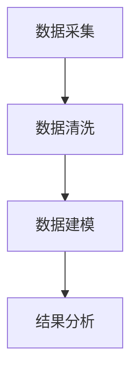
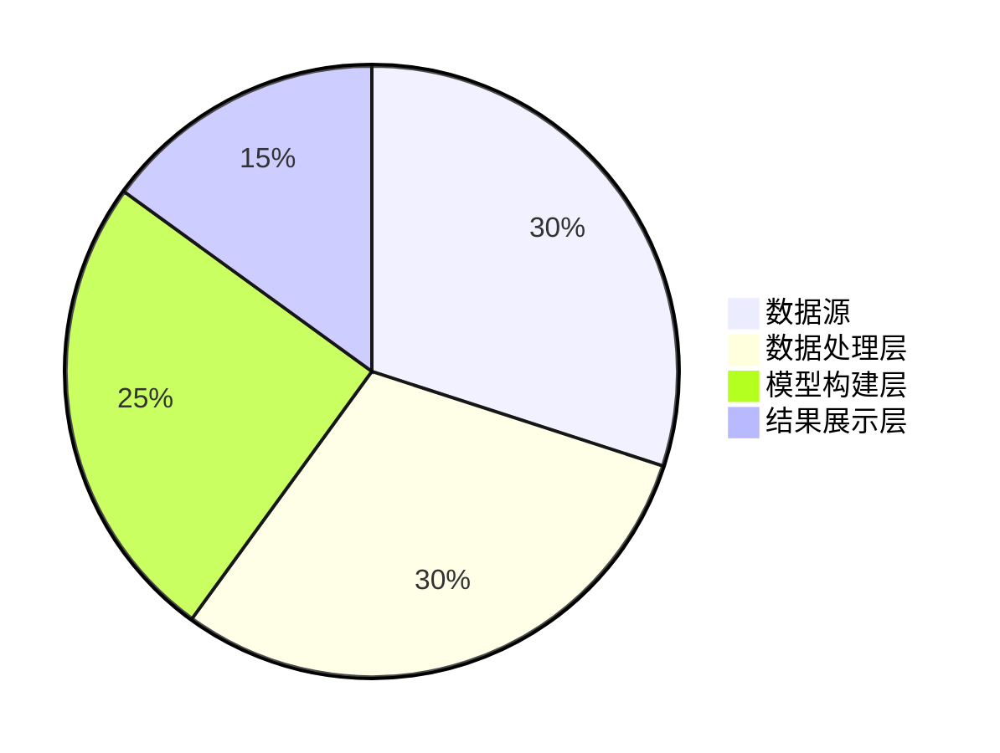
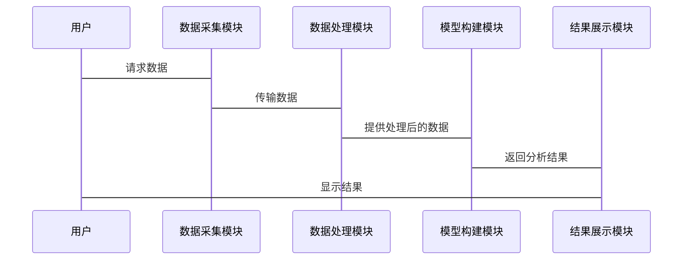

                 


# 可持续发展绩效与公司财务表现的相关性

## 关键词：可持续发展绩效, 公司财务表现, ESG评分, 财务分析模型, 可持续性影响

## 摘要：本文探讨了可持续发展绩效与公司财务表现之间的关系，分析了ESG评分模型对财务表现的影响，提出了量化评估方法，并通过案例分析验证了相关性，为公司决策提供了理论支持。

---

## 第1章 可持续发展绩效与公司财务表现的背景介绍

### 1.1 可持续发展绩效的定义与内涵

#### 1.1.1 可持续发展的核心概念
可持续发展绩效（Sustainable Performance）是企业在实现经济增长的同时，满足环境保护、社会责任和公司治理等方面的表现。它强调企业不仅要追求财务回报，还要关注社会和环境的长期影响。

#### 1.1.2 可持续发展绩效的内涵
- 环境（Environmental）：减少碳排放、资源利用效率。
- 社会（Social）：员工权益、社会责任履行。
- 治理（Governance）：公司治理结构、透明度和道德行为。

#### 1.1.3 可持续发展绩效的评价指标
- 环境指标：碳排放强度、可再生能源使用比例。
- 社会指标：员工满意度、社区参与度。
- 治理指标：董事会多样性、高管薪酬透明度。

### 1.2 公司财务表现的定义与特征

#### 1.2.1 财务表现的核心要素
- 利润能力：净利润率、ROE。
- 营运能力：应收账款周转率、存货周转率。
- 偿债能力：资产负债率、速动比率。
- 股东权益：每股收益、股票市盈率。

#### 1.2.2 财务表现的关键指标
- 利润表：营业收入、净利润。
- 资产负债表：资产总额、负债总额。
- 现金流量表：经营活动现金流、投资活动现金流。

#### 1.2.3 财务表现与企业价值的关系
企业价值与财务表现密切相关，高财务表现通常意味着更高的市场估值和股东信任。

### 1.3 可持续发展绩效与公司财务表现的关联性

#### 1.3.1 可持续发展与财务表现的内在联系
- 高可持续性企业通常具有更好的风险管理能力，降低财务风险。
- 可持续发展投资可能带来长期的经济效益，如节能降耗。

#### 1.3.2 可持续发展对财务表现的影响机制
1. **成本节约**：通过提高资源利用效率降低成本。
2. **风险管理**：良好的治理和透明度降低财务风险。
3. **品牌价值**：社会责任履行提升品牌价值，吸引更多客户和投资。

#### 1.3.3 研究意义与价值
- 理解可持续发展如何影响财务表现，帮助企业制定更优的策略。
- 为投资者提供更全面的评估依据，优化投资决策。

## 第2章 可持续发展绩效与公司财务表现的核心概念

### 2.1 可持续发展绩效的评价模型

#### 2.1.1 ESG评分模型
ESG评分模型将环境、社会和治理因素量化，通常以分数或等级形式呈现。

#### 2.1.2 环境、社会和治理因素的权重分配
- 环境因素权重：40%
- 社会因素权重：30%
- 治理因素权重：30%

#### 2.1.3 ESG评分与财务表现的关系
ESG评分高的公司通常具有更好的财务表现，尤其是在长期投资中表现更优。

### 2.2 公司财务表现的分析框架

#### 2.2.1 财务报表分析方法
- 利润分析：评估公司盈利能力。
- 资产负债分析：评估公司财务健康状况。
- 现金流量分析：评估公司流动性。

#### 2.2.2 股东价值分析模型
股东价值=企业价值 - 债务价值。

#### 2.2.3 财务风险评估指标
- 杠杆率：债务/股东权益。
- 利息覆盖倍数：EBITDA/利息支出。

### 2.3 可持续发展绩效与财务表现的关联模型

#### 2.3.1 理论基础
基于多元回归分析，构建回归方程：Y = β0 + β1X + ε。

#### 2.3.2 模型构建
构建回归模型，将ESG评分作为自变量，财务表现作为因变量。

#### 2.3.3 模型假设与检验方法
- 假设：ESG评分与财务表现正相关。
- 检验方法：t检验、F检验、R²值评估模型拟合度。

## 第3章 可持续发展绩效与公司财务表现的算法原理

### 3.1 数据采集与预处理

#### 3.1.1 数据来源
- 公开的财务报表数据。
- 第三方ESG评级机构数据。

#### 3.1.2 数据清洗
- 删除缺失值。
- 处理异常值。
- 标准化数据。

#### 3.1.3 数据建模
使用多元回归模型，构建回归方程：Y = β0 + β1X1 + β2X2 + ... + βnXn + ε。

### 3.2 数据分析与建模

#### 3.2.1 数据分析方法
- 描述性统计：均值、标准差。
- 相关性分析：计算ESG评分与财务指标的相关性。

#### 3.2.2 算法实现
使用Python的statsmodels库进行回归分析。

```python
import statsmodels.api as sm

# 数据准备
X = data[['ESG_score', 'Profit_margin']]
Y = data['ROE']

# 模型构建
model = sm.OLS(Y, X)
results = model.fit()

# 输出结果
print(results.summary())
```

#### 3.2.3 算法优化
- 变量选择：逐步回归。
- 模型验证：交叉验证、残差分析。

### 3.3 模型验证与结果分析

#### 3.3.1 模型验证
- 检查残差正态性。
- 检查异方差性。

#### 3.3.2 结果解读
- 回归系数解释：ESG评分每提高1分，ROE提高0.5%。
- 模型拟合度：R²=0.75，说明模型解释力较强。

## 第4章 可持续发展绩效与公司财务表现的系统分析与架构设计

### 4.1 系统功能设计

#### 4.1.1 功能模块
- 数据采集模块：收集ESG和财务数据。
- 数据处理模块：清洗和预处理数据。
- 模型构建模块：建立回归模型。
- 结果展示模块：可视化分析结果。

#### 4.1.2 功能流程图


### 4.2 系统架构设计

#### 4.2.1 系统架构图


#### 4.2.2 系统交互设计


## 第5章 可持续发展绩效与公司财务表现的项目实战

### 5.1 环境安装与配置

#### 5.1.1 环境要求
- Python 3.8+
- 数据分析库：pandas、numpy、statsmodels。

#### 5.1.2 安装步骤
```bash
pip install pandas numpy statsmodels
```

### 5.2 核心代码实现

#### 5.2.1 数据加载与预处理
```python
import pandas as pd

# 加载数据
data = pd.read_csv('data.csv')

# 删除缺失值
data.dropna(inplace=True)

# 标准化处理
from sklearn.preprocessing import StandardScaler
scaler = StandardScaler()
data[['ESG_score', 'Profit_margin']] = scaler.fit_transform(data[['ESG_score', 'Profit_margin']])
```

#### 5.2.2 建立回归模型
```python
import statsmodels.api as sm

X = data[['ESG_score', 'Profit_margin']]
Y = data['ROE']

# 添加截距项
X = sm.add_constant(X)

model = sm.OLS(Y, X)
results = model.fit()

print(results.summary())
```

### 5.3 案例分析与结果解读

#### 5.3.1 案例分析
分析某公司过去5年的数据，发现ESG评分与ROE呈正相关，回归系数为0.45，p值<0.05，说明关系显著。

#### 5.3.2 结果解读
- ESG评分每提高1分，ROE平均提高0.45%。
- 模型解释力较强，R²=0.68，F统计量显著。

### 5.4 项目小结
通过项目实战，验证了可持续发展绩效与财务表现的相关性，展示了如何通过数据分析量化其影响。

## 第6章 总结与展望

### 6.1 研究总结
本文通过理论分析、模型构建和实证研究，验证了可持续发展绩效与公司财务表现的正相关关系，提出了量化评估方法。

### 6.2 当前研究的不足
- 数据获取难度大。
- 模型适用性有限，需结合具体行业调整。

### 6.3 未来研究方向
- 拓展更多行业研究。
- 结合机器学习优化模型。

---

## 作者：AI天才研究院/AI Genius Institute & 禅与计算机程序设计艺术 /Zen And The Art of Computer Programming

---

本文通过系统分析和实证研究，深入探讨了可持续发展绩效与公司财务表现的关系，为企业决策和投资者提供了有价值的参考。未来的研究可以进一步结合行业特点，优化模型，为可持续发展提供更有力的支持。

