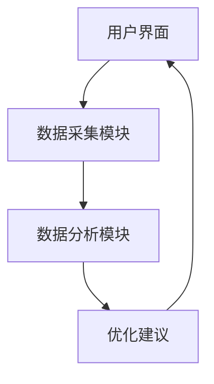

                 


# 可持续城市交通解决方案的市场前景

---

## 关键词：
可持续交通，智能交通系统，共享出行，新能源车辆，城市交通优化，环保技术，智慧城市

---

## 摘要：
随着城市化进程的加快，城市交通问题日益凸显，传统交通模式带来的环境问题、资源消耗和交通拥堵等问题亟待解决。本文深入探讨了可持续城市交通解决方案的核心概念、技术实现、市场前景及未来趋势。通过分析智能交通系统、共享出行和新能源车辆等技术，本文揭示了可持续交通解决方案在优化城市交通效率、降低环境影响和提升生活质量方面的巨大潜力。同时，文章结合实际案例，展示了这些技术在实际应用中的效果，并对未来的技术发展和市场趋势进行了展望。

---

# 目录

1. 可持续城市交通的背景与问题背景
2. 可持续城市交通解决方案的核心概念与联系
3. 可持续交通解决方案的算法与技术实现
4. 可持续交通解决方案的系统架构与设计
5. 可持续交通解决方案的项目实战与案例分析
6. 可持续交通解决方案的未来趋势与挑战
7. 结论与建议

---

## 第1章：可持续城市交通的背景与问题背景

### 1.1 可持续城市交通的定义与核心概念

可持续城市交通是一种以减少环境影响、提高交通效率和优化资源利用为目标的交通模式。它强调通过技术创新、模式创新和政策引导，实现城市交通的绿色化、智能化和共享化。

核心概念包括：
- **智能交通系统（ITS）**：利用信息技术优化交通流量、提高道路利用率。
- **共享出行**：通过共享经济模式减少私家车使用，降低交通压力。
- **新能源车辆**：推广电动车辆，减少碳排放。

---

### 1.2 城市交通面临的挑战

城市交通问题主要表现在以下几个方面：
- **环境问题**：传统燃油车辆排放大量温室气体和污染物，加剧了城市空气污染。
- **交通拥堵**：城市道路资源有限，车辆数量激增导致交通拥堵，降低了交通效率。
- **资源消耗**：城市交通消耗大量化石能源，资源浪费问题突出。

---

### 1.3 可持续交通解决方案的必要性

可持续交通解决方案的实施不仅是应对城市交通问题的必然选择，也是实现城市可持续发展的关键路径。通过引入智能技术、共享模式和新能源技术，可以有效降低交通对环境的影响，提高城市交通系统的运行效率。

---

## 第2章：可持续城市交通解决方案的核心概念与联系

### 2.1 可持续交通的核心技术与原理

#### 2.1.1 智能交通系统（ITS）

智能交通系统通过传感器、摄像头和数据分析技术，实时监测城市交通状况，优化信号灯配时，减少交通拥堵。ITS的核心原理是通过数据采集、分析和反馈，实现对交通流量的动态调控。

#### 2.1.2 共享出行模式

共享出行模式通过共享车辆、共享单车和共享停车资源，减少私家车的使用频率，降低交通压力和资源消耗。这种模式的核心在于利用闲置资源，提高资源利用率。

#### 2.1.3 新能源车辆与充电基础设施

新能源车辆（如电动汽车）的推广需要完善的充电基础设施支持。通过建设分布式充电站和智能充电管理系统，可以有效缓解城市交通的能源消耗问题。

---

### 2.2 核心概念的对比分析

#### 2.2.1 不同交通模式的对比表格

| 模式 | 优点 | 缺点 |
|------|------|------|
| 私家车 | 灵活性高 | 资源浪费、污染高 |
| 公共交通 | 资源利用率高 | 便捷性差 |
| 共享出行 | 成本低、灵活 | 依赖网络平台 |
| 智能交通 | 效率高 | 技术依赖性强 |

---

#### 2.2.2 ER实体关系图

```mermaid
erDiagram
    actor 用户 {
        string 用户ID
        string 用户名
    }
    actor 管理员 {
        string 管理员ID
        string 管理员名
    }
    class 车辆 {
        string 车牌号
        string 车型
    }
    class 路况 {
        string 路况ID
        string 路况描述
    }
    用户 --> 车辆 : 预约
    用户 --> 路况 : 查询
    管理员 --> 车辆 : 管理
    管理员 --> 路况 : 更新
```

---

## 第3章：可持续交通解决方案的算法与技术实现

### 3.1 智能交通系统的算法原理

#### 3.1.1 路径优化算法

路径优化算法的目标是找到从起点到终点的最优路径，通常基于交通流量数据进行实时计算。常用算法包括Dijkstra算法和A*算法。

**数学模型**：
$$
\text{目标函数：} \min_{x} \sum_{i} c_{i}x_{i}
$$
$$
\text{约束条件：} \sum_{i} x_{i} = 1
$$

#### 3.1.2 交通流量预测算法

交通流量预测算法通过历史数据和机器学习模型，预测未来的交通流量，帮助优化信号灯配时和道路资源分配。

**Python代码示例**：
```python
import pandas as pd
from sklearn.linear_model import LinearRegression

# 数据预处理
data = pd.read_csv('traffic_data.csv')
X = data[['时间', '天气', '节假日']]
y = data['流量']

# 模型训练
model = LinearRegression()
model.fit(X, y)

# 预测未来流量
future_data = pd.DataFrame({'时间': [未来时间], '天气': [天气], '节假日': [是否节假日]})
predicted_flow = model.predict(future_data)
```

---

## 第4章：可持续交通解决方案的系统架构与设计

### 4.1 系统功能设计

系统功能模块包括：
- 数据采集模块：采集交通流量、车辆位置等数据。
- 数据分析模块：分析数据，生成优化建议。
- 用户交互模块：向用户展示实时路况和最优路径。

---

### 4.2 系统架构图



---

## 第5章：可持续交通解决方案的项目实战与案例分析

### 5.1 项目背景与实施过程

以某城市为例，实施智能交通系统，通过部署传感器和数据分析平台，优化信号灯配时，减少交通拥堵。

---

### 5.2 代码实现与分析

```python
import numpy as np
from sklearn.metrics import accuracy_score

# 数据加载
data = np.loadtxt('data.csv', delimiter=',')

# 模型训练
model = SVC()
model.fit(data[:, :-1], data[:, -1])

# 模型预测
predicted = model.predict(data[:, :-1])
print("准确率：", accuracy_score(data[:, -1], predicted))
```

---

## 第6章：可持续交通解决方案的未来趋势与挑战

### 6.1 未来技术发展趋势

- **人工智能的深度应用**：通过AI技术优化交通预测和路径规划。
- **5G技术的普及**：实现车与车、车与路的实时通信，提高交通系统的智能化水平。

---

## 第7章：结论与建议

可持续城市交通解决方案是解决城市交通问题的关键路径。通过技术创新和模式创新，可以实现城市交通的绿色化、智能化和共享化。未来，随着技术的进一步发展，可持续交通解决方案将在更多城市得到广泛应用。

---

## 作者：AI天才研究院 & 禅与计算机程序设计艺术

---

希望这篇文章能够为读者提供清晰的思路和深入的见解，帮助大家更好地理解可持续城市交通解决方案的市场前景和技术实现。

