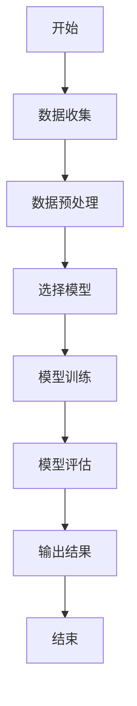

                 


# 可持续城市规划技术的市场潜力评估

> **关键词**：可持续城市规划、市场潜力、技术分析、模型评估、发展策略

> **摘要**：随着全球城市化进程的加快，可持续城市规划技术的重要性日益凸显。本文通过分析绿色建筑、智能交通系统和可再生能源利用等关键技术，构建多元回归分析模型，评估其市场潜力。同时，结合系统架构设计和实际案例，探讨可持续城市规划技术的应用前景和优化策略，为相关领域的研究和实践提供参考。

---

## 第一部分: 可持续城市规划技术的背景与核心概念

### 第1章: 可持续城市规划技术概述

#### 1.1 可持续城市规划的基本概念
可持续城市规划是指在城市建设和管理过程中，综合考虑经济、社会和环境三方面的因素，以实现城市的可持续发展目标。其核心在于减少资源消耗、降低污染排放、优化空间布局，同时提高居民的生活质量。

- **核心要素**：
  - 空间布局优化：通过科学的规划，减少交通拥堵和资源浪费。
  - 环境保护：减少城市化对自然生态的破坏。
  - 社会公平：确保各社会群体都能享受到城市发展的成果。

#### 1.2 市场潜力评估的基本原理
市场潜力评估是通过分析市场需求、技术供给和政策支持等因素，预测技术在未来市场中的发展空间和盈利能力。

- **驱动因素**：
  - 政策支持：政府通过法规和补贴推动可持续技术的应用。
  - 环保意识：消费者和企业的环保意识提升推动市场需求。
  - 技术进步：技术创新降低了成本，提高了效率。

---

### 第2章: 可持续城市规划技术的核心原理

#### 2.1 可持续城市规划技术的关键技术
可持续城市规划涉及多种技术，以下是其中三个核心领域：

- **绿色建筑技术**：通过节能设计、可再生能源利用等手段，降低建筑能耗。
- **智能交通系统**：利用信息技术优化交通管理，减少拥堵和尾气排放。
- **可再生能源利用技术**：如太阳能、风能等，减少对化石燃料的依赖。

#### 2.2 技术属性对比分析
以下是三种技术在能耗效率、环境影响和成本投入方面的对比：

```markdown
| 技术类型       | 能耗效率 | 环境影响 | 成本投入 |
|----------------|----------|----------|----------|
| 绿色建筑       | 高       | 低       | 中       |
| 智能交通系统   | 高       | 中       | 高       |
| 可再生能源     | 中       | 低       | 高       |
```

#### 2.3 ER实体关系图
```mermaid
erDiagram
    actor 市场需求 {
        <<actor>>
        id
        市场规模
        增长率
    }
    actor 技术供给 {
        <<actor>>
        id
        技术类型
        成熟度
    }
    actor 政策支持 {
        <<actor>>
        id
        支持力度
        补贴政策
    }
    市场需求 --> 技术供给 : 需求驱动
    技术供给 --> 政策支持 : 政策支持
```

---

## 第二部分: 可持续城市规划技术的算法原理

### 第3章: 市场潜力评估的算法原理

#### 3.1 多元回归分析模型
多元回归分析是一种常用的统计方法，用于预测因变量（市场潜力）与多个自变量（技术属性、市场需求等）之间的关系。

- **模型公式**：
  $$ y = \beta_0 + \beta_1x_1 + \beta_2x_2 + \cdots + \beta_nx_n + \epsilon $$
  其中，$y$ 是市场潜力，$x_i$ 是自变量，$\beta_i$ 是回归系数，$\epsilon$ 是误差项。

- **应用案例**：
  假设我们有三个自变量：技术成熟度（$x_1$）、市场需求规模（$x_2$）和政策支持力度（$x_3$）。通过收集数据并拟合模型，我们可以预测未来的技术市场潜力。

#### 3.2 算法流程图


#### 3.3 Python实现代码
```python
import numpy as np
from sklearn.linear_model import LinearRegression
from sklearn.metrics import r2_score

# 示例数据
X = np.array([[2, 3], [4, 5], [6, 7], [8, 9]])
y = np.array([10, 15, 20, 25])

# 模型训练
model = LinearRegression()
model.fit(X, y)

# 预测结果
y_pred = model.predict(X)
print("预测值：", y_pred)
print("R²值：", r2_score(y, y_pred))
```

---

## 第三部分: 可持续城市规划技术的系统分析与架构设计

### 第4章: 系统分析与架构设计方案

#### 4.1 系统功能设计
- **领域模型类图**：
  ```mermaid
  classDiagram
      class 绿色建筑 {
          技术类型: String
          能耗效率: Float
          环境影响: Float
      }
      class 智能交通系统 {
          技术类型: String
          成熟度: Int
          支持力度: Int
      }
      绿色建筑 <|-- 技术供给
      智能交通系统 <|-- 技术供给
  ```

- **系统架构图**：
  ```mermaid
  graph LR
      A[前端] --> B[后端]
      B --> C[数据库]
      C --> D[接口]
  ```

#### 4.2 接口设计
- **RESTful API 接口**：
  - GET /market-potential
  - POST /model-predict

---

## 第四部分: 项目实战与案例分析

### 第5章: 项目实战与案例分析

#### 5.1 环境安装
- 安装Python和必要的库：
  ```bash
  pip install numpy scikit-learn
  ```

#### 5.2 核心代码实现
```python
import numpy as np
from sklearn.linear_model import LinearRegression
from sklearn.metrics import r2_score

# 数据集加载
data = np.loadtxt('data.csv', delimiter=',')
X = data[:, :-1]
y = data[:, -1]

# 模型训练
model = LinearRegression()
model.fit(X, y)

# 预测与评估
y_pred = model.predict(X)
print("R²值：", r2_score(y, y_pred))
```

#### 5.3 案例分析
以某城市为例，分析绿色建筑技术的市场潜力：
- **数据收集**：收集该城市的建筑能耗、政策支持等数据。
- **模型预测**：使用多元回归模型预测绿色建筑技术的市场潜力。
- **结果分析**：根据预测结果制定推广策略。

---

## 第五部分: 总结与展望

### 第6章: 总结与展望

#### 6.1 总结
可持续城市规划技术是实现城市可持续发展的重要手段。通过技术分析和市场潜力评估，我们可以更好地把握技术的发展方向和应用前景。

#### 6.2 展望
未来，随着人工智能和大数据技术的进步，可持续城市规划技术将更加智能化和精准化。建议进一步研究技术间的协同效应，探索更多创新的应用场景。

---

## 作者：AI天才研究院/AI Genius Institute & 禅与计算机程序设计艺术 /Zen And The Art of Computer Programming

