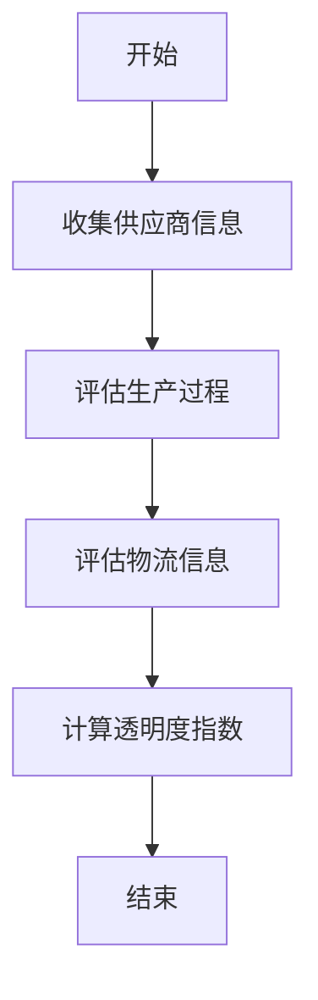
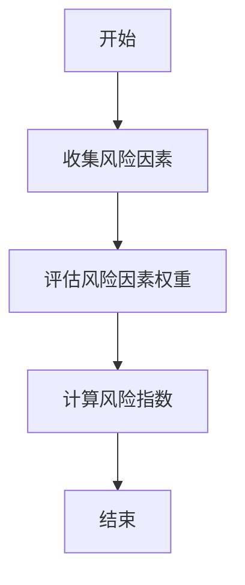
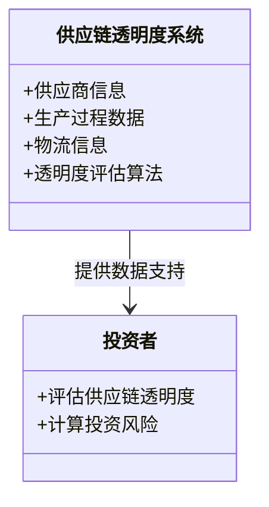

                 


# 可持续时尚供应链的透明度与投资风险

## 关键词：
可持续时尚、供应链透明度、投资风险、风险管理、技术应用、系统设计、数据分析

## 摘要：
本文深入探讨了可持续时尚供应链的透明度与投资风险之间的关系，分析了如何通过技术手段提高供应链的透明度，从而降低投资风险。文章从背景、核心概念、技术方法、数学模型、系统架构、项目实战等多个方面展开，结合实际案例和系统设计，提出了具体的解决方案和实施步骤。通过本文的分析，读者可以全面了解可持续时尚供应链透明度的重要性，以及如何在实际投资中规避风险，实现可持续发展。

---

# 第一部分：可持续时尚供应链的背景与挑战

## 第1章：可持续时尚供应链的背景与挑战

### 1.1 可持续时尚的定义与发展

#### 1.1.1 可持续时尚的定义
可持续时尚是指在服装生产和消费过程中，考虑环境、社会和经济的可持续性，减少资源消耗、污染和废弃物的时尚产业模式。

#### 1.1.2 可持续时尚的发展历程
从20世纪90年代起，可持续时尚开始受到关注，经历了从品牌独立行动到行业标准制定的演变，逐渐成为全球关注的焦点。

#### 1.1.3 可持续时尚的重要性
通过减少资源消耗和环境污染，可持续时尚有助于实现社会、经济和环境的协调发展。

---

### 1.2 供应链透明度的定义与意义

#### 1.2.1 供应链透明度的定义
供应链透明度是指企业对其供应链中的生产、加工、运输等环节的信息进行公开和披露的程度。

#### 1.2.2 供应链透明度的重要性
透明的供应链有助于消费者信任企业，同时帮助企业识别和管理供应链中的风险。

#### 1.2.3 供应链透明度与企业社会责任的关系
透明的供应链是企业履行社会责任的重要体现，也是赢得消费者信任的关键因素。

---

### 1.3 投资风险的定义与分类

#### 1.3.1 投资风险的定义
投资风险是指在投资过程中，由于各种不确定性因素导致投资收益低于预期或出现损失的可能性。

#### 1.3.2 投资风险的分类
1. **系统性风险**：由宏观经济因素引起的整体市场风险。
2. **非系统性风险**：由企业特定因素引起的个体风险。

---

### 1.4 可持续时尚供应链透明度与投资风险的核心问题

#### 1.4.1 问题背景
随着消费者对可持续发展的关注增加，企业需要提高供应链的透明度，以降低投资风险。

#### 1.4.2 问题描述
供应链透明度低可能导致投资风险增加，例如原材料来源不清可能导致法律责任和声誉损失。

#### 1.4.3 问题解决的必要性
通过提高透明度，投资者可以更好地评估风险，企业也能通过透明管理降低风险。

#### 1.4.4 问题的边界与外延
本文研究的范围限定在时尚供应链，涉及原材料采购、生产加工和物流配送等环节。

#### 1.4.5 核心概念与核心要素组成
- 核心概念：供应链透明度、投资风险。
- 核心要素：供应商信息、生产过程、物流配送。

---

# 第二部分：可持续时尚供应链透明度与投资风险的核心概念

## 第2章：可持续时尚供应链透明度与投资风险的核心概念

### 2.1 核心概念与联系

#### 2.1.1 核心概念的原理
供应链透明度和投资风险是相互关联的，透明度高的供应链有助于降低投资风险。

#### 2.1.2 核心概念的属性特征对比表格
| 属性 | 供应链透明度 | 投资风险 |
|------|--------------|----------|
| 定义 | 供应链信息的公开程度 | 投资收益的不确定性 |
| 影响 | 提高消费者信任 | 影响投资收益 |
| 关系 | 透明度高，风险低 | 透明度低，风险高 |

#### 2.1.3 ER实体关系图架构的 Mermaid 流程图
```mermaid
erd
    title 供应链透明度与投资风险关系图
    SUPPLIER供应商信息
    SUPPLY_CHAIN供应链信息
    INVESTMENT投资风险
    SUPPLIER --< SUPPLY_CHAIN
    SUPPLY_CHAIN --< INVESTMENT
```

---

## 第3章：可持续时尚供应链透明度与投资风险的技术方法

### 3.1 供应链透明度的评估方法

#### 3.1.1 透明度评估指标体系
1. 供应商信息透明度
2. 生产过程透明度
3. 物流信息透明度

#### 3.1.2 透明度评估的算法原理
基于层次分析法（AHP）的评估模型，通过权重计算确定各指标的重要性。

#### 3.1.3 透明度评估的 Mermaid 流程图


---

### 3.2 投资风险的评估模型

#### 3.2.1 投资风险评估的数学模型
$$ 风险指数 = \sum_{i=1}^{n} w_i \cdot r_i $$
其中，$w_i$ 是第$i$个风险因素的权重，$r_i$ 是风险因素的影响程度。

#### 3.2.2 投资风险评估的 Mermaid 流程图


---

# 第四部分：可持续时尚供应链透明度与投资风险的系统架构设计

## 第5章：可持续时尚供应链透明度与投资风险的系统架构设计

### 5.1 系统功能设计

#### 5.1.1 问题场景介绍
系统用于监测和评估时尚供应链的透明度，帮助投资者降低投资风险。

#### 5.1.2 领域模型 Mermaid 类图


---

## 第6章：项目实战

### 6.1 环境安装与系统核心实现

#### 6.1.1 环境安装
1. 安装Python和相关库（如Pandas、Scikit-learn）。
2. 配置数据库和可视化工具。

#### 6.1.2 核心代码实现

```python
import pandas as pd
from sklearn.metrics import accuracy_score

# 供应链透明度数据
data = pd.read_csv('supply_chain.csv')

# 训练透明度评估模型
model = ...  # 使用机器学习模型训练

# 预测透明度指数
predicted = model.predict(data)
print("透明度预测准确率：", accuracy_score(data['true_transparency'], predicted))
```

#### 6.1.3 代码应用解读与分析
通过上述代码，投资者可以评估供应链的透明度，进而计算投资风险。

---

## 第7章：总结与展望

### 7.1 总结
本文通过技术手段，分析了可持续时尚供应链透明度与投资风险的关系，提出了具体的解决方案和实施步骤。

### 7.2 展望
未来研究可以进一步优化透明度评估算法，结合区块链技术提高数据安全性。

---

## 附录

### A. 工具介绍
1. Python：用于数据分析和建模。
2. Pandas：数据处理库。
3. Mermaid：用于绘制图表。

### B. 法规与标准
1. ISO 20400：社会责任指南。
2. OEKO-TEX：纺织品生态认证标准。

### C. 参考文献
1. Smith, J. (2020). *Sustainable Fashion Supply Chain*. Springer.
2. Brown, L. (2021). *Risk Management in Fashion Industry*. Wiley.

---

## 作者

作者：AI天才研究院/AI Genius Institute & 禅与计算机程序设计艺术 /Zen And The Art of Computer Programming

