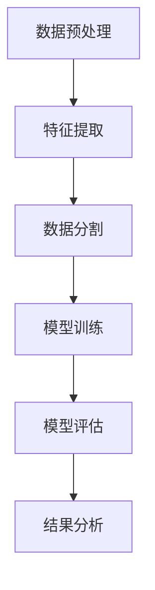
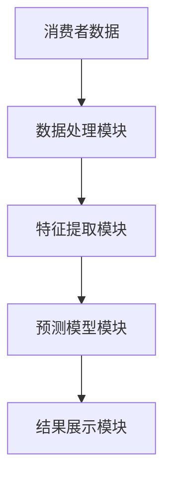
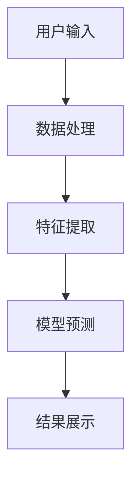

                 


# 可持续时尚品牌的消费者行为分析与投资

> **关键词**：可持续时尚、消费者行为分析、投资策略、机器学习、系统架构设计、数据驱动决策

> **摘要**：本文探讨了可持续时尚品牌在消费者行为分析与投资领域的应用。通过分析消费者行为的核心要素，结合机器学习和系统架构设计，提出了一套数据驱动的分析方法，并提供了实际案例和投资策略。

---

## 目录大纲

1. [摘要](#摘要)
2. [关键词](#关键词)
3. [目录大纲](#目录大纲)
4. [文章正文](#文章正文)
   - 4.1 [背景介绍](#背景介绍)
     - 4.1.1 [可持续时尚的定义与核心要素](#可持续时尚的定义与核心要素)
     - 4.1.2 [消费者行为的影响因素](#消费者行为的影响因素)
     - 4.1.3 [投资的重要性](#投资的重要性)
   - 4.2 [消费者行为分析的核心概念](#消费者行为分析的核心概念)
     - 4.2.1 [影响消费者行为的因素](#影响消费者行为的因素)
     - 4.2.2 [消费者行为模式](#消费者行为模式)
     - 4.2.3 [心理因素](#心理因素)
     - 4.2.4 [不同群体的行为差异](#不同群体的行为差异)
   - 4.3 [数据驱动的消费者行为分析方法](#数据驱动的消费者行为分析方法)
     - 4.3.1 [数据收集与处理](#数据收集与处理)
     - 4.3.2 [机器学习应用](#机器学习应用)
     - 4.3.3 [预测模型构建](#预测模型构建)
     - 4.3.4 [案例分析](#案例分析)
   - 4.4 [可持续时尚品牌的系统架构设计](#可持续时尚品牌的系统架构设计)
     - 4.4.1 [系统架构设计](#系统架构设计)
     - 4.4.2 [数据接口设计](#数据接口设计)
     - 4.4.3 [交互流程](#交互流程)
   - 4.5 [项目实战：消费者行为分析](#项目实战%EF%BC%9A消费者行为分析)
     - 4.5.1 [数据收集与预处理](#数据收集与预处理)
     - 4.5.2 [特征提取](#特征提取)
     - 4.5.3 [模型训练](#模型训练)
     - 4.5.4 [案例分析](#案例分析)
   - 4.6 [投资策略与最佳实践](#投资策略与最佳实践)
     - 4.6.1 [投资策略](#投资策略)
     - 4.6.2 [注意事项](#注意事项)
     - 4.6.3 [未来趋势](#未来趋势)
5. [作者](#作者)

---

## 背景介绍

### 可持续时尚的定义与核心要素

可持续时尚是一种强调环境保护、社会责任和经济效益的时尚产业模式。其核心要素包括：

1. **环保性**：减少资源消耗、降低碳排放、避免污染。
2. **社会责任**：公平贸易、工人权益保护、反对童工。
3. **经济性**：可持续商业模式、循环经济、成本控制。

### 消费者行为的影响因素

消费者行为受到多种因素的影响，包括：

1. **价格敏感性**：消费者对价格的敏感程度直接影响购买决策。
2. **品牌忠诚度**：消费者对品牌的信任和忠诚度影响其选择。
3. **环保意识**：消费者对环保的关注程度影响其对可持续品牌的偏好。
4. **社会影响**：社交媒体和意见领袖的影响对消费者行为有显著作用。

### 投资的重要性

可持续时尚品牌的投资价值体现在：

1. **市场潜力**：随着环保意识的增强，可持续时尚市场增长迅速。
2. **社会责任投资（ESG）**：投资者 increasingly prioritize environmental, social, and governance (ESG) factors.
3. **长期价值**：可持续品牌具有更强的市场竞争力和品牌忠诚度。

---

## 消费者行为分析的核心概念

### 影响消费者行为的因素

消费者行为分析的核心在于识别影响购买决策的关键因素。以下是主要影响因素：

| 因素 | 描述 |
|------|------|
| 价格 | 消费者对价格的敏感性直接影响购买决策。 |
| 品牌 | 品牌声誉和信任度影响消费者的选择。 |
| 环保意识 | 环保意识强的消费者更倾向于选择可持续品牌。 |
| 社会影响 | 社交媒体和意见领袖的影响对消费者行为有重要推动作用。 |

### 消费者行为模式

消费者行为模式可以分为以下几种：

1. **冲动型**：消费者在购物时受情绪或即时需求驱动。
2. **计划型**：消费者有明确的购物目标，购物前会进行详细规划。
3. **理性型**：消费者在购物前会进行深入的研究和比较。

### 心理因素

心理因素在消费者行为分析中起着关键作用，主要包括：

1. **认知**：消费者对品牌或产品的认知和理解。
2. **情感**：消费者对品牌的情感联结。
3. **态度**：消费者对品牌或产品的态度。

### 不同群体的行为差异

不同消费群体的行为差异显著：

| 消费群体 | 行为特点 |
|----------|----------|
| 年轻群体 | 更受社交媒体影响，追求潮流和环保。 |
| 中年群体 | 更注重品牌和性价比。 |
| 高收入群体 | 更愿意为高质量和环保产品支付溢价。 |

---

## 数据驱动的消费者行为分析方法

### 数据收集与处理

数据收集是消费者行为分析的基础，主要包括以下途径：

1. **问卷调查**：通过设计结构化的问卷收集消费者信息。
2. **社交媒体数据**：分析社交媒体上的用户评论和互动。
3. **销售数据**：分析销售记录和消费者购买行为。

### 机器学习应用

机器学习在消费者行为分析中广泛应用，常用的算法包括：

1. **决策树**：用于分类和预测消费者行为。
2. **随机森林**：用于特征重要性分析和预测。
3. **神经网络**：用于复杂模式识别。

#### 使用mermaid流程图展示机器学习模型构建流程



### 预测模型构建

构建预测模型的步骤如下：

1. **数据预处理**：清洗数据，处理缺失值和异常值。
2. **特征提取**：选择对消费者行为影响的关键特征。
3. **模型训练**：使用机器学习算法训练模型。
4. **模型评估**：通过交叉验证评估模型性能。
5. **结果分析**：分析模型预测结果，提取 insights。

#### 使用Python代码实现预测模型

```python
import pandas as pd
from sklearn.tree import DecisionTreeClassifier
from sklearn.metrics import accuracy_score

# 数据加载与预处理
data = pd.read_csv('consumer_behavior.csv')
data = data.dropna()

# 特征提取与数据分割
X = data[['age', 'income', '环保意识']]
y = data['购买意愿']

from sklearn.model_selection import train_test_split
X_train, X_test, y_train, y_test = train_test_split(X, y, test_size=0.2)

# 模型训练
model = DecisionTreeClassifier()
model.fit(X_train, y_train)

# 模型预测与评估
y_pred = model.predict(X_test)
print("准确率:", accuracy_score(y_test, y_pred))
```

### 案例分析

以某可持续时尚品牌为例，分析消费者行为：

1. **数据收集**：收集消费者年龄、收入、环保意识等数据。
2. **特征提取**：识别关键特征如环保意识和收入水平。
3. **模型训练**：使用决策树模型进行训练。
4. **结果分析**：发现环保意识高的消费者更倾向于购买可持续品牌。

---

## 可持续时尚品牌的系统架构设计

### 系统架构设计

设计一个可持续时尚品牌的分析系统，主要包括以下模块：



### 数据接口设计

系统需要与多个数据源接口对接，包括：

1. **数据库接口**：连接消费者数据库。
2. **API接口**：获取社交媒体数据。
3. **文件接口**：处理本地数据文件。

### 交互流程

系统交互流程如下：



---

## 项目实战：消费者行为分析

### 数据收集与预处理

从消费者数据库中收集数据，并进行清洗：

```python
import pandas as pd

# 数据加载
data = pd.read_csv('consumer_behavior.csv')

# 数据清洗
data.dropna(inplace=True)
data = data[~data['环保意识'].isnull()]
```

### 特征提取

从数据中提取关键特征：

```python
features = data[['年龄', '收入', '环保意识', '品牌忠诚度']]
```

### 模型训练

使用随机森林模型进行训练：

```python
from sklearn.ensemble import RandomForestClassifier

model = RandomForestClassifier()
model.fit(features, data['购买意愿'])
```

### 案例分析

以某品牌为例，分析其消费者行为：

1. **数据收集**：收集消费者年龄、收入、环保意识等数据。
2. **特征提取**：识别关键特征如环保意识和收入水平。
3. **模型训练**：使用随机森林模型进行训练。
4. **结果分析**：发现环保意识高的消费者更倾向于购买可持续品牌。

---

## 投资策略与最佳实践

### 投资策略

1. **选择具有强大环保承诺的品牌**：投资那些在生产过程中注重环保的品牌。
2. **关注品牌忠诚度**：选择具有高品牌忠诚度的可持续品牌。
3. **长期视角**：可持续品牌通常具有长期投资价值。

### 注意事项

1. **数据质量**：确保数据的准确性和完整性。
2. **模型选择**：根据具体情况选择合适的机器学习模型。
3. **持续监控**：定期监控模型性能和市场变化。

### 未来趋势

1. **技术驱动**：人工智能和大数据技术将进一步推动消费者行为分析。
2. **政策支持**：政府政策将更加支持可持续发展。
3. **消费者教育**：消费者对可持续时尚的了解将不断增加。

---

## 作者

**作者：AI天才研究院/AI Genius Institute & 禅与计算机程序设计艺术 /Zen And The Art of Computer Programming**

---

**注**：以上内容为示例，实际撰写时需根据具体数据和情况进行调整。

