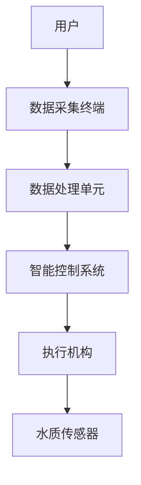
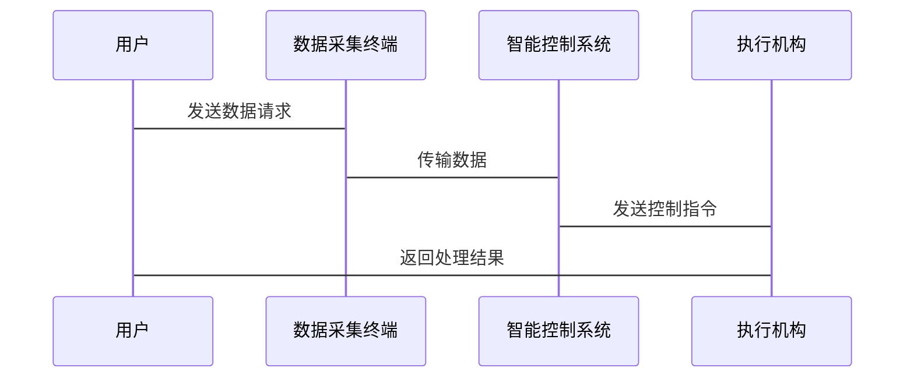

                 


```markdown
# 可持续水处理技术的全球市场需求分析

## 关键词：可持续水处理技术、全球市场、水处理技术、市场需求分析、环保技术、水处理系统、水资源管理

## 摘要： 
可持续水处理技术是解决全球水资源短缺和污染问题的重要手段。本文通过分析全球水处理市场的现状、技术分类、经济性与环境影响、市场需求驱动因素以及未来趋势，深入探讨可持续水处理技术的全球市场需求。结合技术原理、数学模型和实际案例，本文为读者提供了全面的视角，帮助理解如何通过技术创新和市场策略实现水资源的可持续管理。

---

## 第1章：可持续水处理技术的背景与定义

### 1.1 问题背景与定义

#### 1.1.1 水资源短缺与污染的现状
水资源是人类生存和发展的基础，但全球范围内水资源短缺和污染问题日益严重。根据联合国数据，全球约有22亿人面临水资源短缺问题，而水污染每年导致数百万人死亡。这些问题凸显了水处理技术的重要性。

#### 1.1.2 可持续水处理技术的定义与目标
可持续水处理技术是指在满足当前用水需求的同时，不破坏环境和未来资源利用的技术。其目标是通过创新技术实现水资源的高效利用和循环再生，减少对环境的负面影响。

#### 1.1.3 可持续水处理技术的核心要素与边界
- **核心要素**：技术创新、资源效率、环境友好、经济可行性。
- **边界**：技术应用范围、环境影响、经济成本。

### 1.2 可持续水处理技术的核心概念

#### 1.2.1 技术原理与实现机制
- **物理处理**：通过过滤、沉淀等方法去除水中杂质。
- **化学处理**：利用化学反应去除污染物。
- **生物处理**：利用微生物分解有机物。

#### 1.2.2 可持续性与经济性的平衡
- **可持续性**：技术必须减少能源消耗和环境影响。
- **经济性**：技术必须具备成本效益，能够在市场上推广。

#### 1.2.3 技术与市场的相互作用
- 技术进步推动市场需求，市场需求反过来促进技术创新。

---

## 第2章：可持续水处理技术的技术分析

### 2.1 技术分类与对比

#### 2.1.1 常见水处理技术的分类
- **物理处理**：过滤、沉淀。
- **化学处理**：混凝、沉淀。
- **生物处理**：活性污泥法、生物滤池法。
- **膜技术**：反渗透、超滤。

#### 2.1.2 各类技术的优缺点对比
| 技术类型    | 优点                     | 缺点                     |
|-------------|--------------------------|--------------------------|
| 物理处理    | 成本低、操作简单         | 对细微杂质处理能力有限   |
| 化学处理    | 去除特定污染物效果显著     | 可能产生二次污染         |
| 生物处理    | 能效高、处理彻底         | 处理周期长               |
| 膜技术      | 高效、无二次污染         | 成本高、维护复杂         |

### 2.2 技术原理与数学模型

#### 2.2.1 水处理过程的数学模型
$$ Q = \frac{A \cdot k}{C} $$
其中，Q表示处理效率，A为过滤面积，k为反应系数，C为污染物浓度。

#### 2.2.2 模型的建立与求解
通过建立数学模型，可以预测不同技术在不同条件下的处理效果。例如，反渗透技术的过滤效率可以通过以下公式计算：
$$ \eta = \frac{Q_{\text{进}} - Q_{\text{出}}}{Q_{\text{进}}} $$

#### 2.2.3 案例分析与公式推导
以活性污泥法为例，假设污水中有机物浓度为100mg/L，处理后降至20mg/L，处理效率为：
$$ \eta = \frac{100 - 20}{100} = 0.8 \text{或} 80\% $$

### 2.3 技术的经济性与环境影响分析

#### 2.3.1 技术成本的构成与影响因素
- **成本构成**：设备投资、运行成本、维护费用。
- **影响因素**：技术复杂性、能源消耗、材料成本。

#### 2.3.2 环境效益的量化评估
- **环境效益**：减少污染物排放、降低能源消耗。
- **量化指标**：单位处理成本、碳排放强度。

#### 2.3.3 经济与环境的综合优化
通过优化技术参数和运营策略，可以实现经济与环境效益的双赢。

---

## 第3章：全球水处理市场的现状与驱动因素

### 3.1 全球水处理市场的规模与结构

#### 3.1.1 市场规模的估算与预测
根据市场研究机构的数据，2023年全球水处理市场规模约为1,500亿美元，预计到2030年将达到2,500亿美元。

#### 3.1.2 各区域市场的特点与分布
- **发达国家**：技术先进、市场需求稳定。
- **发展中国家**：需求增长快，但技术基础薄弱。
- **新兴市场**：增长潜力大，政策支持强。

### 3.2 市场需求的区域差异与趋势

#### 3.2.1 发达国家与发展中国家的需求差异
- **发达国家**：注重技术创新和高效处理。
- **发展中国家**：关注成本低、易于推广的技术。

#### 3.2.2 新兴市场的增长潜力
- **印度、东南亚**：城市化进程快，水处理需求激增。
- **非洲**：基础设施落后，但政策支持力度大。

### 3.3 市场驱动因素的详细分析

#### 3.3.1 政策法规的影响
- **国际公约**：如《水污染防治公约》。
- **各国政策**：如中国“水十条”、欧盟“水框架指令”。

#### 3.3.2 技术进步的推动
- **创新技术**：膜技术、智能水处理系统。
- **研发投入**：企业加大对水处理技术的研发投入。

#### 3.3.3 环保意识的提升
- **公众意识**：消费者对环保产品的接受度提高。
- **企业责任**：企业越来越重视环境社会责任。

---

## 第4章：可持续水处理技术的商业模式创新

### 4.1 可持续水处理的商业模式

#### 4.1.1 基于服务的商业模式
- **订阅服务**：用户按需付费，企业提供维护服务。
- **BOT模式**：建设-运营-转让，降低初始投资。

#### 4.1.2 基于技术的商业模式
- **技术授权**：将技术授权给其他企业使用。
- **设备销售**：销售水处理设备，提供售后服务。

### 4.2 案例分析

#### 4.2.1 智能水处理系统的商业模式
某公司通过提供智能水处理系统，采用订阅制收费，用户按月支付服务费，公司提供设备安装、维护和升级。

#### 4.2.2 膜技术的商业化应用
某企业通过技术授权，与多家水处理公司合作，共同推广膜技术的应用。

### 4.3 对行业的启示

#### 4.3.1 创新驱动市场增长
技术创新是推动市场增长的核心动力。

#### 4.3.2 模式创新提升竞争力
灵活的商业模式能够帮助企业在竞争中占据优势。

---

## 第5章：可持续水处理技术的系统分析

### 5.1 系统架构设计

#### 5.1.1 系统功能设计
- **数据采集**：实时监测水质参数。
- **智能控制**：自动调节处理工艺。
- **远程监控**：通过云平台实现远程管理。

#### 5.1.2 系统架构图


### 5.2 系统接口设计

#### 5.2.1 数据接口
- **输入接口**：水质传感器数据。
- **输出接口**：控制指令。

#### 5.2.2 通信接口
- **无线通信**：Wi-Fi、4G。
- **有线通信**：以太网。

### 5.3 系统交互设计

#### 5.3.1 交互流程图


---

## 第6章：可持续水处理技术的项目实战

### 6.1 环境安装与配置

#### 6.1.1 系统环境
- **硬件**：水质传感器、数据采集卡、工控机。
- **软件**：数据采集软件、控制系统软件、云平台。

#### 6.1.2 网络配置
- **局域网**：内部通信。
- **互联网**：远程监控。

### 6.2 系统核心实现

#### 6.2.1 数据采集代码
```python
import serial

ser = serial.Serial('COM3', 9600)

while True:
    data = ser.readline().decode()
    print('水质数据:', data)
```

#### 6.2.2 智能控制代码
```python
def control_system(status):
    if status == 'high':
        return '开启'
    else:
        return '关闭'

status = 'high'
action = control_system(status)
print('执行动作:', action)
```

### 6.3 案例分析与总结

#### 6.3.1 实际案例
某工业园区采用智能水处理系统，实现了水质实时监测和自动处理，节省了30%的运营成本。

#### 6.3.2 项目总结
- **技术优势**：高效、智能、可持续。
- **经济优势**：降低成本、提高效率。
- **环境优势**：减少污染、保护资源。

---

## 第7章：可持续水处理技术的最佳实践与未来展望

### 7.1 最佳实践

#### 7.1.1 技术选择
根据具体需求选择合适的技术，注重经济性和环境效益的平衡。

#### 7.1.2 模式创新
结合实际情况，探索灵活的商业模式，提升市场竞争力。

#### 7.1.3 系统维护
定期维护设备，确保系统的高效运行。

### 7.2 未来展望

#### 7.2.1 技术趋势
- **智能化**：人工智能、大数据技术的应用。
- **绿色化**：更加注重环保和能源效率。

#### 7.2.2 市场发展
- **新兴市场**：增长潜力巨大。
- **技术创新**：推动市场持续扩大。

---

## 作者：AI天才研究院 & 禅与计算机程序设计艺术

## 感谢阅读
感谢您阅读《可持续水处理技术的全球市场需求分析》。如需进一步探讨或获取更多资料，请随时联系作者或访问相关网站。
```

