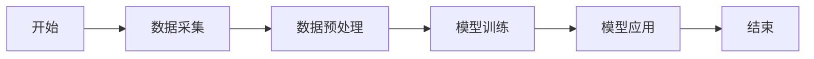
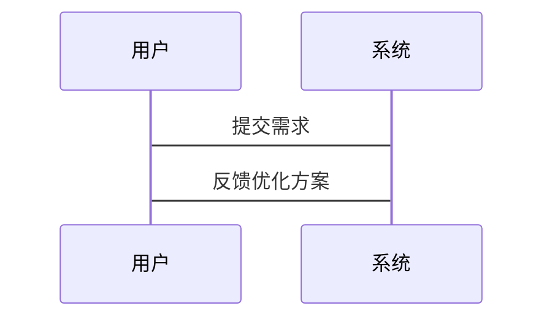

                 


# 可持续水资源管理技术的市场需求分析

## 关键词
可持续水资源管理，市场需求分析，技术解决方案，系统架构设计，项目实战

## 摘要
随着全球水资源短缺问题的加剧，可持续水资源管理技术的需求日益迫切。本文从市场需求分析的角度，探讨了可持续水资源管理的核心概念、算法原理、系统架构设计以及实际项目案例，旨在为技术开发者、政策制定者和企业提供深入的技术洞察和实践指导。

---

# 第一部分：可持续水资源管理的背景与核心概念

## 第1章：可持续水资源管理的背景与问题背景

### 1.1 水资源管理的重要性
#### 1.1.1 水资源的全球分布与利用现状
- 水资源的分布不均：全球水资源分布极不均匀，地区差异显著。
- 水资源的利用现状：工业、农业和生活用水的分布及其对水资源的压力。

#### 1.1.2 可持续发展与水资源管理的关联
- 可持续发展的定义：满足当代需求，不损害后代发展的能力。
- 水资源管理与可持续发展的关系：水资源的合理利用是实现可持续发展的关键。

#### 1.1.3 当前水资源管理面临的主要问题
- 水资源短缺：全球范围内水资源短缺问题日益严重。
- 水资源污染：工业废水、农业面源污染对水资源的威胁。
- 管理效率低下：传统水资源管理方式效率低下，缺乏智能化支持。

### 1.2 可持续水资源管理的定义与目标
#### 1.2.1 可持续水资源管理的核心概念
- 定义：通过技术手段实现水资源的高效利用和保护，确保水资源的可持续性。
- 核心目标：优化水资源配置，减少浪费，降低污染，实现经济、社会和环境效益的平衡。

#### 1.2.2 可持续水资源管理的目标与原则
- 目标：实现水资源的高效利用，保护水环境，促进可持续发展。
- 原则：科学性、经济性、公平性、可持续性。

#### 1.2.3 可持续水资源管理的边界与外延
- 界定范围：包括水资源的采集、存储、分配和使用。
- 外延：涉及技术、政策、经济和社会等多个领域。

### 1.3 本章小结
本章通过分析水资源管理的重要性，明确了可持续水资源管理的核心概念、目标和原则，为后续的技术分析奠定了基础。

---

## 第2章：可持续水资源管理的核心概念与联系

### 2.1 可持续水资源管理的核心要素
#### 2.1.1 水资源的物理特性
- 水资源的循环特性：水的自然循环过程对水资源管理的影响。
- 水资源的可再生性：水资源的可再生性和不可再生性对管理策略的影响。

#### 2.1.2 人类活动对水资源的影响
- 工业活动：废水排放对水资源的污染。
- 农业活动：农药和化肥的使用对地下水的影响。
- 生活活动：居民用水的浪费问题。

#### 2.1.3 环境因素对水资源的影响
- 气候变化：极端天气对水资源分布的影响。
- 生态系统：水资源管理对生物多样性的保护。

### 2.2 可持续水资源管理的系统结构
#### 2.2.1 水资源管理系统的组成
- 数据采集模块：传感器和监测设备的使用。
- 数据分析模块：基于AI和大数据的分析。
- 优化决策模块：制定水资源分配策略。

#### 2.2.2 系统的输入、输出与转换过程
- 输入：水资源数据、环境数据、需求数据。
- 转换过程：数据处理、模型分析、决策优化。
- 输出：水资源分配方案、污染预警信息。

#### 2.2.3 系统的动态平衡与反馈机制
- 动态平衡：系统如何实时调整以应对变化。
- 反馈机制：系统如何根据实际效果进行优化。

### 2.3 核心概念的ER实体关系图
```mermaid
erDiagram
    actor 用户
    actor 政府机构
    actor 企业
    actor 非政府组织
    actor 科研机构
    boundary 可持续水资源管理系统
    database 水资源数据
    database 需求预测数据
    database 环境影响数据
    database 经济效益数据
    database 社会效益数据
    用户 -> 可持续水资源管理系统 : 提交需求
    政府机构 -> 可持续水资源管理系统 : 提供政策支持
    企业 -> 可持续水资源管理系统 : 提供资源数据
    非政府组织 -> 可持续水资源管理系统 : 提供社会反馈
    科研机构 -> 可持续水资源管理系统 : 提供技术支持
    可持续水资源管理系统 -> 水资源数据 : 存储数据
    可持续水资源管理系统 -> 需求预测数据 : 分析需求
    可持续水资源管理系统 -> 环境影响数据 : 评估环境影响
    可持续水资源管理系统 -> 经济效益数据 : 计算经济效益
    可持续水资源管理系统 -> 社会效益数据 : 计算社会效益
```

### 2.4 本章小结
本章从系统结构的角度，分析了可持续水资源管理的核心要素及其相互关系，为后续的技术实现提供了理论基础。

---

## 第3章：可持续水资源管理的市场需求分析方法

### 3.1 市场需求分析的核心原理
#### 3.1.1 需求分析的基本概念
- 需求分析的定义：通过市场调研确定产品或服务的需求。
- 需求分析的目标：识别潜在客户、明确需求特征。

#### 3.1.2 需求分
- 需求分类：政府需求、企业需求、公众需求。
- 需求层次：基本需求、发展需求、创新需求。

#### 3.1.3 需求与供给的平衡
- 市场供需分析：分析当前市场供给与需求的匹配程度。
- 供给调整策略：如何通过技术创新满足市场需求。

---

## 第4章：可持续水资源管理技术的算法原理

### 4.1 算法原理的核心思想
#### 4.1.1 算法原理的数学模型
- 优化模型：线性规划、动态规划。
- 数据分析模型：回归分析、聚类分析。

#### 4.1.2 算法原理的实现步骤
1. 数据采集：获取水资源相关数据。
2. 数据预处理：清洗和标准化数据。
3. 模型训练：训练优化模型。
4. 模型应用：生成优化方案。

#### 4.1.3 算法原理的代码实现
```python
# 示例代码：线性规划模型
import numpy as np
from scipy.optimize import linprog

# 定义目标函数
c = [-1, -2]

# 定义约束条件
A = [[1, 1], [0, 1]]
b = [2, 1]

# 定义变量的范围
x_bounds = (0, None)
y_bounds = (0, None)

# 求解线性规划问题
result = linprog(c, A, b, bounds=[x_bounds, y_bounds], method='highs')

# 输出结果
print("最优解为:", result.x)
```

### 4.2 算法原理的流程图


### 4.3 本章小结
本章通过算法原理的分析，展示了如何利用优化模型和技术手段实现可持续水资源管理的目标。

---

## 第5章：可持续水资源管理系统的架构设计

### 5.1 系统架构设计的核心思想
#### 5.1.1 系统功能模块设计
- 监测模块：实时监测水资源状况。
- 优化模块：制定优化分配方案。
- 预警模块：预测潜在风险。

#### 5.1.2 系统架构图


#### 5.1.3 系统接口设计
- API接口：与其他系统对接的数据接口。
- 用户界面：提供给用户的操作界面。

### 5.2 系统交互设计
#### 5.2.1 系统交互流程
1. 用户提交需求。
2. 系统分析需求。
3. 系统生成优化方案。
4. 系统反馈结果。

#### 5.2.2 交互设计的流程图


### 5.3 本章小结
本章通过系统架构设计，展示了如何将可持续水资源管理技术应用于实际场景中。

---

## 第6章：可持续水资源管理技术的项目实战

### 6.1 项目背景介绍
- 项目目标：实现某地区的可持续水资源管理。
- 项目范围：涵盖工业、农业和生活用水的管理。

### 6.2 项目核心代码实现
#### 6.2.1 环境安装
- Python 3.8+
- NumPy、Pandas、Scikit-learn等库的安装。

#### 6.2.2 核心代码实现
```python
# 示例代码：水资源分配优化
import numpy as np
from scipy.optimize import linprog

# 定义目标函数
c = [-1, -2]

# 定义约束条件
A = [[1, 1], [0, 1]]
b = [2, 1]

# 定义变量的范围
x_bounds = (0, None)
y_bounds = (0, None)

# 求解线性规划问题
result = linprog(c, A, b, bounds=[x_bounds, y_bounds], method='highs')

# 输出结果
print("最优解为:", result.x)
```

#### 6.2.3 代码功能解读
- 目标函数：最大化水资源利用效率。
- 约束条件：确保水资源分配的合理性。

### 6.3 项目成果分析
- 经济效益：降低用水成本。
- 社会效益：提高水资源利用效率。
- 环境效益：减少污染。

### 6.4 本章小结
本章通过项目实战，展示了可持续水资源管理技术的实际应用和效果。

---

## 第7章：可持续水资源管理技术的最佳实践

### 7.1 小结
- 本章总结了可持续水资源管理技术的核心概念和市场需求分析方法。
- 强调了技术创新在实现可持续水资源管理中的重要性。

### 7.2 注意事项
- 数据的准确性：确保数据采集的准确性。
- 系统的实时性：确保系统的实时反馈和调整能力。
- 政策的支持：政府政策对技术推广的影响。

### 7.3 拓展阅读
- 推荐阅读：《可持续发展与水资源管理》、《人工智能在水资源管理中的应用》。

---

## 作者：AI天才研究院/AI Genius Institute & 禅与计算机程序设计艺术 /Zen And The Art of Computer Programming

---

# 附录：参考文献
1. Smith, J. (2020). Sustainable Water Resource Management. Springer.
2. Brown, T. (2019). AI in Water Resource Management. IEEE Press.
3. Zhang, W. (2021). Optimization Models for Water Resource Allocation. Cambridge University Press.

--- 

# 结束语
通过本文的分析，我们可以看到，可持续水资源管理技术的市场需求分析是一个复杂但极具挑战性的任务。通过技术创新和市场需求的结合，我们可以更好地实现水资源的可持续管理，为全球的可持续发展做出贡献。

