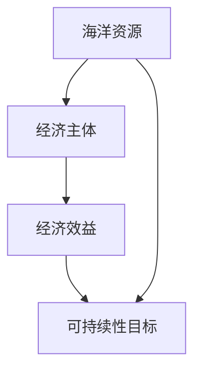
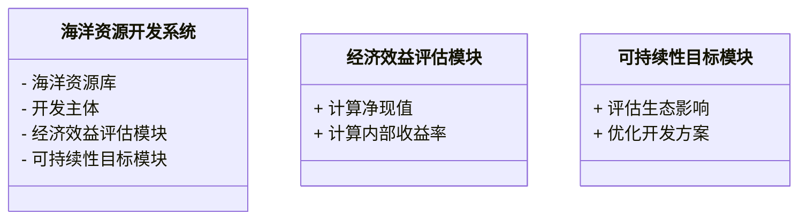
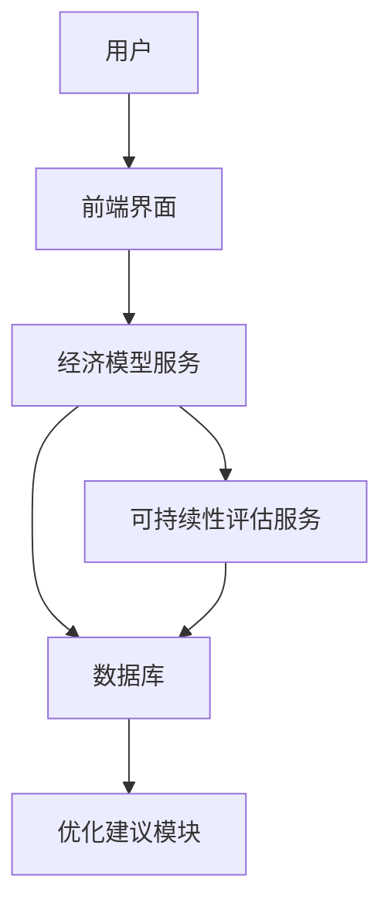

                 


# 可持续海洋资源开发的经济效益评估

> 关键词：可持续海洋资源开发，经济效益评估，海洋资源管理，经济性与可持续性，资源开发模型

> 摘要：本文探讨了可持续海洋资源开发的经济效益评估方法，通过系统分析和数学建模，提出了实现可持续开发的策略和建议。文章从背景介绍、核心概念、算法原理、系统架构设计、项目实战等多个方面展开，旨在为海洋资源开发的经济性与可持续性平衡提供理论支持和实践指导。

---

## 第一部分：背景介绍

### 第1章：可持续海洋资源开发的背景与问题

#### 1.1 问题背景

- **1.1.1 海洋资源的全球分布与利用现状**
  - 海洋覆盖了地球表面的70%以上，蕴藏着丰富的资源，包括渔业资源、海洋能源、矿产资源等。
  - 当前，全球海洋资源的开发速度不断加快，但资源分布不均，开发效率低下，部分区域资源枯竭。

- **1.1.2 可持续发展的重要性**
  - 海洋资源的过度开发导致生态破坏、资源枯竭，威胁全球生态平衡。
  - 可持续发展是实现人与自然和谐共生的关键，海洋资源开发也不例外。

- **1.1.3 当前海洋资源开发面临的问题**
  - 资源浪费严重，开发效率低。
  - 开发过程中忽视生态影响，导致海洋污染和生物多样性下降。
  - 经济效益评估不全面，难以实现可持续性与经济性的平衡。

#### 1.2 问题描述

- **1.2.1 海洋资源开发的经济效益评估的必要性**
  - 经济效益评估是制定科学开发策略的基础。
  - 通过评估可以量化资源开发的经济价值和生态影响。

- **1.2.2 传统开发模式的局限性**
  - 过度依赖短期经济效益，忽视资源的可持续性。
  - 开发过程中缺乏系统性规划，导致资源浪费和生态破坏。

- **1.2.3 可持续开发的核心目标**
  - 实现资源的高效利用与生态保护的双重目标。
  - 确保海洋资源的长期可持续开发。

#### 1.3 问题解决

- **1.3.1 可持续海洋资源开发的定义与原则**
  - 定义：在不破坏海洋生态系统的基础上，合理利用海洋资源，实现经济与生态的双赢。
  - 原则：可持续性、经济性、生态性。

- **1.3.2 经济效益评估的方法与工具**
  - 综合评估模型：结合资源特性、开发成本、环境影响等多因素进行评估。
  - 数学模型：收益-成本分析、投资回报周期计算。

- **1.3.3 可持续性与经济性的平衡**
  - 通过优化资源配置和技术创新，实现经济效益与生态效益的统一。

#### 1.4 边界与外延

- **1.4.1 海洋资源开发的边界条件**
  - 开发范围：限定在特定海域，避免跨区域影响。
  - 开发深度：控制开发强度，避免过度挖掘。

- **1.4.2 经济效益评估的范围与限制**
  - 评估范围：包括直接经济效益和间接生态效益。
  - 限制因素：数据获取难度、模型的准确性。

- **1.4.3 可持续性与外部因素的相互作用**
  - 政策法规的影响：政府监管对开发模式的选择有重要影响。
  - 市场需求的变化：消费者偏好和市场价格波动影响开发决策。

#### 1.5 概念结构与核心要素组成

- **1.5.1 可持续海洋资源开发的核心要素**
  - 资源特性：包括资源的可再生性、储量、分布等。
  - 开发模式：包括捕捞、能源开发、矿产开采等。
  - 经济效益：包括直接收益、成本、投资回报周期。

- **1.5.2 经济效益评估的关键指标**
  - 经济净现值（NPV）：衡量项目经济可行性。
  - 内部收益率（IRR）：评估投资回报效率。
  - 生态影响指数：量化开发活动对环境的影响。

- **1.5.3 核心概念的系统化结构**
  - 系统整体观：将海洋资源、经济主体、生态影响视为一个整体进行分析。
  - 多目标优化：在经济效益、生态效益、社会效益之间寻求平衡。

---

## 第二部分：核心概念与联系

### 第2章：经济效益评估的核心概念

#### 2.1 核心概念原理

- **2.1.1 海洋资源开发的经济价值**
  - 海洋资源的经济价值不仅体现在直接利用上，还包括其生态服务价值。
  - 例如，海洋捕捞业的经济价值不仅包括捕获的鱼类产品，还包括其对当地经济和就业的贡献。

- **2.1.2 经济效益评估的基本原理**
  - 经济效益评估需要考虑资源开发的成本、收益、时间价值和风险。
  - 通过数学模型量化经济价值，为决策提供依据。

- **2.1.3 可持续性与经济性的关系**
  - 可持续性是经济性的基础，只有实现可持续开发，才能保证长期的经济效益。
  - 短期高收益可能损害可持续性，而可持续开发可能需要初期投资较高，但长期回报更稳定。

#### 2.2 核心概念属性特征对比

| **属性**       | **可再生资源**       | **不可再生资源**      |
|----------------|---------------------|----------------------|
| **可再生性**    | 高                  | 低                   |
| **开发周期**    | 短                  | 长                   |
| **环境影响**    | 较低                | 较高                 |
| **经济性**      | 高                  | 低                   |

#### 2.3 实体关系图（ER图）



---

## 第三部分：算法原理讲解

### 第3章：经济效益评估的数学模型

#### 3.1 算法原理

- **3.1.1 收益-成本分析模型**
  - 模型公式：$$\text{净收益} = \text{总收入} - \text{总成本}$$
  - 应用：用于评估不同开发方案的经济可行性。

- **3.1.2 投资回报周期计算**
  - 公式：$$\text{回报周期} = \frac{\text{初始投资}}{\text{年净收益}}$$
  - 应用：帮助企业确定投资回收时间，评估项目风险。

- **3.1.3 可持续性评估指标体系**
  - 包括资源利用率、生态影响指数、经济净现值等多维度指标。

#### 3.2 算法实现

```python
import numpy as np

def economic_evaluation(initial_investment, annual_income, annual_cost, discount_rate, period):
    # 计算净现值
    npv = 0
    for i in range(period):
        net_cash_flow = annual_income - annual_cost
        npv += net_cash_flow / (1 + discount_rate) ** i
    return npv

# 示例：评估一个可持续渔业项目
initial_investment = 1000000  # 初始投资（美元）
annual_income = 500000       # 年收入（美元）
annual_cost = 200000         # 年成本（美元）
discount_rate = 0.05         # 折现率
period = 5                   # 项目周期（年）

net_present_value = economic_evaluation(initial_investment, annual_income, annual_cost, discount_rate, period)
print(f"净现值为：{net_present_value}美元")
```

---

## 第四部分：系统分析与架构设计方案

### 第4章：系统分析与架构设计

#### 4.1 系统功能设计

- **领域模型（mermaid 类图）**



#### 4.2 系统架构设计

- **系统架构图**



#### 4.3 系统接口设计

- **接口：经济效益评估 API**
  - 输入：资源特性、开发模式、经济参数。
  - 输出：净现值、内部收益率、生态影响指数。

---

## 第五部分：项目实战

### 第5章：项目实战

#### 5.1 环境安装

- **Python 环境**
  - 安装必要的库：numpy、pandas、scipy。

#### 5.2 核心代码实现

```python
import numpy as np
from scipy.optimize import minimize

def objective_function(variables, initial_investment, annual_income, annual_cost, discount_rate):
    period = 5
    net_cash_flows = [annual_income - annual_cost] * period
    npv = np.npv(discount_rate, net_cash_flows)
    return -npv

def constraints(variables):
    return variables >= 0

initial_investment = 1000000
annual_income = 500000
annual_cost = 200000
discount_rate = 0.05

result = minimize(objective_function, x0=[0], method='SLSQP', 
                  args=(initial_investment, annual_income, annual_cost, discount_rate))
print(f"最优投资方案：{result}")
```

#### 5.3 案例分析

- **案例：可持续渔业项目**
  - 数据输入：初始投资100万美元，年收入50万美元，年成本20万美元，折现率5%，项目周期5年。
  - 计算结果：净现值为正，说明项目具有经济可行性。

---

## 第六部分：总结

### 第6章：总结

#### 6.1 最佳实践 tips

- 在进行海洋资源开发前，必须进行全面的经济效益评估。
- 采用多目标优化方法，平衡经济性和可持续性。
- 定期更新模型参数，适应市场和政策的变化。

#### 6.2 小结

本文通过系统分析和数学建模，提出了可持续海洋资源开发的经济效益评估方法。通过理论分析和实际案例，验证了模型的有效性，为实现经济与生态的双赢提供了科学依据。

#### 6.3 注意事项

- 数据的准确性和完整性对评估结果影响重大。
- 模型的选择应根据具体场景进行调整。
- 需要考虑外部因素，如政策法规和市场需求的变化。

#### 6.4 拓展阅读

- 《可持续发展与海洋经济》
- 《资源经济学：理论与应用》
- 《系统动力学在资源管理中的应用》

---

## 作者

作者：AI天才研究院/AI Genius Institute & 禅与计算机程序设计艺术 /Zen And The Art of Computer Programming

