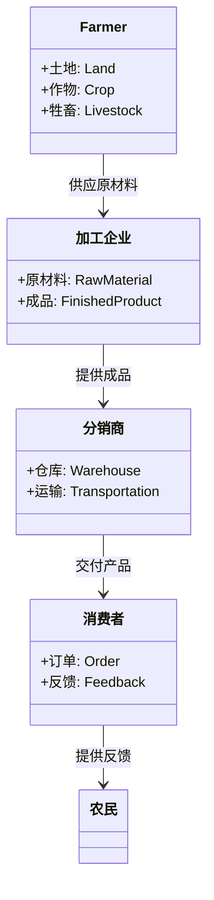
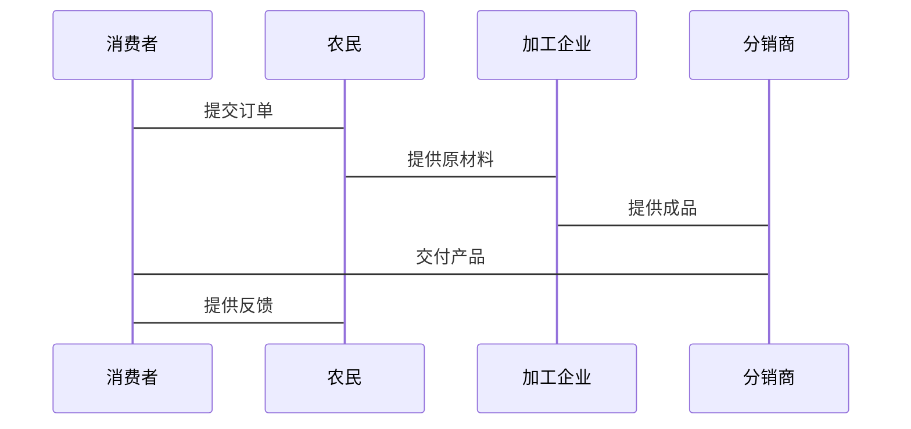

                 


# 可持续食品系统的创新与投资机会

## 关键词：可持续食品系统、技术创新、投资机会、农业数字化、智能供应链、生态系统

## 摘要：  
可持续食品系统是解决全球食品安全、环境资源压力和供应链脆弱性等问题的关键。本文将从技术创新、系统架构和投资机会等多个维度深入分析可持续食品系统的现状、挑战与未来发展方向。通过案例分析和系统设计，本文将为读者提供全面的视角，帮助理解如何通过技术创新和投资推动可持续食品系统的建设。

---

# 第1章：可持续食品系统的背景与概念

## 1.1 可持续食品系统的定义与核心要素

### 1.1.1 可持续发展的基本概念
可持续发展是指在满足当前需求的同时，不损害后代满足其需求的能力。在食品系统中，可持续性涉及生产、加工、分销和消费等环节的资源效率和环境影响。

### 1.1.2 食品系统的核心要素
1. **生产**：农业种植、畜牧养殖和水产养殖。
2. **加工**：食品加工技术与包装。
3. **分销**：供应链管理与物流。
4. **消费**：消费者行为与食品浪费。

### 1.1.3 可持续食品系统的内涵与外延
可持续食品系统强调资源高效利用、减少环境影响、促进社会公平和经济可行。

## 1.2 可持续食品系统的问题背景

### 1.2.1 当前全球食品安全挑战
- 饥饿与营养不良问题。
- 食品供应链的脆弱性。
- 食品浪费与资源浪费。

### 1.2.2 环境与资源的可持续性问题
- 土地退化与水资源短缺。
- 温室气体排放与气候变化。
- 化肥和农药的过度使用。

### 1.2.3 社会公平与食品供应链的脆弱性
- 农民收入低、资源获取不平等。
- 疫情等突发事件对供应链的冲击。

## 1.3 可持续食品系统的现状与趋势

### 1.3.1 全球可持续食品系统的实践案例
- 有机农业的推广。
- 可持续渔业认证。
- 环保包装与循环经济。

### 1.3.2 技术创新对可持续食品系统的影响
- 数字技术（如物联网、大数据）的应用。
- 新兴技术（如垂直农业、基因编辑）的创新。

### 1.3.3 可持续食品系统的未来发展方向
- 数字化与智能化。
- 循环经济与零浪费模式。
- 社区支持农业（CSA）与共享经济。

## 1.4 可持续食品系统与传统食品系统的对比

### 1.4.1 生产方式的差异
- 传统农业：依赖化学肥料和农药，资源利用效率低。
- 可持续农业：采用生态农业和精准农业技术，减少资源浪费。

### 1.4.2 供应链的差异
- 传统供应链：线性模式，资源消耗大，浪费多。
- 可持续供应链：循环模式，减少浪费，提高效率。

### 1.4.3 消费者行为的差异
- 传统消费：价格敏感，忽视环境影响。
- 可持续消费：注重环保、健康和透明度。

---

# 第2章：可持续食品系统的创新技术与模式

## 2.1 可持续食品系统的创新技术

### 2.1.1 精准农业技术
- **定义**：利用物联网、大数据和人工智能优化农业生产。
- **应用场景**：土壤监测、精准灌溉、病虫害预测。
- **优势**：减少资源浪费，提高产量。

### 2.1.2 垂直农业与城市农业
- **垂直农业**：利用垂直空间进行植物栽培，节省土地。
- **城市农业**：在城市中种植蔬菜和水果，减少运输成本。
- **技术支撑**：LED照明、自动控制系统。

### 2.1.3 生物技术与基因编辑
- **生物技术**：改良作物品种，提高抗病性和营养价值。
- **基因编辑**：CRISPR技术用于快速育种。
- **应用案例**：耐旱作物的开发。

### 2.1.4 循环农业与废弃物资源化
- **循环农业**：将农业废弃物转化为有机肥或生物质能源。
- **资源化技术**：堆肥、沼气发电。

## 2.2 可持续食品系统的创新模式

### 2.2.1 共享农业模式
- **定义**：通过共享资源（如土地、设备）降低生产成本。
- **应用场景**：农场合作、农机共享。
- **优势**：提高资源利用效率，降低农民负担。

### 2.2.2 社区支持农业（CSA）
- **定义**：消费者与农民签订协议，定期购买农产品。
- **优势**：建立信任关系，促进本地生产。
- **案例**：美国和欧洲的CSA项目。

### 2.2.3 数字化供应链管理
- **定义**：利用数字化技术优化供应链的透明度和效率。
- **技术支撑**：区块链技术用于溯源，物联网监控物流过程。
- **优势**：减少浪费，提高透明度。

## 2.3 可持续食品系统的创新案例分析

### 2.3.1 智能农业的实践案例
- **案例**：印度的智能农业项目，利用无人机监测作物生长。
- **技术应用**：精准灌溉、病虫害预测。

### 2.3.2 可持续食品加工与包装创新
- **案例**：使用可降解材料制作食品包装。
- **技术支撑**：生物基塑料、活性包装技术。

### 2.3.3 可持续食品包装与物流创新
- **案例**：减少包装层数，采用共享物流模式。
- **技术支撑**：智能温控系统、共享配送平台。

---

# 第3章：可持续食品系统的投资机会分析

## 3.1 可持续食品系统的投资热点

### 3.1.1 农业科技（Agri-tech）投资
- **精准农业技术**：如土壤传感器、无人机监测。
- **投资案例**：投资农业大数据公司，如The Climate Corporation。

### 3.1.2 可持续食品加工与包装
- **投资方向**：可降解包装材料、智能包装技术。
- **投资案例**：投资环保包装公司，如Economa Technologies。

### 3.1.3 数字化供应链投资
- **投资方向**：区块链技术用于食品溯源，智能物流系统。
- **投资案例**：投资供应链管理公司，如TraceLink。

## 3.2 可持续食品系统的投资策略

### 3.2.1 风险评估与机会识别
- **风险分析**：市场需求波动、技术不确定性、政策变化。
- **机会识别**：关注技术创新、政策支持和消费者趋势。

### 3.2.2 投资组合优化
- **多元化投资**：分散投资于不同领域的创新技术。
- **长期投资**：关注技术成熟度和市场潜力。

### 3.2.3 可持续发展与投资回报的平衡
- **短期回报**：关注技术创新带来的效率提升。
- **长期回报**：关注品牌价值和市场占有率。

## 3.3 可持续食品系统的未来趋势

### 3.3.1 技术驱动的食品创新
- **人工智能**：优化种植和养殖效率。
- **生物技术**：开发新型食品原料。

### 3.3.2 消费者行为的变化趋势
- **健康意识提升**：消费者更关注食品的健康性和环保性。
- **透明消费**：消费者更倾向于支持透明和可持续的品牌。

### 3.3.3 政策支持与行业规范
- **政府政策**：补贴、税收优惠和法规支持。
- **行业规范**：推动可持续食品标准的制定和推广。

---

# 第4章：系统分析与架构设计方案

## 4.1 问题场景介绍

### 4.1.1 问题描述
- 当前食品系统存在资源浪费、环境污染和供应链脆弱等问题。
- 如何通过技术创新和系统优化实现可持续发展？

## 4.2 项目介绍

### 4.2.1 项目目标
- 开发一个可持续食品系统解决方案，包括生产、加工、分销和消费环节。

## 4.3 系统功能设计

### 4.3.1 领域模型（mermaid类图）


## 4.4 系统架构设计

### 4.4.1 系统架构（mermaid架构图）


## 4.5 系统接口设计

### 4.5.1 接口描述
- 农民与加工企业的接口：原材料供应和订单管理。
- 加工企业与分销商的接口：成品交付和物流协调。
- 分销商与消费者的接口：订单处理和支付。

## 4.6 系统交互设计

### 4.6.1 交互流程（mermaid序列图）


---

# 第5章：项目实战

## 5.1 环境安装

### 5.1.1 系统需求
- 操作系统：Linux/Windows/MacOS
- 开发工具：Python、Git、IDE
- 数据库：MySQL/PostgreSQL
- 云服务：AWS/Azure

## 5.2 系统核心实现源代码

### 5.2.1 核心代码实现
```python
def sustainable_food_system():
    # 农民端
    def farmer():
        land = "肥沃土地"
        crop = "有机蔬菜"
        return (land, crop)

    # 加工企业端
    def processing_plant(crop):
        raw_material = "蔬菜原材料"
        finished_product = "包装蔬菜"
        return (raw_material, finished_product)

    # 分销商端
    def distributor(finished_product):
        warehouse = "中央仓库"
        transportation = "冷链物流"
        return (warehouse, transportation)

    # 消费者端
    def consumer():
        order = "订单"
        feedback = "满意"
        return (order, feedback)

    # 系统流程
    land, crop = farmer()
    raw_material, finished_product = processing_plant(crop)
    warehouse, transportation = distributor(finished_product)
    order, feedback = consumer()
    return (land, raw_material, warehouse, order, feedback)

sustainable_food_system()
```

### 5.2.2 代码应用解读与分析
- **农民端**：提供高质量的有机作物。
- **加工企业端**：将原材料加工成环保包装的成品。
- **分销商端**：通过冷链物流将产品配送到消费者手中。
- **消费者端**：提交订单并提供反馈。

## 5.3 实际案例分析

### 5.3.1 案例分析：有机农业项目
- **背景**：一家有机农场采用精准农业技术，减少化肥使用。
- **实施过程**：安装土壤传感器，监测土壤湿度和温度。
- **结果**：产量提高10%，资源浪费减少20%。

## 5.4 项目小结

### 5.4.1 成功经验总结
- 技术创新是关键。
- 供应链优化是核心。
- 消费者参与是保障。

### 5.4.2 可扩展性分析
- 可扩展到更多农产品类别。
- 可推广到更多地理区域。

---

# 第6章：总结与展望

## 6.1 全文总结

### 6.1.1 核心内容回顾
- 可持续食品系统的背景与挑战。
- 创新技术与模式的分析。
- 投资机会与系统设计方案。

## 6.2 未来趋势与展望

### 6.2.1 技术创新的未来方向
- 更多生物技术应用。
- 更智能的数字化工具。

### 6.2.2 投资机会的未来趋势
- 更多政策支持。
- 更多消费者需求驱动。

### 6.2.3 可持续食品系统的未来发展
- 技术与模式的深度融合。
- 全球化与本地化的平衡。

## 6.3 最佳实践 tips

### 6.3.1 投资者建议
- 关注技术创新和政策支持。
- 选择有潜力的新兴技术。

### 6.3.2 创业者建议
- 专注于特定领域。
- 提供透明和可持续的产品。

## 6.4 注意事项

### 6.4.1 技术风险
- 技术成熟度。
- 市场接受度。

### 6.4.2 市场风险
- 消费者认知。
- 竞争格局。

## 6.5 拓展阅读

### 6.5.1 推荐书籍
- 《The Future of Food》
- 《Sustainable Agriculture: Innovations and Practices》

### 6.5.2 推荐报告
- 联合国粮农组织报告。
- 环境保护机构报告。

---

# 作者：AI天才研究院/AI Genius Institute & 禅与计算机程序设计艺术 /Zen And The Art of Computer Programming

---

本文通过系统的分析与设计，结合实际案例，深入探讨了可持续食品系统的创新与投资机会。希望本文能为读者提供有价值的见解和实践指导，助力可持续食品系统的建设与发展。

