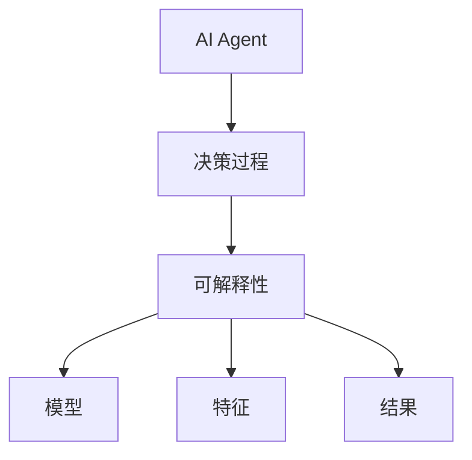
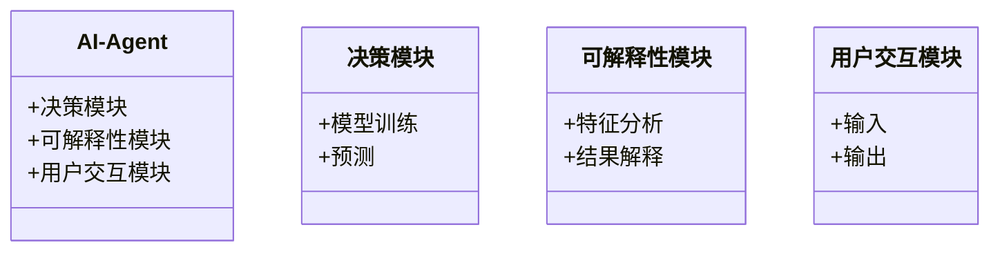
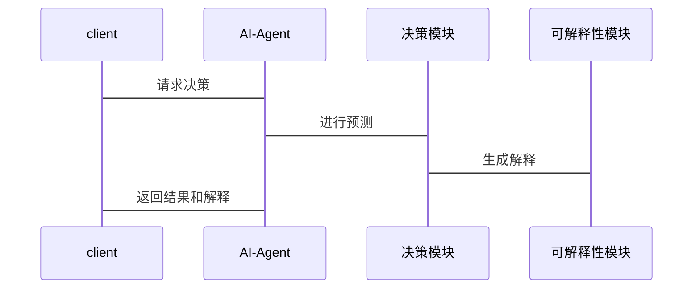

                 


# 可解释性：理解AI Agent的决策过程

> 关键词：AI Agent, 可解释性, 决策过程, SHAP值, LIME算法, 机器学习模型, 强化学习

> 摘要：AI Agent的决策过程需要可解释性，以确保透明度和信任度。本文将从AI Agent的决策机制、可解释性的核心概念、典型算法（如LIME和SHAP）的原理，以及系统架构设计等方面，详细分析如何理解并实现AI Agent的可解释性。通过实际案例和代码实现，帮助读者掌握可解释性技术的核心思想和应用方法。

---

## 第一部分: 可解释性概述

### 第1章: 可解释性的定义与背景

#### 1.1 问题背景与定义
可解释性是人工智能（AI）系统的重要特性之一。AI Agent的决策过程需要透明，以便人类能够理解其行为背后的逻辑。可解释性不仅帮助用户信任AI系统，还能在出现问题时进行故障排除和优化。

#### 1.2 可解释性的重要性
- **信任度**：用户需要信任AI系统的决策过程。
- **透明度**：可解释性使AI系统的决策过程公开透明。
- **责任追究**：在出现问题时，可解释性有助于追溯决策的原因。

#### 1.3 可解释性与AI Agent的关系
AI Agent的决策过程依赖于可解释性，以便更好地与人类交互和协作。可解释性是AI Agent可信性和可用性的关键。

---

### 第2章: AI代理决策过程的复杂性

#### 2.1 AI代理的决策机制
- **基于规则的决策**：通过预定义的规则进行决策，简单但缺乏灵活性。
- **基于模型的决策**：通过机器学习模型进行预测和决策，复杂但更具灵活性。
- **基于强化学习的决策**：通过奖励机制优化决策策略，适用于动态环境。

#### 2.2 决策过程中的不确定性
- **不确定性来源**：数据噪声、模型假设、环境动态等。
- **不确定性对可解释性的影响**：不确定性可能导致决策过程难以解释。
- **量化不确定性**：通过概率模型或置信区间量化决策的不确定性。

---

## 第二部分: 可解释性的核心概念与联系

### 第3章: 可解释性维度与模型复杂度

#### 3.1 可解释性的维度分析
- **局部可解释性**：关注单个预测的解释，适用于复杂模型。
- **全局可解释性**：关注整个模型的解释，适用于简单模型。
- **时间依赖性**：解释可能随时间变化而变化。

#### 3.2 模型复杂度与可解释性的关系
- **简单模型的可解释性优势**：线性回归模型易于解释。
- **复杂模型的可解释性挑战**：深度神经网络难以解释。
- **平衡复杂度与可解释性的方法**：使用可解释性模型（如LIME）对复杂模型进行解释。

---

### 第4章: 可解释性模型对比分析

#### 4.1 常见可解释性模型对比
- **LIME模型**：通过局部线性近似解释单个预测。
- **SHAP值**：基于博弈论的特征重要性解释。
- **其他方法**：如特征贡献分析、决策树解释等。

#### 4.2 模型属性特征对比表
| 模型类型 | 解释能力 | 计算复杂度 |
|---------|----------|------------|
| LIME    | 高       | 中         |
| SHAP    | 高       | 高         |
| 线性回归| 高       | 低         |

#### 4.3 ER实体关系图架构


---

## 第三部分: 可解释性算法原理

### 第5章: LIME算法原理与实现

#### 5.1 LIME算法概述
- **算法原理**：通过局部线性近似解释单个预测。
- **算法步骤**：
  1. 采样：在预测点附近生成样本数据。
  2. 拟合：在采样数据上拟合简单模型（如线性回归）。
  3. 解释：通过简单模型的系数解释预测结果。

#### 5.2 LIME算法的数学模型
- **核心公式**：$$y = \beta_0 + \beta_1x_1 + \beta_2x_2 + \dots + \beta_nx_n$$
- **优化目标**：最小化预测值与近似模型的差异。

#### 5.3 LIME算法的Python实现
```python
import lime
from lime import lime_explanations

# 初始化解释器
explainer = lime_explanations.LimeExplainer()

# 解释单个预测
explanation = explainer.explain_instance(X, model.predict, 100)
```

---

### 第6章: SHAP值原理与实现

#### 6.1 SHAP值概述
- **算法原理**：基于博弈论的特征重要性解释。
- **算法步骤**：
  1. 计算特征对模型预测的贡献。
  2. 使用SHAP值对特征贡献进行加权。
  3. 可视化SHAP值以解释预测结果。

#### 6.2 SHAP值的数学模型
- **核心公式**：$$SHAP(x) = \phi_1 + \phi_2 + \dots + \phi_n$$
- **解释**：每个$\phi_i$表示特征$i$对预测结果的贡献。

#### 6.3 SHAP值的Python实现
```python
import shap

# 初始化解释器
explainer = shap.TreeExplainer(model)

# 解释模型
shap_values = explainer.shap_values(X)

# 可视化解释
shap.summary_plot(shap_values, X)
```

---

## 第四部分: 可解释性系统架构设计

### 第7章: AI Agent系统设计

#### 7.1 问题场景介绍
- **目标**：设计一个可解释的AI Agent系统。
- **需求**：支持可解释性、实时决策、用户交互。

#### 7.2 系统功能设计


#### 7.3 系统架构设计


#### 7.4 系统接口设计
- **输入接口**：接收用户输入。
- **输出接口**：输出解释结果。
- **交互接口**：支持用户与AI Agent的实时交互。

#### 7.5 系统交互流程


---

## 第五部分: 项目实战

### 第8章: 可解释性电商推荐系统

#### 8.1 环境安装
```bash
pip install lime shap
```

#### 8.2 核心代码实现
```python
import numpy as np
import lime
from lime import lime_explanations

# 数据准备
X = np.array([[1, 2, 3], [4, 5, 6]])
y = np.array([0, 1])

# 训练模型
model.fit(X, y)

# 初始化解释器
explainer = lime_explanations.LimeExplainer()

# 解释单个预测
explanation = explainer.explain_instance(X[0], model.predict, 100)
```

#### 8.3 案例分析与结果解读
- **预测结果**：模型预测结果为0。
- **解释结果**：特征1对预测结果的影响最大。

---

## 第六部分: 总结与展望

### 9.1 最佳实践
- 使用LIME和SHAP等可解释性工具。
- 在系统设计阶段考虑可解释性需求。
- 定期验证和优化可解释性模型。

### 9.2 小结
本文详细介绍了AI Agent决策过程的可解释性，从核心概念到算法实现，再到系统设计和项目实战，为读者提供了全面的指导。

### 9.3 注意事项
- 可解释性需要在系统设计阶段就考虑。
- 不同场景下可解释性需求可能不同。
- 需要结合具体业务场景选择合适的可解释性方法。

### 9.4 拓展阅读
- "Explainable AI: A Survey"，Nature Machine Intelligence。
- "Interpretable Machine Learning"， Christoph Molnár。

---

作者：AI天才研究院 & 禅与计算机程序设计艺术

