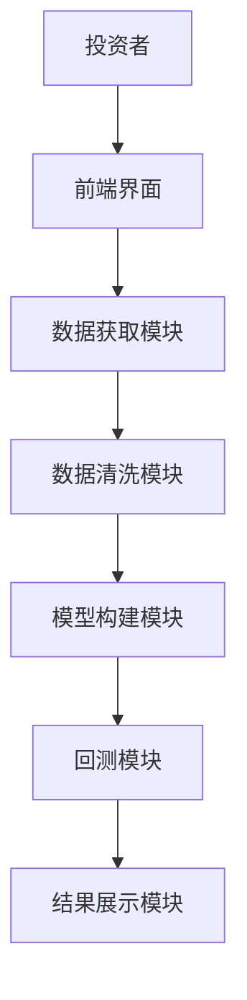

                 


# 可转换债券策略：兼具股债特性的灵活工具

---

## 关键词：
可转换债券，债券，股票，投资策略，定价模型，风险分析，量化交易

---

## 摘要：
可转换债券（Convertible Bonds）是一种兼具债券和股票双重特性的金融工具，能够在不同市场环境下灵活配置资产，为投资者提供多样化的收益机会。本文从可转换债券的基本概念出发，深入分析其定价模型、投资策略、风险特征以及实际应用场景，结合量化方法和系统设计，为投资者提供一套完整的可转换债券策略体系。文章内容涵盖可转换债券的核心原理、算法实现、系统架构以及项目实战，旨在帮助读者全面理解和应用这一灵活的金融工具。

---

## 第一部分: 可转换债券策略的背景与基础

### 第1章: 可转换债券的基本概念与市场背景

#### 1.1 可转换债券的定义与特性
- **1.1.1 可转换债券的基本定义**
  - 可转换债券是一种附有转股权的债券，允许投资者在特定条件下将债券转换为公司股票。
- **1.1.2 可转换债券的核心特性**
  - 稀释性：转股后稀释公司原有股东权益。
  - 期权性：嵌入的转股权赋予债券期权属性。
  - 刚性兑付：债券本金和利息的偿付优先于股票。
- **1.1.3 可转换债券的股债双重属性**
  - 在债券市场中具有股票属性，在股票市场中具有债券属性。

#### 1.2 可转换债券的市场现状
- **1.2.1 全球可转换债券市场的规模与发展趋势**
  - 全球市场规模稳步增长，主要分布在北美和欧洲市场。
- **1.2.2 中国可转换债券市场的特点与现状**
  - 中国市场起步较晚，但发展迅速，应用场景广泛。

#### 1.3 可转换债券与股票、债券的关系
- **1.3.1 可转换债券与股票的联系与区别**
  - 联系：转股后可转换债券成为公司股票。
  - 区别：债券具有固定收益属性，股票具有高风险高收益属性。
- **1.3.2 可转换债券与债券的联系与区别**
  - 联系：债券的基本属性相同，均承诺到期偿还本金和利息。
  - 区别：可转换债券附加转股权，债券无此权利。
- **1.3.3 可转换债券在资产配置中的作用**
  - 通过股债双重属性实现资产多元化配置。

---

### 第2章: 可转换债券的结构与定价模型

#### 2.1 可转换债券的结构分析
- **2.1.1 可转换债券的基本结构**
  - 债券面值、票面利率、期限、转股价等核心要素。
- **2.1.2 可转换债券的赎回与回售条款**
  - 赎回条款：发行人有权在特定条件下赎回债券。
  - 回售条款：投资者有权在特定条件下回售债券。
- **2.1.3 可转换债券的票面利率与期限**
  - 票面利率通常低于普通债券，期限多为5-10年。

#### 2.2 可转换债券的定价原理
- **2.2.1 可转换债券定价的核心思想**
  - 可转换债券的价值由其债券部分和期权部分组成。
- **2.2.2 Black-Scholes期权定价模型在可转换债券中的应用**
  - 使用Black-Scholes模型对转股权进行定价。
- **2.2.3 股票波动率对可转换债券定价的影响**
  - 股票波动率越高，转股权价值越大。

#### 2.3 可转换债券定价的数学模型
- **2.3.1 Black-Scholes模型的公式推导**
  $$ C = S_0 \Phi(d_1) - K e^{-rT} \Phi(d_2) $$
  其中：
  - \( C \) 是期权的价值。
  - \( S_0 \) 是股票当前价格。
  - \( K \) 是期权的执行价格。
  - \( r \) 是无风险利率。
  - \( T \) 是期权到期时间。
  - \( \Phi \) 是标准正态分布的累积分布函数。
  - \( d_1 = \frac{\ln(\frac{S_0}{K}) + (r + \frac{\sigma^2}{2})T}{\sigma \sqrt{T}} \)
  - \( d_2 = d_1 - \sigma \sqrt{T} \)

- **2.3.2 可转换债券定价的简化模型**
  $$ V = B + C $$
  其中：
  - \( V \) 是可转换债券的总价值。
  - \( B \) 是债券部分的价值。
  - \( C \) 是转股权的价值。

- **2.3.3 定价模型的假设条件与限制**
  - 假设股票价格服从几何布朗运动。
  - 无股息支付（或忽略股息影响）。
  - 无交易成本和税收。

---

### 第3章: 可转换债券的策略与应用

#### 3.1 可转换债券的基本投资策略
- **3.1.1 买入持有策略**
  - 投资者购买可转换债券并持有至到期，获取固定利息和本金偿还。
- **3.1.2 期权套利策略**
  - 利用可转换债券的期权属性进行套利，例如通过同时买入可转换债券和卖出标的股票构建无风险套利组合。
- **3.1.3 股票替代策略**
  - 当股票价格低于转股价时，可转换债券可以作为股票的替代投资工具。

#### 3.2 可转换债券的套利机会
- **3.2.1 股票与可转换债券之间的套利**
  - 当可转换债券的理论价值低于市场价时，卖出可转换债券并买入标的股票进行套利。
- **3.2.2 可转换债券与普通债券之间的套利**
  - 当可转换债券的债券部分价值低于普通债券时，买入可转换债券进行套利。
- **3.2.3 跨市场套利机会**
  - 利用不同市场间的价格差异进行套利，例如在A股和港股市场之间寻找套利机会。

#### 3.3 可转换债券的行业配置策略
- **3.3.1 行业选择的基本原则**
  - 选择高成长行业，例如科技、医药等行业。
- **3.3.2 不同行业可转换债券的风险收益特征**
  - 高成长行业：波动性高，收益潜力大。
  - 稳定行业：波动性低，收益相对稳定。
- **3.3.3 行业轮动策略的应用**
  - 根据市场周期变化，动态调整行业配置比例。

---

### 第4章: 可转换债券的风险与收益分析

#### 4.1 可转换债券的收益来源
- **4.1.1 利息收入**
  - 可转换债券的票面利率通常低于普通债券，但具有期权价值补偿。
- **4.1.2 股权增值收益**
  - 当标的股票价格上涨时，可转换债券的转股权价值上升。
- **4.1.3 时间价值收益**
  - 期权的时间价值随着到期日临近而减少，但可以通过持有获取时间价值收益。

#### 4.2 可转换债券的风险分析
- **4.2.1 市场风险**
  - 股票价格波动对可转换债券价值的影响。
- **4.2.2 利率风险**
  - 利率上升导致债券价格下跌。
- **4.2.3 信用风险**
  - 发行人违约风险。
- **4.2.4 流动性风险**
  - 市场流动性不足导致买卖价差增大。

#### 4.3 可转换债券的风险控制策略
- **4.3.1 期限匹配策略**
  - 根据市场周期选择债券期限，避免期限错配。
- **4.3.2 杠杆控制策略**
  - 通过杠杆比例控制整体投资风险。
- **4.3.3 多元化配置策略**
  - 将可转换债券与其他资产类别进行多元化配置，降低整体风险。

---

## 第二部分: 可转换债券的系统分析与架构设计

### 第5章: 可转换债券的系统分析

#### 5.1 问题场景介绍
- 投资者需要一个系统化的方法来分析和管理可转换债券投资。

#### 5.2 系统功能设计
- **5.2.1 领域模型**
  ```mermaid
  graph TD
  A[投资者] --> B[可转换债券] --> C[标的股票]
  B --> D[债券部分]
  B --> E[期权部分]
  ```
- **5.2.2 功能模块**
  - 数据获取模块：获取可转换债券和标的股票的市场数据。
  - 数据清洗模块：处理缺失值和异常值。
  - 模型构建模块：基于Black-Scholes模型构建定价模型。
  - 回测模块：对策略进行历史数据回测。

#### 5.3 系统架构设计


#### 5.4 系统接口设计
- **数据接口**：
  - 接收可转换债券和标的股票的市场数据。
- **用户接口**：
  - 提供用户输入参数和结果显示界面。

#### 5.5 系统交互设计
```mermaid
sequenceDiagram
投资者 ->+> 前端界面: 输入投资参数
前端界面 ->+> 数据获取模块: 获取市场数据
数据获取模块 ->+> 数据清洗模块: 数据清洗
数据清洗模块 ->+> 模型构建模块: 构建定价模型
模型构建模块 ->+> 回测模块: 进行策略回测
回测模块 ->+> 结果展示模块: 显示回测结果
结果展示模块 ->+> 投资者: 展示最终结果
```

---

### 第6章: 可转换债券的项目实战

#### 6.1 环境安装与配置
- **Python环境**：安装Python 3.8以上版本。
- **依赖库安装**：
  ```bash
  pip install numpy pandas matplotlib
  ```

#### 6.2 系统核心实现源代码
- **数据清洗代码**：
  ```python
  import pandas as pd

  # 读取数据
  df = pd.read_csv('convertible_bond_data.csv')
  
  # 数据清洗
  df.dropna(inplace=True)
  df = df[ df['price'] > 0 ]
  df.to_csv('cleaned_data.csv', index=False)
  ```

- **模型构建代码**：
  ```python
  import numpy as np

  def black_scholes(S, K, r, T, sigma):
      d1 = (np.log(S/K) + (r + sigma**2/2)*T) / (sigma*np.sqrt(T))
      d2 = d1 - sigma*np.sqrt(T)
      C = S * norm.cdf(d1) - K * np.exp(-r*T) * norm.cdf(d2)
      return C

  # 计算期权价值
  S = 100  # 标的价格
  K = 105  # 执行价格
  r = 0.05  # 无风险利率
  T = 1  # 到期时间
  sigma = 0.3  # 波动率
  option_value = black_scholes(S, K, r, T, sigma)
  print(option_value)
  ```

#### 6.3 项目实战分析
- **实际案例分析**：
  - 选择某科技公司发行的可转换债券，分析其转股权价值。
- **详细解读与分析**：
  - 通过历史数据回测验证策略的有效性。
  - 讨论不同市场环境下策略的表现。

---

## 第三部分: 可转换债券策略的最佳实践与总结

### 第7章: 总结与展望

#### 7.1 总结
- 可转换债券是一种兼具股债特性的灵活工具，其定价模型和投资策略需要结合市场环境和投资者需求进行灵活调整。

#### 7.2 展望
- 未来研究方向：
  - 可转换债券的量化交易策略。
  - 利用人工智能技术优化可转换债券的投资决策。
  - 可转换债券在资产配置中的应用研究。

---

## 作者：AI天才研究院/AI Genius Institute & 禅与计算机程序设计艺术 /Zen And The Art of Computer Programming

