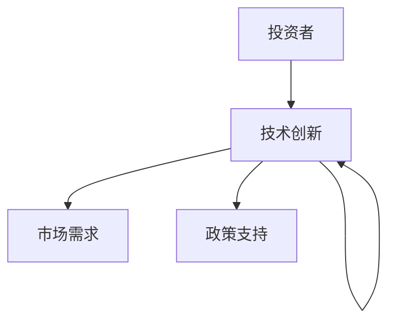
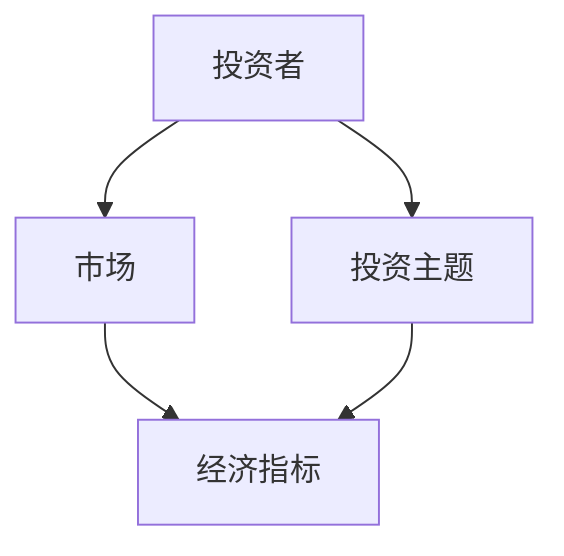
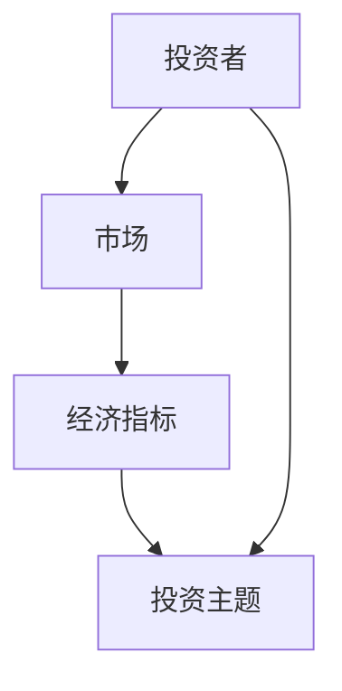
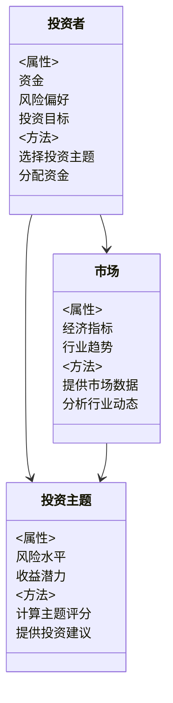
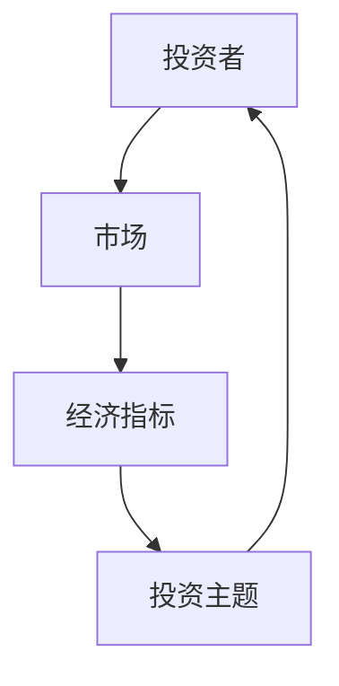
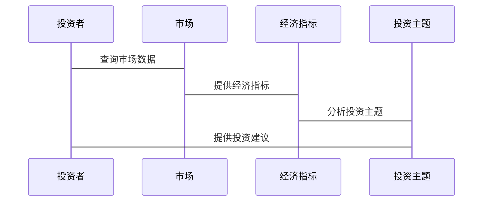

                 


# 后疫情时代的经济复苏投资主题

> 关键词：疫情、经济复苏、投资主题、数字经济、绿色经济、健康医疗

> 摘要：后疫情时代，全球经济格局发生了深刻变化。本文从疫情对全球经济的冲击入手，分析了投资主题的演变和新机遇，重点探讨了数字经济、绿色经济和健康医疗等领域的投资机会。通过系统分析和案例研究，结合量化模型和算法，为投资者提供了科学的投资策略和最佳实践。

---

# 第一部分: 后疫情时代的经济复苏背景与现状

## 第1章: 疫情对全球经济的深远影响

### 1.1 疫情对全球经济的冲击
#### 1.1.1 疫情对供应链的中断影响
疫情导致全球供应链中断，特别是半导体、电子产品和医疗物资的供应问题，给全球经济带来了深远的影响。

#### 1.1.2 疫情对就业市场的冲击
疫情导致大量企业倒闭，尤其是中小企业，全球失业率显著上升，尤其是服务业和旅游业受到重创。

#### 1.1.3 疫情对消费行为的长期影响
疫情改变了人们的消费习惯，线上消费、远程办公和智能家居的需求大幅增加，传统零售业和旅游业受到冲击。

### 1.2 投资主题的演变与新机遇
疫情后，全球经济复苏过程中，新的投资主题不断涌现，尤其是数字经济、绿色经济和健康医疗等领域。

---

## 第2章: 投资主题的定义与分类

### 2.1 投资主题的定义
投资主题是指在特定经济环境下，具有持续增长潜力的行业或领域，能够吸引投资者关注和资金流入。

### 2.2 投资主题的分类与特征
| 投资主题 | 主要特征 | 风险水平 | 收益潜力 |
|----------|----------|----------|----------|
| 增长型   | 高增长潜力 | 中高     | 高       |
| 防御型   | 稳定收益   | 低       | 中       |
| 周期性   | 受经济周期影响大 | 高       | 中       |

### 2.3 疫情后投资主题的演变
疫情后，投资主题从传统的周期性行业（如房地产、能源）逐渐转向高增长的数字经济和绿色经济领域。

---

## 第3章: 后疫情时代的主要投资领域

### 3.1 数字经济与科技投资
#### 3.1.1 数字经济的发展趋势
数字经济成为全球经济复苏的重要驱动力，尤其是人工智能、大数据和云计算等领域的投资机会。

#### 3.1.2 科技领域的投资机会
科技巨头的市场地位进一步巩固，新兴科技企业（如AI初创公司）也吸引了大量投资。

#### 3.1.3 数字化转型的投资潜力
企业数字化转型需求激增，相关技术和服务的投资前景广阔。

### 3.2 健康与医疗投资
#### 3.2.1 医疗行业的复苏与增长
疫情后，医疗行业需求回暖，疫苗研发、医疗设备和数字化医疗等领域投资潜力巨大。

#### 3.2.2 健康科技的投资机会
远程医疗、智能健康管理等新兴领域成为投资热点。

#### 3.2.3 医疗服务领域的投资策略
高端医疗服务和医疗连锁机构的投资前景良好。

### 3.3 绿色经济与可持续发展投资
#### 3.3.1 绿色经济的发展趋势
碳中和目标推动绿色经济发展，可再生能源和环保技术成为投资热点。

#### 3.3.2 可再生能源的投资机会
太阳能、风能等可再生能源行业迎来快速发展。

#### 3.3.3 碳中和目标下的投资策略
绿色金融、环保科技和循环经济等领域投资潜力巨大。

---

# 第二部分: 投资主题的核心概念与分析框架

## 第4章: 投资主题的核心概念与属性

### 4.1 投资主题的核心概念
#### 4.1.1 投资主题的构成要素
投资主题由市场需求、行业趋势和技术进步等要素构成。

#### 4.1.2 投资主题的驱动因素
政策支持、技术创新和消费升级是推动投资主题变化的主要因素。

#### 4.1.3 投资主题的生命周期
投资主题通常经历萌芽、成长、成熟和衰退四个阶段。

### 4.2 投资主题的属性特征对比
| 属性     | 增长型投资主题 | 防御型投资主题 | 周期性投资主题 |
|----------|---------------|---------------|---------------|
| 风险     | 中高           | 低             | 高             |
| 收益     | 高             | 中             | 中             |
| 周期性   | 弱             | 强             | 强             |

### 4.3 投资主题的系统架构


---

## 第5章: 投资主题的实体关系架构

### 5.1 实体关系图


### 5.2 投资主题的系统架构


---

# 第三部分: 投资主题的系统分析与架构设计

## 第6章: 系统分析与架构设计方案

### 6.1 问题场景介绍
疫情后，全球经济复苏过程中，投资主题的选择面临复杂多变的市场环境。

### 6.2 系统功能设计


### 6.3 系统架构设计


### 6.4 系统交互设计


---

## 第7章: 投资主题分析系统的实现

### 7.1 环境安装
```bash
pip install numpy pandas scikit-learn matplotlib
```

### 7.2 核心实现代码
```python
import numpy as np
import pandas as pd
from sklearn.decomposition import PCA

# 示例数据: 行业指数
data = pd.DataFrame({
    '行业1': [100, 110, 120, 130],
    '行业2': [80, 90, 100, 110],
    '行业3': [70, 80, 90, 100]
})

# 主成分分析
pca = PCA(n_components=2)
pca.fit(data)
principal_components = pca.transform(data)

print('主成分得分:', principal_components)
```

---

## 第8章: 投资主题分析系统的应用

### 8.1 投资主题的量化分析
使用因子分析模型量化投资主题的吸引力。

### 8.2 投资主题的风险评估
通过蒙特卡洛模拟评估投资主题的风险和收益。

---

## 第9章: 投资主题分析系统的优化

### 9.1 系统优化策略
优化算法效率和数据处理能力。

### 9.2 系统功能扩展
增加更多投资主题分析功能，如实时数据分析和风险预警。

---

# 第四部分: 投资主题分析系统的项目实战

## 第10章: 项目实战

### 10.1 项目背景
疫情后，全球经济复苏背景下，选择合适的投资主题至关重要。

### 10.2 数据采集与处理
```python
import requests
import pandas as pd

# 示例: 采集科技股数据
url = 'https://api.example.com/stock_data'
response = requests.get(url)
data = pd.DataFrame(response.json())
print(data.head())
```

### 10.3 投资主题筛选
```python
# 筛选高增长主题
growthThemes = data[data['增长率'] > 10]
print(growthThemes)
```

### 10.4 投资策略生成
```python
# 生成投资策略
def generate_strategy(data):
    strategy = []
    for theme in data['主题']:
        if theme['增长率'] > 10 and theme['风险'] < 0.5:
            strategy.append(theme)
    return strategy

strategy = generate_strategy(data)
print(strategy)
```

### 10.5 案例分析
分析科技股投资机会，结合量化模型生成投资策略。

---

## 第11章: 最佳实践与总结

### 11.1 投资主题分析的最佳实践
- 分散投资，降低风险。
- 长期视角，关注高增长领域。
- 保持灵活性，及时调整投资策略。

### 11.2 小结
后疫情时代，投资主题的选择至关重要。通过系统分析和量化模型，投资者可以更好地把握投资机会，实现稳健收益。

### 11.3 注意事项
- 注意市场波动，避免盲目跟风。
- 关注政策变化，及时调整投资策略。
- 确保数据质量，避免错误决策。

### 11.4 拓展阅读
推荐阅读《投资学原理》、《金融科技与投资》等书籍，深入理解投资主题的分析方法。

---

# 附录

## 附录A: 术语表
- 投资主题：具有持续增长潜力的行业或领域。
- 数字经济：以数字技术为核心驱动力的经济形态。
- 绿色经济：以低碳发展为目标的经济模式。

## 附录B: 数据来源
- 数据来源包括公开市场数据、行业报告和学术研究。

## 附录C: 参考文献
- [1] 《投资学原理》
- [2] 《金融科技与投资》
- [3] 《绿色经济发展报告》

---

# 作者

作者：AI天才研究院/AI Genius Institute & 禅与计算机程序设计艺术 /Zen And The Art of Computer Programming

