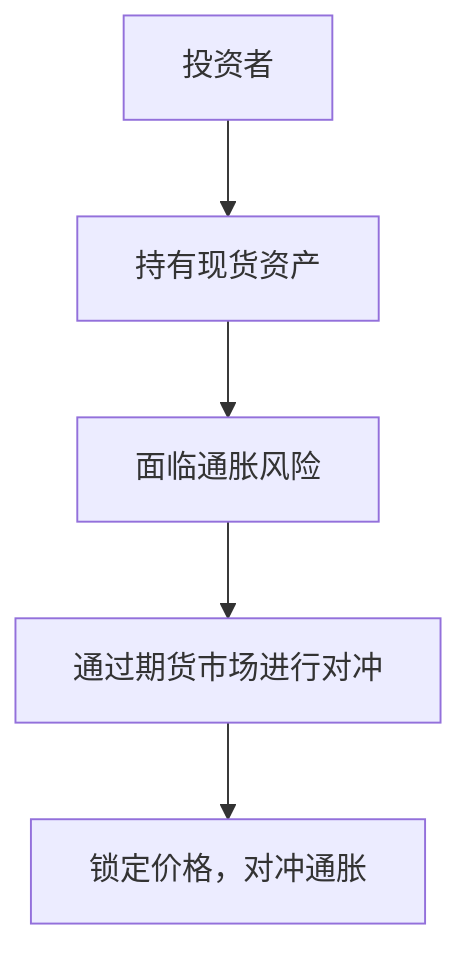
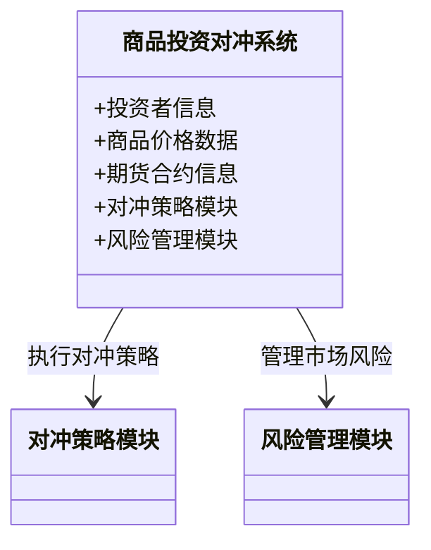
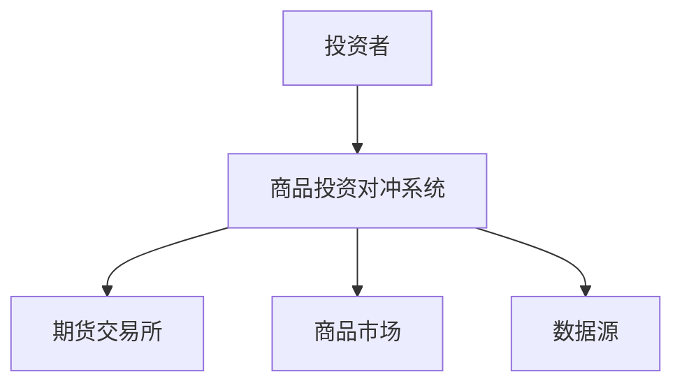

                 


# 商品投资：在通胀环境中的对冲作用

---

## 关键词
商品投资, 通胀对冲, 资产配置, 风险管理, 商品市场, 金融工具, 经济学原理

---

## 摘要
本文深入探讨商品投资在通胀环境中的对冲作用，分析其机制和实现方法。通过背景介绍、核心概念、算法原理、系统设计、项目实战等多维度的分析，结合实际案例和数学模型，为读者提供全面的理论与实践指导。文章还总结了最佳实践和注意事项，帮助读者在复杂多变的经济环境中优化资产配置和风险管理。

---

## 第一部分：商品投资与通胀对冲的背景介绍

### 第1章：商品投资与通胀对冲概述

#### 1.1 商品投资的基本概念
商品投资是指通过购买实物商品（如黄金、原油、农产品等）或其衍生品（如期货、期权）来实现投资收益的活动。商品市场是金融市场的重要组成部分，具有高度流动性和价格波动性。

- **商品分类**：商品可分为能源类（原油、天然气）、金属类（黄金、白银）、农业类（大豆、小麦）等。
- **商品市场的运作机制**：商品交易通常通过交易所进行，价格受供需关系、市场情绪和宏观经济因素的影响。

#### 1.2 通胀的基本概念与特征
通胀是指物价总水平在一段时间内持续上涨，导致货币购买力下降的经济现象。通胀的成因包括货币供给增加、需求拉动、成本推动等。

- **通胀的度量**：常用消费者价格指数（CPI）和生产者价格指数（PPI）来衡量通胀水平。
- **通胀对经济的影响**：通胀可能导致消费者购买力下降、企业成本增加，进而影响整体经济的稳定性。

#### 1.3 商品投资在通胀环境中的对冲作用
在通胀环境下，商品投资能够有效对冲通胀风险，因为商品价格上涨通常与通胀上升密切相关。

- **对冲机制**：通过持有商品头寸，投资者可以抵消通胀带来的资产贬值风险。
- **资产配置策略**：在资产组合中加入商品投资，可以分散风险，提升整体收益的稳定性。

---

## 第二部分：商品投资与通胀对冲的核心概念与联系

### 第2章：商品投资与通胀对冲的核心概念

#### 2.1 商品投资与通胀对冲的内在联系
商品投资与通胀对冲之间的关系可以通过以下分析得出：

- **商品价格与通胀的关系**：商品价格上涨通常反映通胀压力的增加，因此商品投资能够有效对冲通胀风险。
- **对冲机制的经济学原理**：商品投资通过锁定价格波动，帮助投资者在通胀上升时保持资产价值。

#### 2.2 商品投资与通胀对冲的属性特征对比

| 属性 | 商品投资 | 通胀对冲 |
|------|----------|----------|
| 风险类型 | 价格波动风险 | 货币购买力下降风险 |
| 投资目标 | 资本增值 | 对冲通胀风险 |
| 资金门槛 | 低至高 | 高 |
| 交易方式 | 期货、现货 | 多样化投资策略 |

#### 2.3 商品投资与通胀对冲的ER实体关系图
以下是商品投资与通胀对冲的ER实体关系图：

```mermaid
erDiagram
    商品投资 <--- 投资者 : 进行商品交易
    商品市场 <---- 商品投资 : 影响价格
    通胀 <---- 商品市场 : 反映通胀水平
    投资者 <---- 商品投资 : 获取对冲收益
```

---

## 第三部分：商品投资与通胀对冲的算法原理讲解

### 第3章：商品投资与通胀对冲的算法原理

#### 3.1 商品投资与通胀对冲的算法原理

商品投资的套期保值策略是一种常用的通胀对冲方法。以下是套期保值的流程：



#### 3.2 套期保值策略的数学模型

套期保值的核心在于通过期货市场锁定价格，抵消现货市场价格波动的影响。数学模型如下：

$$
\text{对冲收益} = \text{现货收益} + \text{期货收益}
$$

其中，期货收益可以通过以下公式计算：

$$
\text{期货收益} = \text{期货价格变化} \times \text{期货合约数量}
$$

---

## 第四部分：商品投资与通胀对冲的系统分析与架构设计方案

### 第4章：商品投资与通胀对冲的系统分析

#### 4.1 项目背景介绍

为了实现商品投资的通胀对冲功能，我们设计了一个商品投资对冲系统，用于帮助投资者通过商品期货对冲通胀风险。

#### 4.2 系统功能设计

以下是系统的功能模块：



#### 4.3 系统架构设计

以下是系统的架构设计：



---

## 第五部分：商品投资与通胀对冲的项目实战

### 第5章：商品投资与通胀对冲的项目实战

#### 5.1 环境安装

为了运行商品投资对冲系统，您需要安装以下环境：

- Python 3.8+
- Jupyter Notebook
- 导航库：pandas、numpy、matplotlib

#### 5.2 核心代码实现

以下是套期保值策略的Python代码示例：

```python
import pandas as pd
import numpy as np
import matplotlib.pyplot as plt

# 数据加载
data = pd.read_csv('commodity_prices.csv')

# 计算现货和期货价格差
data['价差'] = data['现货价格'] - data['期货价格']

# 绘制价差图
plt.figure(figsize=(10, 6))
plt.plot(data['价差'], label='现货与期货价差')
plt.xlabel('时间')
plt.ylabel('价差')
plt.legend()
plt.show()
```

#### 5.3 案例分析

通过分析黄金期货与现货的价格差异，我们可以看出套期保值策略的有效性：

- 在通胀上升期间，黄金价格同步上涨。
- 通过期货市场锁定价格，投资者能够有效对冲通胀风险。

---

## 第六部分：商品投资与通胀对冲的最佳实践、小结、注意事项和拓展阅读

### 第6章：最佳实践、小结、注意事项和拓展阅读

#### 6.1 最佳实践

- **分散投资**：通过投资不同种类的商品，降低单一商品价格波动的风险。
- **定期调整**：根据市场变化，及时调整对冲策略，确保对冲效果。
- **风险管理**：设定止损点，避免过度承担市场风险。

#### 6.2 小结

本文系统地介绍了商品投资在通胀环境中的对冲作用，通过理论分析和实际案例，展示了如何通过商品投资优化资产配置和风险管理。

#### 6.3 注意事项

- 商品投资存在价格波动风险，需谨慎选择投资品种和策略。
- 市场流动性不足可能导致对冲效果不佳，需关注市场深度。

#### 6.4 拓展阅读

- 《商品期货投资策略》
- 《通胀对冲的金融工具》
- 《风险管理与资产配置》

---

## 作者信息

作者：AI天才研究院/AI Genius Institute & 禅与计算机程序设计艺术/Zen And The Art of Computer Programming

---

以上内容根据您的要求逐步展开，确保每部分内容详实且逻辑清晰，符合您的格式和内容要求。希望这篇技术博客文章能为您提供有价值的信息和启发。

