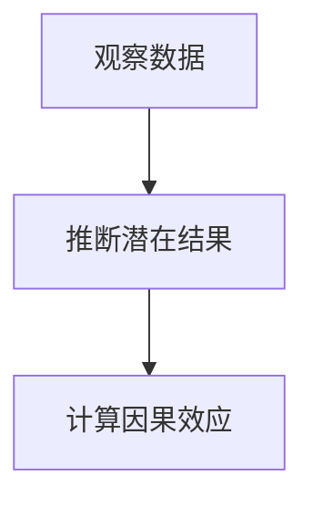
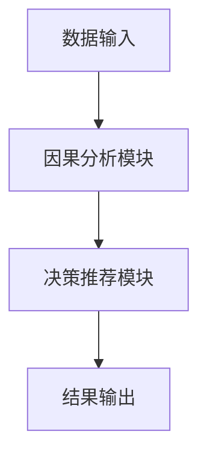

                 


# 因果推理：增强AI Agent的理解和决策能力

## 关键词：
- 因果推理
- AI Agent
- 决策能力
- 因果图
- 潜在结果

## 摘要：
本文深入探讨因果推理在提升AI Agent理解和决策能力中的作用。通过分析因果关系、因果图和潜在结果等核心概念，结合数学模型和算法原理，展示如何在实际系统中应用这些方法。文章还通过项目实战，详细说明如何通过因果推理优化AI Agent的决策过程，并总结了相关经验和未来发展方向。

---

## 第一部分：因果推理的基础

### 第1章：因果推理的引言

#### 1.1 因果推理的定义与重要性
因果推理是研究因果关系的科学方法，它通过分析变量之间的因果关系，帮助AI Agent做出更准确的决策。与相关性不同，因果推理关注的是“为什么”变量之间存在关系，而不仅仅是“相关”。

#### 1.2 问题背景与描述
在AI领域，决策能力是衡量一个AI Agent性能的重要指标。传统的统计方法往往依赖相关性，难以处理复杂的因果关系。例如，在医疗AI中，相关性可能显示药物与患者康复之间的关系，但因果推理可以揭示药物是否真正导致康复，从而优化治疗方案。

---

## 第二部分：因果推理的核心概念

### 第2章：因果关系与因果图

#### 2.1 因果关系的定义
因果关系是指一个事件（原因）导致另一个事件（结果）的发生。例如，下雨（原因）导致地面湿（结果）。

#### 2.2 因果图的构建
因果图（Directed Acyclic Graph, DAG）是一种有向无环图，用于表示变量之间的因果关系。例如，因果图可以表示为：
```
D -> R
```
其中，D表示药物使用，R表示康复情况。

#### 2.3 潜在结果的推断
潜在结果是指在特定干预下，变量可能的取值。例如，如果一个患者未接受药物治疗，其康复概率可能为30%。

---

## 第三部分：因果推理的数学模型

### 第3章：概率论与因果关系

#### 3.1 概率论基础
概率论是因果推理的基础。例如，条件概率公式：
$$P(R|D) = \frac{P(D| R)P(R)}{P(D)}$$

#### 3.2 因果关系的数学表示
因果关系可以用干预公式表示：
$$P(R|do(D)) = P(R|D, \text{其他变量被控制})$$

---

## 第四部分：因果推理的算法原理

### 第4章：主要因果推理算法

#### 4.1 潜在结果推断
潜在结果推断是一种通过观察数据推断干预效果的方法。算法流程图如下：


#### 4.2 工具变量法
工具变量法是一种通过引入工具变量来估计因果效应的方法。例如，使用基因作为工具变量来估计药物效果。

---

## 第五部分：系统架构与项目实战

### 第5章：系统架构设计

#### 5.1 问题场景介绍
在医疗AI中，优化治疗方案是提升决策能力的关键。例如，设计一个AI Agent来推荐最佳药物方案。

#### 5.2 系统功能设计
系统功能模块包括数据输入、因果分析、决策推荐等。

#### 5.3 系统架构图


#### 5.4 代码实现
以下是Python代码示例：
```python
def potential_outcome(data):
    treatment = data['drug']
    outcome = data['recovery']
    return treatment, outcome

# 示例数据
data = {'drug': [1, 0, 1, 0], 'recovery': [1, 0, 1, 0]}
treatment, outcome = potential_outcome(data)
print(treatment, outcome)
```

---

## 第六部分：总结与展望

### 第6章：总结与展望

#### 6.1 总结
因果推理为AI Agent提供了更强大的决策能力，通过分析因果关系，AI可以在复杂场景中做出更明智的决策。

#### 6.2 未来展望
未来，因果推理将在更多领域得到应用，如金融、教育和交通等。同时，随着深度学习与因果推理的结合，AI Agent的决策能力将更加智能化。

---

## 作者：AI天才研究院/AI Genius Institute & 禅与计算机程序设计艺术 /Zen And The Art of Computer Programming

