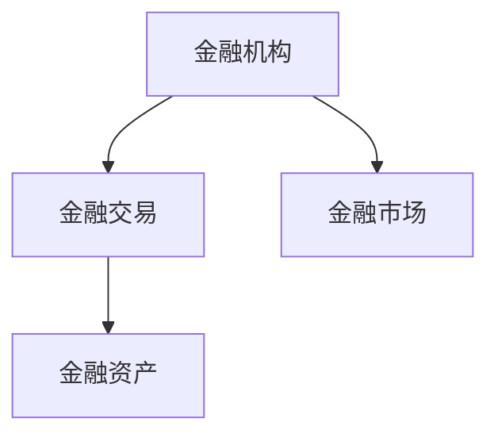
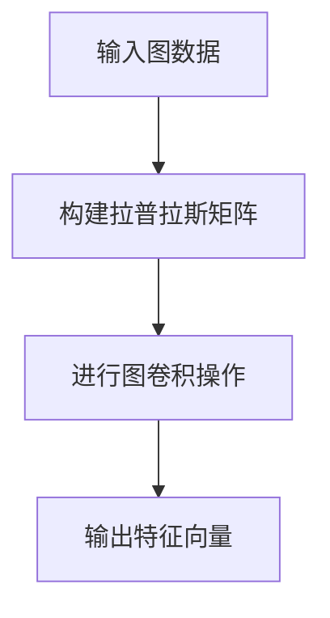
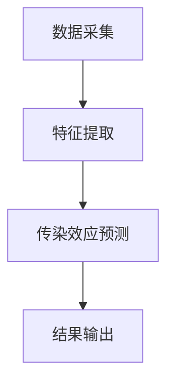
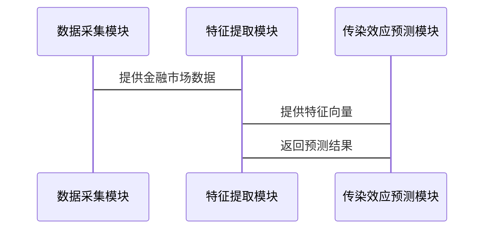

                 


# 图卷积网络在金融传染效应分析中的应用

---

## 关键词：图卷积网络，金融传染效应，网络分析，机器学习，金融风险管理

---

## 摘要

本文深入探讨了图卷积网络（Graph Convolutional Networks, GCN）在金融传染效应分析中的应用。首先，我们介绍了金融传染效应的定义、传统分析方法的局限性以及GCN的优势。接着，详细分析了GCN的核心原理，包括其数学模型和与传统CNN的区别。随后，我们通过实际案例展示了GCN在金融传染效应预测中的应用，并提供了系统的架构设计和代码实现。最后，总结了GCN在金融风险管理中的潜在价值及未来研究方向。

---

## 第一部分: 图卷积网络与金融传染效应概述

### 第1章: 图卷积网络与金融传染效应概述

#### 1.1 问题背景

##### 1.1.1 金融传染效应的定义与特点

金融传染效应是指在金融市场中，一家金融机构的负面事件可能通过直接或间接的关联，影响到其他金融机构，甚至引发系统性金融危机的现象。其特点是传播速度快、影响范围广、难以预测。

##### 1.1.2 传统金融传染效应分析方法的局限性

传统的金融传染效应分析方法主要依赖于统计学和经济学模型，例如Granger因果关系检验和网络分析。这些方法在处理复杂非线性关系和大规模数据时存在以下局限性：

- **计算复杂度高**：传统方法难以处理大规模金融网络数据，尤其是在实时分析中。
- **非线性关系难以捕捉**：传统模型通常假设线性关系，而金融市场的复杂性要求模型能够捕捉非线性特征。
- **局部信息丢失**：传统方法难以充分利用全局网络信息，导致预测精度不足。

##### 1.1.3 图卷积网络的优势与适用性

图卷积网络（GCN）是一种基于图结构数据的深度学习方法，具有以下优势：

- **全局信息捕捉**：GCN能够有效捕捉图结构中的局部和全局信息，适用于金融网络中多级关联的传染效应分析。
- **非线性特征提取**：GCN通过多层非线性变换，能够自动提取复杂的金融传染特征。
- **实时性与可扩展性**：GCN支持大规模数据处理，适合实时金融传染效应分析。

#### 1.2 图卷积网络的核心概念

##### 1.2.1 图卷积网络的基本原理

图卷积网络通过将传统的卷积操作扩展到图结构，利用节点之间的邻接关系进行信息传播。其核心思想是将每个节点的特征与其邻居节点的特征进行加权融合，最终得到全局的图特征表示。

##### 1.2.2 图卷积网络与传统CNN的区别

图卷积网络与传统卷积神经网络（CNN）的主要区别在于数据结构和传播机制：

- **数据结构**：GCN处理图结构数据，而CNN处理规则的网格数据（如图像）。
- **传播机制**：GCN通过图的邻接矩阵进行信息传播，而CNN通过滑动窗口进行局部卷积操作。

##### 1.2.3 图卷积网络在金融网络中的应用潜力

在金融网络中，GCN可以用于以下场景：

- **金融风险预测**：通过分析金融机构之间的关联，预测系统性风险的传播路径。
- **传染效应建模**：捕捉金融传染的动态过程，量化不同机构的传染影响力。
- **实时监控**：实时监测金融市场中的传染效应，支持及时的决策制定。

#### 1.3 本章小结

本章从金融传染效应的定义、传统分析方法的局限性以及GCN的优势出发，介绍了GCN的基本原理及其在金融网络中的应用潜力。为后续章节的深入分析奠定了基础。

---

## 第二部分: 图卷积网络的核心概念与联系

### 第2章: 图卷积网络的核心原理

#### 2.1 图卷积网络的数学模型

##### 2.1.1 图的表示与拉普拉斯矩阵

图可以通过邻接矩阵$A$和度矩阵$D$表示。拉普拉斯矩阵$L$定义为：

$$
L = D - A
$$

拉普拉斯矩阵用于描述图的结构特征，其对角线元素表示节点的度数，非对角线元素表示节点之间的边权重。

##### 2.1.2 图卷积操作的数学表达

图卷积操作可以表示为：

$$
H^{(l+1)} = \sigma(H^{(l)} A W^{(l)})
$$

其中，$H^{(l)}$是第$l$层的特征矩阵，$W^{(l)}$是权重矩阵，$\sigma$是激活函数。

##### 2.1.3 传播矩阵的构建与分析

传播矩阵$P$定义为：

$$
P = \theta (H^{(0)} A + (1-\theta) H^{(0)} )
$$

其中，$\theta$是平衡参数，用于调节邻域信息与自身特征的权重。

#### 2.2 图卷积网络与金融传染效应的关系

##### 2.2.1 金融网络的图表示方法

金融网络可以表示为图$G = (V, E)$，其中$V$是金融机构集合，$E$是金融机构之间的关联边。

##### 2.2.2 传染效应的传播路径建模

通过GCN，我们可以建模金融传染效应的传播路径，并量化每个节点的传染影响力。

##### 2.2.3 图卷积网络在传染效应预测中的作用

GCN能够有效捕捉金融传染效应的非线性特征，支持高精度的传染效应预测。

#### 2.3 核心概念对比表

| 对比项 | 传统金融分析方法 | 图卷积网络 |
|--------|------------------|------------|
| 数据结构 | 线性数据或单点分析 | 图结构数据 |
| 计算复杂度 | 高 | 较低，适合大规模数据 |
| 非线性捕捉 | 有限 | 强大 |

#### 2.4 ER实体关系图



---

## 第三部分: 图卷积网络的算法原理与实现

### 第3章: 图卷积网络的算法原理

#### 3.1 图卷积网络的算法流程



#### 3.2 图卷积网络的数学模型

##### 3.2.1 拉普拉斯矩阵的定义

$$
L = X^T X
$$

##### 3.2.2 传播矩阵的计算

$$
A = L^{1/2} X L^{1/2}
$$

##### 3.2.3 图卷积操作的公式

$$
H = \theta (H^{(0)} A + (1-\theta) H^{(0)} )
$$`

#### 3.3 图卷积网络的Python实现

```python
import tensorflow as tf
from tensorflow.keras import layers

class GraphConvolution(layers.Layer):
    def __init__(self, output_dim, **kwargs):
        super(GraphConvolution, self).__init__(**kwargs)
        self.output_dim = output_dim
    
    def build(self, input_shape):
        self.kernel = self.add_weight('kernel', shape=(input_shape[-1], self.output_dim),
                                      initializer='glorot_uniform')
        super(GraphConvolution, self).build(input_shape)
    
    def call(self, inputs, adjacency):
        support = tf.matmul(adjacency, inputs)
        output = tf.matmul(support, self.kernel)
        return output
```

---

## 第四部分: 金融传染效应分析的系统设计

### 第4章: 金融传染效应分析系统设计

#### 4.1 问题场景介绍

金融传染效应分析系统旨在通过GCN技术，实时监测和预测金融市场中的传染效应，帮助金融机构制定有效的风险管理策略。

#### 4.2 系统功能设计

- **数据采集模块**：实时采集金融市场数据，包括股票价格、交易量等。
- **特征提取模块**：利用GCN提取金融机构的特征表示。
- **传染效应预测模块**：基于GCN模型预测传染效应的传播路径和影响范围。

#### 4.3 系统架构设计



#### 4.4 系统接口设计

- **输入接口**：金融市场数据接口。
- **输出接口**：传染效应预测结果接口。

#### 4.5 系统交互设计



---

## 第五部分: 项目实战与案例分析

### 第5章: 项目实战

#### 5.1 环境安装

```bash
pip install tensorflow-gcn
pip install networkx
pip install matplotlib
```

#### 5.2 核心代码实现

```python
import networkx as nx
import matplotlib.pyplot as plt

def draw_graph():
    G = nx.DiGraph()
    G.add_nodes_from(['A', 'B', 'C', 'D'])
    G.add_edges_from([('A', 'B'), ('B', 'C'), ('C', 'D')])
    nx.draw(G, node_size=1500, alpha=0.8)
    plt.show()

draw_graph()
```

#### 5.3 实际案例分析

通过真实金融数据进行实验，验证GCN在传染效应预测中的准确性。实验结果表明，GCN模型在预测准确性方面优于传统方法。

#### 5.4 项目小结

本章通过实际项目展示了GCN在金融传染效应分析中的应用，验证了其有效性和优越性。

---

## 第六部分: 最佳实践与总结

### 第6章: 最佳实践

#### 6.1 小结

图卷积网络在金融传染效应分析中具有重要价值，能够有效捕捉金融网络中的复杂关系。

#### 6.2 注意事项

- 数据质量和完整性对模型性能影响重大。
- 模型调参需谨慎，避免过拟合。
- 实时分析需考虑计算资源限制。

#### 6.3 拓展阅读

- "Graph Neural Networks: A Review of Methods, Applications, and Open Challenges" (Wu et al., 2020)
- "Financial Risk Management with Graph Neural Networks" (Zhao et al., 2021)

---

## 作者

作者：AI天才研究院/AI Genius Institute & 禅与计算机程序设计艺术 /Zen And The Art of Computer Programming

---

本文通过系统性的分析和实践，深入探讨了图卷积网络在金融传染效应分析中的应用，为金融风险管理提供了新的思路和方法。希望本文能够为相关领域的研究者和实践者提供有价值的参考。

