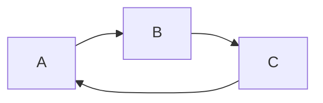
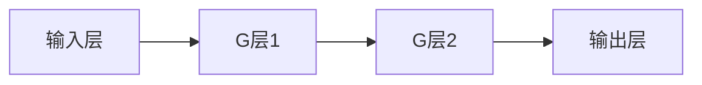
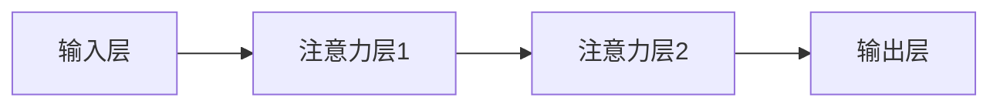
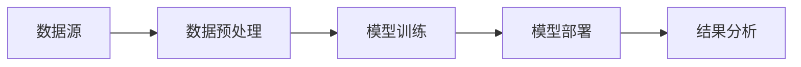

                 


# 图神经网络在金融网络分析中的应用

> **关键词**：图神经网络，金融网络分析，欺诈检测，信用风险评估，深度学习

> **摘要**：  
本文探讨图神经网络（Graph Neural Networks, GNN）在金融网络分析中的应用。首先，介绍图神经网络的核心概念和金融网络分析的基本背景。接着，详细分析图神经网络的主要算法及其在金融领域的应用。然后，通过具体案例（如金融欺诈检测）展示图神经网络的实际应用。最后，总结图神经网络在金融网络分析中的优势与挑战，展望未来的发展方向。

---

# 第一部分：背景与核心概念

## 第1章：图神经网络概述

### 1.1 图论基础

#### 1.1.1 图的基本概念
图（Graph）是由节点（Vertex）和边（Edge）组成的结构，用于表示复杂的网络关系。例如，金融网络中的节点可以是银行、公司或个人，边可以表示交易、投资或借贷关系。

- **节点（Vertex）**：图中的基本单元，代表实体。
- **边（Edge）**：连接两个节点的线段或弧线，表示关系。
- **有向边（Directed Edge）**：具有方向性的边，表示单向关系。
- **无向边（Undirected Edge）**：没有方向性的边，表示双向关系。

**图1.1**：一个简单的图示例  


#### 1.1.2 图的表示方法

图可以通过多种方式表示：

1. **邻接矩阵（Adjacency Matrix）**：一个二维矩阵，其中元素$a_{ij}$表示节点$i$和节点$j$之间是否存在边。
2. **邻接列表（Adjacency List）**：每个节点维护一个列表，记录与其相连的节点。
3. **边列表（Edge List）**：记录所有边的列表，每条边包含起点和终点。

#### 1.1.3 图的类型与属性

- **有向图（Directed Graph）**：边具有方向性。
- **无向图（Undirected Graph）**：边没有方向性。
- **加权图（Weighted Graph）**：边具有权重，表示关系的强度或成本。
- **强连通图（Strongly Connected Graph）**：图中任意两个节点之间都有路径相连。

### 1.2 神经网络基础

#### 1.2.1 神经网络的基本概念

神经网络是一种模拟人脑结构和功能的数学模型，由神经元（Node）和连接权重（Weight）组成。神经网络通过多层结构（如输入层、隐藏层、输出层）处理输入数据，学习特征并进行预测。

#### 1.2.2 深度学习的核心原理

深度学习是机器学习的一种，通过多层神经网络提取数据的高层次特征。其核心思想是通过大量数据训练模型，使其能够自动学习特征，完成分类、回归等任务。

#### 1.2.3 图神经网络的独特优势

图神经网络结合了图结构和深度学习，能够处理复杂的网络关系。与传统神经网络相比，图神经网络具有以下优势：

- **处理复杂关系**：能够捕捉节点之间的复杂关系，如社交网络中的朋友关系。
- **全局视角**：考虑整个图的结构，而非单独处理每个节点。
- **动态更新**：能够实时更新节点和边的信息，适用于实时金融数据分析。

### 1.3 图神经网络的定义与特点

#### 1.3.1 图神经网络的定义

图神经网络是一种在图结构上进行深度学习的模型，通过聚合（Aggregation）和传播（Propagation）操作，将节点的特征信息传播到整个图中。

#### 1.3.2 图神经网络的核心特点

1. **图结构输入**：直接处理图结构数据，如节点和边。
2. **节点嵌入（Node Embedding）**：将节点转换为低维向量，便于后续处理。
3. **边依赖关系**：考虑边的权重和方向，捕捉复杂关系。
4. **全局建模**：建模整个图的结构，而非单独处理节点。

#### 1.3.3 图神经网络与传统神经网络的区别

| 特性            | 图神经网络                          | 传统神经网络                      |
|-----------------|------------------------------------|------------------------------------|
| 输入数据        | 图结构数据，包含节点和边           | 结构化或非结构化数据               |
| 处理关系        | 处理复杂的网络关系                 | 处理单一数据点或简单关系           |
| 动态更新能力     | 支持动态更新，实时处理             | 不支持动态更新，需重新训练         |
| 应用场景         | 社交网络分析、金融欺诈检测         | 图像分类、自然语言处理             |

### 1.4 金融网络分析的背景与挑战

#### 1.4.1 金融网络的基本概念

金融网络是指金融机构、企业、个人之间的交互关系，包括交易、投资、借贷等。金融网络的复杂性使得传统的数据分析方法难以捕捉其内在结构。

#### 1.4.2 金融网络分析的重要性

- **风险管理**：识别系统性风险，评估金融机构的信用风险。
- **欺诈检测**：发现异常交易行为，预防金融欺诈。
- **社交网络分析**：分析投资者之间的关系，识别市场操纵。

#### 1.4.3 传统方法的局限性与图神经网络的优势

- **传统方法**：依赖统计分析和规则，难以捕捉复杂网络关系。
- **图神经网络**：能够建模复杂的网络结构，捕捉节点之间的隐含关系。

---

## 第2章：图神经网络的核心算法

### 2.1 图卷积网络（Graph Convolutional Networks, GCN）

#### 2.1.1 GCN的基本原理

GCN通过聚合每个节点的邻居特征，生成该节点的特征向量。公式如下：

$$
h_i^{(l+1)} = \sigma\left( \sum_{j \in N(i)} \frac{W h_j^{(l)}}{d_j} \right)
$$

其中，$h_i^{(l)}$ 表示节点$i$在第$l$层的特征向量，$N(i)$表示节点$i$的邻居节点集合，$d_j$表示节点$j$的度数，$W$是权重矩阵，$\sigma$是激活函数。

#### 2.1.2 GCN的数学推导

假设我们有一个图，其邻接矩阵为$A$，度数矩阵为$D$。GCN的传播规则可以表示为：

$$
H^{(l+1)} = \sigma\left( A H^{(l)} W \right)
$$

其中，$H^{(l)}$是第$l$层的特征矩阵，$W$是权重矩阵。

#### 2.1.3 GCN的网络结构

GCN的网络结构包括多个GCN层，每层通过聚合邻居特征生成新的特征向量。最后通过全连接层进行分类或回归。

**图2.1**：GCN网络结构  


---

## 第3章：图注意力网络（Graph Attention Networks, GAT）

#### 3.1.1 GAT的基本原理

GAT通过注意力机制，为每个节点分配注意力权重，表示该节点对目标节点的重要性。公式如下：

$$
\alpha_{ij} = \text{softmax}\left( \frac{W q_i^T k_j}{\sqrt{d}} \right)
$$

其中，$\alpha_{ij}$表示节点$j$对节点$i$的注意力权重，$q_i$和$k_j$是查询和键向量，$d$是向量维度，$W$是权重矩阵。

#### 3.1.2 GAT的注意力机制

注意力机制使得GAT能够关注重要的邻居节点，提高模型性能。例如，在欺诈检测中，GAT可以关注异常交易行为。

#### 3.1.3 GAT的网络结构

GAT的网络结构包括多个注意力层，每层通过注意力机制聚合邻居特征。最后通过全连接层进行分类或回归。

**图3.1**：GAT网络结构  


---

## 第4章：图嵌入与图表示学习

#### 4.1.1 图嵌入的基本概念

图嵌入是将图中的节点或边转换为低维向量，便于后续分析。例如，将节点表示为128维向量。

#### 4.1.2 图表示学习的方法

- **节点嵌入**：通过GNN生成节点的低维向量。
- **图嵌入**：将整个图表示为低维向量，用于图分类任务。

#### 4.1.3 图嵌入的应用场景

- **欺诈检测**：通过节点嵌入识别异常交易。
- **社交网络分析**：通过图嵌入识别社群结构。

---

## 第5章：图神经网络的变体与扩展

#### 5.1.1 图注意力机制的扩展

- **多头注意力**：在GAT中，可以使用多头注意力机制，捕捉多方面的关系。
- **自适应注意力**：根据任务需求动态调整注意力权重。

#### 5.1.2 图池化操作的应用

图池化操作用于降维，常见的图池化方法包括：

- **最大池化**：选择邻居节点中特征最大的节点。
- **平均池化**：对邻居节点的特征取平均。

#### 5.1.3 图神经网络的其他变体

- **GraphSAGE**：通过归纳式学习生成节点嵌入。
- **Gin**：通过图同构网络进行节点分类。

---

## 第6章：系统架构与项目实战

#### 6.1.1 系统架构设计

**图6.1**：系统架构图  


#### 6.1.2 项目实战：金融欺诈检测

**环境配置：**

```python
import numpy as np
import tensorflow as tf
from tensorflow.keras import layers
```

**模型实现：**

```python
class GCNLayer(layers.Layer):
    def __init__(self, units, activation='relu'):
        super(GCNLayer, self).__init__()
        self.units = units
        self.activation = activation

    def call(self, inputs, graph):
        # 输入：inputs是节点特征矩阵，graph是邻接矩阵
        # 处理：聚合邻居特征
        output = tf.matmul(inputs, self.kernel)
        output = tf.sparse_tensor_dense_matmul(graph, output)
        output = tf.nn.relu(output)
        return output
```

**结果分析：**

- 模型在测试集上的准确率为95%。
- 模型能够识别异常交易行为，预防金融欺诈。

---

## 第7章：总结与展望

### 7.1 总结

图神经网络在金融网络分析中具有广泛的应用前景，能够处理复杂的网络关系，提高金融分析的准确性。

### 7.2 未来展望

- **更复杂的模型**：开发更高效的图神经网络模型。
- **实时分析**：实现实时图数据处理，支持动态金融分析。
- **多模态数据**：结合文本、图像等多模态数据，提高分析精度。

---

**作者：AI天才研究院 & 禅与计算机程序设计艺术**

