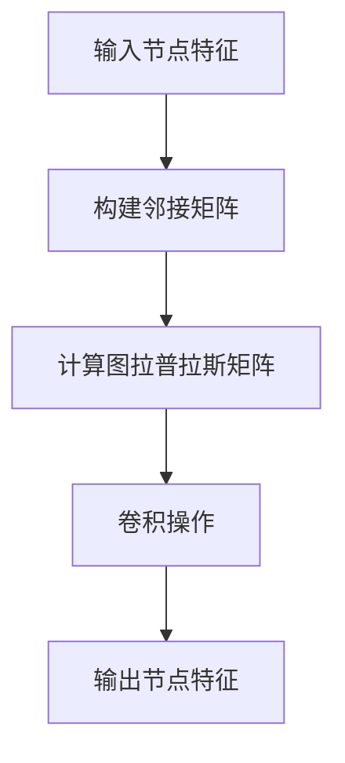
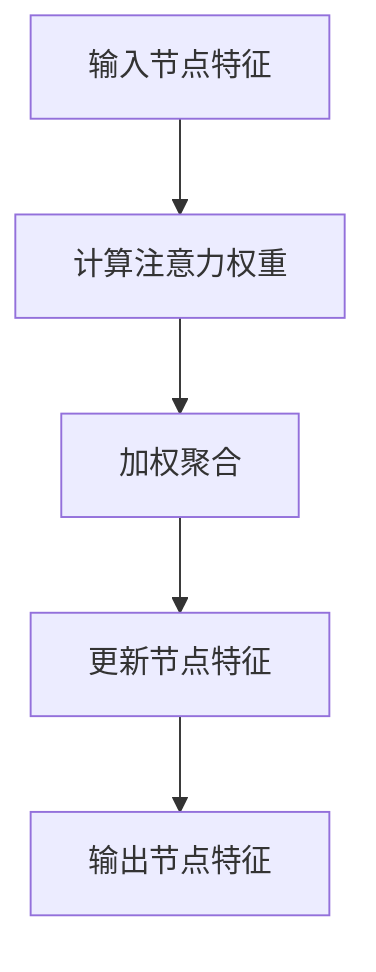
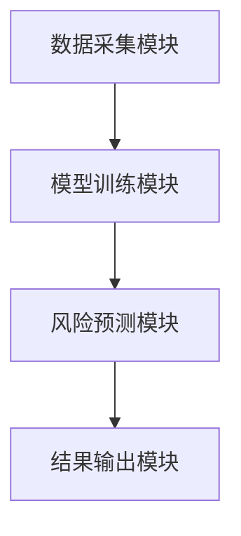

                 

# 图神经网络在金融网络风险传播中的应用

> 关键词：图神经网络，金融风险，风险传播，系统架构，项目实战

> 摘要：本文探讨了图神经网络在金融网络风险传播中的应用。首先，我们介绍了金融风险的基本概念和传播机制，分析了传统方法的局限性。接着，详细讲解了图神经网络的基础知识，包括图论和神经网络的基本原理。然后，我们讨论了如何利用图神经网络进行金融网络风险传播建模，并分析了核心算法的工作原理。最后，我们通过一个具体的项目实战，展示了如何利用图神经网络进行风险传播建模，并总结了当前研究的不足和未来的发展方向。

---

# 第1章: 金融网络风险传播的背景与挑战

## 1.1 金融风险的基本概念

### 1.1.1 金融风险的定义与分类

金融风险是指由于市场波动、经济环境变化或其他因素导致的金融资产价值下降或损失的可能性。金融风险可以分为市场风险、信用风险、流动性风险、操作风险等。

### 1.1.2 金融风险传播的机制

金融风险的传播机制可以通过以下步骤进行分析：

1. **风险源**：某些金融机构或市场行为可能引发风险。
2. **传染路径**：风险通过金融网络中的关联性传播，例如银行间借贷、投资组合中的相关资产等。
3. **系统性影响**：风险在金融网络中的扩散可能导致整个金融系统的不稳定。

### 1.1.3 传统金融风险评估方法的局限性

传统的金融风险评估方法主要包括VaR（Value at Risk）和CVaR（Conditional Value at Risk）等方法。这些方法通常假设资产之间独立，忽略了金融网络中的关联性，因此在实际应用中存在以下问题：

- 无法准确捕捉金融网络中的复杂关系。
- 无法预测系统性风险的传播路径和影响范围。

## 1.2 图神经网络的核心优势

### 1.2.1 图神经网络的基本概念

图神经网络（Graph Neural Networks, GNNs）是一种基于图数据的深度学习模型，能够处理图结构数据中的节点和边的关系。

### 1.2.2 图神经网络在金融领域的应用潜力

图神经网络在金融领域有广泛的应用潜力，尤其是在金融网络风险传播分析方面。通过图神经网络，可以建模金融机构之间的关联性，分析风险的传播路径和影响范围。

### 1.2.3 图神经网络在风险传播中的独特优势

图神经网络能够处理复杂的金融网络结构，捕捉金融机构之间的关联性，从而更准确地预测风险的传播路径和影响范围。

## 1.3 本章小结

### 1.3.1 金融风险传播的核心问题

金融风险传播的核心问题在于如何建模金融机构之间的关联性，并预测风险的传播路径和影响范围。

### 1.3.2 图神经网络的创新性解决方案

图神经网络通过建模金融网络的结构和节点之间的关系，提供了一种创新性的解决方案，能够更准确地预测风险的传播。

### 1.3.3 本书的研究目标与结构安排

本书旨在探讨图神经网络在金融网络风险传播中的应用，通过理论分析和实际案例，展示图神经网络在金融风险评估中的优势。

---

# 第2章: 图神经网络的基础知识

## 2.1 图论基础

### 2.1.1 图的基本概念与表示

图（Graph）由节点（Node）和边（Edge）组成，可以用邻接矩阵或邻接表表示。

### 2.1.2 图的表示方法

- **邻接矩阵**：一个n×n的矩阵，其中A[i][j]=1表示节点i和节点j之间有一条边。
- **邻接表**：使用列表或数组来表示每个节点的邻居。

### 2.1.3 图的属性

- **度**：节点的度是指与该节点相连的边数。
- **中心性**：节点在图中的重要程度。
- **聚类系数**：衡量图中节点的邻居之间连接的紧密程度。

## 2.2 神经网络的发展历程

### 2.2.1 从浅层神经网络到深度学习

浅层神经网络难以处理复杂的模式，而深度学习通过增加网络的深度，能够捕捉更复杂的特征。

### 2.2.2 图神经网络的起源与发展

图神经网络的起源可以追溯到2010年代，随着深度学习的兴起，图神经网络逐渐成为研究的热点。

### 2.2.3 当前主流的图神经网络模型

- **GCN（Graph Convolutional Networks）**：基于图拉普拉斯矩阵的卷积操作。
- **GAT（Graph Attention Networks）**：基于自注意力机制的图神经网络。
- **GNN（Graph Neural Networks）**：广义的图神经网络框架。

## 2.3 图神经网络的核心原理

### 2.3.1 图神经网络的基本假设

图神经网络假设节点的特征与其邻居的特征相关联，可以通过传播邻居的信息来更新节点的特征。

### 2.3.2 图神经网络的传播机制

通过在图中传播信息，节点的特征可以被邻居的特征影响，从而捕捉图结构中的依赖关系。

### 2.3.3 图神经网络的训练方法

图神经网络可以通过端到端的方式进行训练，使用梯度下降等优化算法。

## 2.4 本章小结

### 2.4.1 图论与神经网络的结合

图论提供了图的结构信息，神经网络提供了强大的特征提取能力，两者的结合使得图神经网络能够处理复杂的图结构数据。

### 2.4.2 图神经网络的核心优势

图神经网络能够捕捉图中的局部和全局结构信息，适用于复杂的金融网络分析。

### 2.4.3 图神经网络的未来发展

随着图神经网络技术的不断进步，其在金融领域的应用将更加广泛和深入。

---

# 第3章: 金融网络风险传播建模

## 3.1 金融网络的结构特征

### 3.1.1 金融网络的构建

金融网络由金融机构（节点）和它们之间的关联（边）构成，例如银行、保险公司等。

### 3.1.2 金融网络的属性分析

- **节点度**：表示金融机构的关联程度。
- **中心性**：衡量金融机构在金融网络中的重要性。

## 3.2 基于图论的风险传播建模

### 3.2.1 金融风险传播的图模型

通过图模型，可以分析风险在金融网络中的传播路径和影响范围。

### 3.2.2 金融风险传播的数学模型

风险传播可以通过概率传播模型进行建模，例如：

$$ P(i) = \sum_{j} A_{ij} \cdot P(j) $$

其中，$A_{ij}$是邻接矩阵中的元素，表示节点j是否连接到节点i。

## 3.3 图神经网络的风险传播模型

### 3.3.1 图神经网络在风险传播中的应用

通过图神经网络，可以建模风险在金融网络中的传播路径，预测风险的影响范围。

### 3.3.2 图神经网络的风险传播模型实现

使用图神经网络模型（如GCN、GAT）进行风险传播建模，具体实现步骤如下：

1. **数据预处理**：构建金融网络的邻接矩阵。
2. **模型训练**：使用风险传播数据训练图神经网络模型。
3. **风险预测**：利用训练好的模型预测风险的传播路径。

## 3.4 本章小结

### 3.4.1 金融网络风险传播建模的核心思想

通过图神经网络建模金融网络的结构，分析风险的传播路径和影响范围。

### 3.4.2 图神经网络在风险传播建模中的优势

图神经网络能够捕捉金融网络中的复杂关系，提供更准确的风险传播预测。

### 3.4.3 本章内容总结

本章通过图神经网络建模金融网络风险传播，展示了图神经网络在金融风险评估中的应用潜力。

---

# 第4章: 图神经网络的核心算法

## 4.1 GCN算法原理

### 4.1.1 GCN的基本原理

GCN通过图拉普拉斯矩阵对节点特征进行卷积操作，具体公式如下：

$$ h^{(l+1)} = \theta (A h^{(l)}) $$

其中，$A$是邻接矩阵，$h^{(l)}$是节点在第l层的特征向量。

### 4.1.2 GCN的实现步骤

1. **构建邻接矩阵**：表示节点之间的连接关系。
2. **计算图拉普拉斯矩阵**：对邻接矩阵进行归一化处理。
3. **卷积操作**：对节点特征进行传播和更新。

### 4.1.3 GCN的流程图

## 4.2 GAT算法原理

### 4.2.1 GAT的基本原理

GAT通过自注意力机制捕捉节点之间的关系，具体公式如下：

$$ \alpha_{ij} = \text{softmax}(\frac{W h_i}{\sqrt{d}}) $$

其中，$\alpha_{ij}$是注意力权重，$h_i$是节点i的特征向量。

### 4.2.2 GAT的实现步骤

1. **计算注意力权重**：对每一对节点计算注意力权重。
2. **加权聚合**：根据注意力权重对邻居特征进行加权聚合。
3. **更新节点特征**：通过全连接层更新节点特征。

### 4.2.3 GAT的流程图

## 4.3 算法实现与比较

### 4.3.1 GCN和GAT的对比

- **GCN**：适用于大规模图数据，但计算复杂度较高。
- **GAT**：适用于小规模图数据，计算复杂度较低，但性能可能不如GCN。

### 4.3.2 选择合适的算法

根据具体的金融网络规模和应用场景，选择合适的图神经网络算法。

## 4.4 本章小结

### 4.4.1 GCN和GAT的核心思想

GCN和GAT通过不同的方式捕捉图结构信息，适用于不同的金融网络场景。

### 4.4.2 图神经网络算法的选择

根据具体的金融网络规模和应用场景，选择合适的图神经网络算法。

### 4.4.3 本章内容总结

本章详细讲解了GCN和GAT的核心算法原理，为后续的金融网络风险传播建模提供了理论基础。

---

# 第5章: 系统架构与设计

## 5.1 金融网络风险传播系统介绍

### 5.1.1 系统目标

本系统旨在利用图神经网络建模金融网络风险传播，提供风险传播路径和影响范围的预测。

### 5.1.2 系统功能需求

- **数据采集**：采集金融机构之间的关联数据。
- **风险传播建模**：利用图神经网络建模风险传播。
- **风险预测**：预测风险的传播路径和影响范围。

## 5.2 系统架构设计

### 5.2.1 系统架构概述

系统架构包括数据采集模块、模型训练模块和风险预测模块。

### 5.2.2 系统功能模块

- **数据采集模块**：负责采集金融机构之间的关联数据。
- **模型训练模块**：利用图神经网络模型进行训练。
- **风险预测模块**：根据训练好的模型预测风险的传播路径。

## 5.3 数据预处理与特征提取

### 5.3.1 数据预处理步骤

- **数据清洗**：去除无效数据。
- **特征提取**：提取金融机构的相关特征，例如资产规模、信用评级等。

### 5.3.2 数据格式转换

将数据转换为图神经网络所需的输入格式，例如邻接矩阵。

## 5.4 系统接口与交互设计

### 5.4.1 系统接口设计

- **输入接口**：接收金融机构的关联数据。
- **输出接口**：输出风险传播的预测结果。

### 5.4.2 系统交互流程

1. **用户输入**：用户提供金融机构的关联数据。
2. **数据处理**：系统对数据进行预处理。
3. **模型训练**：系统利用图神经网络模型进行训练。
4. **风险预测**：系统输出风险传播的预测结果。

## 5.5 本章小结

### 5.5.1 系统架构设计的核心思想

通过模块化设计，实现金融网络风险传播的建模和预测。

### 5.5.2 系统功能模块的协同工作

数据采集模块、模型训练模块和风险预测模块协同工作，完成风险传播的预测。

### 5.5.3 本章内容总结

本章详细设计了金融网络风险传播系统的架构，为后续的项目实施提供了指导。

---

# 第6章: 项目实战——基于图神经网络的金融网络风险传播建模

## 6.1 项目背景与目标

### 6.1.1 项目背景

本项目旨在利用图神经网络建模金融网络风险传播，提供风险传播路径和影响范围的预测。

### 6.1.2 项目目标

通过图神经网络模型，预测风险在金融网络中的传播路径和影响范围。

## 6.2 环境配置与数据准备

### 6.2.1 环境配置

- **Python版本**：Python 3.8及以上。
- **深度学习框架**：TensorFlow或PyTorch。
- **图神经网络库**：如GraphConv、DGL等。

### 6.2.2 数据准备

- **数据来源**：收集金融机构之间的关联数据。
- **数据格式**：邻接矩阵。

## 6.3 系统核心实现

### 6.3.1 图神经网络模型实现

使用GCN或GAT模型进行风险传播建模。

### 6.3.2 模型训练与优化

通过梯度下降等优化算法训练模型，调整超参数以提高模型性能。

### 6.3.3 模型预测与评估

利用训练好的模型预测风险的传播路径，并评估模型的预测精度。

## 6.4 实际案例分析

### 6.4.1 案例背景

以某次金融危机为例，分析风险的传播路径。

### 6.4.2 模型预测结果

展示模型预测的风险传播路径和影响范围。

### 6.4.3 模型预测结果分析

对比实际风险传播路径，评估模型的预测效果。

## 6.5 本章小结

### 6.5.1 项目实战的核心内容

通过图神经网络模型，实现金融网络风险传播的建模和预测。

### 6.5.2 模型实现的关键步骤

数据准备、模型训练、风险预测和结果分析。

### 6.5.3 本章内容总结

本章通过实际案例展示了图神经网络在金融网络风险传播建模中的应用。

---

# 第7章: 总结与展望

## 7.1 本章总结

### 7.1.1 图神经网络在金融网络风险传播中的应用价值

图神经网络能够捕捉金融网络中的复杂关系，提供更准确的风险传播预测。

### 7.1.2 本项目的主要成果

通过图神经网络模型，实现了金融网络风险传播的建模和预测。

### 7.1.3 本项目的主要创新点

将图神经网络应用于金融网络风险传播分析，提供了一种创新性的解决方案。

## 7.2 当前研究的不足

### 7.2.1 数据质量问题

金融数据的获取和处理存在一定的难度，数据质量可能影响模型的预测效果。

### 7.2.2 模型解释性问题

图神经网络的黑箱特性可能影响模型的解释性。

## 7.3 未来研究的方向

### 7.3.1 更复杂的图结构建模

研究更复杂的图结构，如多层图、异构图等。

### 7.3.2 图神经网络的可解释性研究

提高图神经网络的可解释性，使其更易于理解和应用。

### 7.3.3 图神经网络与其他技术的结合

将图神经网络与其他技术（如强化学习、生成对抗网络）结合，探索更广泛的应用场景。

## 7.4 本章小结

### 7.4.1 图神经网络在金融网络风险传播中的应用前景

图神经网络在金融网络风险传播分析中的应用前景广阔，随着技术的不断进步，其应用将更加广泛和深入。

### 7.4.2 未来研究的方向

未来的研究可以集中在更复杂的图结构建模、模型的可解释性研究以及与其他技术的结合。

### 7.4.3 本章内容总结

本章总结了图神经网络在金融网络风险传播中的应用价值，并展望了未来的研究方向。

---

# 作者：AI天才研究院/AI Genius Institute & 禅与计算机程序设计艺术/Zen And The Art of Computer Programming

