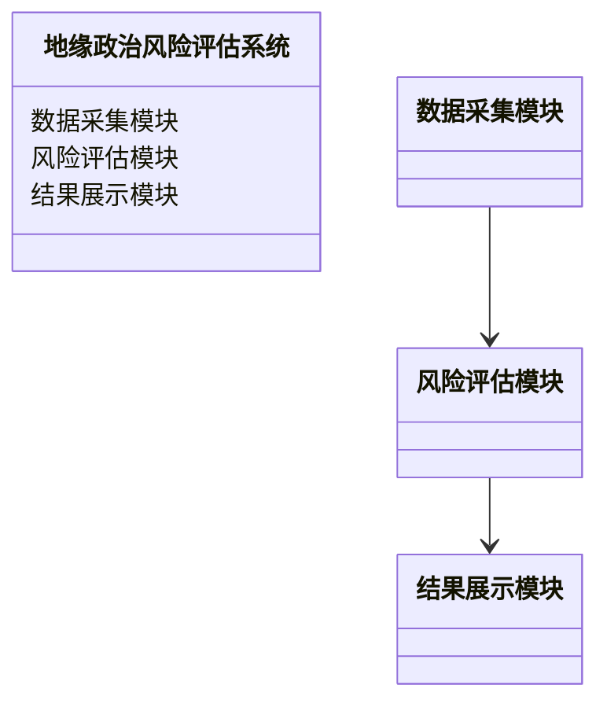

                 

# 地缘政治风险评估：全球投资的关键考量

---

## 关键词：
- 地缘政治风险
- 全球投资
- 政治稳定性
- 经济因素
- 社会文化因素
- 军事安全
- 风险评估

---

## 摘要：
地缘政治风险评估是全球投资决策中的关键考量因素。随着全球化进程的加速，国际政治、经济和社会环境的复杂性不断增加，投资者需要准确评估潜在的地缘政治风险，以制定有效的投资策略。本文从地缘政治风险的基本概念出发，分析其影响因素，并结合实际案例，探讨如何通过系统化的评估方法来识别和应对这些风险。文章还介绍了地缘政治风险评估的数学模型和算法，并提出了相应的系统架构设计和实战案例，为投资者提供了实用的工具和方法。

---

## 目录大纲：

### 第一部分：地缘政治风险的基本概念
1. **地缘政治风险的定义与特征**
   - 1.1 地缘政治的定义
   - 1.2 地缘政治风险的核心要素
   - 1.3 地缘政治风险的分类与层次
2. **地缘政治风险评估的重要性**
   - 2.1 全球化背景下的投资挑战
   - 2.2 风险评估在决策中的作用
   - 2.3 风险与收益的平衡
3. **地缘政治风险的影响因素**
   - 3.1 政治因素
   - 3.2 经济因素
   - 3.3 社会文化因素
   - 3.4 军事安全因素
4. **地缘政治风险评估的基本框架**
   - 4.1 评估的步骤与流程
   - 4.2 数据收集与分析方法
   - 4.3 评估结果的呈现方式

### 第二部分：地缘政治风险的多维度分析
5. **政治风险分析**
   - 5.1 政治稳定性评估
   - 5.2 政治关系与国际冲突
6. **经济风险分析**
   - 6.1 经济波动与市场风险
   - 6.2 财政政策与债务风险
7. **社会文化风险分析**
   - 7.1 社会稳定与文化差异
   - 7.2 社会治理与透明度
8. **军事安全风险分析**
   - 8.1 地缘政治冲突与军事安全
   - 8.2 区域安全环境评估

### 第三部分：地缘政治风险评估的方法与工具
9. **地缘政治风险评估的方法论**
   - 9.1 定性分析与定量分析
   - 9.2 风险评估模型的构建
10. **地缘政治风险评估的数学模型**
    - 10.1 风险概率计算公式
    - 10.2 风险影响程度评估
11. **地缘政治风险评估的系统架构设计**
    - 11.1 问题场景介绍
    - 11.2 系统功能设计（领域模型）
    - 11.3 系统架构设计（架构图）
    - 11.4 系统接口设计
    - 11.5 系统交互设计（序列图）
12. **地缘政治风险评估的实战案例**
    - 12.1 环境安装与配置
    - 12.2 核心代码实现
    - 12.3 代码解读与分析
    - 12.4 实际案例分析

### 第四部分：总结与展望
13. **总结与反思**
    - 13.1 全书内容回顾
    - 13.2 风险评估的关键点
14. **未来研究方向**
    - 14.1 新兴的地缘政治因素
    - 14.2 技术驱动的风险评估创新
15. **最佳实践与注意事项**
    - 15.1 风险评估的误区与解决方案
    - 15.2 投资者的关键考量

### 第五部分：附录
16. **术语表**
    - 16.1 核心术语解释
17. **工具与资源**
    - 17.1 风险评估工具列表
    - 17.2 数据来源与参考文献
18. **参考文献与延伸阅读**
    - 18.1 相关书籍与学术论文
    - 18.2 网络资源与在线工具

---

## 正文部分：

### 第一部分：地缘政治风险的基本概念

#### 1. 地缘政治风险的定义与特征

地缘政治风险是指在特定地理区域内，由于政治、经济、社会或军事等因素的变化，可能对投资活动产生负面影响的可能性。这些风险可以是国家间的冲突、政策变化、社会动荡或经济波动等。地缘政治风险的核心要素包括稳定性、透明度和可预测性。

**1.1 地缘政治的定义**

地缘政治是研究地理空间中政治活动及其相互关系的学科。它关注国家之间的权力分布、资源争夺和边界问题。地缘政治风险涉及这些因素如何影响投资活动。

**1.2 地缘政治风险的核心要素**

- **政治稳定性**：政府的稳定性和政策的连续性。
- **经济稳定性**：经济波动和通货膨胀对投资的影响。
- **社会文化因素**：社会动荡和文化差异对投资环境的影响。
- **军事安全**：地区冲突和战争风险。

**1.3 地缘政治风险的分类与层次**

地缘政治风险可以分为国家层面、区域层面和全球层面。例如，国家内部的政治动荡可能影响特定国家的投资，而地区冲突可能影响整个区域的投资环境。

---

### 第二部分：地缘政治风险的多维度分析

#### 5. 政治风险分析

**5.1 政治稳定性评估**

政治稳定性是评估地缘政治风险的重要指标。一个国家的政治稳定性可以通过政府更迭频率、政策连续性、社会支持程度等因素来衡量。

**5.2 政治关系与国际冲突**

国际关系的紧张可能导致贸易限制、制裁或战争，这些都会对投资产生负面影响。例如，中美贸易摩擦对全球供应链的影响就是一个典型例子。

---

### 第三部分：地缘政治风险评估的方法与工具

#### 9. 地缘政治风险评估的方法论

**9.1 定性分析与定量分析**

定性分析通过专家意见和案例研究来评估风险，而定量分析则利用统计数据和模型进行预测。例如，可以通过历史数据和统计模型来预测某地区的政治风险概率。

**9.2 风险评估模型的构建**

构建地缘政治风险评估模型需要考虑多个因素，如政治稳定性、经济指标、社会因素等。可以通过加权平均的方法将这些因素综合起来，得出总体风险评分。

---

#### 10. 地缘政治风险评估的数学模型

**10.1 风险概率计算公式**

$$ \text{风险概率} = \sum_{i=1}^{n} w_i \times f_i $$

其中，\( w_i \) 是因素 \( f_i \) 的权重，\( n \) 是因素总数。

**10.2 风险影响程度评估**

风险影响程度可以通过损失金额或业务中断时间来衡量。例如：

$$ \text{影响程度} = \text{损失金额} / \text{投资总额} $$

---

#### 11. 地缘政治风险评估的系统架构设计

**11.1 问题场景介绍**

假设我们正在开发一个地缘政治风险评估系统，用于帮助投资者评估某地区的投资风险。

**11.2 系统功能设计**

使用Mermaid类图描述系统的功能模块，包括数据采集、风险评估、结果展示等。

---

### 第四部分：总结与展望

**13. 总结与反思**

本文系统地介绍了地缘政治风险评估的核心概念、影响因素和评估方法。通过案例分析和系统设计，为投资者提供了实用的工具和方法。

**14. 未来研究方向**

未来可以进一步研究新兴的地缘政治因素，如网络安全和气候变化对投资的影响。

**15. 最佳实践与注意事项**

投资者应定期更新风险评估模型，并关注国际新闻和政策变化。

---

## 作者信息：

作者：AI天才研究院/AI Genius Institute & 禅与计算机程序设计艺术 /Zen And The Art of Computer Programming

联系方式：contact@aitianji研究院.com

---

感谢您的阅读！如需进一步探讨或合作，请随时与我们联系。

