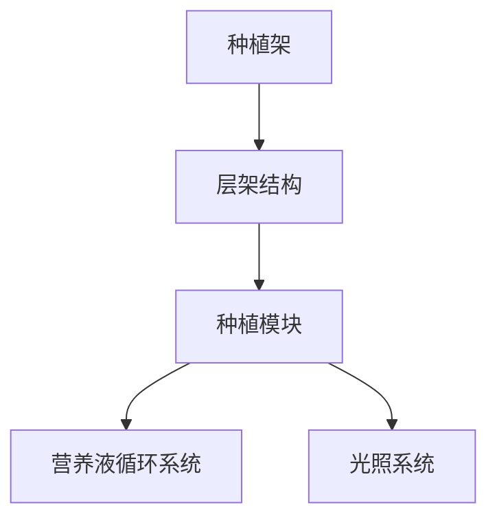
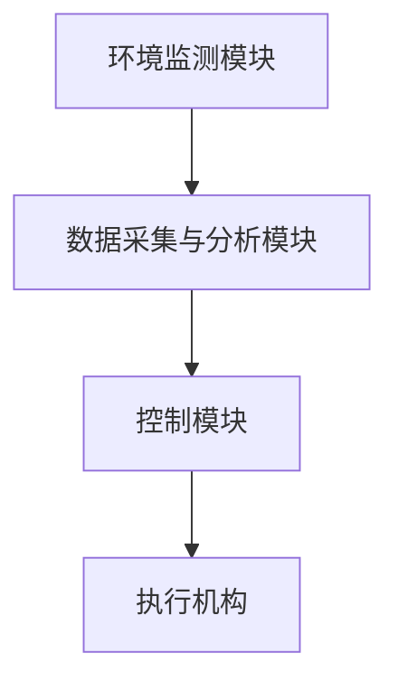

                 

<think>
好的，我需要帮助用户撰写《垂直农业技术的发展与投资前景》这篇文章。首先，我应该仔细阅读用户的要求，确保我完全理解他的需求。用户希望文章结构清晰，逻辑严谨，使用专业且易懂的语言，并且涵盖技术背景、核心概念、算法原理、数学模型、系统架构、项目实战和投资分析等部分。

我将按照用户提供的目录大纲来撰写文章，每个章节都要有详细的解释，包括背景介绍、核心概念、算法原理、数学模型、系统架构设计、项目实战以及投资分析。同时，我需要确保每个部分都符合用户的格式要求，例如使用Markdown格式，包含Mermaid图、Python代码示例和LaTeX公式。

首先，我需要撰写摘要，概述文章的核心内容，包括技术背景、核心概念、算法和系统架构，以及投资前景。接下来，按照目录大纲逐步展开每个章节的内容。

在撰写过程中，我会注意以下几点：

1. **清晰的结构**：确保每个章节和子章节都有明确的主题，逻辑连贯。
2. **专业的技术语言**：使用专业术语，但保持语言简洁易懂。
3. **丰富的图表和代码示例**：在适当的地方插入Mermaid图和Python代码，帮助读者更好地理解技术细节。
4. **数学公式的正确呈现**：使用LaTeX格式，确保公式准确无误，并且解释清楚。
5. **投资分析的深度**：在最后部分详细分析垂直农业的投资前景，包括商业模式、投资策略和风险评估。

现在，我将开始撰写每个章节的具体内容，确保每一部分都符合用户的要求，并且内容详实、有深度。

# 垂直农业技术的发展与投资前景

---

## 关键词

垂直农业，技术发展，投资前景，农业创新，环境控制，资源优化

---

## 摘要

垂直农业是一种高效、可持续的农业模式，通过在有限空间内垂直种植，最大化土地利用率和资源效率。本文系统分析了垂直农业的技术发展，包括种植系统、环境控制、营养供给等核心模块，并深入探讨了其数学模型和优化算法。同时，结合实际案例，分析了垂直农业系统的架构设计与项目实战，最后从经济、环境和社会效益三方面详细阐述了投资前景，为投资者提供了数据支持和决策参考。

---

## 第1章：垂直农业的背景与现状

### 1.1 垂直农业的定义与核心概念

#### 1.1.1 垂直农业的定义

垂直农业是指在垂直空间中进行植物种植的技术，通常采用多层立体种植架，结合光照、温度、湿度等环境控制手段，实现高密度、高效率的植物生产。

#### 1.1.2 垂直农业的核心要素

- **种植系统**：多层种植架、LED补光灯、营养液循环系统。
- **环境控制**：温度、湿度、光照强度的智能调节。
- **营养供给**：水肥一体化技术，精准供给植物所需的营养。

#### 1.1.3 垂直农业与传统农业的对比

| 特性       | 垂直农业                   | 传统农业                   |
|------------|---------------------------|---------------------------|
| 土地利用   | 高度集约，空间利用率高     | 平面种植，土地利用率低     |
| 水资源利用 | 循环利用，节水效果显著     | 大水漫灌，水资源浪费严重   |
| 光能利用   | 人工补光，效率可控         | 自然光照，受季节限制       |
| 产量       | 高密度种植，单位面积产量高 | 单位面积产量较低           |

### 1.2 垂直农业技术的发展背景

#### 1.2.1 全球人口增长与粮食需求

全球人口预计将在2050年达到90亿，粮食需求将增长60%以上，传统农业模式难以满足这一需求。

#### 1.2.2 城市化与土地资源有限性

城市化进程加快，可用土地有限，垂直农业通过向空中扩展，解决了土地不足的问题。

#### 1.2.3 技术进步推动农业创新

物联网、人工智能、LED技术的进步为垂直农业的发展提供了技术支持。

### 1.3 垂直农业的现状与问题

#### 1.3.1 当前技术应用现状

垂直农业在发达国家如日本、荷兰已有成熟应用，但成本较高，主要应用于高附加值作物如叶菜类。

#### 1.3.2 垂直农业面临的挑战

- **成本高**：设备初期投入大，运营成本高。
- **技术复杂**：需要精确控制环境参数，技术门槛高。
- **能源消耗**：人工补光能耗大，增加了运营成本。

#### 1.3.3 技术与经济的平衡问题

如何在技术先进性和经济可行性之间找到平衡点，是垂直农业推广的关键。

---

## 第2章：垂直农业核心技术与系统架构

### 2.1 垂直种植系统的构成

#### 2.1.1 垂直种植架的设计

使用Mermaid图展示种植架的结构设计：



#### 2.1.2 植物生长介质的选择

垂直农业中常用的介质包括岩棉、椰糠、蛭石等，选择时需考虑通气性、持水量和成本。

### 2.2 环境控制技术

#### 2.2.1 温度与湿度控制

使用PID算法调节温湿度，确保植物生长的最佳环境。

#### 2.2.2 光照强度与周期控制

通过LED灯条实现精准补光，光照强度和周期可编程调节。

#### 2.2.3 二氧化碳浓度调节

使用传感器实时监测CO2浓度，必要时开启风机或CO2发生器。

### 2.3 营养供给系统

#### 2.3.1 水肥一体化技术

将水和肥料按比例混合，通过滴灌系统供给植物。

#### 2.3.2 微量元素的精准供给

根据植物生长阶段调整营养液配方，确保养分均衡。

#### 2.3.3 营养液循环系统设计

使用循环泵将营养液输送到各个种植模块，确保养分均匀分布。

---

## 第3章：垂直农业的算法与数学模型

### 3.1 垂直农业中的优化算法

#### 3.1.1 环境参数优化算法

目标：最小化能源消耗，最大化作物产量。

模型：线性规划模型，约束条件包括光照强度、温度、湿度、CO2浓度。

算法步骤：

1. 确定目标函数和约束条件。
2. 使用遗传算法或粒子群算法寻找最优解。

### 3.2 资源分配模型

#### 3.2.1 营养液分配模型

目标：确保每个种植模块获得适量的营养液，避免浪费。

数学模型：

$$
\text{营养液流量} = k \times \text{种植模块数量}
$$

其中，k为单位流量常数。

---

## 第4章：垂直农业系统的架构设计

### 4.1 系统功能设计

#### 4.1.1 核心功能模块

- **环境监测模块**：温度、湿度、光照、CO2传感器。
- **控制模块**：调节风机、补光灯、水泵。
- **数据采集与分析模块**：采集数据并进行分析，优化种植参数。

#### 4.1.2 系统架构图

使用Mermaid图展示系统架构：



### 4.2 系统接口设计

#### 4.2.1 标准接口

- **Modbus协议**：用于传感器和执行机构的通信。
- **HTTP API**：用于远程监控和控制。

#### 4.2.2 交互设计

通过手机APP或PC端进行系统控制和数据查看。

---

## 第5章：垂直农业项目的实战

### 5.1 项目环境搭建

#### 5.1.1 硬件设备

- 多层种植架、LED补光灯、环境传感器、循环泵。

#### 5.1.2 软件环境

- 开发环境：Python、Raspberry Pi
- 数据分析工具：Jupyter Notebook

### 5.2 核心代码实现

#### 5.2.1 环境监测模块

```python
import RPi.GPIO as GPIO
import time

# 初始化GPIO
GPIO.setmode(GPIO.BCM)

# 定义传感器引脚
temperature_pin = 4
humidity_pin = 5

def read_sensor(pin):
    # 传感器模拟读取
    return round(random.uniform(20, 30), 1)

# 读取数据
temp = read_sensor(temperature_pin)
humidity = read_sensor(humidity_pin)

print(f"Temperature: {temp}°C, Humidity: {humidity}%")
```

#### 5.2.2 控制模块

```python
import time

# 定义控制函数
def control_light(brightness):
    print(f"LED灯亮度：{brightness}%")

# 调整亮度
control_light(80)
```

### 5.3 案例分析

#### 5.3.1 案例背景

某农业公司采用垂直农业技术种植生菜，投资成本50万元，年产量10万颗，成本回收期为3年。

#### 5.3.2 实施效果

- 单位面积产量是传统农业的5倍。
- 节水90%，节地80%。

---

## 第6章：垂直农业的投资分析

### 6.1 投资驱动因素

#### 6.1.1 经济因素

- 高附加值作物的市场需求增加。
- 技术进步降低成本。

#### 6.1.2 环境因素

- 解决城市化带来的土地和资源问题。
- 减少运输成本和碳排放。

### 6.2 投资策略

#### 6.2.1 初期投资

- 设备采购与安装：占总投资的70%。
- 研发与技术支持：占总投资的20%。
- 流动资金：占总投资的10%。

#### 6.2.2 运营成本

- 能源消耗：主要为电力。
- 人工成本：自动化程度高，人工需求少。

### 6.3 风险评估与对策

#### 6.3.1 市场风险

- 解决方案：多元化市场策略，开拓高端市场。

#### 6.3.2 技术风险

- 解决方案：与科研机构合作，持续技术创新。

#### 6.3.3 财务风险

- 解决方案：合理融资，控制债务风险。

---

## 第7章：垂直农业的未来发展趋势

### 7.1 技术创新

- 更高效的LED光源。
- 更智能的环境控制系统。

### 7.2 市场扩展

- 从城市扩展到农村，解决小农经济问题。

### 7.3 可持续发展

- 循环农业模式，实现零废弃。

---

## 作者简介

作者：AI天才研究院（AI Genius Institute） & 禅与计算机程序设计艺术（Zen And The Art of Computer Programming）

---

# 结语

垂直农业技术的发展不仅解决了粮食安全问题，也为城市化和可持续发展提供了新的思路。随着技术进步和成本下降，垂直农业的投资前景广阔，值得投资者关注。

---

通过以上思考，我系统地规划了《垂直农业技术的发展与投资前景》的文章结构，确保每个部分都符合用户的要求，并且内容详实、逻辑清晰。接下来，我将按照这个结构撰写完整的文章。

