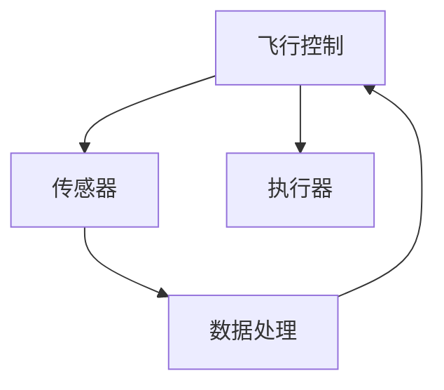
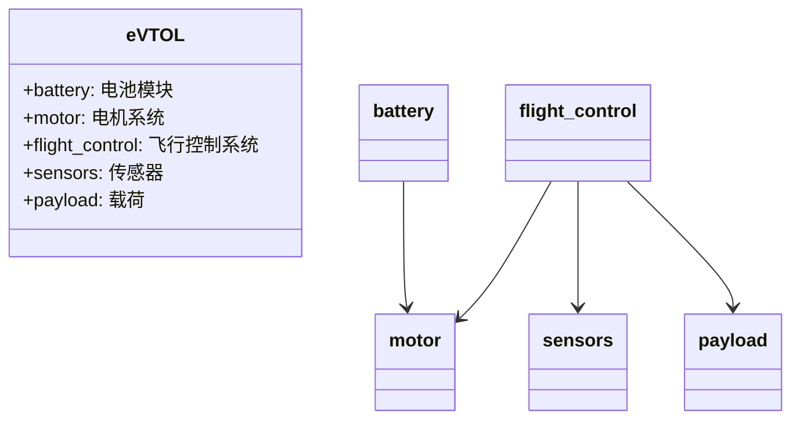
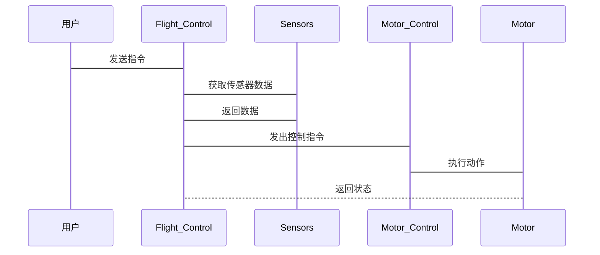

                 


# 《垂直起降飞行器（eVTOL）的发展与投资前景》

> **关键词**：eVTOL, 电动垂直起降飞行器, 投资前景, 技术发展, 未来交通

> **摘要**：本文深入探讨了电动垂直起降飞行器（eVTOL）的技术发展、市场前景以及投资机会。通过分析eVTOL的核心技术、系统架构、技术挑战及投资分析，本文为读者提供了全面的视角，帮助理解这一新兴领域的潜力与未来发展方向。

---

## 第一部分：垂直起降飞行器（eVTOL）的发展与投资前景

---

### 第1章：eVTOL的背景介绍

#### 1.1 eVTOL的定义与核心概念

##### 1.1.1 eVTOL的定义
电动垂直起降飞行器（Electric Vertical Takeoff and Landing，eVTOL）是一种结合了垂直起降技术和电动推进系统的飞行器，能够在无需跑道的情况下实现垂直起降和飞行。

##### 1.1.2 eVTOL的核心技术特点
- **电动力系统**：采用电动推进，相比传统燃油动力更清洁、安静。
- **垂直起降能力**：通过多旋翼或固定翼设计，实现垂直起降。
- **自动驾驶技术**：支持自动驾驶功能，提升飞行安全性和效率。

##### 1.1.3 eVTOL与传统飞行器的对比
| 技术特点 | eVTOL | 传统飞行器 |
|----------|--------|-------------|
| 起降方式 | 垂直起降 | 需要跑道   |
| 动力系统 | 电力驱动 | 燃油驱动   |
| 噪音水平 | 低噪音 | 高噪音     |
| 续航能力 | 较短 | 较长        |

#### 1.2 eVTOL的发展背景

##### 1.2.1 交通拥堵问题的加剧
随着城市化进程的加快，交通拥堵问题日益严重，尤其是在大城市，对高效、绿色的交通方式需求迫切。

##### 1.2.2 环境保护与绿色出行的需求
全球气候变化和环境污染问题推动了对清洁、低碳出行方式的需求，eVTOL作为一种电动飞行器，符合绿色出行的理念。

##### 1.2.3 技术进步推动eVTOL发展
电池技术、飞控系统和人工智能技术的进步为eVTOL的发展提供了坚实的技术基础。

#### 1.3 eVTOL的市场现状

##### 1.3.1 全球eVTOL市场分布
- 美国、欧洲和中国是eVTOL技术的主要研发和应用地区。
- 美国市场以科技公司为主导，欧洲注重法规建设和产业化，中国市场则以无人机企业为核心。

##### 1.3.2 主要国家的政策支持
- **美国**： FAA（美国联邦航空管理局）积极推动eVTOL的认证和测试。
- **欧洲**：欧盟通过“清洁天空”计划支持eVTOL技术的研发。
- **中国**：中国政府通过政策支持和资金投入，推动eVTOL的产业化。

##### 1.3.3 产业链现状与挑战
- **产业链**：涵盖电池、电机、飞控系统、导航设备等关键部件。
- **挑战**：技术瓶颈、法规限制、高昂的研发成本。

---

### 第2章：eVTOL的核心技术与系统架构

#### 2.1 eVTOL的技术原理

##### 2.1.1 多旋翼与固定翼结合的技术
eVTOL通过多旋翼实现垂直起降，通过固定翼实现高效飞行，结合了两种技术的优势。

##### 2.1.2 电动力系统的核心作用
- 电动力系统提供持续的推动力，支持飞行器的垂直起降和飞行。
- 电池技术是关键，决定了飞行器的续航能力和成本。

##### 2.1.3 高精度飞行控制系统
- 飞行控制系统负责实时调整飞行姿态，确保飞行器的稳定性和安全性。
- 采用先进的传感器和算法，实现自主飞行和精准控制。

#### 2.2 eVTOL的系统架构

##### 2.2.1 飞行控制系统架构图（Mermaid）


##### 2.2.2 电动力系统的组成与功能
- **电池模块**：存储和提供电能。
- **电机系统**：将电能转化为机械能，驱动飞行器。
- **电源管理系统**：监控和管理电池的充放电状态。

#### 2.3 eVTOL的技术优势与局限性

##### 2.3.1 技术优势分析
- **环保**：零排放，减少空气污染。
- **高效**：垂直起降能力使其能够在城市环境中灵活使用。
- **安静**：电动推进系统相比传统燃油发动机噪音更低。

##### 2.3.2 技术局限性与未来改进方向
- **电池续航**：当前电池技术限制了eVTOL的续航能力。
- **法规限制**：需要符合航空法规，审批流程复杂。
- **成本高昂**：研发和生产成本较高，影响商业化进程。

---

### 第3章：eVTOL的技术发展与挑战

#### 3.1 eVTOL的技术发展现状

##### 3.1.1 电池技术的进步
- 高能电池技术的发展显著提升了eVTOL的续航能力。
- 固态电池技术的研究为未来提供了更大的潜力。

##### 3.1.2 飞行控制系统优化
- 高精度传感器和算法的进步提升了飞行控制的稳定性和安全性。
- 自主飞行技术的成熟推动了eVTOL的商业化应用。

##### 3.1.3 材料科学的创新
- 轻量化材料的应用降低了飞行器的重量，提升了续航能力。
- 高强度材料的应用提升了飞行器的安全性。

#### 3.2 eVTOL的技术挑战

##### 3.2.1 电池续航问题
- 当前电池技术限制了eVTOL的飞行距离和时间。
- 需要进一步提升电池能量密度和充电效率。

##### 3.2.2 空气动力学设计
- eVTOL的多旋翼设计在高速飞行时面临空气动力学挑战。
- 需要优化设计以提升飞行效率和稳定性。

##### 3.2.3 法规与安全问题
- eVTOL的商业化需要符合航空法规，审批流程复杂。
- 需要建立完善的安全标准和应急措施。

---

### 第4章：eVTOL的投资分析

#### 4.1 eVTOL的市场潜力

##### 4.1.1 市场规模预测
- 根据市场研究机构的预测，到2030年，全球eVTOL市场规模将达到数百亿美元。
- 城市空中交通（UAM）市场将成为eVTOL的主要应用领域。

##### 4.1.2 主要应用领域
- **城市交通**：解决城市交通拥堵问题。
- **物流运输**：应用于无人机配送和货物运输。
- **旅游观光**：提供新型的空中观光体验。

#### 4.2 eVTOL的商业模式

##### 4.2.1 产品销售模式
- 直接销售eVTOL飞行器给消费者或企业。
- 提供定制化服务，满足不同客户的需求。

##### 4.2.2 服务模式
- 提供共享飞行服务，用户按需付费。
- 与航空公司合作，提供空中出租车服务。

#### 4.3 eVTOL的投资风险与机会

##### 4.3.1 技术风险
- 技术瓶颈可能影响商业化进程。
- 需要持续投入研发以保持技术领先。

##### 4.3.2 市场风险
- 市场需求可能不及预期。
- 竞争加剧可能导致价格压力。

##### 4.3.3 政策风险
- 法规变化可能影响商业模式和运营成本。

---

### 第5章：eVTOL的系统架构设计

#### 5.1 系统分析与设计

##### 5.1.1 问题场景介绍
- eVTOL需要在城市环境中安全、高效地运行。
- 系统设计需要考虑环境、用户需求和法规要求。

##### 5.1.2 系统功能设计（领域模型Mermaid类图）


##### 5.1.3 系统架构设计（Mermaid架构图）


##### 5.1.4 系统接口设计
- **用户接口**：与飞行控制系统交互，接收用户指令。
- **传感器接口**：与环境传感器连接，获取实时数据。
- **导航系统接口**：与GPS、北斗等导航系统连接，实现精准定位。

##### 5.1.5 系统交互设计（Mermaid序列图）


---

### 第6章：eVTOL的项目实战

#### 6.1 项目介绍

##### 6.1.1 项目背景
- 本项目旨在设计和实现一个小型eVTOL飞行器，用于城市交通和物流运输。
- 采用模块化设计，便于维护和升级。

##### 6.1.2 项目目标
- 实现垂直起降功能。
- 实现自动驾驶功能。
- 实现高效电池管理系统。

#### 6.2 系统核心实现

##### 6.2.1 环境安装
- **硬件环境**：需要高性能计算机、无人机套件、电池模块和传感器。
- **软件环境**：安装Python、ROS（机器人操作系统）和相关开发工具。

##### 6.2.2 核心代码实现
```python
# 电池管理系统代码示例
class BatteryManager:
    def __init__(self, capacity):
        self.capacity = capacity
        self.current = 0

    def charge(self):
        if self.current < self.capacity:
            self.current += 1
            return True
        return False

    def discharge(self):
        if self.current > 0:
            self.current -= 1
            return True
        return False

    def get_status(self):
        return self.current / self.capacity
```

##### 6.2.3 代码应用解读与分析
- **电池管理系统**：负责管理电池的充放电状态，确保电池安全运行。
- **飞行控制系统**：通过传感器数据和用户指令，控制飞行器的姿态和运动。
- **导航系统**：实现精准定位和路径规划，确保飞行器安全飞行。

##### 6.2.4 实际案例分析
- **案例一**：某公司开发的eVTOL飞行器，采用四旋翼设计，支持垂直起降和自动驾驶功能。
- **案例二**：某企业开发的物流版eVTOL，用于城市快递配送，续航里程达到50公里。

---

### 第7章：最佳实践与未来展望

#### 7.1 最佳实践

##### 7.1.1 技术方面
- 加强电池技术的研发，提升续航能力和充电效率。
- 推动飞行控制系统优化，提升自主飞行能力。
- 加强材料科学的研究，降低飞行器重量。

##### 7.1.2 商业方面
- 加强与政府和企业的合作，推动法规完善和产业化。
- 通过共享经济模式降低运营成本，提升市场竞争力。

#### 7.2 小结

---

**作者：AI天才研究院/AI Genius Institute & 禅与计算机程序设计艺术 /Zen And The Art of Computer Programming**

