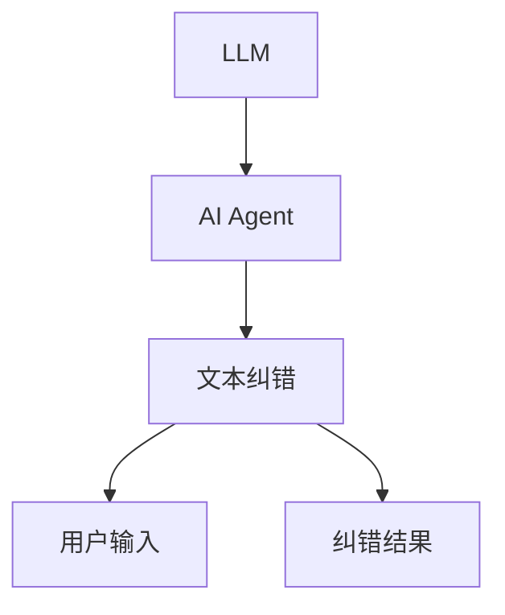
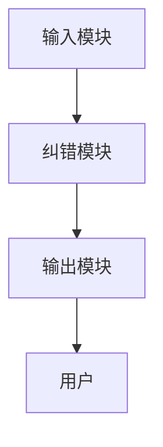
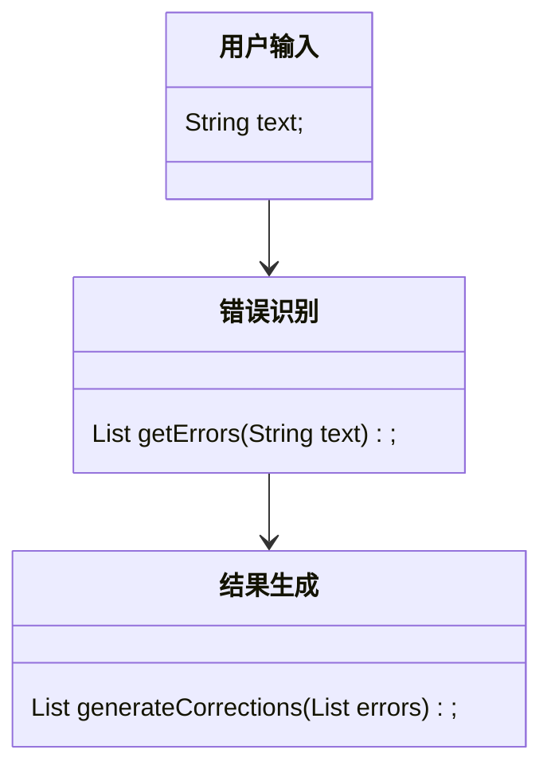
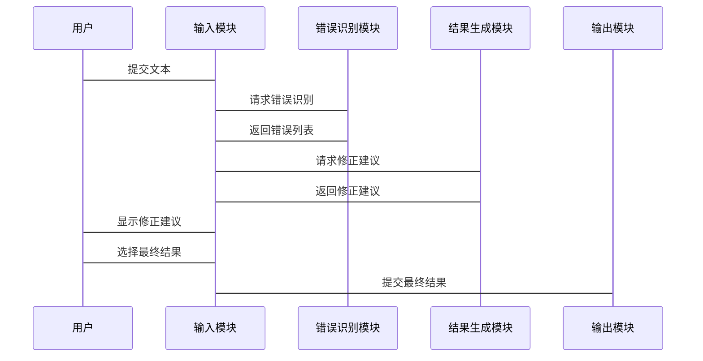

                 


# 基于LLM的AI Agent文本纠错系统

> **关键词**：大语言模型（LLM）、AI Agent、文本纠错、自然语言处理（NLP）、算法原理

> **摘要**：  
本文详细探讨了基于大语言模型（LLM）的AI Agent在文本纠错领域的应用。通过分析文本纠错的核心问题、LLM的工作原理以及AI Agent的设计思路，本文提出了一个基于LLM的AI Agent文本纠错系统的整体架构和实现方案。从背景介绍到系统设计，再到项目实战，本文为读者提供了从理论到实践的全面指导。

---

## 第1章：AI Agent与文本纠错的背景

### 1.1 问题背景

文本纠错是自然语言处理（NLP）领域的重要任务，广泛应用于教育、办公、社交等领域。传统的文本纠错方法依赖于规则库和统计模型，存在效率低、覆盖面有限的问题。近年来，随着大语言模型（LLM）的兴起，基于LLM的AI Agent逐渐成为文本纠错领域的研究热点。

#### 1.1.1 当前文本纠错的需求与痛点
- **需求分析**：用户在写作过程中常会遇到拼写错误、语法错误、用词不当等问题，这些错误会影响文本的可读性和准确性。
- **痛点分析**：传统方法依赖规则库，难以覆盖所有可能的错误场景，且效率较低。此外，规则库的维护成本较高，难以实时更新。

#### 1.1.2 AI Agent在文本纠错中的作用
- AI Agent可以实时分析用户输入的文本，利用LLM的强大能力快速识别并修正错误。
- AI Agent不仅能够处理简单的拼写错误，还能识别复杂的语法错误和语义错误。

#### 1.1.3 基于LLM的AI Agent的优势
- **高效性**：LLM通过预训练模型能够快速生成候选纠错结果。
- **准确性**：基于大量真实数据的训练，LLM能够识别上下文中的潜在错误。
- **可扩展性**：AI Agent可以集成到多种应用场景中，支持多语言和多种文本类型。

### 1.2 技术背景

#### 1.2.1 大语言模型（LLM）的发展现状
- LLM（如GPT系列、BERT系列）通过大规模预训练，掌握了丰富的语言知识。
- LLM具有生成文本、识别错误的强大能力，为AI Agent提供了强大的技术支持。

#### 1.2.2 AI Agent的技术基础
- AI Agent是一种智能体，能够感知环境、理解需求并执行任务。
- 基于LLM的AI Agent通过自然语言处理技术与用户交互，提供智能化服务。

#### 1.2.3 当前文本纠错系统的局限性
- **传统方法**：依赖规则库，纠错能力有限。
- **基于统计模型的方法**：效率较低，难以实时处理大规模文本。
- **基于LLM的方法**：虽然纠错能力强大，但需要解决计算资源和实时性的问题。

### 1.3 核心概念与问题描述

#### 1.3.1 基于LLM的AI Agent定义
- AI Agent：能够理解用户输入、识别错误并提供修正建议的智能体。
- LLM：支持AI Agent进行文本生成和纠错的核心技术。

#### 1.3.2 文本纠错系统的功能需求
- **输入处理**：接收用户输入的文本。
- **错误识别**：识别文本中的拼写、语法、语义错误。
- **结果生成**：生成候选纠错结果并提供给用户。
- **用户反馈**：根据用户反馈优化纠错结果。

#### 1.3.3 系统边界与外延
- **系统边界**：仅关注文本纠错功能，不涉及文本生成或其他任务。
- **外延**：纠错结果可以集成到其他系统（如写作软件）中。

#### 1.3.4 核心问题描述
- 如何高效识别文本中的错误？
- 如何快速生成准确的纠错建议？
- 如何优化AI Agent与用户的交互体验？

### 1.4 本章小结

本章从问题背景和技术背景两个方面介绍了基于LLM的AI Agent文本纠错系统的必要性。通过分析传统方法的局限性，提出了基于LLM的AI Agent的优势和核心功能需求。

---

## 第2章：大语言模型（LLM）的核心原理

### 2.1 LLM的结构与原理

#### 2.1.1 模型结构：Transformer与注意力机制
- **Transformer结构**：由编码器和解码器组成，广泛应用于NLP任务。
- **注意力机制**：通过计算词与词之间的关联性，提升模型对上下文的理解能力。

#### 2.1.2 模型训练：监督学习与无监督学习
- **监督学习**：基于大量标注数据进行训练，提升模型的纠错能力。
- **无监督学习**：利用未标注数据进行预训练，增强模型的泛化能力。

#### 2.1.3 模型推理：生成与纠错机制
- **生成机制**：基于LLM的生成能力，生成候选纠错结果。
- **纠错机制**：通过概率模型，选择最可能的纠错方案。

### 2.2 LLM与AI Agent的结合

#### 2.2.1 AI Agent的定义与功能
- **定义**：AI Agent是一种智能体，能够与用户交互并执行任务。
- **功能**：文本纠错、信息检索、任务执行。

#### 2.2.2 LLM在AI Agent中的角色
- **语言理解**：通过LLM理解用户输入的文本。
- **语言生成**：通过LLM生成候选纠错结果。

#### 2.2.3 LLM驱动的文本纠错流程
1. **输入处理**：接收用户输入的文本。
2. **错误识别**：利用LLM识别文本中的错误。
3. **结果生成**：生成候选纠错结果。
4. **用户反馈**：根据用户反馈优化结果。

### 2.3 核心概念对比表

| **对比项**       | **传统方法**               | **基于LLM的方法**           |
|--------------------|-----------------------------|-----------------------------|
| **纠错能力**      | 依赖规则库，纠错能力有限   | 基于上下文，纠错能力强     |
| **效率**          | 低效，难以实时处理         | 高效，支持实时处理           |
| **可扩展性**       | 有限，难以扩展到多语言     | 支持多语言和多种文本类型     |

### 2.4 ER实体关系图（Mermaid）



### 2.5 本章小结

本章详细介绍了大语言模型（LLM）的核心原理及其在AI Agent中的应用。通过对比传统方法与基于LLM的方法，突出了基于LLM的AI Agent在文本纠错中的优势。

---

## 第3章：算法原理讲解

### 3.1 模型训练流程

#### 3.1.1 数据预处理
- **数据清洗**：去除噪声数据，确保数据质量。
- **数据标注**：标注错误类型（拼写错误、语法错误等）。

#### 3.1.2 损失函数设计
- **交叉熵损失函数**：用于衡量模型输出与真实标签的差异。
  $$ \text{loss} = -\frac{1}{N}\sum_{i=1}^{N} \sum_{j=1}^{M} y_{ij}\log p(y_{ij}|x_i) $$
- **优化目标**：最小化损失函数，提升模型的纠错能力。

#### 3.1.3 模型优化
- **Adam优化器**：结合动量和自适应学习率，加速模型收敛。
- **批量训练**：通过批量处理数据，提高训练效率。

#### 3.1.4 模型评估
- **准确率**：模型正确识别错误的比例。
- **召回率**：模型识别错误的比例。
- **F1分数**：综合准确率和召回率的指标。

#### 3.1.5 超参数调优
- **学习率**：调整优化器的步长。
- **批次大小**：每次训练的数据量。
- **训练轮数**：模型训练的次数。

### 3.2 算法原理的数学模型

#### 3.2.1 概率模型
- **条件概率公式**：模型预测错误的概率。
  $$ P(y|x) = \frac{P(y,x)}{P(x)} $$
- **最大似然估计**：通过最大化条件概率，优化模型参数。

#### 3.2.2 损失函数优化
- **梯度下降**：通过计算损失函数的梯度，更新模型参数。
- **反向传播**：通过链式法则，计算梯度并更新参数。

### 3.3 本章小结

本章详细讲解了基于LLM的AI Agent文本纠错系统的算法原理，包括模型训练流程、数学模型和优化方法。通过这些方法，可以提升系统的纠错能力和效率。

---

## 第4章：系统设计

### 4.1 系统架构设计

#### 4.1.1 系统组成
- **输入模块**：接收用户输入的文本。
- **纠错模块**：利用LLM识别并修正错误。
- **输出模块**：将纠错结果返回给用户。

#### 4.1.2 模块划分
- **输入模块**：文本接收与预处理。
- **纠错模块**：错误识别与结果生成。
- **输出模块**：结果展示与用户反馈。

#### 4.1.3 系统架构图（Mermaid）



### 4.2 系统功能设计

#### 4.2.1 领域模型（Mermaid 类图）



#### 4.2.2 系统功能流程
1. **用户输入**：用户输入需要纠错的文本。
2. **错误识别**：系统识别文本中的错误。
3. **结果生成**：系统生成候选纠错结果。
4. **用户反馈**：用户选择最终的纠错结果。

### 4.3 系统接口设计

#### 4.3.1 输入接口
- **输入格式**：文本字符串。
- **输入方式**：通过API或用户界面接收。

#### 4.3.2 输出接口
- **输出格式**：纠错后的文本或错误修正建议。
- **输出方式**：通过API返回或展示在用户界面上。

### 4.4 系统交互设计（Mermaid 序列图）



### 4.5 本章小结

本章详细设计了基于LLM的AI Agent文本纠错系统的架构、功能和接口。通过模块划分和流程设计，确保系统的高效性和可扩展性。

---

## 第5章：项目实战

### 5.1 环境安装

#### 5.1.1 环境需求
- **Python 3.8+**
- **TensorFlow或PyTorch框架**
- **大语言模型API（如OpenAI API）**

#### 5.1.2 安装依赖
```bash
pip install transformers requests
```

### 5.2 系统核心实现源代码

#### 5.2.1 输入模块
```python
def receive_input():
    text = input("请输入需要纠错的文本：")
    return text
```

#### 5.2.2 错误识别模块
```python
from transformers import pipeline

def detect_errors(text):
    nlp = pipeline("text-classification", model="bert-base-uncased")
    errors = nlp(text)
    return errors
```

#### 5.2.3 结果生成模块
```python
def generate_corrections(errors):
    corrections = []
    for error in errors:
        corrections.append(error["label"])
    return corrections
```

#### 5.2.4 输出模块
```python
def display_output(corrections):
    print("纠错结果：")
    for correction in corrections:
        print(correction)
```

### 5.3 代码应用解读与分析

#### 5.3.1 输入模块解读
- **功能**：接收用户输入的文本。
- **实现细节**：使用标准输入获取文本内容。

#### 5.3.2 错误识别模块解读
- **功能**：利用NLP模型识别文本中的错误。
- **实现细节**：使用预训练模型进行错误分类。

#### 5.3.3 结果生成模块解读
- **功能**：生成候选纠错结果。
- **实现细节**：基于错误识别结果生成修正建议。

#### 5.3.4 输出模块解读
- **功能**：将纠错结果展示给用户。
- **实现细节**：逐行打印纠错结果。

### 5.4 实际案例分析

#### 5.4.1 案例描述
- **输入文本**：用户输入的文本包含拼写错误和语法错误。
- **错误识别**：系统识别并分类错误。
- **结果生成**：系统生成候选修正建议。
- **用户反馈**：用户选择最终的修正结果。

#### 5.4.2 代码实现

```python
def main():
    text = receive_input()
    errors = detect_errors(text)
    corrections = generate_corrections(errors)
    display_output(corrections)

if __name__ == "__main__":
    main()
```

### 5.5 本章小结

本章通过实际案例展示了基于LLM的AI Agent文本纠错系统的实现过程，从环境安装到代码实现，详细解读了系统的各个模块。

---

## 第6章：总结与展望

### 6.1 系统总结

#### 6.1.1 核心功能总结
- **输入处理**：接收用户输入的文本。
- **错误识别**：利用LLM识别文本中的错误。
- **结果生成**：生成候选纠错结果。
- **用户反馈**：优化纠错结果。

#### 6.1.2 系统特点总结
- **高效性**：基于LLM的纠错能力强大。
- **准确性**：通过上下文理解错误，提高纠错准确率。
- **可扩展性**：支持多种语言和文本类型。

### 6.2 未来展望

#### 6.2.1 技术优化方向
- **模型优化**：进一步优化LLM的纠错能力。
- **实时性提升**：减少响应时间，提升用户体验。
- **多语言支持**：扩展系统支持更多语言。

#### 6.2.2 应用场景拓展
- **教育领域**：辅助学生写作和学习。
- **办公领域**：集成到办公软件中，提升文本质量。
- **社交领域**：优化用户评论和消息的纠错功能。

### 6.3 注意事项

- **模型选择**：选择适合特定任务的LLM模型。
- **计算资源**：确保有足够的计算资源支持模型运行。
- **用户隐私**：保护用户的文本数据隐私。

### 6.4 最佳实践 tips

- **模型微调**：根据特定任务对模型进行微调，提升纠错效果。
- **结果验证**：验证纠错结果的准确性，确保系统可靠性。
- **用户反馈**：收集用户反馈，优化系统性能。

### 6.5 本章小结

本章总结了基于LLM的AI Agent文本纠错系统的实现成果，并展望了未来的技术优化和应用场景。同时，提出了系统实现中的注意事项和最佳实践建议。

---

## 作者：AI天才研究院（AI Genius Institute） & 禅与计算机程序设计艺术（Zen And The Art of Computer Programming）

---

通过以上目录结构，我们可以看到，本文从背景介绍到系统设计，再到项目实战，全面详细地探讨了基于LLM的AI Agent文本纠错系统的实现过程。从理论到实践，为读者提供了丰富的技术内容和实用的代码示例，帮助读者更好地理解和应用这一技术。

