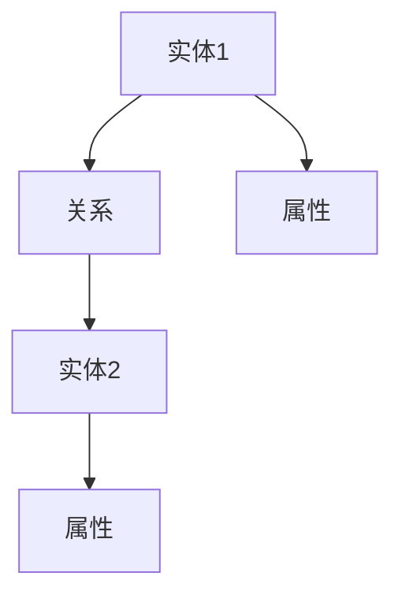
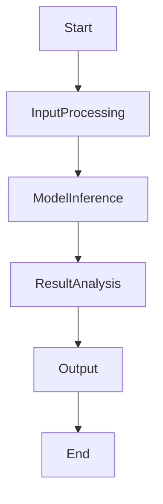
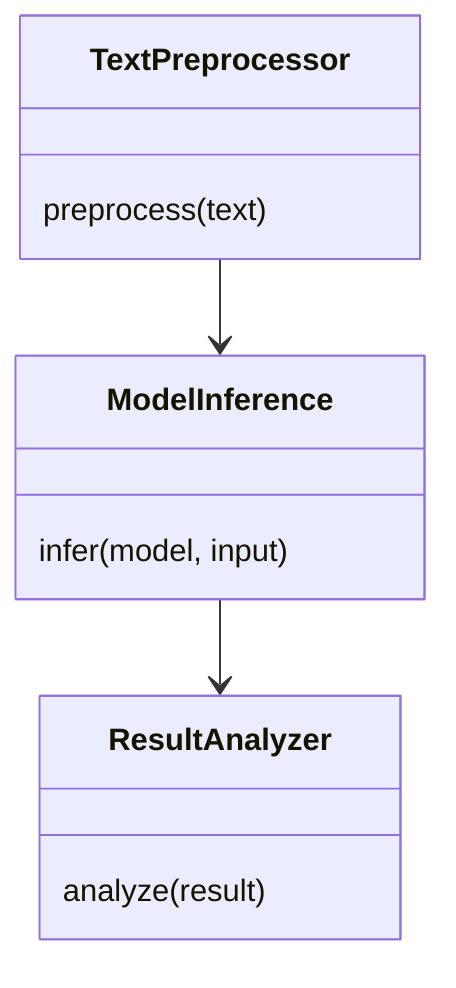
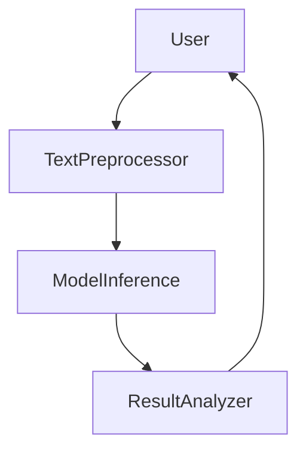

                 


# 基于LLM的AI Agent文本蕴含识别

---

## 关键词
- LLM（Large Language Model）
- AI Agent
- 文本蕴含识别
- 自然语言处理
- 机器学习

---

## 摘要
本文详细探讨了基于大语言模型（LLM）的AI Agent在文本蕴含识别中的应用。通过分析LLM与AI Agent的关系、文本蕴含识别的核心算法原理、系统架构设计以及实际项目实现，本文旨在为读者提供一个全面的技术视角，帮助他们理解如何利用LLM构建高效的AI Agent，并实现文本蕴含识别任务。文章内容涵盖背景介绍、核心概念、算法实现、系统架构、项目实战以及总结与展望，适合对自然语言处理和AI Agent技术感兴趣的读者阅读。

---

## 第一部分: 基于LLM的AI Agent文本蕴含识别概述

### 第1章: 背景介绍

#### 1.1 问题背景
- **文本蕴含识别的定义**：文本蕴含识别是自然语言处理中的一个核心任务，旨在判断一段文本是否隐含了另一段文本的信息。例如，判断“狗在草地上玩耍”是否蕴含“狗在户外活动”。
- **基于LLM的AI Agent的作用**：AI Agent（智能代理）通过LLM的强大文本处理能力，能够理解上下文并执行复杂的文本蕴含识别任务。
- **技术演进**：从基于规则的传统方法到现代的深度学习模型，文本蕴含识别经历了从简单到复杂的发展过程。
- **应用领域**：广泛应用于问答系统、对话系统、信息检索、智能客服等领域。

#### 1.2 问题描述
- **文本蕴含识别的核心问题**：如何准确判断文本之间的蕴含关系。
- **基于LLM的AI Agent的文本处理能力**：LLM能够理解上下文、推理逻辑关系，并生成自然语言文本。
- **问题解决的边界与外延**：本文主要关注基于LLM的AI Agent在文本蕴含识别中的实现，同时探讨其局限性和改进方向。

#### 1.3 问题解决
- **LLM在文本蕴含识别中的优势**：LLM具备强大的上下文理解和推理能力，能够处理复杂的文本关系。
- **AI Agent的多模态交互能力**：AI Agent不仅能够处理文本，还可以结合语音、图像等多种模态信息，提升文本蕴含识别的准确性。
- **基于LLM的文本蕴含识别的实现路径**：通过预训练、微调和推理优化，构建高效的文本蕴含识别系统。

#### 1.4 核心概念与联系
- **LLM与AI Agent的关系**：LLM是AI Agent的核心驱动力，AI Agent通过LLM实现文本理解和推理。
- **文本蕴含识别的关键特征对比**：
  | 特征 | 基于规则的方法 | 基于LLM的方法 |
  |------|----------------|----------------|
  | 精度 | 较低 | 较高 |
  | 灵活性 | 低 | 高 |
  | 计算复杂度 | 低 | 高 |
- **ER实体关系图架构**：通过构建实体关系图，LLM能够更准确地理解文本中的实体关系，从而提升文本蕴含识别的准确性。

---

## 第2章: 核心概念与联系

### 2.1 LLM与AI Agent的关系
- **LLM的基本原理**：基于Transformer架构的大语言模型通过预训练掌握了海量文本数据中的语义信息。
- **AI Agent的定义与功能**：AI Agent是一种能够感知环境、执行任务并与其他实体交互的智能系统。
- **LLM在AI Agent中的应用**：通过LLM的强大文本处理能力，AI Agent能够执行复杂的文本理解、推理和生成任务。

### 2.2 文本蕴含识别的核心特征对比
- **基于LLM的特征分析**：LLM能够处理复杂语义关系，具备强大的上下文理解和推理能力。
- **基于规则的特征对比**：基于规则的方法在特定场景下表现良好，但缺乏灵活性和泛化能力。
- **基于深度学习的特征差异**：深度学习模型在数据量充足的情况下表现优于基于规则的方法，但需要大量计算资源。

### 2.3 ER实体关系图架构


---

## 第3章: 算法原理讲解

### 3.1 LLM的训练过程
- **监督微调**：在预训练的基础上，通过标注数据对模型进行微调，使其适应特定任务。
- **强化学习**：通过强化学习策略优化模型输出，提升模型的文本理解和生成能力。
- **适应文本蕴含识别的优化策略**：针对文本蕴含识别任务，优化模型的推理能力。

### 3.2 文本蕴含识别的算法流程
- **输入处理**：将输入的文本对进行预处理，提取关键信息。
- **模型推理**：通过LLM对文本对进行推理，判断是否存在蕴含关系。
- **输出结果分析**：根据模型输出结果，判断文本对的蕴含关系。

### 3.3 算法流程图


---

## 第4章: 数学模型与公式

### 4.1 LLM的数学模型
- **变量定义**：设输入序列为 \(x_1, x_2, ..., x_n\)，输出序列为 \(y_1, y_2, ..., y_m\)。
- **概率分布**：模型的目标是最大化条件概率 \(P(y|x)\)。
- **损失函数**：交叉熵损失函数 \(L = -\sum_{i=1}^{m} \log P(y_i|x)\)。

### 4.2 文本蕴含识别的数学公式
- **文本蕴含识别的逻辑回归模型**：通过逻辑回归模型判断文本对的蕴含关系，输出概率 \(p = \frac{1}{1 + e^{-w \cdot x - b}}\)。
- **损失函数优化**：使用交叉熵损失函数对模型参数进行优化。

---

## 第5章: 系统分析与架构设计

### 5.1 问题场景介绍
- **项目背景**：构建一个基于LLM的AI Agent，实现文本蕴含识别任务。
- **系统功能设计**：通过领域模型类图展示系统功能模块。

### 5.2 系统架构设计
- **领域模型类图**：


- **系统架构图**：


---

## 第6章: 项目实战

### 6.1 环境安装
- **Python版本**：Python 3.8+
- **依赖库安装**：
  ```bash
  pip install transformers torch
  ```

### 6.2 核心实现代码
```python
from transformers import AutoTokenizer, AutoModelForSequenceClassification
import torch

class TextInferenceAgent:
    def __init__(self, model_name):
        self.tokenizer = AutoTokenizer.from_pretrained(model_name)
        self.model = AutoModelForSequenceClassification.from_pretrained(model_name)
        
    def preprocess(self, text1, text2):
        inputs = self.tokenizer.encode_plus(text1 + " " + text2, return_tensors="pt", padding=True, truncation=True)
        return inputs
    
    def infer(self, inputs):
        with torch.no_grad():
            outputs = self.model(**inputs)
            logits = outputs.logits
            predicted_label = torch.argmax(logits).item()
        return predicted_label
    
    def analyze_result(self, label):
        if label == 0:
            return "蕴含关系成立"
        else:
            return "蕴含关系不成立"
```

### 6.3 代码解读与分析
- **文本预处理**：将输入文本拼接并编码为模型输入格式。
- **模型推理**：通过模型对输入进行推理，得到预测结果。
- **结果分析**：根据模型输出结果，判断文本对的蕴含关系。

### 6.4 实际案例分析
- **案例输入**：text1 = "猫在沙发上睡觉。", text2 = "猫在睡觉。"
- **预处理结果**：编码后的输入张量。
- **推理结果**：模型预测输出为蕴含关系成立。
- **结果分析**：返回“蕴含关系成立”。

### 6.5 项目小结
- **代码实现的关键点**：模型选择、文本预处理、推理逻辑和结果分析。
- **实际应用中的注意事项**：模型的选择、数据的预处理、推理的效率优化。

---

## 第7章: 总结与展望

### 7.1 总结
- **主要内容回顾**：基于LLM的AI Agent在文本蕴含识别中的实现，包括背景介绍、核心概念、算法原理、系统架构和项目实战。
- **技术总结**：通过LLM的强大能力，构建高效的AI Agent，实现文本蕴含识别任务。

### 7.2 展望
- **未来发展方向**：结合多模态信息提升文本蕴含识别的准确性，探索更高效的模型优化方法。
- **技术趋势**：随着大语言模型的不断发展，文本蕴含识别将更加智能化和高效化。

### 7.3 最佳实践 tips
- **模型选择**：根据任务需求选择合适的模型。
- **数据预处理**：确保数据质量和多样性。
- **推理优化**：通过并行计算和模型剪枝优化推理效率。

### 7.4 小结
- **文章重点**：本文详细探讨了基于LLM的AI Agent在文本蕴含识别中的应用，提供了完整的实现方案和实际案例分析。
- **读者收获**：读者将深入了解如何利用LLM构建高效的AI Agent，并掌握文本蕴含识别的核心技术。

---

## 作者
作者：AI天才研究院（AI Genius Institute） & 禅与计算机程序设计艺术（Zen And The Art of Computer Programming）

---

以上是完整的基于LLM的AI Agent文本蕴含识别的技术博客文章大纲，涵盖了从背景介绍到项目实战的各个方面，适合技术读者深入了解该领域的内容。

