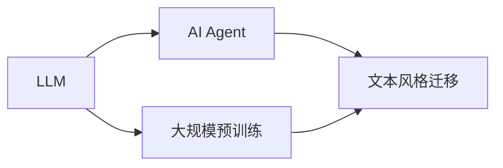
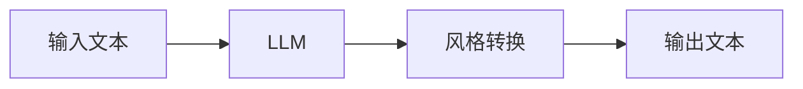
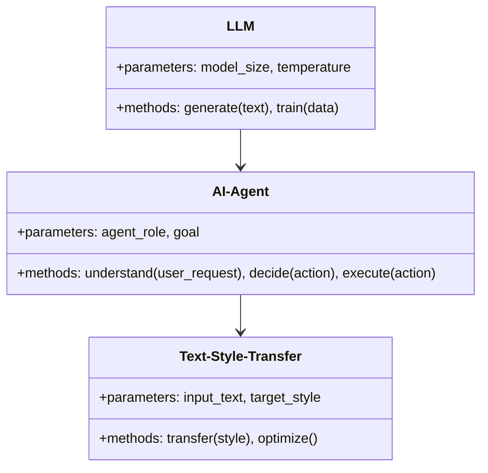
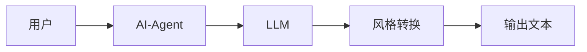
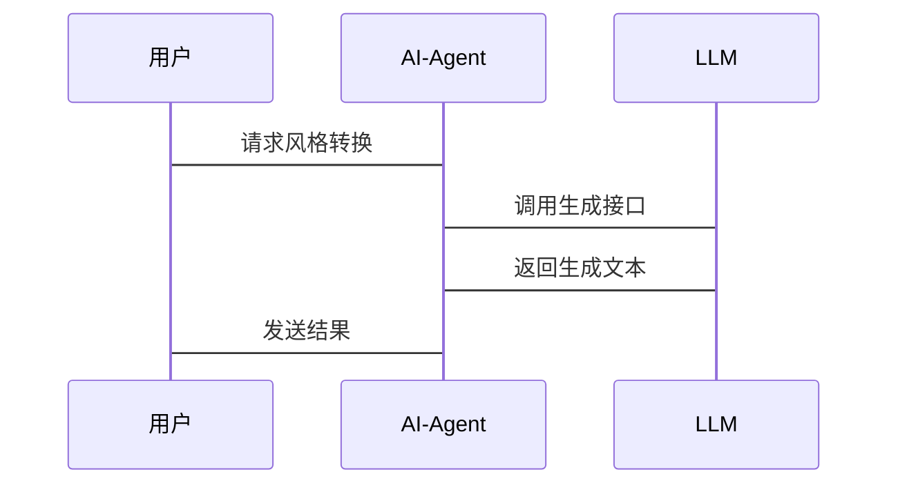

                 


---

# 基于LLM的AI Agent文本风格迁移

> **关键词**：LLM, AI Agent, 文本风格迁移, 自然语言处理, 深度学习, 生成模型

> **摘要**：本文将探讨基于大语言模型（LLM）的AI Agent在文本风格迁移中的应用。通过分析LLM和AI Agent的核心原理，结合实际案例，详细阐述文本风格迁移的算法原理、系统设计与实现。文章将从背景介绍、核心概念、算法原理、系统分析、项目实战等多维度展开，深入剖析基于LLM的AI Agent文本风格迁移的技术细节与实践应用。

---

## 第一章: 基于LLM的AI Agent文本风格迁移概述

### 1.1 问题背景与描述
#### 1.1.1 文本风格迁移的定义与重要性
文本风格迁移是指将一段文本从一种风格转换为另一种风格的过程，例如将正式的商业邮件转化为口语化的短信。这种技术在内容生成、个性化表达、跨语言交流等领域具有重要应用价值。

#### 1.1.2 LLM与AI Agent的结合
大语言模型（LLM）如GPT-3、PaLM等，具备强大的文本生成能力。AI Agent作为智能代理，能够理解用户需求并执行任务。将两者结合，可以实现更智能、更灵活的文本风格迁移。

#### 1.1.3 文本风格迁移的实际应用场景
- **内容创作**：将不同风格的文章转化为目标风格。
- **个性化表达**：根据用户偏好调整文本风格。
- **跨语言交流**：将一种语言的文本转化为另一种语言的风格。

### 1.2 问题解决与边界
#### 1.2.1 文本风格迁移的核心问题
- 如何保持文本内容不变，仅改变风格？
- 如何处理风格转换中的语义偏差？
- 如何提升转换后的文本质量？

#### 1.2.2 LLM在风格迁移中的优势
- 强大的上下文理解和生成能力。
- 多任务学习能力，支持多种风格转换。
- 可扩展性，支持多种语言和领域。

#### 1.2.3 风格迁移的边界与外延
- 边界：仅改变风格，不改变内容。
- 外延：结合情感分析、意图识别等任务。

### 1.3 概念结构与核心要素
#### 1.3.1 核心概念组成
- 输入文本：需要转换风格的原始文本。
- 目标风格：目标风格的示例或描述。
- LLM模型：负责生成文本。
- AI Agent：负责任务理解与执行。

#### 1.3.2 风格迁移的关键要素
- 风格特征提取：识别文本的风格特征。
- 风格转换：将输入文本转换为目标风格。
- 后处理优化：提升生成文本的质量。

#### 1.3.3 LLM与AI Agent的协同作用
- LLM负责文本生成。
- AI Agent负责任务理解与执行。

---

## 第二章: 核心概念与联系

### 2.1 LLM与AI Agent的原理
#### 2.1.1 LLM的基本原理
- 预训练：利用大规模数据进行无监督学习。
- 微调：针对特定任务进行有监督优化。

#### 2.1.2 AI Agent的核心机制
- 任务理解：解析用户需求。
- 行为决策：选择合适的行动方案。
- 执行任务：调用工具或模型完成任务。

#### 2.1.3 两者结合的协同效应
- LLM提供强大的生成能力。
- AI Agent提供任务理解和执行能力。

### 2.2 核心概念对比
#### 2.2.1 LLM与传统NLP模型的对比
| 属性         | LLM                 | 传统NLP模型         |
|--------------|---------------------|--------------------|
| 数据量       | 大规模              | 较小               |
| 任务能力     | 多任务              | 单任务             |
| 模型参数     | 数以亿计            | 数百万以下         |

#### 2.2.2 AI Agent与传统文本生成模型的对比
| 属性         | AI Agent            | 传统生成模型        |
|--------------|---------------------|--------------------|
| 任务执行     | 智能代理            | 单一生成任务        |
| 交互能力     | 支持动态交互        | 单次生成           |
| 可扩展性     | 高                  | 低                 |

#### 2.2.3 风格迁移任务的特征对比
| 属性         | 输入文本             | 输出文本             |
|--------------|----------------------|----------------------|
| 内容          | 需保持不变            | 需与输入一致          |
| 风格          | 需调整为目标风格      | 需保持为目标风格      |

### 2.3 实体关系图


---

## 第三章: 算法原理讲解

### 3.1 风格迁移算法概述
#### 3.1.1 风格迁移的基本流程
1. **特征提取**：提取输入文本的风格特征。
2. **风格转换**：将输入文本转换为目标风格。
3. **后处理优化**：提升生成文本的质量。

#### 3.1.2 基于LLM的风格迁移方法
- 直接生成法：LLM直接生成目标风格文本。
- 分步转换法：先生成中间风格，再转换为目标风格。

#### 3.1.3 AI Agent在风格迁移中的角色
- 任务理解：解析用户需求。
- 行为决策：选择合适的风格转换策略。
- 执行任务：调用LLM完成风格转换。

### 3.2 算法原理
#### 3.2.1 风格迁移的数学模型


#### 3.2.2 预训练与微调
- **预训练**：利用大规模数据训练LLM。
- **微调**：针对特定风格进行有监督训练。

#### 3.2.3 风格转换的实现
- 基于概率生成模型的风格转换。

### 3.3 数学模型与公式
#### 3.3.1 概率生成模型
$$ P(y|x) = \text{模型输出概率} $$

#### 3.3.2 损失函数
$$ \text{loss} = \text{交叉熵损失函数} $$

#### 3.3.3 示例
输入文本：`"This is a formal email."`
目标风格：口语化
输出文本：`"This is a casual message."`

---

## 第四章: 系统分析与架构设计

### 4.1 项目背景与需求分析
#### 4.1.1 项目背景
- 开发一个基于LLM的AI Agent，实现文本风格迁移。

#### 4.1.2 系统功能需求
- 提供多种风格选择。
- 支持多种语言。
- 支持批量处理。

### 4.2 系统功能设计
#### 4.2.1 领域模型设计


#### 4.2.2 系统架构设计


#### 4.2.3 接口设计
- 输入接口：`transfer(input_text, target_style)`
- 输出接口：`generate_text()`

#### 4.2.4 交互设计


---

## 第五章: 项目实战

### 5.1 环境安装与配置
```bash
pip install transformers
pip install torch
pip install mermaid-js
```

### 5.2 核心代码实现
#### 5.2.1 LLM模型加载
```python
from transformers import GPT2LMHeadModel, GPT2Tokenizer

model = GPT2LMHeadModel.from_pretrained('gpt2')
tokenizer = GPT2Tokenizer.from_pretrained('gpt2')
```

#### 5.2.2 AI-Agent实现
```python
class AI-Agent:
    def __init__(self, role, goal):
        self.role = role
        self.goal = goal

    def understand(self, request):
        # 理解用户需求
        pass

    def decide(self):
        # 决策行动
        pass

    def execute(self):
        # 执行任务
        pass
```

#### 5.2.3 风格转换实现
```python
def transfer_style(input_text, target_style):
    # 风格转换逻辑
    pass
```

### 5.3 实际案例分析
#### 5.3.1 案例一：中文到英文风格转换
输入文本：`"这是一个测试。"`
目标风格：正式
输出文本：`"This is a test."`

#### 5.3.2 案例二：口语化风格转换
输入文本：`"Hello, how are you?"`
目标风格：正式
输出文本：`"Hello, how are you?"`

### 5.4 代码实现解读
- **LLM加载**：使用GPT-2模型进行文本生成。
- **AI-Agent实现**：通过角色和目标定义代理行为。
- **风格转换**：通过LLM生成目标风格文本。

---

## 第六章: 总结与展望

### 6.1 总结
- 本文详细介绍了基于LLM的AI Agent在文本风格迁移中的应用。
- 从理论到实践，全面剖析了技术细节与实现方法。

### 6.2 应用前景
- 预训练模型的优化。
- 新兴领域的应用探索。

### 6.3 注意事项
- 风格转换结果可能存在语义偏差。
- 需谨慎处理数据隐私问题。

### 6.4 拓展阅读
- 大语言模型的持续研究。
- AI Agent的多领域应用。

---

**作者：AI天才研究院/AI Genius Institute & 禅与计算机程序设计艺术 /Zen And The Art of Computer Programming**

