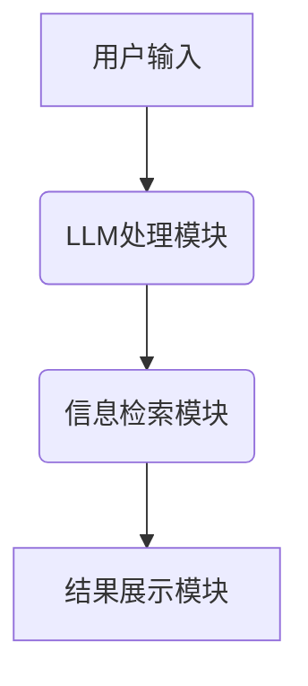
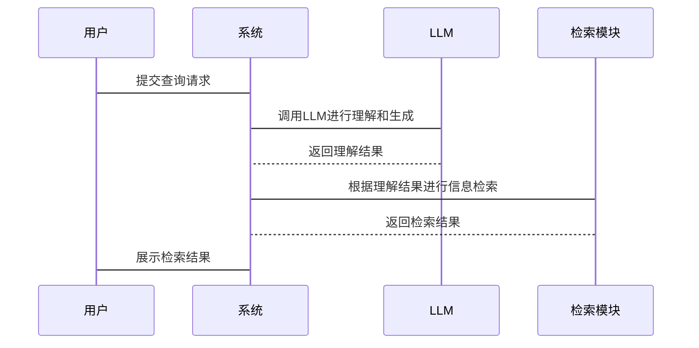

                 


# 基于LLM的AI Agent跨语言信息检索

## 关键词：跨语言信息检索、大语言模型（LLM）、AI Agent、自然语言处理、多语言模型

## 摘要：  
本文探讨了基于大语言模型（LLM）的AI Agent在跨语言信息检索中的应用。通过分析跨语言信息检索的核心挑战，结合LLM和AI Agent的技术原理，提出了一种基于LLM的AI Agent跨语言信息检索模型，并详细阐述了其实现方法和应用场景。本文内容包括跨语言信息检索的背景与挑战、LLM与AI Agent的核心原理、跨语言信息检索的技术策略、基于LLM的AI Agent跨语言信息检索模型的设计与实现、系统架构设计、项目实战以及最佳实践等部分。通过本文的分析，读者可以全面了解基于LLM的AI Agent跨语言信息检索的技术细节和实际应用。

---

# 第1章: 跨语言信息检索的背景与挑战

## 1.1 跨语言信息检索的定义与背景

### 1.1.1 什么是跨语言信息检索
跨语言信息检索（Cross-Language Information Retrieval, CLIR）是指在多种语言之间进行信息检索的过程。其核心目标是通过技术手段，将不同语言的文本进行理解和匹配，从而实现跨语言的信息检索和处理。

跨语言信息检索的应用场景非常广泛，例如在多语言搜索引擎中，用户可以用一种语言查询，系统能够检索并返回其他语言的相关结果；在国际商务中，跨语言信息检索可以帮助企业快速获取多语言的市场信息和竞争对手分析等。

### 1.1.2 跨语言信息检索的重要性
随着全球化的发展，信息的多语言化已经成为不可忽视的趋势。跨语言信息检索技术能够帮助用户突破语言障碍，获取更广泛的信息资源。特别是在大数据时代，信息的多语言化使得跨语言信息检索技术的需求更加迫切。

### 1.1.3 当前技术发展的背景
近年来，随着自然语言处理（NLP）技术的快速发展，大语言模型（LLM）的出现为跨语言信息检索提供了强大的技术支持。LLM具有强大的多语言理解和生成能力，结合AI Agent的智能化特性，跨语言信息检索技术的实现变得更加高效和智能化。

---

## 1.2 大语言模型（LLM）的基本概念

### 1.2.1 LLM的定义
大语言模型（Large Language Model, LLM）是指基于深度学习技术构建的大型神经网络模型，能够处理和生成多种语言的文本。LLM的核心思想是通过大量的多语言文本数据进行训练，从而掌握多种语言的语法、语义和上下文信息。

### 1.2.2 LLM的核心特点
1. **多语言支持**：LLM能够理解和生成多种语言的文本，支持跨语言的文本处理。
2. **上下文理解**：LLM具有强大的上下文理解能力，能够根据上下文推断出语义信息。
3. **自适应性**：LLM能够根据输入的文本动态调整输出，适应不同的应用场景。

### 1.2.3 LLM与传统NLP模型的区别
传统的NLP模型通常针对特定任务进行训练，例如机器翻译、文本分类等，且多专注于单一语言。而LLM是一种通用的大模型，能够同时处理多种语言和多种任务，具有更强的泛化能力。

---

## 1.3 AI Agent的基本概念与功能

### 1.3.1 AI Agent的定义
AI Agent（人工智能代理）是指能够感知环境并采取行动以实现目标的智能体。AI Agent可以通过与用户的交互，理解用户的需求，并通过调用各种工具和服务，帮助用户完成特定任务。

### 1.3.2 AI Agent的核心功能
1. **感知环境**：AI Agent能够通过传感器或接口获取环境中的信息。
2. **理解需求**：AI Agent能够理解用户的需求，并将其转化为具体的操作指令。
3. **决策与执行**：AI Agent能够根据需求和环境信息，制定行动计划，并通过调用相关工具和服务来执行任务。

### 1.3.3 AI Agent的应用场景
AI Agent的应用场景非常广泛，例如智能助手、智能客服、智能推荐系统等。在跨语言信息检索中，AI Agent可以作为用户与多语言信息之间的桥梁，帮助用户快速获取所需信息。

---

## 1.4 跨语言信息检索的核心问题

### 1.4.1 多语言文本的理解与转换
跨语言信息检索的核心问题之一是多语言文本的理解与转换。由于不同语言的语法、语义和表达习惯存在差异，如何准确理解多语言文本并进行有效的信息转换是一个重要的挑战。

### 1.4.2 跨语言信息检索的挑战
1. **语言差异**：不同语言之间的语法和语义差异可能导致信息检索的不准确。
2. **数据稀疏性**：某些语言的数据量较少，导致模型训练效果不佳。
3. **计算效率**：跨语言信息检索涉及大量的计算，如何提高计算效率是一个重要的问题。

### 1.4.3 跨语言信息检索的目标与边界
跨语言信息检索的目标是实现多语言文本之间的信息检索和理解，其边界包括多语言文本的预处理、信息检索算法的设计以及结果的准确性和效率。

---

## 1.5 本章小结
本章介绍了跨语言信息检索的背景与挑战，分析了大语言模型（LLM）和AI Agent的基本概念和功能，并提出了跨语言信息检索的核心问题和目标。通过本章的分析，读者可以理解跨语言信息检索的重要性和技术难点。

---

# 第2章: 大语言模型（LLM）与AI Agent的核心原理

## 2.1 大语言模型（LLM）的内部原理

### 2.1.1 LLM的训练过程
大语言模型的训练过程通常包括以下步骤：
1. **数据准备**：收集和整理多语言的文本数据。
2. **模型构建**：选择适合的模型架构，例如Transformer模型。
3. **模型训练**：使用大量的多语言文本数据对模型进行训练，优化模型参数。
4. **模型评估**：通过测试数据对模型的性能进行评估和优化。

### 2.1.2 LLM的模型结构
大语言模型通常基于Transformer架构，包括编码器（Encoder）和解码器（Decoder）两个部分。编码器负责将输入的文本转换为向量表示，解码器负责根据向量表示生成输出文本。

### 2.1.3 LLM的推理机制
LLM的推理机制基于概率预测，模型通过计算输入文本的概率分布，选择最可能的下一个词进行生成。这种机制使得模型能够生成连贯且符合语义的文本。

---

## 2.2 AI Agent的工作原理

### 2.2.1 AI Agent的任务分解
AI Agent的任务分解是指将用户的需求分解为多个具体的任务，并为每个任务分配相应的资源和服务。例如，在跨语言信息检索中，AI Agent可以将用户的查询分解为多语言文本的理解、信息检索和结果展示三个任务。

### 2.2.2 AI Agent的决策机制
AI Agent的决策机制基于状态和动作的选择。模型通过感知环境状态，评估可能的动作，并选择最优的动作以实现目标。这种机制使得AI Agent能够适应不同的环境和需求。

### 2.2.3 AI Agent的执行流程
AI Agent的执行流程包括以下步骤：
1. **感知输入**：获取用户的输入需求。
2. **需求分析**：理解用户的需求并将其转化为具体的任务。
3. **任务执行**：调用相关工具和服务完成任务。
4. **结果反馈**：将结果反馈给用户。

---

## 2.3 LLM与AI Agent的协同工作

### 2.3.1 LLM作为AI Agent的核心模块
在AI Agent中，LLM通常作为核心模块，负责理解和生成文本。AI Agent通过调用LLM来完成多语言文本的理解和生成任务。

### 2.3.2 LLM与AI Agent的交互方式
LLM与AI Agent的交互方式可以通过API接口实现。AI Agent将用户的需求传递给LLM，LLM根据需求生成相应的文本，并将结果返回给AI Agent。

### 2.3.3 LLM与AI Agent的联合优化
为了提高AI Agent的性能，可以通过联合优化的方法对LLM和AI Agent进行协同训练。例如，可以通过强化学习的方法，优化AI Agent的决策策略，同时优化LLM的生成能力。

---

## 2.4 本章小结
本章分析了大语言模型（LLM）和AI Agent的核心原理，介绍了LLM的训练过程和模型结构，以及AI Agent的任务分解和决策机制。同时，还探讨了LLM与AI Agent的协同工作方式，为后续章节的内容奠定了理论基础。

---

# 第3章: 跨语言信息检索的核心技术与挑战

## 3.1 跨语言信息检索的主要技术

### 3.1.1 多语言模型的训练技术
多语言模型的训练技术包括多语言预训练和微调。多语言预训练是指在多种语言的文本数据上进行预训练，微调是指在特定任务上进行微调优化。

### 3.1.2 跨语言检索的相似度计算
跨语言检索的相似度计算通常基于向量空间模型。例如，可以将多语言文本表示为向量，并计算向量之间的相似度。

### 3.1.3 跨语言信息的语义对齐
语义对齐是指将不同语言的文本映射到相同的语义空间中。通过语义对齐，可以实现跨语言文本的相似度计算和信息检索。

---

## 3.2 跨语言信息检索的主要挑战

### 3.2.1 多语言数据的不平衡问题
在实际应用中，不同语言的数据量可能存在较大的差异，导致模型在某些语言上的表现不佳。

### 3.2.2 不同语言之间的语义差异
不同语言之间的语义差异可能导致跨语言信息检索的不准确。

### 3.2.3 跨语言检索的计算效率问题
跨语言信息检索涉及大量的计算，如何提高计算效率是一个重要的挑战。

---

## 3.3 解决跨语言信息检索的技术策略

### 3.3.1 使用预训练多语言模型
通过使用预训练的多语言模型，可以快速构建跨语言信息检索系统，减少数据准备和模型训练的时间。

### 3.3.2 跨语言特征的提取与对齐
通过提取跨语言特征并进行语义对齐，可以提高跨语言信息检索的准确性和效率。

### 3.3.3 基于LLM的跨语言检索优化
利用大语言模型的强大能力，对跨语言检索进行优化，例如通过LLM生成高质量的检索结果。

---

## 3.4 本章小结
本章分析了跨语言信息检索的主要技术，包括多语言模型的训练、相似度计算和语义对齐等。同时，还探讨了跨语言信息检索的主要挑战，并提出了相应的技术策略。

---

# 第4章: 基于LLM的AI Agent跨语言信息检索模型

## 4.1 模型的整体架构

### 4.1.1 模型的输入与输出
模型的输入是用户用任意语言提出的查询，输出是与查询相关的多语言信息。

### 4.1.2 模型的模块划分
模型主要由以下几个模块组成：
1. **输入处理模块**：将用户的查询转换为模型可处理的形式。
2. **LLM处理模块**：利用大语言模型对查询进行理解和生成。
3. **信息检索模块**：根据LLM的理解结果进行跨语言信息检索。
4. **结果展示模块**：将检索结果以用户理解的形式展示出来。

### 4.1.3 模型的训练与优化
模型的训练包括多语言数据的预训练和任务特定的微调。优化过程可以通过强化学习等方法进行。

---

## 4.2 模型的核心算法

### 4.2.1 基于LLM的文本表示算法
文本表示算法通过将文本转换为向量表示，以便进行相似度计算。常用的向量表示方法包括Word2Vec和BERT。

### 4.2.2 跨语言相似度计算算法
跨语言相似度计算算法包括余弦相似度和欧氏距离等方法。通过计算向量之间的相似度，可以实现跨语言文本的相似度排序。

### 4.2.3 基于AI Agent的检索优化算法
AI Agent的检索优化算法通过动态调整检索策略，提高检索结果的准确性和相关性。

---

## 4.3 模型的实现细节

### 4.3.1 输入处理模块的实现
输入处理模块负责将用户的查询转换为模型可处理的形式。例如，可以将用户的查询转换为向量表示或直接输入到LLM中。

### 4.3.2 LLM处理模块的实现
LLM处理模块利用大语言模型对查询进行理解和生成。例如，可以通过调用LLM的API接口，获取与查询相关的多语言文本。

### 4.3.3 信息检索模块的实现
信息检索模块根据LLM的理解结果进行跨语言信息检索。例如，可以通过预训练的多语言模型进行检索，或者通过语义对齐技术进行检索。

### 4.3.4 结果展示模块的实现
结果展示模块将检索结果以用户理解的形式展示出来。例如，可以将检索结果翻译成用户的语言，或者以多语言的形式展示。

---

## 4.4 本章小结
本章详细介绍了基于LLM的AI Agent跨语言信息检索模型的整体架构和核心算法，分析了模型的实现细节。通过本章的分析，读者可以理解跨语言信息检索模型的设计和实现过程。

---

# 第5章: 跨语言信息检索的系统架构设计

## 5.1 系统功能设计

### 5.1.1 系统功能模块划分
跨语言信息检索系统主要包括以下几个功能模块：
1. **用户输入模块**：接收用户的查询请求。
2. **LLM处理模块**：利用大语言模型对查询进行理解和生成。
3. **信息检索模块**：根据理解结果进行跨语言信息检索。
4. **结果展示模块**：将检索结果以用户理解的形式展示出来。

### 5.1.2 系统功能流程
系统的功能流程包括以下步骤：
1. 用户输入查询请求。
2. 系统调用LLM对查询进行理解和生成。
3. 根据理解结果进行跨语言信息检索。
4. 将检索结果展示给用户。

---

## 5.2 系统架构设计

### 5.2.1 系统架构图
以下是跨语言信息检索系统的架构图：



### 5.2.2 关键模块的设计
1. **用户输入模块**：负责接收用户的查询请求，并将其传递给LLM处理模块。
2. **LLM处理模块**：利用大语言模型对查询进行理解和生成，输出与查询相关的多语言文本。
3. **信息检索模块**：根据LLM生成的文本进行跨语言信息检索，返回检索结果。
4. **结果展示模块**：将检索结果以用户理解的形式展示出来，例如翻译成用户的语言。

---

## 5.3 系统接口设计

### 5.3.1 API接口设计
跨语言信息检索系统可以通过API接口与其他系统进行交互。例如，用户可以通过调用API接口，将查询请求传递给系统，并获取检索结果。

### 5.3.2 接口实现细节
接口的实现细节包括接口的输入参数和输出结果。例如，输入参数可以是用户的查询请求和目标语言，输出结果可以是检索到的相关文本。

---

## 5.4 系统交互流程

### 5.4.1 系统交互流程图
以下是跨语言信息检索系统的交互流程图：



---

## 5.5 本章小结
本章详细介绍了跨语言信息检索系统的功能设计和架构设计，分析了系统的接口设计和交互流程。通过本章的分析，读者可以理解跨语言信息检索系统的整体架构和实现细节。

---

# 第6章: 项目实战——基于LLM的AI Agent跨语言信息检索实现

## 6.1 环境安装与配置

### 6.1.1 开发环境要求
建议使用Python 3.8及以上版本，安装必要的开发工具和库，例如Python、pip、PyTorch、Hugging Face Transformers库等。

### 6.1.2 安装必要的库
需要安装的主要库包括：
- `transformers`：用于加载和使用大语言模型。
- `torch`：用于深度学习模型的训练和推理。
- `requests`：用于HTTP请求的发送。

### 6.1.3 配置环境变量
如果需要使用Hugging Face的模型，需要在环境中配置API密钥。

---

## 6.2 系统核心代码实现

### 6.2.1 输入处理模块的实现
以下是输入处理模块的实现代码：

```python
import requests
from transformers import AutoTokenizer, AutoModelForSeq2SeqLM

# 加载预训练模型
tokenizer = AutoTokenizer.from_pretrained("t5-base")
model = AutoModelForSeq2SeqLM.from_pretrained("t5-base")

def process_input(query):
    inputs = tokenizer(query, return_tensors="pt")
    outputs = model.generate(inputs.input_ids, max_length=50)
    return tokenizer.decode(outputs[0], skip_special_tokens=True)
```

### 6.2.2 LLM处理模块的实现
以下是LLM处理模块的实现代码：

```python
import requests

def call_llm(query, target_language):
    # 调用大语言模型的API
    api_url = f"https://api.example.com/llm?query={query}&target_language={target_language}"
    response = requests.get(api_url)
    return response.json()["result"]
```

### 6.2.3 信息检索模块的实现
以下是信息检索模块的实现代码：

```python
import requests

def cross_language_retrieval(query, target_language):
    # 调用跨语言信息检索API
    api_url = f"https://api.example.com/cross_retrieval?query={query}&target_language={target_language}"
    response = requests.get(api_url)
    return response.json()["results"]
```

### 6.2.4 结果展示模块的实现
以下是结果展示模块的实现代码：

```python
def display_results(results, target_language):
    # 将检索结果翻译成目标语言并展示
    for result in results:
        print(f"Result in {target_language}: {result}")
```

---

## 6.3 代码应用解读与分析

### 6.3.1 输入处理模块的解读
输入处理模块负责将用户的查询请求转换为模型可处理的形式。例如，可以将用户的查询请求转换为向量表示或直接输入到LLM中进行处理。

### 6.3.2 LLM处理模块的解读
LLM处理模块利用大语言模型对查询进行理解和生成。例如，可以通过调用LLM的API接口，获取与查询相关的多语言文本。

### 6.3.3 信息检索模块的解读
信息检索模块根据LLM生成的结果进行跨语言信息检索。例如，可以通过预训练的多语言模型进行检索，或者通过语义对齐技术进行检索。

### 6.3.4 结果展示模块的解读
结果展示模块将检索结果以用户理解的形式展示出来。例如，可以将检索结果翻译成用户的语言，或者以多语言的形式展示。

---

## 6.4 实际案例分析

### 6.4.1 案例背景
假设用户使用中文提出查询请求，系统需要返回相关的多语言信息。

### 6.4.2 实现步骤
1. 用户输入查询请求："寻找关于人工智能的英文资料"。
2. 系统调用LLM对查询进行理解和生成，生成相关的多语言文本。
3. 系统根据生成的文本进行跨语言信息检索，返回英文资料。
4. 系统将检索结果展示给用户。

### 6.4.3 案例分析结果
通过上述步骤，系统能够准确地返回用户所需的多语言信息，满足用户的查询需求。

---

## 6.5 本章小结
本章通过实际案例分析，详细介绍了基于LLM的AI Agent跨语言信息检索系统的实现过程。通过本章的分析，读者可以理解跨语言信息检索系统的具体实现方法和应用场景。

---

# 第7章: 跨语言信息检索的最佳实践与优化

## 7.1 最佳实践

### 7.1.1 模型选择与优化
在选择和优化模型时，需要注意以下几点：
1. **模型的多语言支持**：选择支持多种语言的大语言模型。
2. **模型的训练数据**：确保训练数据的多样性和代表性。
3. **模型的计算效率**：优化模型的计算效率，减少推理时间。

### 7.1.2 数据预处理与清洗
在数据预处理和清洗过程中，需要注意以下几点：
1. **数据的多样性和平衡性**：确保训练数据的多样性和平衡性。
2. **数据的清洗与标注**：对数据进行清洗和标注，确保数据质量。
3. **数据的存储与管理**：优化数据的存储和管理，提高数据访问效率。

### 7.1.3 系统的性能优化
在系统的性能优化过程中，需要注意以下几点：
1. **系统的计算效率**：优化系统的计算效率，减少响应时间。
2. **系统的资源利用**：合理利用系统资源，提高资源利用率。
3. **系统的容错与恢复**：增强系统的容错与恢复能力，确保系统的稳定性。

---

## 7.2 小结

---

## 7.3 注意事项

### 7.3.1 模型的泛化能力
在实际应用中，需要注意模型的泛化能力。模型的泛化能力越强，系统的适应性越强。

### 7.3.2 数据的隐私与安全
在数据处理和传输过程中，需要注意数据的隐私与安全，确保数据不被泄露或滥用。

### 7.3.3 系统的可扩展性
在系统设计中，需要注意系统的可扩展性，确保系统能够适应未来的业务需求。

---

## 7.4 拓展阅读

### 7.4.1 大语言模型的最新研究
建议读者阅读大语言模型的最新研究论文，了解领域内的最新进展。

### 7.4.2 跨语言信息检索的经典论文
建议读者阅读跨语言信息检索领域的经典论文，深入理解相关技术。

### 7.4.3 AI Agent的相关书籍与文章
建议读者阅读AI Agent相关的书籍和文章，了解AI Agent的最新发展和应用。

---

# 第8章: 总结与展望

## 8.1 本章总结
本文详细探讨了基于大语言模型（LLM）的AI Agent跨语言信息检索的技术细节和实现方法。通过分析跨语言信息检索的背景与挑战，结合LLM和AI Agent的核心原理，提出了基于LLM的AI Agent跨语言信息检索模型，并详细阐述了其实现方法和应用场景。

## 8.2 未来展望
随着大语言模型和AI Agent技术的不断发展，跨语言信息检索的应用前景将更加广阔。未来的研究方向可以包括：
1. **多模态跨语言信息检索**：结合图像、音频等多种模态信息，实现更全面的跨语言信息检索。
2. **动态自适应的AI Agent**：研究动态自适应的AI Agent，使其能够根据环境变化和用户需求实时调整检索策略。
3. **跨语言信息检索的实时性优化**：研究如何进一步提高跨语言信息检索的计算效率，实现更快速的检索响应。

---

# 作者：AI天才研究院/AI Genius Institute & 禅与计算机程序设计艺术 /Zen And The Art of Computer Programming

---

通过本文的系统分析和详细阐述，读者可以全面了解基于LLM的AI Agent跨语言信息检索的技术细节和实际应用。

