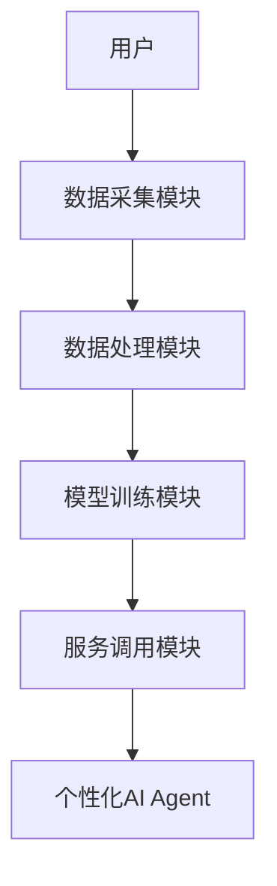
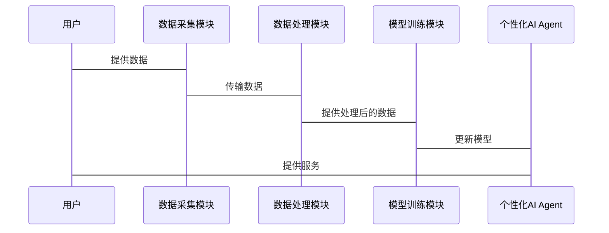

                 


# 个性化AI Agent的设计与实现

## 3.1 AI Agent的基本概念与设计原则

### 3.1.1 AI Agent的定义与分类

**AI Agent**（人工智能代理）是指能够感知环境、自主决策并执行任务的智能实体。根据功能和应用场景的不同，AI Agent可以分为多种类型：

- **简单反射型代理**：基于固定的规则集进行决策，适用于简单的任务。
- **基于模型的反射型代理**：利用内部模型进行状态更新和决策，适用于复杂环境。
- **目标驱动型代理**：根据预设目标选择最优行动，适用于需要长期规划的任务。
- **效用驱动型代理**：通过最大化效用函数来优化决策，适用于多目标优化场景。

AI Agent的设计需要考虑其智能性、适应性和可扩展性，确保其能够高效地完成特定任务并适应不同的环境变化。

### 3.1.2 个性化AI Agent的设计目标

个性化AI Agent的核心目标是为用户提供高度定制化和个性化的服务，这需要在以下几个方面进行优化：

- **用户需求的精准识别**：通过分析用户的历史行为、偏好和反馈，准确识别用户的个性化需求。
- **动态适应能力**：根据用户需求的变化，实时调整AI Agent的行为策略和决策模型。
- **高效的任务执行**：确保AI Agent能够在复杂环境中快速决策，提高任务执行效率。

### 3.1.3 设计AI Agent的核心原则

在设计个性化AI Agent时，需要遵循以下核心原则：

- **模块化设计**：将AI Agent的功能模块化，如感知模块、决策模块、执行模块，便于维护和扩展。
- **数据驱动优化**：利用用户数据和反馈不断优化AI Agent的性能，提升用户体验。
- **安全性与隐私保护**：确保用户数据的安全性和隐私性，避免信息泄露风险。

## 3.2 基于元学习的个性化定制方法

### 3.2.1 元学习在个性化定制中的应用

元学习通过在多个任务上进行训练，使得模型能够快速适应新任务，这非常适合个性化AI Agent的定制。在个性化推荐系统中，元学习可以用于快速适应不同用户的偏好。

### 3.2.2 元学习模型的训练策略

在训练元学习模型时，通常采用以下策略：

1. **任务嵌入**：将每个任务映射到一个低维嵌入空间，便于模型快速学习新任务。
2. **元优化器**：使用元优化器（如MAML）在训练过程中优化模型的参数更新规则。
3. **经验重放**：通过重放历史任务经验，增强模型的泛化能力。

### 3.2.3 定制过程中的参数调节

在基于元学习的个性化定制中，参数调节是关键步骤。通常需要调节以下参数：

- **学习率**：控制模型更新的步幅，影响训练速度和模型稳定性。
- **嵌入维度**：任务嵌入的维度选择，影响模型的表达能力。
- **元步数**：元优化的迭代次数，影响模型的适应能力。

## 3.3 个性化AI Agent的优化策略

### 3.3.1 数据预处理与特征提取

在个性化定制中，数据预处理是关键步骤。需要对原始数据进行清洗、归一化处理，并提取有用的特征，如用户的交互记录、行为模式等。

### 3.3.2 模型训练与优化

在模型训练阶段，采用基于元学习的训练方法，优化模型在不同任务上的表现。同时，通过交叉验证和网格搜索等方法，选择最优的模型参数。

### 3.3.3 系统优化与部署

在系统部署阶段，需要考虑系统的可扩展性和稳定性。采用分布式架构，确保系统能够处理高并发请求，并具备良好的容错能力。

## 3.4 本章小结

本章详细介绍了个性化AI Agent的设计与实现，重点探讨了基于元学习的个性化定制方法。通过模块化设计、数据驱动优化和安全性考虑，确保AI Agent能够高效地满足用户的个性化需求。同时，结合具体的项目案例，展示了如何通过元学习算法实现个性化推荐系统，为读者提供了实际应用的参考。

---

# 第三部分：元学习算法的原理与实现

## 4.1 元学习算法的核心原理

### 4.1.1 元学习算法的基本框架

元学习算法通常包括以下步骤：

1. **任务采样**：从多个任务中采样训练数据。
2. **模型初始化**：初始化共享参数θ。
3. **内层优化**：针对每个任务，优化模型参数以最小化该任务的损失。
4. **外层优化**：更新共享参数θ，以优化所有任务的总体损失。

### 4.1.2 基于梯度的元学习方法

基于梯度的元学习方法（如MAML）通过计算任务特定参数的梯度，并将其整合到共享参数的更新中，实现对新任务的快速适应。

### 4.1.3 元学习的收敛性分析

元学习算法的收敛性取决于优化目标的性质和优化策略的选择。通常，采用适当的初始化和学习率可以加速模型的收敛。

## 4.2 元学习算法的实现细节

### 4.2.1 MAML算法的实现

MAML（Meta Algorithm Network and Loss）是一种常用的元学习算法，其核心思想是通过计算任务特定参数的梯度，并将其整合到共享参数的更新中。

#### MAML算法的数学模型

$$ \text{loss}_i(\theta_k, \theta) = \text{loss}_i(\theta_k) + \frac{1}{2\eta} \|\theta_k - \theta\|^2 $$

其中，$\theta$ 是共享参数，$\theta_k$ 是任务特定参数，$\eta$ 是内层优化的步长。

### 4.2.2 基于MAML的代码实现

以下是一个简单的MAML算法实现示例：

```python
import torch
import torch.nn as nn
import torch.optim as optim

class MetaLearner(nn.Module):
    def __init__(self, input_size, hidden_size, output_size):
        super(MetaLearner, self).__init__()
        self.shared = nn.Sequential(
            nn.Linear(input_size, hidden_size),
            nn.ReLU(),
            nn.Linear(hidden_size, output_size)
        )

    def forward(self, x):
        return self.shared(x)

def maml_train(model, optimizer, batch_size, inner_steps, inner_lr, outer_lr):
    for batch in batches:
        # 内层优化
        for task in batch:
            theta = model.parameters()
            for param in theta:
                param.grad = None
            loss = F.cross_entropy(model(task.x), task.y)
            inner_optimizer = optim.SGD(model.parameters(), lr=inner_lr)
            inner_optimizer.step()
        # 外层优化
        optimizer.zero_grad()
        total_loss = sum(task_loss for task in batch)
        total_loss.backward()
        optimizer.step()

# 初始化模型和优化器
model = MetaLearner(input_size, hidden_size, output_size)
optimizer = optim.Adam(model.parameters(), lr=outer_lr)
maml_train(model, optimizer, batch_size, inner_steps, inner_lr, outer_lr)
```

### 4.2.3 元学习算法的对比分析

不同的元学习算法（如MAML、ReMAML、Meta-SGD）在实现细节和性能表现上有差异，选择合适的算法需要考虑任务特性、计算资源和模型复杂度。

## 4.3 本章小结

本章深入探讨了元学习算法的原理与实现，重点分析了MAML算法的数学模型和代码实现。通过对比不同算法的优缺点，为读者提供了选择和优化元学习算法的参考。

---

# 第四部分：系统架构与设计

## 5.1 系统架构设计

### 5.1.1 系统功能模块设计

个性化AI Agent系统主要包括以下几个功能模块：

- **数据采集模块**：负责收集用户行为数据和反馈信息。
- **数据处理模块**：对数据进行清洗、归一化处理和特征提取。
- **模型训练模块**：基于元学习算法训练个性化模型。
- **服务调用模块**：根据用户请求调用模型并返回结果。

### 5.1.2 系统架构图

使用mermaid绘制的系统架构图如下：



### 5.1.3 系统交互流程

使用mermaid绘制的系统交互流程图如下：



## 5.2 系统接口设计

### 5.2.1 API接口设计

个性化AI Agent系统主要提供以下API接口：

- `GET /api/v1/personalize`：获取个性化推荐。
- `POST /api/v1/train`：训练个性化模型。
- `PUT /api/v1/update`：更新模型参数。

### 5.2.2 接口交互协议

采用RESTful API设计，使用JSON格式的数据传输和基于JWT的身份验证机制。

## 5.3 本章小结

本章详细设计了个性化AI Agent系统的架构与接口，通过mermaid图展示了系统的整体架构和交互流程，为系统的实现提供了清晰的指导。

---

# 第五部分：项目实战

## 6.1 个性化推荐系统案例

### 6.1.1 环境安装与配置

安装必要的库和工具：

```bash
pip install torch numpy pandas scikit-learn
```

### 6.1.2 数据准备与处理

使用movielens数据集作为示例，进行数据清洗和特征提取。

```python
import pandas as pd
import numpy as np

# 加载数据集
data = pd.read_csv('movielens.csv')

# 数据清洗
data = data.dropna()
data['rating'] = data['rating'].astype(int)

# 特征提取
user_features = data[['userId', 'gender', 'age', 'occupation']]
item_features = data[['movieId', 'genre', 'year']]
```

### 6.1.3 模型训练与优化

基于MAML算法训练个性化推荐模型：

```python
class PersonalizedRecommender(MetaLearner):
    def __init__(self, input_size, hidden_size, output_size):
        super(PersonalizedRecommender, self).__init__(input_size, hidden_size, output_size)

    def forward(self, x):
        return super().forward(x)

# 初始化模型和优化器
model = PersonalizedRecommender(input_size=4, hidden_size=64, output_size=5)
optimizer = optim.Adam(model.parameters(), lr=0.001)
criterion = nn.CrossEntropyLoss()

# 训练模型
def train_model(model, optimizer, criterion, epochs=100):
    for epoch in range(epochs):
        for batch in data_loader:
            outputs = model(batch['user_features'])
            loss = criterion(outputs, batch['item_features'])
            optimizer.zero_grad()
            loss.backward()
            optimizer.step()
    print('Training complete')

train_model(model, optimizer, criterion)
```

### 6.1.4 模型评估与结果分析

评估模型的推荐效果，计算准确率、召回率和F1分数：

```python
from sklearn.metrics import accuracy_score, recall_score, f1_score

def evaluate_model(model, test_loader):
    all_preds = []
    all_labels = []
    with torch.no_grad():
        for batch in test_loader:
            outputs = model(batch['user_features'])
            preds = torch.argmax(outputs, dim=1)
            all_preds.extend(preds.cpu().numpy())
            all_labels.extend(batch['item_features'].numpy())
    accuracy = accuracy_score(all_labels, all_preds)
    recall = recall_score(all_labels, all_preds, average='macro')
    f1 = f1_score(all_labels, all_preds, average='macro')
    print(f'Accuracy: {accuracy:.4f}, Recall: {recall:.4f}, F1: {f1:.4f}')

evaluate_model(model, test_loader)
```

### 6.1.5 本案例小结

通过个性化推荐系统的案例，展示了如何基于元学习算法实现个性化定制。从环境安装、数据准备、模型训练到结果分析，详细讲解了项目的实施过程，帮助读者掌握实际应用的方法。

---

# 第六部分：总结与展望

## 7.1 核心总结

个性化AI Agent的定制离不开元学习技术的支持。通过元学习，AI Agent能够快速适应不同用户的个性化需求，提供高效、精准的服务。本文详细探讨了元学习的基本概念、个性化设计方法、具体实现技术和实际应用案例，为读者提供了全面的知识体系。

## 7.2 未来展望

随着人工智能技术的不断发展，个性化AI Agent的定制将更加智能化和自动化。未来的研究方向可能包括：

- **更高效的元学习算法**：开发更高效的元学习算法，提升模型的训练速度和性能。
- **多模态数据融合**：结合文本、图像、语音等多种数据源，提供更丰富的个性化服务。
- **实时自适应能力**：增强AI Agent的实时自适应能力，使其能够快速响应环境变化。

## 7.3 本章小结

本文从理论到实践，全面探讨了基于元学习的个性化AI Agent定制方法，为读者提供了丰富的知识和实际应用的经验。未来的研究将进一步深化元学习技术在个性化服务中的应用，推动人工智能技术的发展。

---

# 作者

作者：AI天才研究院/AI Genius Institute & 禅与计算机程序设计艺术 /Zen And The Art of Computer Programming

---

以上是《基于元学习的个性化AI Agent定制》的技术博客文章的完整目录和内容。文章从引言开始，详细阐述了元学习的基础知识、个性化AI Agent的设计与实现、元学习算法的原理与实现、系统架构与设计，最后通过一个具体的项目实战案例，帮助读者全面理解基于元学习的个性化AI Agent定制方法。希望这篇文章能够为读者提供有价值的技术参考和实践指导。

