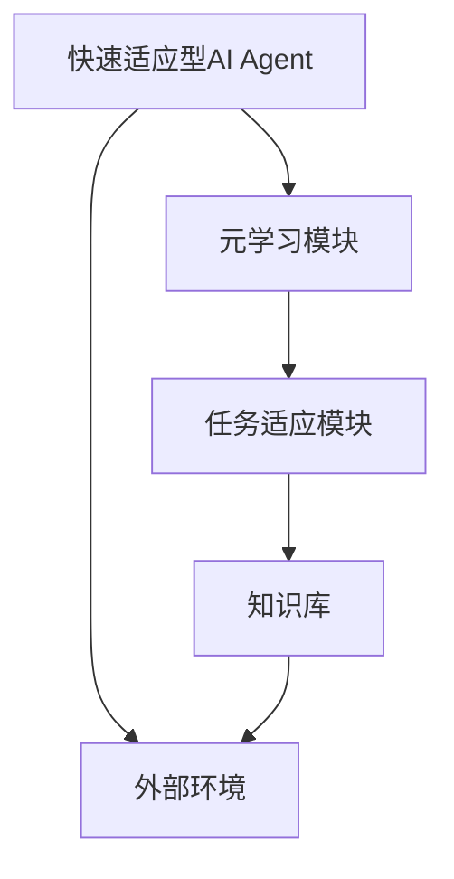
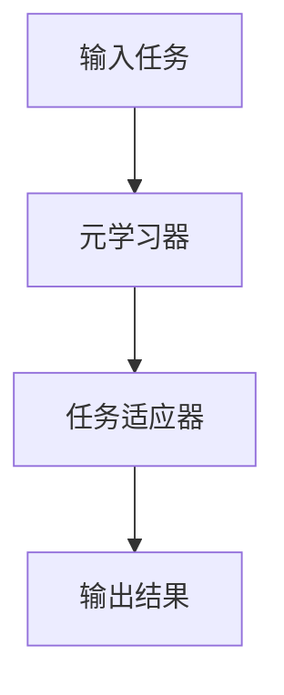
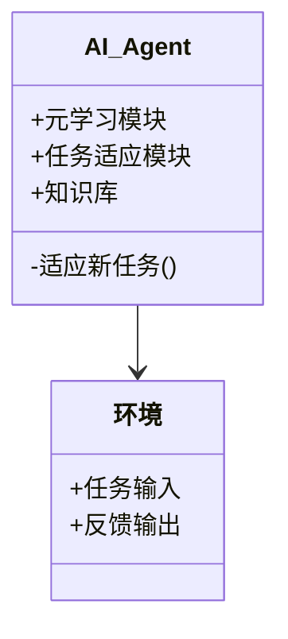
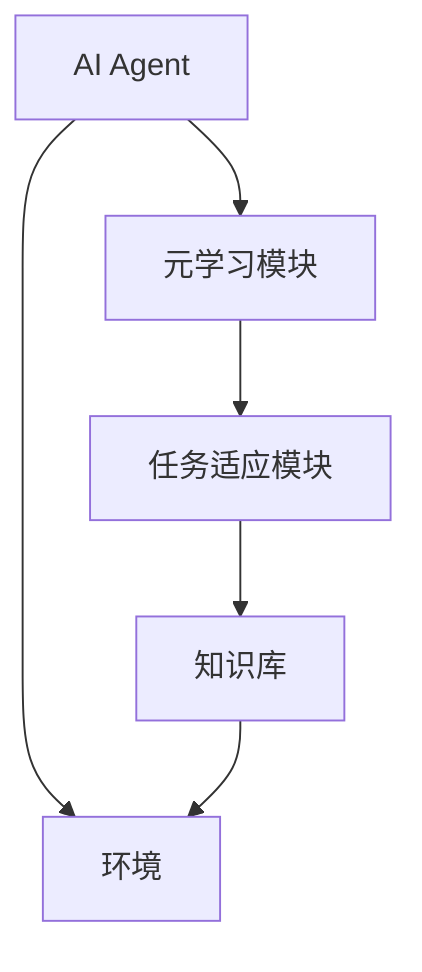
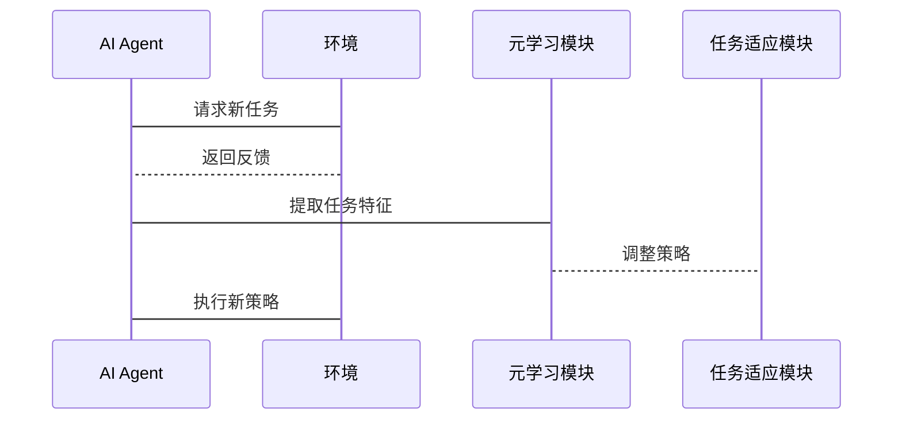

                 


# 基于元学习的快速适应型AI Agent

> 关键词：元学习，快速适应型AI Agent，MAML算法，Reptile算法，系统架构设计

> 摘要：本文将详细探讨基于元学习的快速适应型AI Agent的构建与实现。从背景介绍、核心概念、算法原理、系统架构到项目实战，层层深入，结合实际案例和代码实现，为读者提供全面的技术指导。

---

# 第一部分: 背景介绍

# 第1章: 基于元学习的快速适应型AI Agent背景介绍

## 1.1 问题背景与描述
### 1.1.1 AI Agent的基本概念与应用领域
AI Agent（智能体）是指在环境中能够感知并自主行动以实现目标的智能实体。它可以广泛应用于推荐系统、游戏AI、自动驾驶、智能助手等领域。例如，智能助手通过与用户的交互不断优化自己的响应策略。

### 1.1.2 快速适应型AI Agent的需求背景
在动态变化的环境中，传统的AI Agent可能需要重新训练才能适应新任务，这不仅耗时，还可能导致性能下降。快速适应型AI Agent能够在新任务上线后，快速调整策略，无需重新训练。

### 1.1.3 元学习在AI Agent中的作用与意义
元学习（Meta-Learning）是一种让模型学习如何学习的方法，能够在少量数据或任务上快速适应新任务。将元学习应用于AI Agent，可以显著提升其快速适应能力。

## 1.2 问题解决与边界
### 1.2.1 快速适应型AI Agent的目标与核心问题
目标是让AI Agent在新任务上线时，能够快速调整策略，适应环境变化。核心问题是如何设计高效的元学习算法，使其能够在新任务中快速收敛。

### 1.2.2 元学习在解决适应性问题中的应用边界
元学习适用于任务之间有共享特征的场景，例如在多任务学习中，元学习可以帮助模型快速适应新任务。但对完全独立的任务，元学习的效果可能有限。

### 1.2.3 相关领域的对比与区分
与传统机器学习相比，元学习更注重快速适应能力；与强化学习相比，元学习更关注跨任务的迁移能力。

## 1.3 概念结构与核心要素
### 1.3.1 快速适应型AI Agent的核心要素分析
1. **元学习模块**：负责学习任务的通用特征。
2. **任务适应模块**：根据新任务调整策略。
3. **知识库**：存储已学习的任务知识。

### 1.3.2 元学习在概念结构中的位置与作用
元学习模块位于AI Agent的核心位置，负责提取任务特征并指导任务适应模块进行策略调整。

### 1.3.3 相关概念的对比与联系
通过对比元学习、强化学习、迁移学习，明确各自的优缺点及适用场景。

## 1.4 本章小结
本章介绍了快速适应型AI Agent的背景、目标、核心问题及元学习的作用，为后续章节奠定了基础。

---

# 第二部分: 核心概念与联系

# 第2章: 元学习与快速适应型AI Agent的核心概念

## 2.1 元学习的原理与机制
### 2.1.1 元学习的基本原理
元学习通过在多个任务上预训练，学习任务的特征表示，从而能够快速适应新任务。

### 2.1.2 快速适应的实现机制
通过元学习模块提取任务特征，任务适应模块快速调整策略。

### 2.1.3 元学习与传统机器学习的对比
传统机器学习依赖大量数据，而元学习通过共享特征实现快速适应。

## 2.2 快速适应型AI Agent的属性特征对比
| 属性 | 快速适应型AI Agent | 传统AI Agent |
|------|---------------------|--------------|
| 适应性 | 强 | 弱 |
| 数据需求 | 少 | 多 |
| 训练时间 | 短 | 长 |

### 2.2.3 属性之间的关系与影响
适应性与数据需求、训练时间呈负相关关系。

## 2.3 实体关系图


## 2.4 本章小结
本章详细讲解了元学习的原理及其在快速适应型AI Agent中的应用，为后续章节奠定了理论基础。

---

# 第三部分: 算法原理讲解

# 第3章: 元学习算法原理

## 3.1 模型无关的元学习算法
### 3.1.1 MAML算法
#### 3.1.1.1 算法流程
1. 预训练阶段：在多个任务上训练元学习器。
2. 适应阶段：在新任务上微调模型。

#### 3.1.1.2 MAML算法流程图


#### 3.1.1.3 MAML算法伪代码
```python
def meta_train():
    for batch in meta_train_batches:
        for task in batch:
            # 预训练阶段
            loss_task = compute_loss(task, theta)
            # 适应阶段
            theta = theta - alpha * d(loss_task)/d(theta)
```

### 3.1.2 Reptile算法
#### 3.1.2.1 算法流程
1. 在多个任务上交替训练，更新全局参数。

#### 3.1.2.2 Reptile算法伪代码
```python
def reptile_train():
    for batch in reptile_train_batches:
        for task in batch:
            # 适应阶段
            theta_task = compute_theta_task(task, theta)
            # 更新全局参数
            theta = theta - beta * (theta - theta_task)
```

## 3.2 模型相关的元学习算法
### 3.2.1 模型无关与模型相关算法的对比
| 对比维度 | 模型无关 | 模型相关 |
|---------|----------|----------|
| 算法复杂度 | 低 | 高 |
| 适用场景 | 数据少 | 数据多 |

## 3.3 元学习算法的数学模型
### 3.3.1 MAML算法的数学公式
$$ \theta_{meta} = \theta_{meta} - \alpha \frac{\partial L_{task}(\theta_{meta})}{\partial \theta_{meta}} $$

### 3.3.2 Reptile算法的数学公式
$$ \theta_{global} = \theta_{global} - \beta (\theta_{global} - \theta_{task}) $$

## 3.4 本章小结
本章详细讲解了MAML和Reptile两种典型元学习算法，并分析了它们的优缺点。

---

# 第四部分: 系统分析与架构设计

# 第4章: 系统分析与架构设计

## 4.1 项目介绍
本项目旨在构建一个基于元学习的快速适应型AI Agent，能够在新任务上线时快速调整策略。

## 4.2 系统功能设计
### 4.2.1 领域模型类图


### 4.2.2 系统架构图


### 4.2.3 系统接口设计
| 接口 | 描述 |
|-----|------|
| 适应新任务 | 根据新任务调整策略 |
| 获取反馈 | 获取环境反馈 |

### 4.2.4 系统交互序列图


## 4.3 本章小结
本章详细设计了系统的架构，包括类图、架构图和交互序列图，为后续实现奠定了基础。

---

# 第五部分: 项目实战

# 第5章: 项目实战

## 5.1 环境安装
```bash
pip install numpy
pip install matplotlib
pip install torch
```

## 5.2 核心代码实现
### 5.2.1 元学习模块实现
```python
import torch
import torch.nn as nn

class MetaLearner(nn.Module):
    def __init__(self):
        super().__init__()
        self.shared_net = nn.Sequential(
            nn.Linear(4, 64),
            nn.ReLU(),
            nn.Linear(64, 2)
        )
    
    def forward(self, x):
        return self.shared_net(x)
```

### 5.2.2 任务适应模块实现
```python
class TaskAdapter(nn.Module):
    def __init__(self):
        super().__init__()
        self.adapter = nn.Sequential(
            nn.Linear(64, 128),
            nn.ReLU(),
            nn.Linear(128, 64)
        )
    
    def forward(self, x):
        return self.adapter(x)
```

### 5.2.3 训练循环实现
```python
def train(metalearner, task_adapter, optimizer_meta, optimizer_task, batch_size):
    for batch in range(batch_size):
        # 元学习优化
        optimizer_meta.zero_grad()
        metalearner_loss = compute_metalearner_loss(metalearner, task)
        metalearner_loss.backward()
        optimizer_meta.step()
        
        # 任务适应优化
        optimizer_task.zero_grad()
        task_adapter_loss = compute_task_adapter_loss(task_adapter, metalearner)
        task_adapter_loss.backward()
        optimizer_task.step()
```

## 5.3 代码应用解读与分析
### 5.3.1 元学习模块的作用
元学习模块负责提取任务特征，为任务适应模块提供输入。

### 5.3.2 任务适应模块的作用
任务适应模块根据新任务调整策略，输出适应性更强的模型。

## 5.4 实际案例分析
### 5.4.1 案例背景
假设我们有一个图像分类任务，需要快速适应新类别。

### 5.4.2 训练过程
1. 预训练阶段：在多个图像分类任务上训练元学习模块。
2. 适应阶段：在新类别上微调任务适应模块。

### 5.4.3 结果分析
通过对比传统机器学习和元学习的适应时间，验证元学习的优势。

## 5.5 本章小结
本章通过实际案例详细讲解了如何实现基于元学习的快速适应型AI Agent，并分析了其优势。

---

# 第六部分: 最佳实践 tips

# 第6章: 最佳实践 tips

## 6.1 小结
本篇文章从背景、概念、算法、架构到实战，全面讲解了基于元学习的快速适应型AI Agent的构建过程。

## 6.2 注意事项
1. 元学习适用于任务之间有共享特征的场景。
2. 选择合适的元学习算法取决于任务需求和数据规模。

## 6.3 拓展阅读
推荐阅读相关领域的经典论文和书籍，如《《Deep Learning》》。

## 6.4 参考文献
1. 李开复. 《人工智能》
2. Meta-Learning literature review

---

# 作者：AI天才研究院/AI Genius Institute & 禅与计算机程序设计艺术 /Zen And The Art of Computer Programming

---

本文通过详细讲解基于元学习的快速适应型AI Agent的构建过程，从理论到实践，为读者提供全面的技术指导。希望本文能为相关领域的研究和应用提供有价值的参考。

