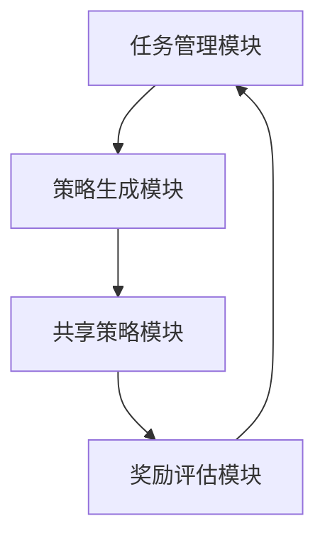
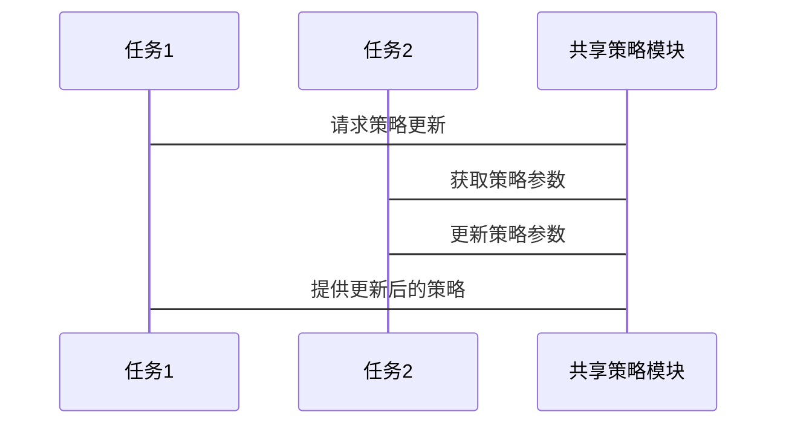

                 


# 基于元强化学习的AI Agent策略生成

> **关键词**：元强化学习，AI Agent，策略生成，多任务学习，强化学习，系统设计

> **摘要**：本文深入探讨了基于元强化学习的AI Agent策略生成技术，从基础概念到算法原理，再到系统设计与实际应用，全面解析了该领域的最新进展。通过详细的技术分析和实际案例，展示了如何利用元强化学习快速生成高效策略，为AI Agent的研究与应用提供了新的思路。

---

## 第一部分: 元强化学习基础

### 第1章: 强化学习概述

#### 1.1 强化学习的基本概念

**1.1.1 什么是强化学习**

强化学习（Reinforcement Learning，RL）是一种机器学习范式，其中智能体通过与环境交互，学习如何采取一系列行动以最大化累积的奖励。与监督学习不同，强化学习不需要明确的标注数据，而是通过试错和奖励机制来优化策略。

**1.1.2 强化学习的核心要素**

- **智能体（Agent）**：执行动作的主体，通常是算法或模型。
- **环境（Environment）**：智能体所处的外部世界，可以是虚拟的（如游戏）或现实的（如机器人控制）。
- **状态（State）**：环境在某一时刻的描述。
- **动作（Action）**：智能体在给定状态下采取的行动。
- **奖励（Reward）**：智能体采取动作后获得的反馈，用于指导策略优化。

**1.1.3 强化学习的应用场景**

- 游戏AI（如AlphaGo、Dota AI）
- 机器人控制
- 自动驾驶
- 金融交易策略

---

#### 1.2 元学习的基本概念

**1.2.1 元学习的定义**

元学习（Meta-Learning）是一种学习方法，旨在使模型能够快速适应新的任务或环境，而不需要从头开始训练。它通过在多个任务上进行预训练，提取通用特征或策略，从而实现快速迁移学习。

**1.2.2 元学习的核心思想**

元学习的目标是让模型学会如何学习，即通过经验快速掌握新任务的策略。其核心思想包括：

- **任务多样性**：在多个任务上训练模型，使其具备泛化能力。
- **策略共享**：多个任务之间共享部分策略，减少训练时间和计算资源。
- **快速适应**：在新任务上线时，模型能够快速调整策略以适应环境。

**1.2.3 元学习与传统强化学习的区别**

| **维度** | **传统强化学习** | **元强化学习** |
|----------|-----------------|----------------|
| 训练目标 | 优化单一任务策略 | 优化多个任务的策略共享与快速适应 |
| 任务多样性 | 单一任务 | 多任务学习 |
| 适应性 | 需要长时间训练 | 快速适应新任务 |

---

### 第2章: AI Agent的基本结构

#### 2.1 AI Agent的定义与分类

**2.1.1 什么是AI Agent**

AI Agent是一种智能实体，能够感知环境、做出决策并执行动作以实现目标。它可以是一个软件程序（如推荐系统）或物理实体（如自动驾驶汽车）。

**2.1.2 AI Agent的分类**

- **简单反射型Agent**：基于当前状态直接做出反应。
- **基于模型的反射型Agent**：维护环境的内部模型，用于决策。
- **目标驱动型Agent**：根据目标选择最优动作。
- **效用驱动型Agent**：根据效用函数优化决策。

**2.1.3 AI Agent的应用领域**

- 智能家居
- 自动驾驶
- 智能客服
- 游戏AI

#### 2.2 策略生成的基本原理

**2.2.1 策略生成的定义**

策略生成是AI Agent的核心任务，指的是根据当前状态和目标，生成最优或近似最优的行动序列。

**2.2.2 策略生成的实现方法**

- **基于值函数的方法**：学习状态的价值，指导决策。
- **基于策略的方法**：直接学习动作的概率分布。
- **基于模型的方法**：构建环境模型，模拟决策过程。

**2.2.3 策略生成的优化目标**

- 最大化累积奖励
- 最小化策略更新时间
- 提高策略的泛化能力

---

## 第二部分: 元强化学习算法原理

### 第3章: 元强化学习的核心算法

#### 3.1 元Q-learning算法

**3.1.1 算法的基本思想**

元Q-learning是一种基于Q-learning的元强化学习算法。它通过在多个任务上共享Q值函数，实现快速策略生成。

**3.1.2 算法的实现步骤**

1. 初始化共享的Q值函数。
2. 对每个任务，更新Q值函数以最大化累积奖励。
3. 共享更新后的Q值函数，供其他任务使用。

**3.1.3 算法的数学模型**

共享Q值函数的更新公式：

$$ Q_{\text{shared}}(s, a) \leftarrow Q_{\text{shared}}(s, a) + \alpha \cdot [R + \gamma \max_{a'} Q_{\text{shared}}(s', a') - Q_{\text{shared}}(s, a)] $$

其中：
- $\alpha$：学习率
- $\gamma$：折扣因子
- $R$：奖励

**3.1.4 算法的优势**

- 适用于离散动作空间
- 简单易实现
- 可快速适应新任务

---

#### 3.2 元策略梯度方法

**3.2.1 策略梯度的基本概念**

策略梯度（Policy Gradient）方法直接优化策略参数，以最大化累积奖励。

**3.2.2 元策略梯度的核心思想**

元策略梯度通过在多个任务上共享策略梯度，实现快速策略生成。

**3.2.3 算法的数学推导**

共享策略的梯度更新公式：

$$ \nabla_{\theta} J(\theta) = \mathbb{E}_{t} \left[ \nabla_{\theta} \log \pi_{\theta}(a|s) \cdot Q_{\text{shared}}(s, a) \right] $$

其中：
- $J(\theta)$：策略的累积奖励
- $\pi_{\theta}(a|s)$：策略分布
- $Q_{\text{shared}}(s, a)$：共享的Q值函数

**3.2.4 算法的实现步骤**

1. 初始化共享策略参数。
2. 对每个任务，计算策略梯度并更新参数。
3. 共享更新后的策略参数，供其他任务使用。

---

### 第4章: 多任务学习与元强化学习

#### 4.1 多任务学习的基本概念

**4.1.1 多任务学习的定义**

多任务学习（Multi-Task Learning，MTL）是指在多个相关任务上同时训练模型，通过共享参数或特征，提高模型的泛化能力。

**4.1.2 多任务学习的优势**

- 参数共享，减少训练时间
- 提高模型的泛化能力
- 适用于数据稀疏的任务

**4.1.3 多任务学习的应用场景**

- 自然语言处理（如BERT）
- 计算机视觉（如多任务目标检测）
- 游戏AI（如多任务机器人控制）

#### 4.2 元强化学习在多任务中的应用

**4.2.1 元强化学习如何处理多任务**

元强化学习通过共享策略或价值函数，同时优化多个任务的策略生成。

**4.2.2 多任务学习中的策略共享**

在多任务强化学习中，可以通过以下方式实现策略共享：

- **共享参数**：所有任务共享部分或全部参数。
- **共享价值函数**：多个任务共享价值函数，减少计算量。
- **共享策略梯度**：多个任务共享策略梯度，优化共享参数。

**4.2.3 多任务学习的优化方法**

- **任务权重调整**：根据任务的重要性调整权重。
- **任务交替训练**：轮流训练不同任务，平衡模型性能。
- **任务聚类**：将相似任务分组，优化共享策略。

---

## 第三部分: 系统设计与架构

### 第5章: 系统分析与设计

#### 5.1 问题场景分析

**5.1.1 问题背景**

在实际应用中，AI Agent需要在多种环境下快速生成策略。传统强化学习需要针对每个任务单独训练，效率低下。元强化学习通过共享策略，显著提高了训练效率。

**5.1.2 问题描述**

- 多任务学习中的策略生成效率低
- 策略生成的适应性差
- 策略生成的泛化能力不足

**5.1.3 问题解决目标**

- 提高策略生成效率
- 增强策略生成的适应性
- 提升策略生成的泛化能力

#### 5.2 系统功能设计

**5.2.1 系统功能模块划分**

- **任务管理模块**：管理多个任务，分配资源。
- **策略生成模块**：生成和优化策略。
- **共享策略模块**：共享和更新策略参数。
- **奖励评估模块**：评估动作的奖励。

**5.2.2 系统功能流程图**



---

### 第6章: 系统架构设计

#### 6.1 系统架构概述

**6.1.1 系统架构的选择**

选择分布式架构，以便在多个任务之间共享策略参数。

**6.1.2 系统架构的优缺点**

- **优点**：提高并行计算能力，加快训练速度。
- **缺点**：增加系统复杂性，需要处理通信开销。

**6.1.3 系统架构的实现步骤**

1. 初始化分布式系统。
2. 分配任务到不同的计算节点。
3. 同步策略参数，共享更新后的参数。
4. 评估每个任务的奖励，优化策略。

#### 6.2 系统接口设计

**6.2.1 系统接口的定义**

- **任务接口**：定义任务的输入输出格式。
- **策略接口**：定义策略生成和更新的接口。
- **共享接口**：定义策略参数共享的方式。

**6.2.2 系统接口的设计原则**

- **解耦性**：不同模块之间 loosely coupled。
- **可扩展性**：支持新任务的动态加入。
- **容错性**：能够处理部分节点故障。

**6.2.3 系统接口的实现方法**

- 使用API网关统一接口。
- 采用消息队列实现异步通信。
- 使用版本控制管理接口。

---

### 第7章: 系统交互设计

#### 7.1 系统交互概述

**7.1.1 系统交互的目标**

通过高效的交互机制，实现多任务之间的策略共享和快速适应。

#### 7.2 系统交互序列图



---

## 第四部分: 项目实战

### 第8章: 项目介绍与环境配置

#### 8.1 项目介绍

本项目旨在实现一个基于元强化学习的AI Agent，能够在多个任务中快速生成策略。我们选择智能客服作为应用场景，因为智能客服需要在多个对话中快速生成合适的回复。

---

### 第9章: 核心代码实现

#### 9.1 环境配置

```python
import gym
import numpy as np
import tensorflow as tf
```

#### 9.2 策略生成模块

```python
class MetaQNetwork:
    def __init__(self, state_space, action_space, learning_rate=0.01):
        self.state_space = state_space
        self.action_space = action_space
        self.lr = learning_rate
        self.model = self.build_model()
    
    def build_model(self):
        model = tf.keras.Sequential([
            tf.keras.layers.Dense(64, activation='relu', input_dim=self.state_space),
            tf.keras.layers.Dense(self.action_space, activation='linear')
        ])
        return model
    
    def update(self, state, action, reward, next_state):
        target = reward + 0.95 * np.max(self.model.predict(next_state)[0])
        target = target.reshape(-1, 1)
        self.model.fit(np.array([state]), target, epochs=1, verbose=0)
```

#### 9.3 系统交互设计

```python
class MetaAgent:
    def __init__(self, meta_qnetwork):
        self.meta_qnetwork = meta_qnetwork
    
    def generate_policy(self, state):
        q_values = self.meta_qnetwork.model.predict(state)
        action = np.argmax(q_values)
        return action
```

---

## 第五部分: 扩展与总结

### 第10章: 最佳实践与注意事项

**10.1 最佳实践**

- 在多任务学习中，合理分配任务权重，避免某些任务主导整体训练。
- 定期评估模型的泛化能力，及时调整策略生成模块。
- 使用分布式架构优化计算效率，同时注意通信开销。

**10.2 小结**

元强化学习通过在多个任务上共享策略，显著提高了AI Agent的策略生成效率。本文详细探讨了元强化学习的核心算法、系统设计与实际应用，为读者提供了一套完整的解决方案。

**10.3 注意事项**

- 策略共享可能导致某些任务性能下降，需要仔细权衡。
- 系统设计中要注意任务之间的依赖关系，避免冲突。
- 环境配置时，确保硬件资源充足，优化分布式计算的效率。

### 第11章: 拓展阅读

- **《Meta Reinforcement Learning: A Survey》**：深入探讨元强化学习的最新进展。
- **《Multi-Task Learning: A Review》**：全面分析多任务学习的理论与应用。
- **《Reinforcement Learning: Theory and Algorithms》**：强化学习的经典教材。

---

## 作者信息

**作者：AI天才研究院/AI Genius Institute & 禅与计算机程序设计艺术 /Zen And The Art of Computer Programming**

---

**版权声明：本文版权归作者所有，未经授权不得转载。**

---

**联系作者：[email protected]**

--- 

**感谢您的阅读！希望本文对您理解基于元强化学习的AI Agent策略生成有所帮助！**

