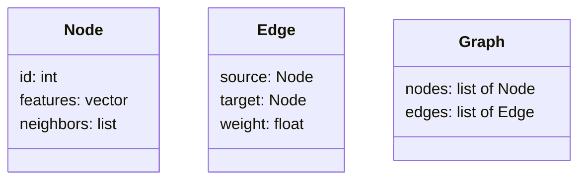
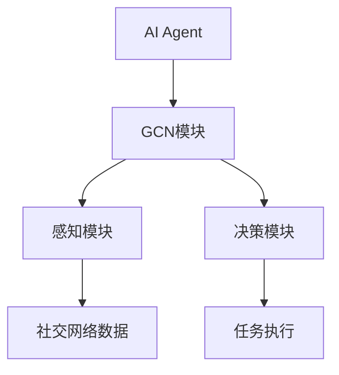

                 


# 基于图卷积网络的AI Agent社交网络分析

> **关键词**：图卷积网络（GCN）、AI Agent、社交网络分析、网络结构学习、深度学习  
> 
> **摘要**：  
> 随着社交网络的快速发展，如何高效地分析和理解社交网络的结构与行为成为了人工智能领域的重要挑战。本文基于图卷积网络（Graph Convolutional Networks, GCN），结合AI Agent的概念，探讨如何在社交网络中进行高效的节点表示学习、关系建模与任务推理。通过详细分析GCN的核心原理、AI Agent的实现机制以及它们在社交网络中的具体应用，本文旨在为读者提供一种全新的视角来理解社交网络分析的前沿技术。文章内容涵盖背景介绍、核心概念、算法原理、系统设计与项目实战，最后通过总结与展望，为未来的研究与实践提供方向性指导。

---

## 第1章: 背景介绍

### 1.1 问题背景

#### 1.1.1 社交网络分析的重要性
随着社交媒体的普及，社交网络已成为人们日常生活的重要组成部分。社交网络分析通过研究用户之间的关系、行为模式和信息传播，能够为个性化推荐、舆情分析、社群划分等任务提供有力支持。然而，社交网络具有复杂性、动态性和高维性等特点，传统的分析方法往往难以捕捉其深层结构。

#### 1.1.2 图卷积网络的引入动机
图卷积网络（GCN）作为一种基于图结构的深度学习方法，能够有效地处理图数据中的节点关系。通过将社交网络建模为图结构，GCN可以捕捉节点之间的语义关系，从而在社交网络分析中发挥重要作用。此外，GCN还具有良好的可扩展性和并行性，适合处理大规模图数据。

#### 1.1.3 AI Agent在社交网络中的作用
AI Agent（智能体）是一种能够感知环境、自主决策并执行任务的智能系统。在社交网络中，AI Agent可以通过学习用户行为和网络结构，实现自动化的信息处理、推荐服务和异常检测等任务。结合GCN的强大建模能力，AI Agent能够在复杂社交网络中实现更高效的分析与推理。

### 1.2 问题描述

#### 1.2.1 社交网络分析的核心问题
社交网络分析的核心问题包括：
1. **节点表示学习**：如何将复杂的网络结构转化为低维向量表示，以便后续分析。
2. **关系建模**：如何建模节点之间的关系，揭示网络中的潜在结构。
3. **任务推理**：如何基于网络结构和节点特征，完成特定任务（如分类、聚类等）。

#### 1.2.2 图卷积网络在社交网络分析中的应用场景
GCN在社交网络分析中的应用场景包括：
1. **用户行为预测**：通过GCN建模用户关系，预测用户的下一步行为。
2. **社群检测**：基于GCN提取的节点特征，进行社群划分。
3. **信息传播建模**：分析信息在社交网络中的传播路径和速度。

#### 1.2.3 AI Agent在社交网络中的任务定义
AI Agent在社交网络中的任务包括：
1. **实时数据处理**：实时分析用户行为和网络动态。
2. **自适应推荐**：根据用户特征和网络结构，动态调整推荐内容。
3. **异常检测**：识别网络中的异常行为，如虚假信息传播。

### 1.3 问题解决

#### 1.3.1 图卷积网络的核心优势
图卷积网络的核心优势包括：
1. **局部聚合能力**：GCN能够聚合每个节点及其邻居的信息，捕捉局部结构特征。
2. **全局建模能力**：通过多层传播，GCN能够建模全局网络结构。
3. **可扩展性**：GCN支持大规模图数据的分布式计算。

#### 1.3.2 AI Agent在社交网络分析中的具体实现
AI Agent的具体实现包括：
1. **感知模块**：通过GCN提取节点特征，感知网络结构和用户行为。
2. **决策模块**：基于感知信息，制定任务执行策略。
3. **执行模块**：通过API或交互界面，执行具体任务。

#### 1.3.3 图卷积网络与AI Agent的结合方式
GCN与AI Agent的结合方式包括：
1. **嵌入式结合**：将GCN嵌入AI Agent的感知模块中，实时提取网络特征。
2. **分层结合**：AI Agent通过GCN预处理网络数据，再进行任务推理。

### 1.4 边界与外延

#### 1.4.1 图卷积网络的适用范围
GCN适用于以下场景：
1. **节点关系建模**：当任务需要建模节点之间的关系时。
2. **图结构数据处理**：当数据具有明确的图结构时。
3. **局部与全局特征结合**：当任务需要同时考虑局部和全局特征时。

#### 1.4.2 AI Agent在社交网络分析中的局限性
AI Agent的局限性包括：
1. **计算资源消耗**：大规模社交网络分析需要大量计算资源。
2. **实时性限制**：部分任务可能需要实时处理，对系统响应速度提出更高要求。
3. **模型可解释性**：深度学习模型的黑箱特性可能影响决策的透明性。

#### 1.4.3 相关技术的对比与选择
相关技术包括：
1. **传统图算法**：如PageRank、社区检测算法，适用于简单任务。
2. **神经网络模型**：如GAT、GraphSAGE，适用于复杂任务。
3. **强化学习模型**：适用于需要决策优化的任务。

---

## 第2章: 核心概念与联系

### 2.1 图卷积网络的原理

#### 2.1.1 图卷积网络的基本概念
图卷积网络是一种基于图结构的深度学习模型。其核心思想是通过传播邻居节点的信息，逐步聚合全局特征。GCN的数学表达式为：
$$
Z = A X W^{(1)} W^{(2)} \cdots W^{(L)}
$$
其中，$A$是邻接矩阵，$X$是输入特征矩阵，$W^{(i)}$是第$i$层权重矩阵。

#### 2.1.2 图卷积网络的数学模型
GCN的传播规则如下：
$$
h^{(l+1)}_i = \sigma\left(\sum_{j \in N(i)} \frac{1}{d_i} A_{ij} h_j^{(l)} W^{(l)}\right)
$$
其中，$d_i$是节点$i$的度数，$N(i)$是节点$i$的邻居节点集合，$\sigma$是激活函数。

#### 2.1.3 图卷积网络的实现步骤
图卷积网络的实现步骤包括：
1. **图数据预处理**：构建邻接矩阵和节点特征矩阵。
2. **模型训练**：通过反向传播优化模型参数。
3. **节点表示提取**：通过前向传播提取节点表示。

#### 2.1.4 图卷积网络的变体
GCN的常见变体包括：
1. **GAT**：引入注意力机制，增强模型的灵活性。
2. **GraphSAGE**：通过归纳式学习，适用于动态图数据。
3. **GCN+**：通过残差连接和跳跃连接改进模型性能。

### 2.2 AI Agent的核心原理

#### 2.2.1 AI Agent的定义与分类
AI Agent是一种能够感知环境、自主决策并执行任务的智能系统。根据应用场景，AI Agent可以分为：
1. **反应式AI Agent**：基于当前感知做出反应。
2. **认知式AI Agent**：具备复杂推理和决策能力。

#### 2.2.2 AI Agent的核心算法
AI Agent的核心算法包括：
1. **强化学习**：通过奖励机制优化决策策略。
2. **监督学习**：基于标注数据进行任务学习。
3. **无监督学习**：通过聚类、降维等技术发现数据结构。

#### 2.2.3 AI Agent的实现步骤
AI Agent的实现步骤包括：
1. **环境感知**：通过传感器或API获取环境信息。
2. **状态分析**：分析当前状态，提取关键特征。
3. **决策制定**：基于状态分析制定行动策略。
4. **任务执行**：通过执行器执行决策策略。
5. **反馈学习**：根据反馈优化决策模型。

### 2.3 图卷积网络与AI Agent的关系

#### 2.3.1 图卷积网络作为感知模块
在AI Agent中，GCN可以作为感知模块，用于提取网络结构特征。例如，在社交网络中，GCN可以提取用户行为特征和社交关系特征，为决策模块提供输入。

#### 2.3.2 AI Agent作为执行模块
AI Agent可以通过GCN提取的网络特征，制定任务执行策略。例如，AI Agent可以基于用户行为特征，动态调整推荐内容或异常检测阈值。

#### 2.3.3 两者结合的优势
GCN与AI Agent的结合优势包括：
1. **高效特征提取**：GCN能够高效提取网络结构特征。
2. **智能决策能力**：AI Agent具备自主决策能力，能够适应复杂环境。
3. **端到端优化**：结合GCN和AI Agent，可以实现端到端的优化。

---

## 第3章: 算法原理讲解

### 3.1 图卷积网络的数学模型

#### 3.1.1 GCN的数学推导
GCN的数学推导如下：
$$
h^{(l+1)} = \text{ReLu}\left(\frac{1}{d_i} A X W^{(l)}\right)
$$
其中，$d_i$是节点$i$的度数，$A$是邻接矩阵，$X$是节点特征矩阵，$W^{(l)}$是第$l$层权重矩阵。

#### 3.1.2 GCN的前向传播
GCN的前向传播过程如下：
1. **输入特征提取**：输入节点特征矩阵$X$。
2. **邻接矩阵计算**：计算节点之间的邻接关系。
3. **特征传播**：通过邻接矩阵传播节点特征。
4. **非线性激活**：通过激活函数（如ReLU）进行非线性变换。

#### 3.1.3 GCN的反向传播
GCN的反向传播过程如下：
1. **损失计算**：计算预测值与真实值的损失。
2. **梯度计算**：通过链式法则计算各层权重的梯度。
3. **参数更新**：通过优化算法（如Adam）更新模型参数。

### 3.2 图卷积网络的实现

#### 3.2.1 GCN的Python实现代码
```python
import torch
from torch.nn import Module, Linear, ReLU

class GCN(Module):
    def __init__(self, in_features, out_features):
        super(GCN, self).__init__()
        self.linear = Linear(in_features, out_features)
        self.relu = ReLU()

    def forward(self, x, A):
        x = torch.bmm(A, x)
        x = x.mean(dim=1)  # 平均处理
        x = self.linear(x)
        x = self.relu(x)
        return x
```

#### 3.2.2 GCN的代码解读
1. **输入特征提取**：通过`x`参数输入节点特征矩阵。
2. **邻接矩阵计算**：通过`A`参数输入邻接矩阵。
3. **特征传播**：通过矩阵乘法传播特征。
4. **非线性激活**：通过ReLU激活函数进行非线性变换。

#### 3.2.3 GCN的数学公式
GCN的数学公式如下：
$$
h^{(l+1)} = \text{ReLu}\left(\frac{1}{d_i} A X W^{(l)}\right)
$$

---

## 第4章: 系统分析与架构设计

### 4.1 项目背景
本项目旨在通过GCN和AI Agent技术，实现社交网络中的用户行为分析和社群检测。通过本项目，我们可以更好地理解社交网络的结构和用户行为模式。

### 4.2 系统功能设计

#### 4.2.1 领域模型类图


#### 4.2.2 系统架构图


#### 4.2.3 接口设计
1. **输入接口**：接收社交网络数据和任务请求。
2. **输出接口**：输出分析结果和决策建议。

---

## 第5章: 项目实战

### 5.1 环境安装
1. **安装Python**：确保Python版本为3.6以上。
2. **安装PyTorch**：通过以下命令安装：
   ```bash
   pip install torch
   ```
3. **安装其他依赖**：根据需要安装其他依赖库。

### 5.2 核心代码实现

#### 5.2.1 数据预处理代码
```python
import torch
from torch.utils.data import Dataset, DataLoader

class SocialDataset(Dataset):
    def __init__(self, nodes, edges):
        self.nodes = nodes
        self.edges = edges

    def __len__(self):
        return len(self.nodes)

    def __getitem__(self, idx):
        node = self.nodes[idx]
        return node.features, node.label
```

#### 5.2.2 模型训练代码
```python
model = GCN(input_dim, output_dim)
optimizer = torch.optim.Adam(model.parameters(), lr=0.001)
criterion = torch.nn.CrossEntropyLoss()

for epoch in range(num_epochs):
    for batch in dataloader:
        inputs, labels = batch
        outputs = model(inputs, A)
        loss = criterion(outputs, labels)
        optimizer.zero_grad()
        loss.backward()
        optimizer.step()
```

#### 5.2.3 任务执行代码
```python
def execute_task(task_type, input_data):
    if task_type == 'user_prediction':
        # 用户行为预测
        pass
    elif task_type == 'community_detection':
        # 社群检测
        pass
    # 其他任务类型
```

### 5.3 代码解读与分析
1. **数据预处理**：将社交网络数据转换为模型可读的格式。
2. **模型训练**：通过反向传播优化模型参数。
3. **任务执行**：根据任务类型调用相应函数。

### 5.4 实际案例分析
假设我们有一个社交网络数据集，包含用户ID、用户特征和用户关系。我们可以通过GCN提取用户特征，并通过AI Agent进行用户行为预测和社群检测。

### 5.5 项目总结
通过本项目，我们可以看到GCN和AI Agent在社交网络分析中的巨大潜力。未来可以通过优化模型结构和引入更多任务类型，进一步提升系统性能。

---

## 第6章: 总结与展望

### 6.1 全文总结
本文基于图卷积网络（GCN）和AI Agent，探讨了社交网络分析的核心问题和解决方法。通过详细分析GCN的核心原理和AI Agent的实现机制，本文为社交网络分析提供了一种全新的视角。

### 6.2 核心优势
GCN与AI Agent的结合优势包括：
1. **高效特征提取**：GCN能够高效提取网络结构特征。
2. **智能决策能力**：AI Agent具备自主决策能力，能够适应复杂环境。
3. **端到端优化**：结合GCN和AI Agent，可以实现端到端的优化。

### 6.3 当前问题
当前GCN和AI Agent在社交网络分析中仍存在以下问题：
1. **计算资源消耗**：大规模社交网络分析需要大量计算资源。
2. **实时性限制**：部分任务需要实时处理，对系统响应速度提出更高要求。
3. **模型可解释性**：深度学习模型的黑箱特性可能影响决策的透明性。

### 6.4 未来展望
未来的研究方向包括：
1. **模型优化**：通过模型压缩和并行计算优化模型性能。
2. **多模态数据融合**：引入文本、图像等多种数据源，提升分析精度。
3. **强化学习应用**：通过强化学习优化AI Agent的决策策略。

### 6.5 最佳实践Tips
1. **数据预处理**：确保数据质量和完整性。
2. **模型调优**：通过参数调节和模型优化提升性能。
3. **系统设计**：注重系统可扩展性和可维护性。

### 6.6 小结
通过本文的探讨，我们可以看到GCN和AI Agent在社交网络分析中的巨大潜力。未来，随着技术的不断发展，社交网络分析将变得更加高效和智能。

---

## 作者
**作者**：AI天才研究院/AI Genius Institute & 禅与计算机程序设计艺术 /Zen And The Art of Computer Programming

