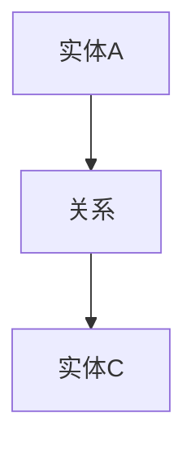

                 


# 基于图谱的AI Agent知识推理引擎

> **关键词**：AI Agent，知识推理，知识图谱，图神经网络，符号逻辑，概率推理

> **摘要**：  
> 本文详细探讨了基于图谱的AI Agent知识推理引擎的设计与实现。首先，我们从问题背景出发，分析了AI Agent在知识推理中的挑战与需求。接着，我们介绍了基于图谱的知识表示与推理的核心概念，包括图谱构建、知识表示与推理机制。然后，我们深入讲解了图神经网络算法、知识图谱构建算法以及符号逻辑和概率推理算法的数学模型与公式。随后，我们通过系统架构设计、接口设计与交互流程图展示了如何将这些算法与概念应用于实际系统中。最后，我们通过一个具体的项目实战案例，详细阐述了环境安装、核心代码实现、案例分析与结果展示，并总结了最佳实践与未来研究方向。

---

# 第一部分：背景介绍与核心概念

## 第1章：问题背景与核心概念

### 1.1 问题背景

#### 1.1.1 当前AI Agent的知识推理挑战
AI Agent（人工智能代理）是能够感知环境、执行任务并做出决策的智能实体。然而，AI Agent的知识推理能力受限于传统知识表示方法的不足，例如符号逻辑推理的局限性和基于规则的方法的脆性。知识图谱作为一种强大的知识表示形式，为AI Agent的知识推理提供了新的可能性。

#### 1.1.2 图谱技术在知识推理中的优势
图谱技术通过构建实体间的关系网络，能够更好地捕捉知识的语义关联。基于图谱的知识推理可以结合符号逻辑和深度学习的优势，实现更强大的推理能力。

#### 1.1.3 基于图谱的AI Agent研究现状
当前，基于图谱的AI Agent研究主要集中在知识图谱构建、图神经网络算法优化以及跨领域的知识推理应用上。然而，如何高效地构建大规模图谱、如何设计高效的推理算法仍然是研究的难点。

### 1.2 核心概念与问题描述

#### 1.2.1 AI Agent的定义与分类
AI Agent是一种能够感知环境、执行任务并做出决策的智能实体。根据智能体的智能水平，可以将AI Agent分为反应式智能体、基于模型的智能体和混合智能体。

#### 1.2.2 知识图谱的构建与表示
知识图谱是一种将实体及其关系以图结构表示的知识表示方法。构建知识图谱需要经历知识抽取、实体识别、关系抽取等步骤。

#### 1.2.3 基于图谱的知识推理问题描述
基于图谱的知识推理问题是通过图结构数据推导新的知识的过程。具体来说，给定图中的部分信息，推理出图中缺失的节点或边。

#### 1.2.4 边界与外延
基于图谱的AI Agent知识推理引擎的边界在于其知识图谱的构建范围和推理能力的限制。其外延则可以扩展到自然语言处理、计算机视觉等领域。

#### 1.2.5 核心要素组成
基于图谱的AI Agent知识推理引擎的核心要素包括知识图谱、推理算法、推理引擎以及推理结果的应用。

## 第2章：核心概念与联系

### 2.1 图谱、知识表示与推理机制

#### 2.1.1 图谱的基本概念与属性特征对比
图谱是一种由节点（实体）和边（关系）组成的结构。图谱的属性特征包括节点度数、边权重、图的稀疏性等。

#### 2.1.2 知识表示的核心原理与方法
知识表示的核心原理是将知识转化为可计算的形式。主要方法包括符号逻辑表示、向量表示和图结构表示。

#### 2.1.3 推理机制的分类与特点
推理机制可以分为符号逻辑推理、概率推理和基于深度学习的推理。符号逻辑推理基于严格的逻辑规则，概率推理考虑不确定性，深度学习推理则依赖于大量数据。

### 2.2 ER实体关系图架构



---

# 第二部分：算法原理讲解

## 第3章：图神经网络算法

### 3.1 图神经网络的基本原理

#### 3.1.1 图的邻接矩阵表示
图的邻接矩阵是一个二维矩阵，表示节点之间是否存在连接：
$$A = [a_{ij}] \text{，其中} a_{ij} = 1 \text{如果节点} i \text{和} j \text{相连，否则} 0$$

#### 3.1.2 图嵌入与节点表示方法
图嵌入是一种将图结构转化为低维向量表示的方法。常用的节点表示方法包括基于邻居的聚合和基于图传播的模型。

### 3.2 图谱构建算法

#### 3.2.1 知识抽取与实体识别
知识抽取是从文本中提取实体和关系的过程。实体识别是通过模式匹配或深度学习模型从文本中识别出实体。

#### 3.2.2 关系抽取与属性建模
关系抽取是从文本中提取实体之间的关系。属性建模是将实体的属性信息嵌入到图谱中。

#### 3.2.3 图谱构建的优化方法
图谱构建的优化方法包括减少冗余边、优化节点度分布等。

### 3.3 推理算法实现

#### 3.3.1 基于符号逻辑的推理
符号逻辑推理基于严格的逻辑规则，例如：
$$\text{如果} P \rightarrow Q \text{，且} P \text{为真，则} Q \text{为真}$$

#### 3.3.2 基于概率的推理
概率推理考虑不确定性，例如：
$$P(Q|E) = \frac{P(E|Q)P(Q)}{P(E)}$$

#### 3.3.3 基于深度学习的推理
深度学习推理依赖于大量数据，通过训练模型来实现推理。

---

## 第4章：数学模型与公式

### 4.1 图谱表示的数学模型

#### 4.1.1 图的邻接矩阵表示
$$A = [a_{ij}] \text{，其中} a_{ij} = 1 \text{如果节点} i \text{和} j \text{相连，否则} 0$$

#### 4.1.2 图的边权重表示
$$w_{ij} = \sum_{k} a_{ik}a_{kj}$$

### 4.2 知识推理的数学公式

#### 4.2.1 基于符号逻辑的推理公式
$$\text{如果} P \rightarrow Q \text{，且} P \text{为真，则} Q \text{为真}$$

#### 4.2.2 基于概率的推理公式
$$P(Q|E) = \frac{P(E|Q)P(Q)}{P(E)}$$

---

## 第5章：系统分析与架构设计

### 5.1 问题场景介绍

#### 5.1.1 AI Agent的知识推理需求
AI Agent需要通过图谱进行知识推理，以支持智能决策和任务执行。

#### 5.1.2 基于图谱的知识推理系统目标
构建一个高效的基于图谱的知识推理引擎，支持AI Agent的智能决策。

### 5.2 系统功能设计

#### 5.2.1 系统功能模块
系统功能模块包括知识图谱构建模块、推理算法模块、推理结果应用模块。

#### 5.2.2 系统架构设计
系统架构设计包括数据层、算法层和应用层。

#### 5.2.3 接口设计与交互流程
接口设计包括知识图谱构建接口、推理算法接口和结果应用接口。

---

## 第6章：项目实战

### 6.1 环境安装

#### 6.1.1 环境配置
安装Python、TensorFlow、PyTorch等工具。

### 6.2 核心代码实现

#### 6.2.1 知识图谱构建代码
```python
def build_knowledge_graph(data):
    graph = {}
    for entity in data:
        graph[entity] = []
    return graph
```

#### 6.2.2 推理算法实现代码
```python
def inference_algorithm(graph, rules):
    result = []
    for rule in rules:
        if rule['premise'] in graph:
            result.append(rule['conclusion'])
    return result
```

### 6.3 案例分析与结果展示

#### 6.3.1 案例分析
分析一个具体案例，展示知识图谱构建和推理算法的应用。

#### 6.3.2 结果展示
展示推理结果，并分析结果的准确性。

---

## 第7章：总结与展望

### 7.1 总结

#### 7.1.1 核心内容回顾
回顾本文的核心内容，包括图谱构建、推理算法和系统设计。

#### 7.1.2 最佳实践
总结基于图谱的AI Agent知识推理引擎的最佳实践。

### 7.2 未来研究方向

#### 7.2.1 知识图谱构建的优化
探索更高效的图谱构建方法。

#### 7.2.2 推理算法的改进
研究更高效的推理算法，例如图神经网络的优化。

---

**作者：AI天才研究院 & 禅与计算机程序设计艺术**

