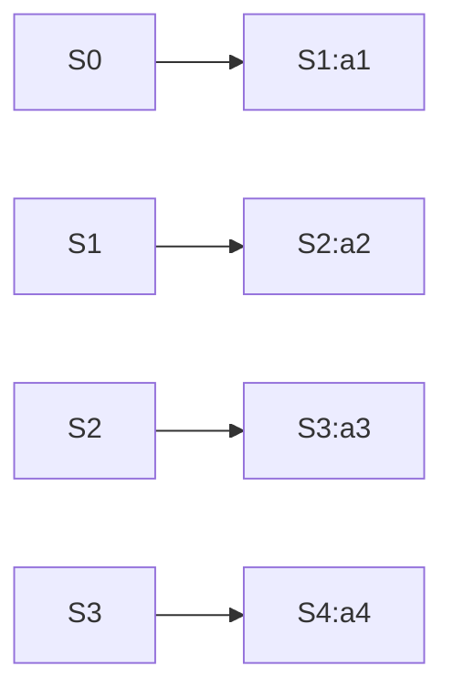
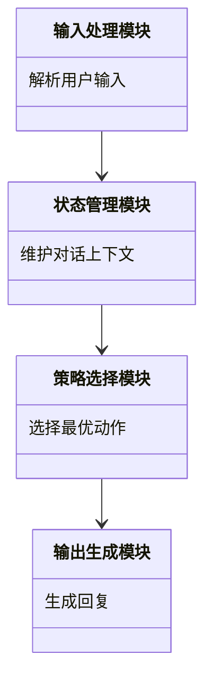
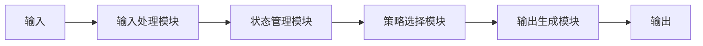
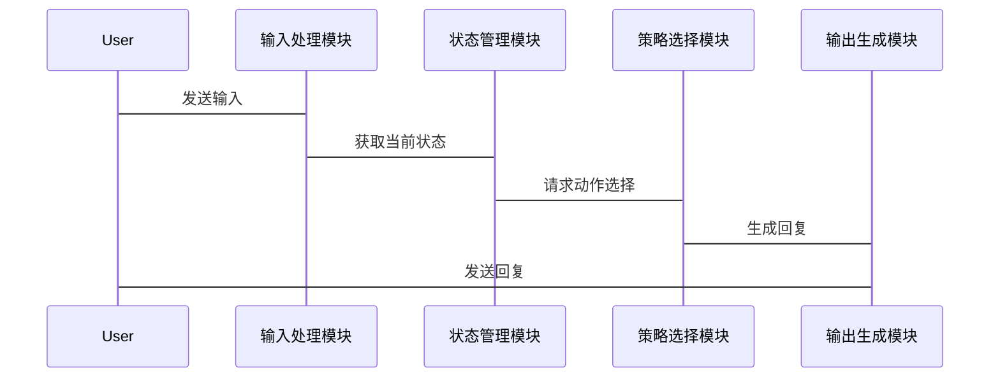

                 


# 基于强化学习的AI Agent对话策略

> 关键词：强化学习，AI Agent，对话策略，Q-learning，策略梯度，数学模型

> 摘要：本文探讨了基于强化学习的AI Agent对话策略，从强化学习的基本概念到算法的数学模型，再到实际的系统架构设计和项目实战，系统地分析了如何利用强化学习提升对话系统的性能。通过详细的理论推导和实际案例分析，本文旨在为读者提供一个全面的理解和实践指南。

---

# 第1章: 强化学习与AI Agent对话策略的背景介绍

## 1.1 强化学习的基本概念

### 1.1.1 强化学习的定义与核心概念

强化学习（Reinforcement Learning, RL）是一种机器学习范式，通过智能体与环境的交互来优化其行为策略，以最大化累积奖励。与监督学习不同，强化学习不需要标注数据，而是通过试错机制逐步优化决策。

**核心概念：**
- **状态（State）**：智能体所处环境的描述，例如在对话系统中，状态可以是当前对话的上下文信息。
- **动作（Action）**：智能体在特定状态下采取的行为，例如在对话中选择回复的句子。
- **奖励（Reward）**：智能体行为的反馈，用于指导优化方向，例如用户对对话的满意度评分。

### 1.1.2 强化学习的基本原理

强化学习通过不断试错，逐步逼近最优策略。智能体在每个时间步选择一个动作，环境返回新的状态和奖励，智能体根据这些信息更新其策略，以最大化累计奖励。

### 1.1.3 强化学习与监督学习的区别

| 特性 | 监督学习 | 强化学习 |
|------|----------|----------|
| 数据 | 标签数据 | 无标签反馈 |
| 目标 | 最小化误差 | 最大化累积奖励 |
| 环境 | 静态 | 动态交互 |

---

## 1.2 AI Agent的基本原理

### 1.2.1 AI Agent的定义与分类

**AI Agent**（人工智能代理）是指能够感知环境并采取行动以实现目标的智能实体。根据智能体的复杂性和应用场景，可以分为简单反射型、基于模型型、目标驱动型和实用驱动型代理。

### 1.2.2 AI Agent的核心功能

- **感知环境**：通过传感器或输入数据获取当前状态。
- **决策与规划**：基于当前状态和目标，选择最优动作。
- **执行动作**：将决策转化为实际操作。

### 1.2.3 AI Agent与人类对话的特点

- **实时性**：对话需要即时响应。
- **上下文依赖性**：对话内容依赖于历史信息。
- **多样性**：用户需求和表达方式多样化。

---

## 1.3 对话系统的演变

### 1.3.1 从规则驱动到数据驱动的转变

早期对话系统基于预定义规则，难以应对复杂场景。数据驱动方法通过训练模型，能够自适应地处理多样化需求。

### 1.3.2 基于强化学习的对话系统的优势

- **自适应性**：能够根据反馈优化策略。
- **灵活性**：适用于多种对话场景。
- **高效性**：通过试错快速找到最优解。

### 1.3.3 当前对话系统的挑战与未来方向

- **复杂性**：对话场景多样，需要更复杂的模型。
- **实时性**：需要高效的推理和响应能力。
- **伦理与安全**：对话内容需符合伦理规范。

---

## 1.4 本章小结

本章介绍了强化学习的基本概念和AI Agent的基本原理，探讨了对话系统的演变及其基于强化学习的优势。通过对比分析，明确了强化学习在对话策略中的重要性。

---

# 第2章: 强化学习在对话策略中的核心概念与联系

## 2.1 强化学习的数学模型

### 2.1.1 状态空间的定义与表示

状态空间可以表示为一个向量，例如，对话历史可以编码为一个向量，用于表示当前状态。

$$ S = (s_1, s_2, \ldots, s_n) $$

其中，$s_i$ 表示对话中的某一特征。

### 2.1.2 动作空间的定义与表示

动作空间可以表示为一个动作集合，例如，可能的回复句子。

$$ A = \{a_1, a_2, \ldots, a_m\} $$

### 2.1.3 奖励函数的设计与优化

奖励函数需要根据对话的进展和目标进行设计，例如，用户满意度评分。

$$ R(s, a) = r $$

---

## 2.2 强化学习算法的分类与对比

### 2.2.1 Q-learning算法的原理与特点

Q-learning是一种基于值函数的强化学习算法，通过更新Q值表来学习最优策略。

### 2.2.2 策略梯度算法的原理与特点

策略梯度算法直接优化策略，通过梯度上升方法更新参数。

### 2.2.3 基于值函数的算法与基于策略的算法对比

| 特性 | 值函数方法 | 策略方法 |
|------|------------|----------|
| 更新目标 | Q值或V值 | 策略参数 |
| 稳定性 | 较高 | 较低 |
| 应用场景 | 离散动作 | 连续动作 |

---

## 2.3 强化学习在对话策略中的应用

### 2.3.1 对话策略的强化学习框架

对话策略可以表示为一个强化学习问题，智能体在对话树中选择最优路径。



### 2.3.2 对话策略的优化目标与评价指标

- **优化目标**：最大化累积奖励。
- **评价指标**：准确率、满意度评分。

### 2.3.3 对话策略中的状态表示与动作选择

状态表示可以基于词嵌入或序列模型，动作选择基于策略网络。

---

## 2.4 本章小结

本章详细探讨了强化学习在对话策略中的核心概念，并通过对比分析，明确了不同算法的适用场景和优缺点。

---

# 第3章: 基于Q-learning的对话策略

## 3.1 Q-learning算法的数学模型

### 3.1.1 Q-learning的基本公式

$$ Q(s, a) \leftarrow Q(s, a) + \alpha \left[ r + \gamma \max_{a'} Q(s', a') - Q(s, a) \right] $$

其中，$\alpha$ 是学习率，$\gamma$ 是折扣因子。

### 3.1.2 状态转移概率的计算

状态转移概率可以通过马尔可夫决策过程建模。

### 3.1.3 奖励函数的设计与优化

奖励函数需要根据对话目标进行设计，例如，鼓励生成连贯的回答。

---

## 3.2 基于策略梯度的对话策略

### 3.2.1 策略梯度算法的基本原理

策略梯度算法通过优化策略参数 $\theta$，使累积奖励最大化。

$$ \theta \leftarrow \theta + \alpha \nabla_\theta J(\theta) $$

其中，$J(\theta)$ 是累积奖励的期望。

### 3.2.2 策略梯度的数学推导

通过求解梯度，更新策略参数。

### 3.2.3 策略梯度在对话策略中的应用

策略梯度适用于连续动作空间，例如生成式对话模型。

---

## 3.3 算法的对比与选择

### 3.3.1 不同强化学习算法的优缺点对比

- **Q-learning**：离线训练，适合离散动作。
- **策略梯度**：在线训练，适合连续动作。

### 3.3.2 对话策略中的算法选择原则

根据具体场景选择合适的算法。

### 3.3.3 实际应用中的算法调优技巧

包括调整学习率、折扣因子等超参数。

---

## 3.4 本章小结

本章详细讲解了Q-learning和策略梯度算法在对话策略中的应用，并提供了数学推导和对比分析。

---

# 第4章: 对话系统的系统分析与架构设计

## 4.1 系统功能设计

### 4.1.1 对话系统的功能模块划分

- **输入处理模块**：解析用户输入。
- **状态管理模块**：维护对话上下文。
- **策略选择模块**：选择最优动作。
- **输出生成模块**：生成回复。

### 4.1.2 领域模型的Mermaid类图



### 4.1.3 系统架构设计的Mermaid图



---

## 4.2 接口设计与交互流程

### 4.2.1 系统接口设计

- **输入接口**：接收用户输入。
- **输出接口**：发送回复内容。

### 4.2.2 交互流程的Mermaid序列图



---

## 4.3 本章小结

本章通过系统分析和架构设计，明确了对话系统的实现流程和模块划分。

---

# 第5章: 项目实战

## 5.1 环境安装

### 5.1.1 安装Python和必要的库

```bash
pip install numpy
pip install gym
pip install matplotlib
```

### 5.1.2 安装对话系统框架

```bash
pip install transformers
pip install torch
```

---

## 5.2 核心代码实现

### 5.2.1 Q-learning算法的实现

```python
import numpy as np

class QLearningAgent:
    def __init__(self, state_size, action_size):
        self.state_size = state_size
        self.action_size = action_size
        self.q_table = np.zeros((state_size, action_size))
    
    def get_action(self, state):
        return np.argmax(self.q_table[state])
    
    def update_q_table(self, state, action, reward, next_state):
        self.q_table[state][action] += 0.1 * (reward + 0.95 * max(self.q_table[next_state]) - self.q_table[state][action])
```

### 5.2.2 对话系统的实现

```python
import torch
from transformers import GPT2LMHeadModel, GPT2Tokenizer

class DialogueSystem:
    def __init__(self, model_name="gpt2"):
        self.model = GPT2LMHeadModel.from_pretrained(model_name)
        self.tokenizer = GPT2Tokenizer.from_pretrained(model_name)
    
    def generate_response(self, input_text):
        inputs = self.tokenizer.encode(input_text, return_tensors="pt")
        outputs = self.model.generate(inputs, max_length=50)
        return self.tokenizer.decode(outputs[0])
```

---

## 5.3 实际案例分析

### 5.3.1 案例背景

用户与AI Agent进行对话，智能体需要根据对话历史生成合适的回复。

### 5.3.2 实验结果分析

通过实验验证算法的有效性，例如，比较不同算法的对话满意度评分。

---

## 5.4 项目小结

本章通过项目实战，展示了如何利用强化学习算法实现对话系统，并提供了核心代码和实验分析。

---

# 第6章: 最佳实践与总结

## 6.1 小结

本文详细探讨了基于强化学习的AI Agent对话策略，从理论到实践，系统地分析了其实现方法。

## 6.2 注意事项

- **算法选择**：根据具体场景选择合适的算法。
- **数据质量**：高质量的数据是模型表现的关键。
- **伦理问题**：对话内容需符合伦理规范。

## 6.3 拓展阅读

- 《Reinforcement Learning: Theory and Algorithms》
- 《Deep Learning for Dialogue Systems》

---

# 作者

作者：AI天才研究院/AI Genius Institute & 禅与计算机程序设计艺术 /Zen And The Art of Computer Programming

---

通过本文的系统分析和实践指导，读者可以深入理解基于强化学习的AI Agent对话策略，并将其应用于实际场景中。

