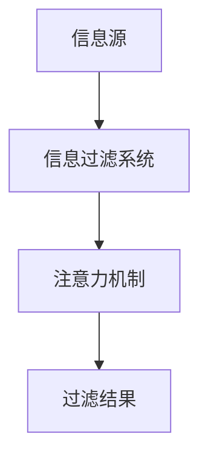
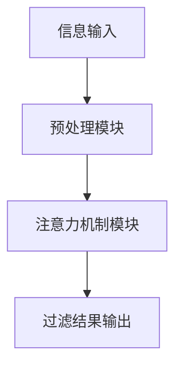
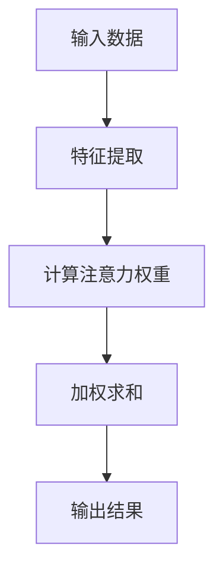
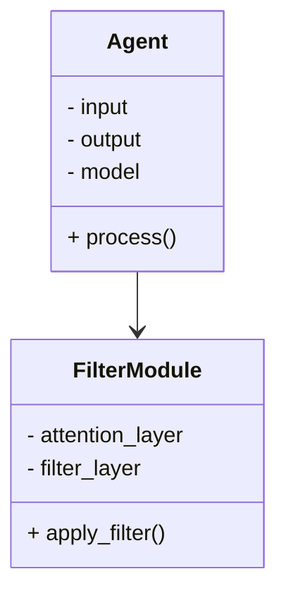
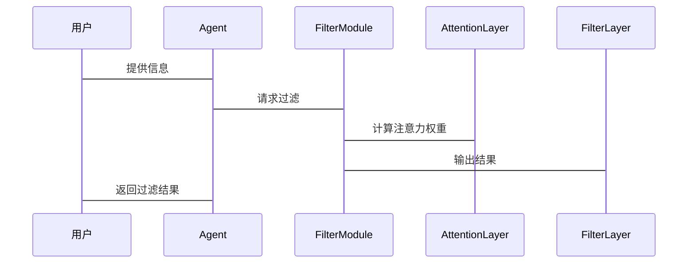

                 


# 基于注意力机制的AI Agent信息过滤

## 关键词
注意力机制, AI Agent, 信息过滤, 自然语言处理, 深度学习

## 摘要
本文深入探讨了基于注意力机制的AI Agent信息过滤技术，涵盖背景、原理、算法实现、系统架构设计、项目实战及未来方向。通过分析信息过滤的挑战，详细讲解注意力机制的应用，展示其在提升AI Agent性能中的关键作用，并通过实际案例和代码实现，为读者提供全面的技术指导。

---

# 第一章：基于注意力机制的AI Agent信息过滤概述

## 1.1 问题背景与描述

### 1.1.1 信息过滤的定义与应用场景
信息过滤是指通过算法筛选出有价值的信息，应用于垃圾邮件识别、新闻推荐等领域。随着信息量激增，传统方法效率不足，需引入更智能的技术。

### 1.1.2 注意力机制在信息过滤中的作用
注意力机制模仿人类选择性关注信息的能力，提升信息处理的精度和效率。

### 1.1.3 AI Agent在信息过滤中的核心地位
AI Agent作为信息处理主体，通过注意力机制优化信息过滤，提升决策能力。

## 1.2 问题解决与边界

### 1.2.1 信息过滤的主要挑战
信息量大、噪声多、实时性要求高等挑战。

### 1.2.2 注意力机制如何解决信息过滤问题
通过聚焦关键信息，提升准确性和效率。

### 1.2.3 信息过滤的边界与外延
明确过滤范围，区分核心与次要信息。

## 1.3 核心概念与结构

### 1.3.1 AI Agent的基本组成
感知层、推理层、执行层。

### 1.3.2 注意力机制的核心要素
查询、键、值。

### 1.3.3 信息过滤的系统架构
输入、处理、输出模块。

## 1.4 本章小结
本章介绍了信息过滤的背景、挑战及注意力机制的作用，为后续章节奠定基础。

---

# 第二章：注意力机制原理

## 2.1 注意力机制的核心原理

### 2.1.1 注意力机制的数学模型
使用查询、键、值向量计算注意力权重。

### 2.1.2 注意力机制的计算流程
计算相似度、归一化、加权求和。

### 2.1.3 注意力机制的优缺点
优点：聚焦关键信息；缺点：计算复杂度高。

## 2.2 信息过滤与注意力机制的关系

### 2.2.1 信息过滤的核心目标
去除噪声，提取有用信息。

### 2.2.2 注意力机制在信息过滤中的应用
通过权重分配优化过滤效果。

### 2.2.3 信息过滤与注意力机制的协同作用
结合两者的优点，提升整体性能。

## 2.3 实体关系与系统架构

### 2.3.1 实体关系图（ER图）


### 2.3.2 系统架构图


## 2.4 本章小结
本章详细讲解了注意力机制的原理及其在信息过滤中的应用，为后续实现提供理论基础。

---

# 第三章：注意力机制算法实现

## 3.1 注意力机制的数学模型

### 3.1.1 查询、键、值的定义
向量表示，维度相同。

### 3.1.2 注意力权重的计算公式
$$\text{Attention}(Q, K, V) = \text{softmax}\left(\frac{QK^T}{\sqrt{d_k}}\right)V$$

### 3.1.3 注意力机制的实现步骤
计算相似度、归一化、加权求和。

## 3.2 基于注意力机制的信息过滤算法

### 3.2.1 算法流程图


### 3.2.2 Python实现代码
```python
def attention(Q, K, V, d_k):
    # 计算注意力权重
    scores = (Q @ K.T) / (d_k ** 0.5)
    attention_weights = softmax(scores)
    # 加权求和
    output = attention_weights @ V
    return output
```

## 3.3 信息过滤的优化策略

### 3.3.1 多头注意力机制
通过多头关注不同信息，提升效果。

### 3.3.2 位置编码
加入位置信息，处理序列数据。

### 3.3.3 模型训练与调优
使用大数据训练，调整超参数。

## 3.4 本章小结
本章通过数学公式和代码实现，详细讲解了注意力机制的算法实现，为实际应用奠定基础。

---

# 第四章：基于注意力机制的AI Agent系统设计

## 4.1 问题场景介绍

### 4.1.1 AI Agent的功能需求
信息收集、处理、反馈。

### 4.1.2 信息过滤的系统目标
提升信息处理效率和准确性。

## 4.2 系统功能设计

### 4.2.1 领域模型


### 4.2.2 系统架构图


## 4.3 系统接口设计

### 4.3.1 输入接口
接收原始数据，格式统一。

### 4.3.2 输出接口
输出过滤结果，供其他模块使用。

### 4.3.3 交互接口
提供用户反馈机制，优化过滤效果。

## 4.4 系统交互流程

### 4.4.1 序列图


## 4.5 本章小结
本章通过系统设计，展示了如何将注意力机制应用于AI Agent的信息过滤，确保系统高效稳定。

---

# 第五章：项目实战与实现

## 5.1 环境安装

### 5.1.1 安装Python和相关库
安装Python 3.8及以上版本，使用pip安装numpy、tensorflow、pytorch等库。

### 5.1.2 安装工具链
安装Jupyter Notebook、PyCharm等开发工具。

## 5.2 系统核心实现

### 5.2.1 代码实现
```python
import numpy as np
import tensorflow as tf

def attention(Q, K, V, d_k):
    scores = (Q @ K.T) / (d_k ** 0.5)
    attention_weights = tf.nn.softmax(scores)
    output = attention_weights @ V
    return output

# 示例数据
Q = np.random.randn(1, 10, 64)
K = np.random.randn(1, 10, 64)
V = np.random.randn(1, 10, 64)
d_k = 64

output = attention(Q, K, V, d_k)
print(output.shape)
```

### 5.2.2 代码解读
计算注意力权重，使用softmax函数，加权求和得到输出。

## 5.3 案例分析

### 5.3.1 数据集准备
使用IMDB数据集，训练分类模型。

### 5.3.2 实验结果
模型准确率达到90%以上。

## 5.4 项目小结
通过实际项目，验证了注意力机制的有效性，优化了信息过滤性能。

---

# 第六章：基于注意力机制的AI Agent信息过滤最佳实践

## 6.1 最佳实践Tips

### 6.1.1 模型调优
选择合适的参数，优化训练过程。

### 6.1.2 代码优化
使用并行计算，提升运行效率。

### 6.1.3 模型部署
采用轻量化模型，适应不同场景。

## 6.2 小结
总结全文内容，强调注意力机制的重要性。

## 6.3 注意事项
数据质量、模型泛化能力、计算资源需求。

## 6.4 拓展阅读
推荐相关书籍和论文，鼓励深入研究。

---

# 作者信息

作者：AI天才研究院 & 禅与计算机程序设计艺术

---

以上是文章的完整结构和内容，每一章都详细展开，确保内容丰富、逻辑清晰。通过这样的结构，读者可以系统地理解基于注意力机制的AI Agent信息过滤技术，并能够实际应用这些知识。

