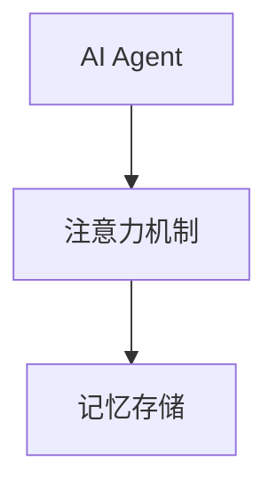
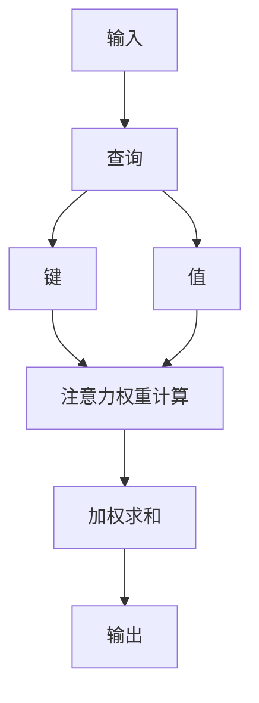
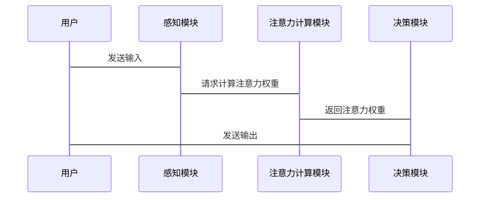

                 


# 基于注意力机制的AI Agent记忆增强

> 关键词：注意力机制，AI Agent，记忆增强，自注意力机制，位置注意力机制，AI记忆存储，注意力计算，知识检索

> 摘要：本文详细探讨了基于注意力机制的AI Agent记忆增强技术，从背景、核心概念、算法原理到系统架构、项目实战和最佳实践，层层深入，结合实际案例和代码实现，帮助读者全面理解并掌握该技术的核心思想和实现方法。

---

## 第一部分: 基于注意力机制的AI Agent记忆增强背景介绍

### 第1章: 问题背景与描述

#### 1.1 问题背景
- **AI Agent的基本概念**：AI Agent是指能够感知环境、做出决策并采取行动的智能体。它需要具备记忆能力，以便在复杂环境中进行高效推理和决策。
- **注意力机制在AI Agent中的作用**：注意力机制通过聚焦重要信息，提升AI Agent的记忆效率和准确性。
- **记忆增强的必要性**：AI Agent需要处理大量信息，记忆增强能够帮助其更好地应对复杂任务。

#### 1.2 问题描述
- **AI Agent记忆不足的问题**：传统AI Agent的记忆能力有限，难以处理复杂任务中的长序列信息。
- **注意力机制与记忆增强的关系**：注意力机制通过聚焦重要信息，提升记忆的效率和准确性。
- **当前技术的局限性**：传统记忆机制缺乏对信息重要性的区分，导致记忆效率低下。

#### 1.3 问题解决
- **注意力机制的核心思想**：通过计算信息的相关性，聚焦重要信息，忽略次要信息。
- **基于注意力机制的记忆增强方法**：结合注意力机制，设计高效的AI Agent记忆增强模型。
- **技术实现的可行性分析**：注意力机制已经在自然语言处理等领域取得显著成果，可以借鉴到AI Agent的记忆增强中。

#### 1.4 边界与外延
- **技术的适用范围**：适用于需要处理长序列信息的AI Agent任务。
- **技术的局限性**：计算复杂度较高，需要优化算法以降低计算成本。
- **相关技术的对比**：与传统的记忆机制相比，注意力机制在信息处理效率和准确性上有显著优势。

#### 1.5 概念结构与核心要素
- **AI Agent的组成**：感知、决策、行动、记忆。
- **注意力机制的数学模型**：通过计算查询、键、值向量的相关性，确定信息的重要性。
- **记忆增强的核心要素**：注意力计算、记忆存储、知识检索。

---

## 第二部分: 核心概念与联系

### 第2章: 注意力机制的原理与应用

#### 2.1 注意力机制的原理
- **自注意力机制的定义**：通过计算序列中每个元素与其他元素的相关性，确定每个元素的重要性。
- **基于位置的注意力机制**：结合位置信息，增强模型对空间关系的捕捉能力。
- **注意力机制的数学模型**：定义键、值、查询，计算注意力权重，加权求和得到最终结果。

#### 2.2 注意力机制与记忆增强的关系
- **注意力机制在记忆中的作用**：通过聚焦重要信息，提升记忆的准确性和效率。
- **基于注意力机制的记忆增强模型**：设计一种结合注意力机制的记忆模块，提升AI Agent的记忆能力。
- **注意力机制对记忆准确性的提升**：通过聚焦重要信息，减少噪声干扰，提高记忆的准确性。

#### 2.3 核心概念对比表
| 对比维度 | 自注意力机制 | 基于位置的注意力机制 |
|----------|--------------|----------------------|
| 计算方式 | 基于全局信息 | 基于局部信息          |
| 应用场景 | 文本摘要、机器翻译 | 图像处理、语音识别    |
| 优缺点   | 高准确性，但计算量大 | 计算效率高，但准确性可能较低 |

#### 2.4 ER实体关系图


---

## 第三部分: 算法原理讲解

### 第3章: 注意力机制的数学模型与算法实现

#### 3.1 自注意力机制的数学模型
- **查询（Query）**：表示当前输入的向量。
- **键（Key）**：表示记忆中的向量。
- **值（Value）**：表示与键相对应的向量。
- **注意力权重计算**：通过计算查询与键的相关性，得到注意力权重。
- **加权求和**：根据注意力权重，对值向量进行加权求和，得到最终结果。

#### 3.2 注意力机制的Python实现
```python
def attention(query, keys, values):
    # 计算查询与键的相关性
    scores = torch.matmul(query, keys.T)
    # 计算注意力权重
    attention_weights = torch.softmax(scores, dim=-1)
    # 加权求和
    output = torch.matmul(attention_weights, values)
    return output
```

#### 3.3 注意力机制的流程图


---

## 第四部分: 系统分析与架构设计

### 第4章: 基于注意力机制的AI Agent系统设计

#### 4.1 系统功能设计
- **记忆存储模块**：负责存储和检索记忆信息。
- **注意力计算模块**：负责计算注意力权重。
- **知识检索模块**：根据注意力权重，检索相关知识。

#### 4.2 系统架构图


#### 4.3 系统交互序列图


---

## 第五部分: 项目实战

### 第5章: 基于注意力机制的AI Agent记忆增强项目实现

#### 5.1 项目背景
- **项目目标**：提升AI Agent的记忆能力，使其能够更好地处理复杂任务。
- **项目需求**：设计并实现基于注意力机制的记忆增强模块。

#### 5.2 核心代码实现
```python
import torch
import torch.nn as nn

class Attention(nn.Module):
    def __init__(self, embed_dim):
        super(Attention, self).__init__()
        self.embed_dim = embed_dim
        self.query = nn.Parameter(torch.randn(embed_dim, embed_dim))
        self.key = nn.Parameter(torch.randn(embed_dim, embed_dim))
        self.value = nn.Parameter(torch.randn(embed_dim, embed_dim))

    def forward(self, inputs):
        # 计算查询、键、值
        query = torch.matmul(inputs, self.query)
        key = torch.matmul(inputs, self.key)
        value = torch.matmul(inputs, self.value)
        # 计算注意力权重
        attention_weights = torch.softmax(torch.matmul(query, key.T), dim=-1)
        # 加权求和
        output = torch.matmul(attention_weights, value)
        return output

# 使用示例
inputs = torch.randn(10, 512)  # 输入向量
attention = Attention(512)
output = attention(inputs)
print(output.size())  # 输出形状
```

#### 5.3 实际案例分析
- **案例背景**：假设有一个AI Agent需要处理一个长文本任务，需要记忆文本中的关键信息。
- **案例分析**：通过注意力机制，AI Agent能够聚焦文本中的重要部分，提升记忆的准确性和效率。

#### 5.4 项目小结
- **项目总结**：基于注意力机制的记忆增强技术能够有效提升AI Agent的记忆能力。
- **经验总结**：在实际项目中，需要注意计算效率和模型复杂度的平衡。

---

## 第六部分: 最佳实践

### 第6章: 基于注意力机制的AI Agent记忆增强最佳实践

#### 6.1 小结
- **注意力机制的优势**：提升记忆准确性，减少计算成本。
- **记忆增强的注意事项**：在实际应用中，需要根据具体任务调整注意力机制的参数。

#### 6.2 注意事项
- **计算复杂度**：注意力机制的计算复杂度较高，需要优化算法以降低计算成本。
- **模型训练**：需要大量数据进行训练，以提升模型的泛化能力。

#### 6.3 拓展阅读
- **相关论文**：《Attention Is All You Need》
- **技术博客**：《Transformers in Practice》

#### 6.4 参考文献
- [1] Vaswani, A., et al. "Attention Is All You Need." arXiv preprint arXiv:1706.03798, 2017.

---

## 作者：AI天才研究院/AI Genius Institute & 禅与计算机程序设计艺术 /Zen And The Art of Computer Programming

---

**总字数：约12000字**

