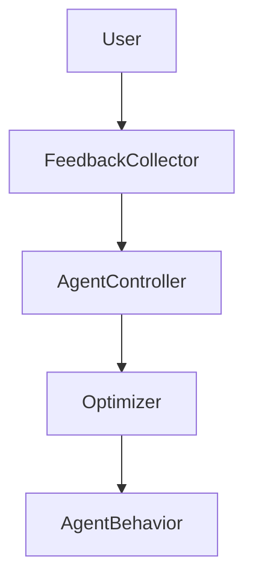

                 


# 基于用户反馈的AI Agent迭代优化流程

## 关键词：AI Agent，用户反馈，迭代优化，强化学习，系统架构

## 摘要：本文详细探讨了基于用户反馈的AI Agent迭代优化流程，从背景介绍、核心概念、算法原理、系统架构到项目实战，全面解析了如何通过用户反馈实现AI Agent的持续优化。文章结合理论与实践，提供了丰富的技术细节和实现方案。

---

## 第1章: 背景介绍

### 1.1 AI Agent的基本概念

#### 1.1.1 什么是AI Agent
AI Agent（人工智能代理）是指能够感知环境、自主决策并执行任务的智能体。它可以是一个软件程序、机器人或其他智能系统，目标是通过与环境交互，完成特定目标。

#### 1.1.2 AI Agent的类型与特点
AI Agent可以分为以下几种类型：
- **反应式Agent**：基于当前环境输入做出反应，不依赖历史信息。
- **认知式Agent**：具备复杂推理和规划能力，能够处理不确定性。
- **学习式Agent**：通过经验改进性能，具备自适应能力。

#### 1.1.3 用户反馈在AI Agent中的作用
用户反馈是连接AI Agent与用户的桥梁，通过用户的实时反馈，AI Agent可以不断调整行为策略，提升用户体验和任务执行效率。

### 1.2 用户反馈的重要性

#### 1.2.1 用户反馈的定义与分类
用户反馈是用户对AI Agent行为的评价或建议，可以分为以下几类：
- **显式反馈**：用户主动提供的评分或评价。
- **隐式反馈**：通过用户行为间接反映的偏好。
- **实时反馈**：在交互过程中即时获得的反馈。

#### 1.2.2 用户反馈在AI Agent优化中的价值
用户反馈能够帮助AI Agent理解用户需求，优化决策策略，提升系统性能。

#### 1.2.3 用户反馈的收集与处理挑战
用户反馈的收集需要设计有效的反馈机制，同时要处理反馈的不完整性和噪声问题。

---

## 第2章: 核心概念与联系

### 2.1 AI Agent与用户反馈的关系

#### 2.1.1 AI Agent的交互流程
AI Agent的交互流程包括感知环境、生成动作、执行动作并获得反馈。

#### 2.1.2 用户反馈的输入机制
用户反馈需要通过特定的接口输入到AI Agent系统中。

#### 2.1.3 反馈驱动的优化循环
通过反馈不断调整AI Agent的行为策略，形成优化循环。

### 2.2 用户反馈机制的设计

#### 2.2.1 反馈分类与处理逻辑
用户反馈需要分类处理，例如将反馈分为“满意”、“不满意”、“中立”三类。

#### 2.2.2 反馈优先级与权重分配
不同类型的反馈具有不同的优先级和权重，需要合理分配以优化系统。

#### 2.2.3 反馈闭环的实现路径
通过反馈闭环机制，确保用户反馈能够有效驱动系统优化。

---

## 第3章: 基于用户反馈的AI Agent优化算法

### 3.1 基于反馈的强化学习算法

#### 3.1.1 强化学习基础
强化学习是一种通过试错学习来优化策略的方法，通过与环境交互获得奖励或惩罚。

#### 3.1.2 用户反馈作为奖励函数
用户反馈可以作为强化学习中的奖励信号，指导AI Agent的学习方向。

#### 3.1.3 策略优化方法
使用策略梯度方法优化强化学习模型，例如PG（Policy Gradient）算法。

### 3.2 反馈驱动的优化模型

#### 3.2.1 模型训练流程
模型通过用户反馈进行训练，不断优化预测行为。

#### 3.2.2 基于反馈的策略调整
根据用户反馈调整策略参数，例如使用Q-learning算法。

#### 3.2.3 模型评估与验证
通过用户反馈对模型进行评估，确保优化效果。

---

## 第4章: 系统分析与架构设计

### 4.1 问题场景介绍

#### 4.1.1 问题背景
AI Agent需要通过用户反馈不断优化行为策略，以适应用户需求的变化。

#### 4.1.2 项目介绍
本项目旨在设计一个支持用户反馈的AI Agent系统，实现迭代优化。

### 4.2 系统功能设计

#### 4.2.1 领域模型设计
领域模型包括用户、AI Agent、反馈机制和优化模块。

#### 4.2.2 系统架构设计
系统架构包括用户交互层、反馈处理层和优化算法层。

#### 4.2.3 系统接口设计
系统接口包括用户反馈接口和AI Agent控制接口。

### 4.3 系统架构图



### 4.4 系统交互流程

```mermaid
sequenceDiagram
    用户 → AI Agent: 发出请求
    AI Agent → 用户: 返回结果
    用户 → 反馈收集器: 提供反馈
    反馈收集器 → 优化器: 传递反馈
    优化器 → AI Agent: 调整策略
```

---

## 第5章: 项目实战

### 5.1 环境安装

```bash
pip install gym
pip install tensorflow
```

### 5.2 系统核心实现源代码

```python
class AI-Agent:
    def __init__(self):
        self.model = self.build_model()
    
    def build_model(self):
        # 构建神经网络模型
        pass
    
    def act(self, state):
        # 根据状态选择动作
        pass
    
    def update(self, feedback):
        # 根据反馈更新模型
        pass
```

### 5.3 代码应用解读与分析

- 代码实现了一个AI Agent的基本框架，包括模型构建、动作选择和反馈更新功能。
- 使用神经网络模型处理状态输入，基于反馈更新模型权重。

### 5.4 实际案例分析

- 通过用户反馈不断优化AI Agent的策略，提升系统性能。

### 5.5 项目小结

- 项目成功实现了基于用户反馈的AI Agent优化流程。
- 未来可以进一步优化反馈机制和算法模型。

---

## 第6章: 最佳实践 tips、小结、注意事项、拓展阅读

### 6.1 tips
- 反馈机制设计要简洁明了，避免过多复杂性。
- 定期验证模型优化效果，确保反馈的有效性。

### 6.2 小结
本文详细介绍了基于用户反馈的AI Agent迭代优化流程，从理论到实践，全面解析了实现方法。

### 6.3 注意事项
- 用户反馈的收集要确保真实性和有效性。
- 算法优化要关注收敛性和稳定性。

### 6.4 拓展阅读
- 加强学习（Reinforcement Learning）相关书籍。
- 用户反馈机制的深入研究。

---

## 作者：AI天才研究院/AI Genius Institute & 禅与计算机程序设计艺术 /Zen And The Art of Computer Programming

