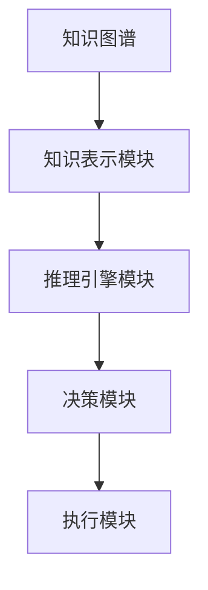
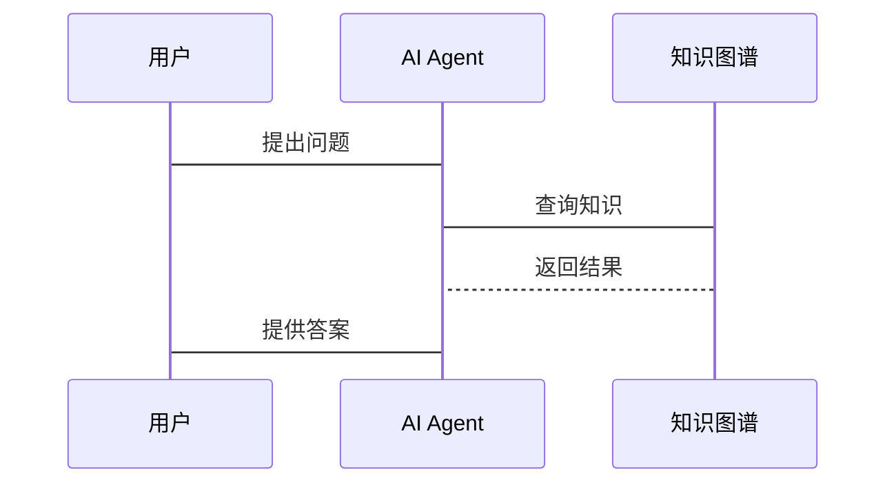

                 


# 基于知识图谱的AI Agent常识推理

> 关键词：知识图谱, AI Agent, 常识推理, 逻辑推理, 图神经网络

> 摘要：本文深入探讨了基于知识图谱的AI Agent常识推理技术，从知识图谱的基本概念到AI Agent的核心功能，再到常识推理的算法原理，系统地分析了其理论基础和实践应用。通过详细的数学模型和实际案例，本文展示了如何利用知识图谱构建高效的AI Agent，并通过图神经网络和逻辑推理等方法实现常识推理。本文还提供了丰富的代码示例和系统架构设计，帮助读者全面掌握基于知识图谱的AI Agent常识推理技术。

---

# 第一部分: 知识图谱与AI Agent概述

## 第1章: 知识图谱的基本概念

### 1.1 知识图谱的定义与特点
知识图谱是一种用于表示知识的数据结构，通常以图的形式组织数据，包括节点（实体）和边（关系）。其特点包括：
- **结构化**：节点和边的明确定义使得知识图谱具有高度的结构化特性。
- **语义丰富**：通过边的标签和权重，可以表示实体之间的复杂关系。
- **可扩展性**：知识图谱可以通过不断添加新的节点和边进行扩展。

### 1.2 知识图谱的构建方法
知识图谱的构建通常包括以下步骤：
1. 数据收集：从多种来源（如数据库、文本、网页）收集数据。
2. 数据清洗：对收集到的数据进行去重、标准化处理。
3. 实体识别与链接：识别数据中的实体并建立它们之间的关联。
4. 知识融合：将不同来源的数据进行整合，消除冲突。
5. 知识存储：将处理后的数据存储到图数据库中。

### 1.3 知识图谱的应用场景
知识图谱广泛应用于搜索引擎、智能问答、推荐系统等领域。例如，在智能问答中，知识图谱可以提供丰富的背景知识，帮助AI Agent更好地理解用户的问题。

## 第2章: AI Agent的基本概念

### 2.1 AI Agent的定义与分类
AI Agent是一种智能体，能够感知环境并采取行动以实现目标。根据智能体的智能水平，可以将其分为：
- **反应式AI Agent**：基于当前感知做出反应。
- **认知式AI Agent**：具备推理、规划等高级智能功能。

### 2.2 AI Agent的核心功能
AI Agent的核心功能包括：
- **感知**：通过传感器或数据接口获取环境信息。
- **推理**：基于知识库进行逻辑推理，得出结论。
- **决策**：根据推理结果制定行动计划。
- **执行**：通过执行器将行动计划转化为实际操作。

### 2.3 AI Agent与知识图谱的结合
AI Agent可以通过知识图谱获取背景知识，从而提高其推理能力和决策水平。例如，在智能客服中，AI Agent可以通过知识图谱快速找到相关的产品信息，为用户提供准确的答案。

---

# 第二部分: 常识推理的核心概念

## 第3章: 常识推理的基本概念

### 3.1 常识推理的定义
常识推理是指AI系统在没有明确规则的情况下，能够基于常识进行推理和判断的能力。例如，当用户提到“狗在公园里”，AI Agent可以推理出“狗可能在公园里玩耍”。

### 3.2 常识推理的挑战
常识推理的挑战包括：
- **知识的不确定性**：常识知识可能不完整或存在歧义。
- **推理的复杂性**：常识推理需要处理多种可能的逻辑关系。
- **计算资源的限制**：大规模常识推理需要大量的计算资源。

### 3.3 常识推理的应用场景
常识推理广泛应用于自然语言处理、智能问答、推荐系统等领域。例如，在智能问答中，常识推理可以帮助AI Agent更好地理解用户的问题，并提供更准确的答案。

## 第4章: 知识图谱中的常识推理

### 4.1 知识图谱中的常识表示
常识可以通过知识图谱中的节点和边进行表示。例如，“狗是动物”可以表示为节点“狗”和边“属于”连接到节点“动物”。

### 4.2 知识图谱中的常识推理
知识图谱中的常识推理可以通过以下步骤实现：
1. **知识抽取**：从文本中抽取实体和关系。
2. **知识融合**：将抽取的知识整合到知识图谱中。
3. **推理与查询**：基于知识图谱进行推理，回答用户的问题。

### 4.3 常识推理的逻辑框架
常识推理的逻辑框架包括：
- **规则推理**：基于预定义的规则进行推理。
- **概率推理**：基于概率论进行推理，考虑知识的不确定性。
- **图神经网络推理**：基于图结构进行深度学习推理。

---

# 第三部分: 知识图谱与AI Agent的算法原理

## 第5章: 知识图谱中的算法原理

### 5.1 知识图谱的表示学习
知识图谱的表示学习通过将实体和关系映射到低维向量空间，可以提高推理效率。常用的方法包括：
- **TransE**：将实体和关系映射到向量空间，通过翻译操作进行推理。
- **TransH**：基于TransE的改进方法，支持不同关系的向量空间。

### 5.2 知识图谱中的推理算法
知识图谱中的推理算法包括：
- **路径推理**：通过遍历图结构，找到实体之间的关系路径。
- **规则推理**：基于预定义的规则进行推理。
- **深度学习推理**：基于图神经网络进行深度学习推理。

## 第6章: AI Agent中的常识推理

### 6.1 AI Agent中的知识表示
AI Agent中的知识表示需要考虑以下方面：
- **可扩展性**：能够方便地添加新的知识。
- **可推理性**：支持基于知识图谱的推理操作。

### 6.2 AI Agent中的推理算法
AI Agent中的推理算法包括：
- **基于规则的推理**：基于预定义的规则进行推理。
- **基于学习的推理**：基于深度学习模型进行推理。
- **混合推理**：结合规则推理和学习推理的优势。

---

# 第四部分: 基于知识图谱的常识推理数学模型

## 第7章: 知识图谱的数学表示

### 7.1 知识图谱的符号表示
知识图谱可以用符号逻辑进行表示，例如：
- 实体：$e_1, e_2, ..., e_n$
- 关系：$r_1, r_2, ..., r_m$
- 三元组：$(e_i, r_j, e_k)$

### 7.2 知识图谱的向量表示
知识图谱的向量表示可以通过以下公式实现：
$$
e_i = \text{lookup}(E, e_i)
$$
$$
r_j = \text{lookup}(R, r_j)
$$
$$
e_k = e_i + r_j
$$

### 7.3 知识图谱的推理公式
知识图谱的推理可以通过以下公式实现：
$$
p(e_i, r_j, e_k) = \sigma(e_i \cdot r_j - e_k)
$$
其中，$\sigma$表示sigmoid函数。

## 第8章: 常识推理的逻辑模型

### 8.1 基于一阶逻辑的推理
基于一阶逻辑的推理可以通过以下公式实现：
$$
\forall x (P(x) \rightarrow Q(x))
$$
$$
P(a) \rightarrow Q(a)
$$
$$
Q(a) \text{ 为真}
$$

### 8.2 基于概率论的推理
基于概率论的推理可以通过贝叶斯定理实现：
$$
P(A|B) = \frac{P(B|A)P(A)}{P(B)}
$$

---

# 第五部分: 系统分析与架构设计

## 第9章: 系统功能设计

### 9.1 知识图谱的构建模块
知识图谱的构建模块包括：
- 数据清洗模块
- 实体识别模块
- 关系抽取模块
- 知识融合模块

### 9.2 AI Agent的推理模块
AI Agent的推理模块包括：
- 知识表示模块
- 推理引擎模块
- 决策模块

## 第10章: 系统架构设计

### 10.1 系统架构图


### 10.2 系统交互流程


---

# 第六部分: 项目实战

## 第11章: 环境安装与核心代码实现

### 11.1 环境安装
需要安装以下环境：
- Python 3.8+
- PyTorch 1.9+
- Node.js 14+
- 图数据库（Neo4j）

### 11.2 核心代码实现
以下是一个简单的知识图谱构建代码示例：
```python
import neo4j-driver
driver = neo4j-driver.Driver('bolt://localhost:7687', auth=('neo4j', 'password'))

def create KnowledgeGraph():
    with driver.session() as session:
        session.write_transaction(lambda tx: tx.run("CREATE (:Entity {name: '狗'})"))
        session.write_transaction(lambda tx: tx.run("CREATE (:Entity {name: '动物'})"))
        session.write_transaction(lambda tx: tx.run("MATCH (a:Entity {name: '狗'}), (b:Entity {name: '动物'}) CREATE (a)-[:属于]->(b)"))
```

## 第12章: 案例分析与项目小结

### 12.1 案例分析
以下是一个简单的常识推理案例：
用户问：“狗是动物吗？”
AI Agent通过知识图谱推理出“狗属于动物”，并回答“是的，狗是动物。”

### 12.2 项目小结
通过本项目的实现，我们可以看到基于知识图谱的AI Agent常识推理技术的强大能力。未来，随着知识图谱的不断扩展和推理算法的不断优化，常识推理技术将更加智能化和实用化。

---

# 总结与展望

基于知识图谱的AI Agent常识推理技术是一项具有广阔应用前景的技术。通过知识图谱的结构化表示和AI Agent的智能推理，我们可以实现更加智能化的交互和决策。未来，随着技术的不断发展，常识推理将在更多领域得到广泛应用。

---

# 附录

## 术语表
- 知识图谱：一种用于表示知识的数据结构，由节点和边组成。
- AI Agent：一种智能体，能够感知环境并采取行动以实现目标。
- 常识推理：AI系统在没有明确规则的情况下，能够基于常识进行推理和判断的能力。

## 参考文献
1.《知识图谱构建与应用》，作者：李明，出版社：人民邮电出版社。
2.《人工智能导论》，作者：张三，出版社：清华大学出版社。

---

作者：AI天才研究院/AI Genius Institute & 禅与计算机程序设计艺术 /Zen And The Art of Computer Programming

