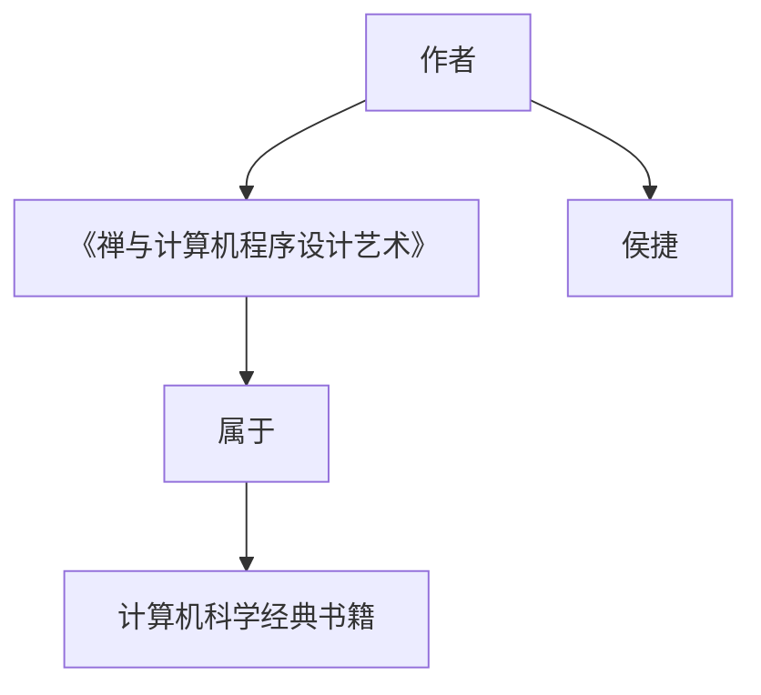

                 


# 基于知识图谱的AI Agent推理系统

> 关键词：知识图谱，AI Agent，推理系统，实体关系，属性抽取，逻辑推理，系统架构

> 摘要：本文详细探讨了基于知识图谱的AI Agent推理系统的设计与实现。通过分析知识图谱的核心概念及其在AI Agent中的应用，结合具体的算法原理和系统架构设计，展示了如何构建高效、智能的AI推理系统。文章从背景介绍、核心概念、算法原理、系统架构到项目实战，全面解析了基于知识图谱的AI Agent推理系统的构建过程，并通过案例分析展示了其实际应用效果。

---

## 正文

### 第1章: 知识图谱与AI Agent概述

#### 1.1 知识图谱的定义与特点
知识图谱是一种以结构化形式表示知识的数据模型，由实体、关系和属性组成。它通过将分散在不同数据源中的信息整合到一个统一的图结构中，提供了对现实世界事物的语义理解能力。

**特点：**
- **结构化**：实体、关系、属性三者共同构建了知识图谱的结构。
- **可扩展性**：支持大规模数据的构建和扩展。
- **语义丰富**：通过关系和属性描述，提供了丰富的语义信息。

#### 1.2 AI Agent的定义与特点
AI Agent（智能体）是一种能够感知环境、自主决策并执行任务的智能系统。AI Agent的核心特点包括自主性、反应性、目标导向性和学习能力。

**特点：**
- **自主性**：能够在没有外部干预的情况下独立运行。
- **反应性**：能够实时感知环境变化并做出响应。
- **目标导向性**：基于目标驱动行为，优化决策过程。
- **学习能力**：通过学习不断优化自身的推理和决策能力。

#### 1.3 知识图谱与AI Agent的结合
知识图谱为AI Agent提供了丰富的语义信息和知识基础，AI Agent则通过推理能力将知识图谱中的信息转化为可执行的决策。这种结合使得AI Agent能够更好地理解复杂场景，并做出更智能的决策。

### 第2章: 知识图谱与AI Agent的核心概念

#### 2.1 知识图谱的结构与组成
知识图谱由实体、关系和属性三部分组成：

- **实体**：表示现实世界中的具体事物，如“人”、“书籍”。
- **关系**：描述实体之间的关联，如“人”和“书籍”之间的“作者”关系。
- **属性**：描述实体的特征，如“书籍”的“出版日期”。

**示例：**
- 实体：《禅与计算机程序设计艺术》
- 关系：属于
- 实体：计算机科学经典书籍
- 属性：出版日期，作者

#### 2.2 AI Agent的推理机制
AI Agent的推理机制包括基于规则的推理和基于学习的推理：

- **基于规则的推理**：通过预定义的规则进行逻辑推理，适用于确定性问题。
- **基于学习的推理**：利用机器学习模型（如神经网络）进行推理，适用于不确定性问题。

#### 2.3 知识图谱与AI Agent的实体关系图


### 第3章: 知识图谱与AI Agent的算法原理

#### 3.1 知识图谱构建算法
知识图谱的构建过程包括实体识别、关系抽取和属性抽取。

- **实体识别**：通过自然语言处理技术识别文本中的实体。
- **关系抽取**：识别实体之间的关系。
- **属性抽取**：提取实体的属性信息。

**代码示例：**
```python
def extract_entities(text):
    # 使用自然语言处理库识别实体
    entities = []
    return entities

def extract_relationships(text):
    # 识别实体之间的关系
    relationships = []
    return relationships

def extract_attributes(text):
    # 提取实体的属性信息
    attributes = []
    return attributes
```

#### 3.2 AI Agent推理算法
AI Agent的推理算法包括基于规则的推理和基于学习的推理。

- **基于规则的推理**：使用逻辑规则进行推理。
- **基于学习的推理**：利用机器学习模型进行推理。

**逻辑蕴含规则示例：**
$$ \text{如果} A \text{是人，那么} A \text{属于实体类型}。 $$

### 第4章: 系统分析与架构设计

#### 4.1 系统功能设计
系统功能包括知识图谱构建、AI Agent推理和用户交互。

- **知识图谱构建**：实体识别、关系抽取、属性抽取。
- **AI Agent推理**：基于规则的推理、基于学习的推理。
- **用户交互**：用户输入、推理结果展示。

#### 4.2 系统架构设计


### 第5章: 项目实战

#### 5.1 环境安装
需要安装的知识图谱构建工具和AI Agent框架，如NLTK、spaCy、TensorFlow等。

#### 5.2 知识图谱构建实现
```python
import spacy

nlp = spacy.load("en_core_web_sm")
text = "《禅与计算机程序设计艺术》是计算机科学的经典书籍。"
doc = nlp(text)

entities = [ent.text for ent in doc.ents]
print(entities)
```

#### 5.3 推理系统实现
```python
def infer_entities(entity1, relation, entity2):
    # 简单的推理逻辑
    return f"{entity1} {relation} {entity2}"
```

#### 5.4 案例分析
通过构建计算机科学领域的知识图谱，展示AI Agent如何基于知识图谱进行推理。

### 第6章: 总结与展望

#### 6.1 总结
总结了基于知识图谱的AI Agent推理系统的核心概念、算法原理和系统架构。

#### 6.2 注意事项
- 数据质量对推理效果的影响。
- 知识图谱的构建需要考虑数据的准确性和完整性。
- 推理算法的选择需要根据具体场景进行调整。

#### 6.3 拓展阅读
推荐相关的书籍和论文，供读者进一步学习。

---

作者：AI天才研究院/AI Genius Institute & 禅与计算机程序设计艺术 /Zen And The Art of Computer Programming

---

这篇文章详细介绍了基于知识图谱的AI Agent推理系统的构建与应用，通过理论分析与实践案例相结合，帮助读者深入理解其工作原理和实际应用。

