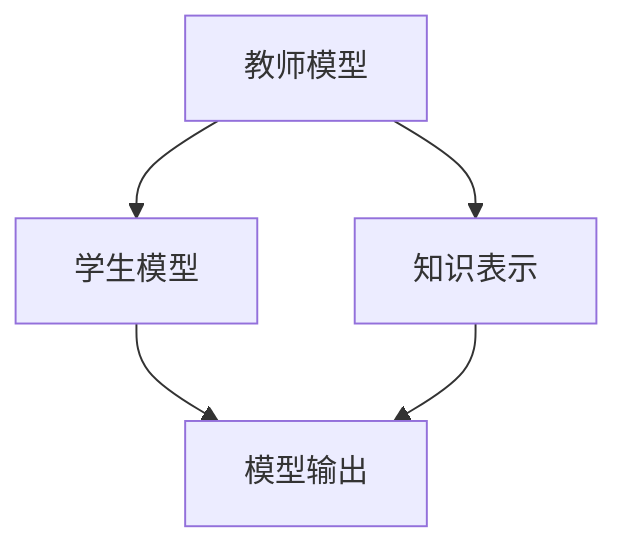
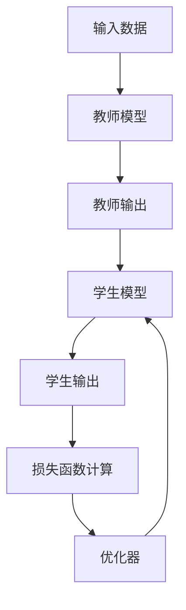
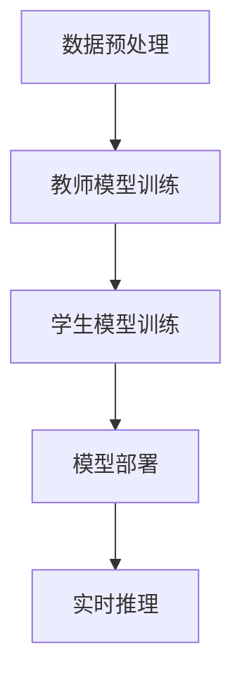

                 


# 基于知识蒸馏的轻量级AI Agent

> 关键词：知识蒸馏，轻量级AI Agent，模型压缩，深度学习，知识表示

> 摘要：本文将深入探讨基于知识蒸馏的轻量级AI Agent的设计与实现。通过分析知识蒸馏的核心原理，结合轻量级AI Agent的应用场景，提出一种高效的模型压缩方法，旨在降低AI Agent的计算复杂度，同时保持其性能和功能。本文将从知识蒸馏的背景、核心概念、算法原理、系统架构、项目实战到最佳实践进行全面阐述，为读者提供一个清晰的知识框架和实践指南。

---

## 第一部分: 知识蒸馏与轻量级AI Agent概述

### 第1章: 知识蒸馏的背景与概念

#### 1.1 知识蒸馏的起源与发展

知识蒸馏（Knowledge Distillation）是一种将复杂模型（教师模型）的知识迁移到简单模型（学生模型）的技术，起源于深度学习领域。其核心思想是通过教师模型的输出或中间层特征来指导学生模型的训练，从而实现模型压缩和性能优化。知识蒸馏的发展经历了以下几个阶段：

1. **早期阶段**：2014年，Hinton团队提出了基于Softmax概率分布的知识蒸馏方法，首次将教师模型的概率分布作为学生模型的软目标。
2. **发展阶段**：研究者们开始探索教师模型的中间层特征、注意力机制等更复杂的知识表示方法。
3. **当前趋势**：知识蒸馏逐渐扩展到图像分类、自然语言处理、推荐系统等多领域，并结合强化学习、图神经网络等技术，形成了多样化的蒸馏方法。

#### 1.2 轻量级AI Agent的概念与特点

轻量级AI Agent是一种计算资源消耗低、运行效率高的AI代理，其核心目标是通过轻量化的模型实现高效的决策、推理和交互能力。以下是轻量级AI Agent的几个关键特点：

1. **低计算复杂度**：模型参数少，计算速度快。
2. **高实时性**：适用于实时响应的场景，如物联网设备、边缘计算等。
3. **可扩展性**：能够根据需求进行灵活部署和扩展。

#### 1.3 知识蒸馏与轻量级AI Agent的结合

知识蒸馏为轻量级AI Agent提供了关键的技术支持。通过蒸馏教师模型的知识，可以在不显著降低性能的前提下，大幅减少模型的计算资源消耗。这种结合主要体现在以下几个方面：

1. **模型压缩**：将复杂的大模型压缩成轻量级的小模型，适用于资源受限的场景。
2. **知识迁移**：通过蒸馏技术，将教师模型的深层知识传递给学生模型，提升轻量级模型的性能。
3. **边缘计算优化**：在物联网、移动设备等资源受限的环境中，轻量级AI Agent通过知识蒸馏技术实现高效的本地推理。

---

### 第2章: 知识蒸馏的核心概念与原理

#### 2.1 知识蒸馏的基本原理

知识蒸馏的核心思想是通过教师模型的输出或中间层特征来指导学生模型的训练。具体来说，教师模型通过软目标标签（Soft Label）提供更细粒度的信息，学生模型通过模仿教师模型的输出，逐步逼近教师模型的性能。以下是知识蒸馏的基本步骤：

1. **教师模型训练**：先训练一个高性能的教师模型，通常是一个较大的深度学习模型。
2. **知识蒸馏过程**：通过蒸馏损失函数（Distillation Loss）优化学生模型，使其输出接近教师模型的输出。
3. **学生模型训练**：在蒸馏过程中，学生模型不仅学习原始数据的标签信息，还学习教师模型的软目标分布。

#### 2.2 知识蒸馏的核心概念对比

为了更好地理解知识蒸馏的原理，我们需要对比以下几个核心概念：

| 对比维度       | 教师模型       | 学生模型       |
|----------------|---------------|---------------|
| 模型复杂度     | 高            | 低            |
| 模型大小       | 大            | 小            |
| 训练目标       | 高性能        | 轻量化        |
| 作用           | 提供知识       | 学习知识       |

此外，知识蒸馏与传统模型压缩技术（如剪枝、量化）也有显著区别。知识蒸馏不仅关注模型的大小，更注重模型知识的传递，从而在轻量化的同时保持性能。

#### 2.3 知识蒸馏的ER实体关系图

以下是一个简单的ER实体关系图，展示了知识蒸馏的核心关系：



---

### 第3章: 知识蒸馏算法的数学模型与公式

#### 3.1 知识蒸馏的数学模型

知识蒸馏的数学模型主要围绕教师模型和学生模型的输出关系展开。以下是关键公式：

1. **教师模型的概率分布**：
   $$ P(y|x) $$

2. **学生模型的概率分布**：
   $$ Q(y|x) $$

3. **蒸馏损失函数**：
   $$ \mathcal{L}_{distill} = -\sum_{i=1}^{n} P(y_i|x_i) \log Q(y_i|x_i) $$

4. **最终损失函数**（结合分类损失和蒸馏损失）：
   $$ \mathcal{L}_{total} = \lambda \mathcal{L}_{classification} + (1-\lambda) \mathcal{L}_{distill} $$

其中，$\lambda$ 是平衡参数，用于调节分类损失和蒸馏损失的权重。

#### 3.2 知识蒸馏算法的实现步骤

以下是知识蒸馏算法的实现步骤：

1. **训练教师模型**：
   - 使用原始数据训练教师模型，得到教师模型的权重参数。
   - 输出教师模型的概率分布 $P(y|x)$。

2. **初始化学生模型**：
   - 初始化学生模型的参数，通常采用随机初始化或基于教师模型的初始化。

3. **蒸馏过程**：
   - 训练学生模型，使用教师模型的软目标分布 $P(y|x)$ 和学生模型的输出 $Q(y|x)$ 作为损失函数。
   - 优化学生模型的参数，使蒸馏损失最小化。

4. **评估与调整**：
   - 在验证集上评估学生模型的性能，调整平衡参数 $\lambda$ 或优化蒸馏温度 $T$。

#### 3.3 知识蒸馏的流程图

以下是一个知识蒸馏的流程图：



---

## 第四部分: 轻量级AI Agent的系统架构与实现

### 第4章: 轻量级AI Agent的系统架构

#### 4.1 系统架构设计

轻量级AI Agent的系统架构通常包括以下几个模块：

1. **数据预处理模块**：
   - 负责将原始数据转换为适合模型输入的形式。
   - 例如，图像数据的归一化、文本数据的分词处理等。

2. **教师模型训练模块**：
   - 使用原始数据训练教师模型，生成软目标分布。

3. **学生模型训练模块**：
   - 使用蒸馏损失函数优化学生模型，得到轻量化的学生模型。

4. **模型部署模块**：
   - 将轻量化的学生模型部署到目标设备上，进行实时推理。

#### 4.2 系统功能设计

以下是轻量级AI Agent的功能模块图：



---

## 第五部分: 项目实战与最佳实践

### 第5章: 项目实战

#### 5.1 环境安装

以下是项目实战所需的环境安装命令：

```bash
pip install tensorflow==2.5.0
pip install numpy==1.21.2
pip install matplotlib==3.5.1
```

#### 5.2 核心实现代码

以下是轻量级AI Agent的实现代码：

```python
import tensorflow as tf
import numpy as np

# 定义教师模型
def teacher_model(input_shape):
    model = tf.keras.Sequential([
        tf.keras.layers.Dense(128, activation='relu', input_shape=input_shape),
        tf.keras.layers.Dense(10, activation='softmax')
    ])
    return model

# 定义学生模型
def student_model(input_shape):
    model = tf.keras.Sequential([
        tf.keras.layers.Dense(64, activation='relu', input_shape=input_shape),
        tf.keras.layers.Dense(10, activation='softmax')
    ])
    return model

# 定义蒸馏损失函数
def distillation_loss(teacher_logits, student_logits, temperature=1.0):
    teacher_probs = tf.nn.softmax(teacher_logits / temperature)
    student_probs = tf.nn.softmax(student_logits / temperature)
    loss = tf.reduce_mean(tf.keras.losses kull_divergence(teacher_probs, student_probs))
    return loss

# 训练教师模型
teacher = teacher_model((input_dim,))
teacher.compile(optimizer='adam', loss='sparse_categorical_crossentropy')
teacher.fit(x_train, y_train, epochs=10)

# 初始化学生模型
student = student_model((input_dim,))
student.compile(optimizer='adam', loss=lambda y_true, y_pred: distillation_loss(teacher_logits, y_pred))

# 训练学生模型
student.fit(x_train, y_train, epochs=10, verbose=1)
```

---

### 第6章: 最佳实践与总结

#### 6.1 最佳实践

1. **选择合适的教师模型**：教师模型的性能直接影响蒸馏效果，建议选择在目标任务上表现优异的模型。
2. **调整蒸馏温度**：蒸馏温度 $T$ 是知识蒸馏中的一个重要超参数，通常在1到5之间。温度越高，软目标分布越均匀。
3. **结合多种蒸馏方法**：可以同时使用软目标蒸馏、特征蒸馏等多种方法，进一步提升学生模型的性能。
4. **优化损失函数**：根据具体任务需求，调整分类损失和蒸馏损失的平衡参数 $\lambda$。

#### 6.2 总结

基于知识蒸馏的轻量级AI Agent通过将复杂模型的知识迁移到简单模型，成功实现了模型的轻量化。这种技术不仅降低了计算资源的消耗，还提升了AI Agent在资源受限场景中的应用能力。未来，随着深度学习技术的不断发展，知识蒸馏将在更多领域展现出其独特的优势。

---

## 作者

**作者：AI天才研究院/AI Genius Institute & 禅与计算机程序设计艺术 /Zen And The Art of Computer Programming**

---

以上是基于知识蒸馏的轻量级AI Agent的完整文章结构，您可以根据实际需求进一步扩展或调整各章节的内容。

