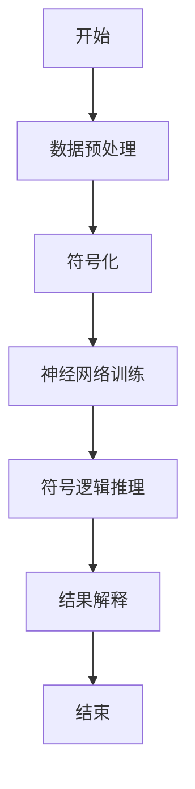
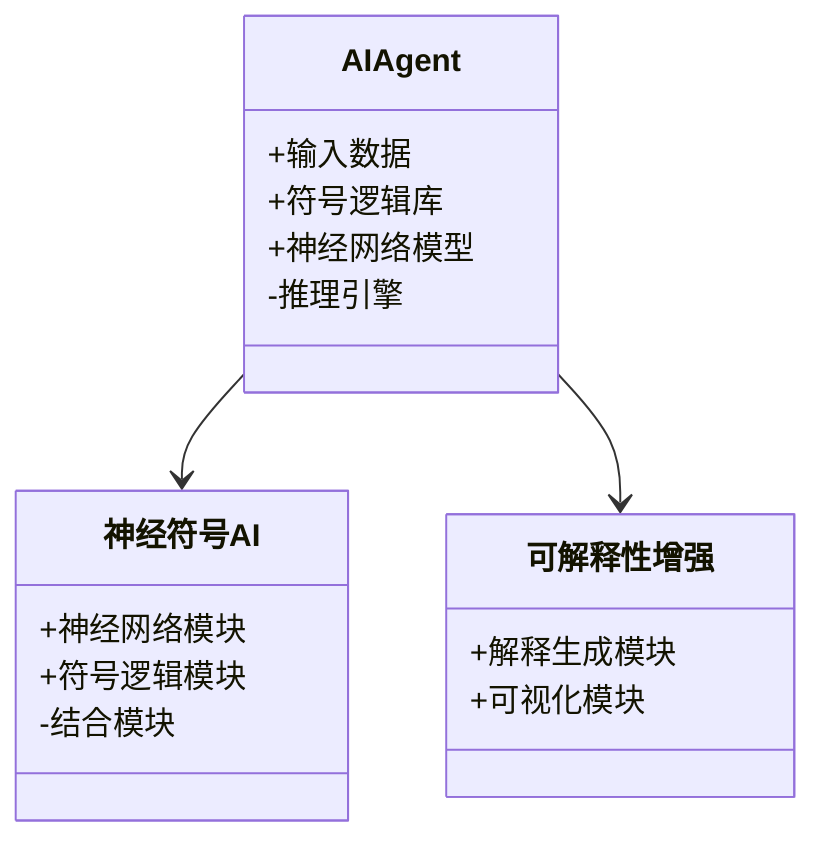

                 


# 目录大纲：《基于神经符号AI的AI Agent可解释性增强》

---

# 第一部分：背景介绍

## 第1章：问题背景与可解释性的重要性

### 1.1 问题背景
#### 1.1.1 神经符号AI的起源与发展
#### 1.1.2 AI Agent的基本概念与应用领域
#### 1.1.3 可解释性在AI Agent中的必要性

### 1.2 问题描述
#### 1.2.1 当前AI Agent的局限性
#### 1.2.2 可解释性缺失带来的问题
#### 1.2.3 神经符号AI在可解释性中的作用

### 1.3 问题解决与边界
#### 1.3.1 神经符号AI的解决方案
#### 1.3.2 可解释性增强的目标与范围
#### 1.3.3 神经符号AI的边界与外延

### 1.4 核心概念与组成
#### 1.4.1 神经符号AI的核心要素
#### 1.4.2 AI Agent的结构与功能
#### 1.4.3 可解释性增强的实现机制

---

# 第二部分：核心概念与联系

## 第2章：神经符号AI与符号AI的对比分析

### 2.1 神经符号AI的核心原理
#### 2.1.1 神经网络与符号逻辑的结合
#### 2.1.2 神经符号AI的优势与劣势

### 2.2 符号AI的特点与局限性
#### 2.2.1 符号逻辑的基本原理
#### 2.2.2 符号AI在实际应用中的挑战

### 2.3 神经符号AI与符号AI的对比
#### 2.3.1 对比分析表格
#### 2.3.2 神经符号AI的改进方向

---

# 第三部分：算法原理讲解

## 第3章：神经符号AI的算法原理

### 3.1 神经符号AI的基本算法
#### 3.1.1 神经符号AI的输入输出模型
#### 3.1.2 神经网络与符号逻辑的结合方式

### 3.2 算法实现步骤
#### 3.2.1 数据预处理与符号化
#### 3.2.2 神经网络的训练与优化
#### 3.2.3 符号逻辑的推理与解释

### 3.3 算法流程图


---

## 第4章：数学模型与公式

### 4.1 神经符号AI的数学基础
#### 4.1.1 符号逻辑与神经网络的结合
#### 4.1.2 神经符号AI的损失函数
$$L = \alpha \cdot L_{\text{neural}} + (1-\alpha) \cdot L_{\text{symbolic}}$$

### 4.2 神经网络与符号逻辑的结合
#### 4.2.1 神经网络输出的符号逻辑转换
$$y = f(x) \rightarrow \text{符号逻辑规则}$$

---

## 第5章：系统分析与架构设计

### 5.1 系统功能设计


### 5.2 系统架构设计


---

## 第6章：项目实战

### 6.1 环境安装
#### 6.1.1 安装Python环境
#### 6.1.2 安装必要的库（如TensorFlow、Keras）

### 6.2 核心代码实现
#### 6.2.1 数据预处理与符号化
```python
import pandas as pd
data = pd.read_csv('data.csv')
# 符号化处理
data['category'] = data['category'].astype(str)
```

#### 6.2.2 神经网络训练
```python
model = tf.keras.Sequential([
    tf.keras.layers.Dense(64, activation='relu'),
    tf.keras.layers.Dense(1, activation='sigmoid')
])
model.compile(optimizer='adam', loss='binary_crossentropy')
model.fit(x_train, y_train, epochs=10)
```

#### 6.2.3 符号逻辑推理
```python
from logic import *
rule = parse_symbolic_rule('如果A则B')
result = apply_rule(rule, data)
```

### 6.3 案例分析与解读
#### 6.3.1 案例场景
#### 6.3.2 数据处理与结果展示
#### 6.3.3 可解释性分析

---

## 第7章：总结与展望

### 7.1 最佳实践 tips
#### 7.1.1 项目开发中的注意事项
#### 7.1.2 神经符号AI的优化建议

### 7.2 小结
#### 7.2.1 本书的核心内容回顾
#### 7.2.2 可解释性增强的重要意义

### 7.3 注意事项
#### 7.3.1 神经符号AI的局限性
#### 7.3.2 实际应用中的挑战

### 7.4 拓展阅读
#### 7.4.1 相关领域推荐书籍
#### 7.4.2 进一步学习资源

---

# 作者：AI天才研究院 & 禅与计算机程序设计艺术

