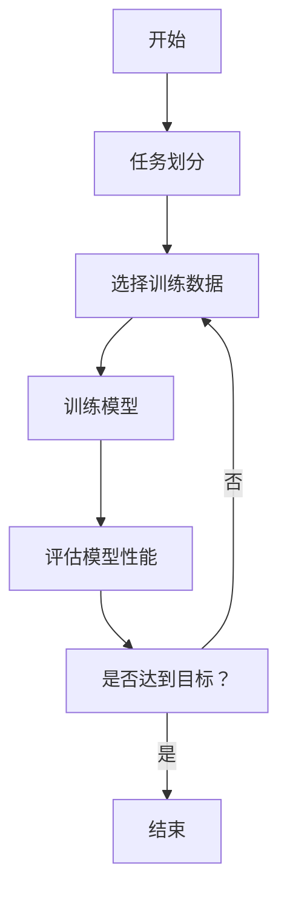
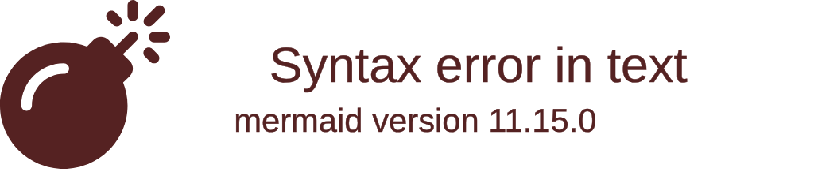
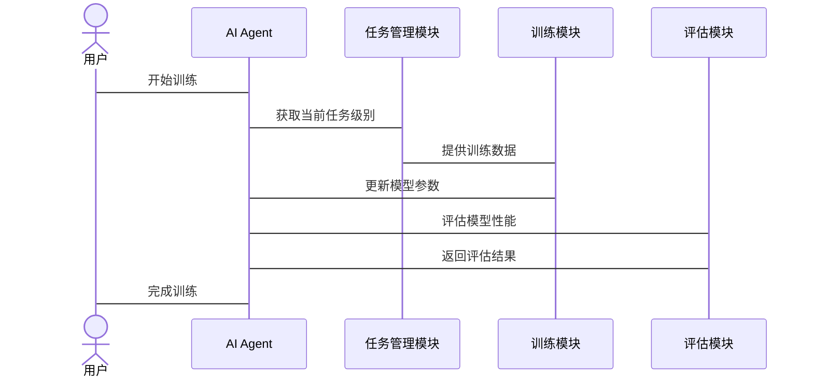

                 


# 基于课程学习的AI Agent能力渐进提升

> 关键词：课程学习, AI Agent, 算法原理, 系统架构, 项目实战

> 摘要：本文详细探讨了基于课程学习的AI Agent能力提升方法。通过分析课程学习的基本原理、算法实现、系统架构设计以及实际案例，展示了如何通过渐进式学习策略优化AI Agent的能力。文章内容涵盖背景介绍、核心概念、算法原理、系统架构设计和项目实战，旨在为AI Agent的开发和研究提供理论支持和实践指导。

---

# 第一部分: 基于课程学习的AI Agent能力渐进提升背景介绍

## 第1章: AI Agent与课程学习概述

### 1.1 AI Agent的基本概念

#### 1.1.1 什么是AI Agent
AI Agent（人工智能代理）是指能够感知环境并采取行动以实现目标的智能实体。它可以是一个软件程序、机器人或其他智能系统，具备自主决策和问题解决的能力。

#### 1.1.2 AI Agent的核心特征
- **自主性**：能够自主决策，无需外部干预。
- **反应性**：能够实时感知环境并做出反应。
- **目标导向**：通过实现目标来优化其行为。
- **学习能力**：能够通过经验改进性能。

#### 1.1.3 课程学习在AI Agent中的作用
课程学习是一种通过逐步优化学习策略来提升模型性能的方法。在AI Agent中，课程学习可以帮助其能力逐步提升，从简单任务到复杂任务，实现渐进式优化。

---

### 1.2 课程学习的基本原理

#### 1.2.1 课程学习的定义
课程学习（Curriculum Learning）是一种机器学习方法，通过逐步增加任务的难度，使模型能够逐步掌握复杂任务。与传统的一次性学习不同，课程学习通过设计合理的难度递增的训练序列，帮助模型更高效地学习。

#### 1.2.2 课程学习的核心要素
- **任务难度**：任务的难度需要逐步增加，确保模型能够逐步适应。
- **训练策略**：根据任务难度设计训练计划，逐步引入更复杂的任务。
- **评估机制**：定期评估模型性能，动态调整训练策略。

#### 1.2.3 课程学习与监督学习的区别
| 特性 | 监督学习 | 课程学习 |
|------|----------|----------|
| 数据提供方式 | 固定的训练数据 | 逐步递增的训练数据 |
| 任务难度 | 固定难度 | 逐步增加难度 |
| 学习效果 | 可能需要大量数据 | 逐步优化，效率更高 |

---

### 1.3 课程学习在AI Agent中的应用前景

#### 1.3.1 课程学习的优势
- **提升学习效率**：通过逐步学习，减少训练时间，提高模型性能。
- **适应复杂任务**：能够处理从简单到复杂的任务，增强模型的通用性。
- **动态调整能力**：根据任务难度动态调整学习策略，增强模型的适应性。

#### 1.3.2 课程学习在AI Agent中的潜在应用
- **自动驾驶**：通过逐步学习不同路况，提升自动驾驶系统的决策能力。
- **智能客服**：通过逐步掌握对话技巧，提高智能客服的交互能力。
- **游戏AI**：通过逐步学习游戏规则，提升游戏AI的策略水平。

#### 1.3.3 课程学习面临的挑战
- **任务难度设计**：如何设计合理的任务难度序列是一个关键问题。
- **动态调整机制**：如何动态调整学习策略需要复杂的算法支持。
- **性能评估**：如何准确评估模型性能并动态调整训练计划是一个挑战。

---

### 1.4 本章小结
本章主要介绍了AI Agent的基本概念和课程学习的核心原理，探讨了课程学习在AI Agent中的应用前景及其面临的挑战。通过逐步分析，为后续的算法实现和系统设计奠定了基础。

---

# 第二部分: 课程学习的核心概念与联系

## 第2章: 课程学习的核心原理

### 2.1 课程学习的原理分析

#### 2.1.1 课程学习的基本流程
课程学习的基本流程可以分为以下几个步骤：
1. **任务难度排序**：根据任务的复杂性，将任务分为多个难度递增的阶段。
2. **训练策略设计**：为每个阶段设计相应的训练策略。
3. **动态调整**：根据模型性能动态调整训练策略，确保模型逐步提升。

#### 2.1.2 课程学习的关键步骤
- **任务划分**：将整体任务划分为多个子任务，每个子任务的难度逐步增加。
- **训练数据选择**：根据任务难度选择合适的训练数据。
- **模型评估**：定期评估模型性能，决定是否进入下一个难度阶段。

#### 2.1.3 课程学习的数学模型
课程学习的数学模型可以表示为：
$$ L_{\text{total}} = \sum_{i=1}^{n} w_i L_i $$
其中，$w_i$ 是任务 $i$ 的权重，$L_i$ 是任务 $i$ 的损失函数。

---

### 2.2 课程学习的核心概念对比

#### 2.2.1 不同学习方法的对比
| 学习方法 | 监督学习 | 强化学习 | 课程学习 |
|----------|----------|----------|----------|
| 数据类型 | 标签数据 | 奖励信号 | 递增任务 |
| 学习目标 | 分类/回归 | 最大化奖励 | 逐步掌握复杂任务 |
| 优势 | 简单易实现 | 适合复杂环境 | 提高学习效率 |

#### 2.2.2 课程学习与其他学习方法的联系
课程学习可以与监督学习和强化学习结合，形成混合学习方法。例如，课程学习可以为强化学习提供更高效的训练策略。

#### 2.2.3 课程学习的优缺点分析
- **优点**：提高学习效率，降低训练成本，增强模型的泛化能力。
- **缺点**：任务难度设计复杂，动态调整机制需要额外的计算资源。

---

### 2.3 课程学习的ER实体关系图

```mermaid
er
actor(AI Agent)
    <--- owns --> 任务(Tasks)
    <--- owns --> 策略(Strategies)
    <--- owns --> 性能指标(Performance Metrics)
    
任务(Tasks)
    <--- consists_of --> 子任务(Subtasks)
    <--- has --> 难度等级(Difficulty Levels)
    
策略(Strategies)
    <--- has --> 训练计划(Training Plans)
    <--- has --> 调整规则(Adjustment Rules)
    
性能指标(Performance Metrics)
    <--- measured_by --> 模型性能(Model Performance)
```

---

### 2.4 本章小结
本章详细分析了课程学习的核心原理，对比了不同学习方法的优缺点，并通过ER实体关系图展示了课程学习的关键要素及其相互关系。

---

# 第三部分: 算法原理讲解

## 第3章: 课程学习算法的实现原理

### 3.1 课程学习算法的流程图



---

### 3.2 课程学习算法的数学模型

课程学习的数学模型可以表示为：
$$ L_{\text{total}} = \sum_{i=1}^{n} \lambda_i L_i $$
其中，$\lambda_i$ 是任务 $i$ 的权重系数，$L_i$ 是任务 $i$ 的损失函数。

---

### 3.3 课程学习算法的代码实现

```python
import numpy as np

def curriculum_learning(n_epochs=100, tasks=5):
    for epoch in range(n_epochs):
        current_task = min(epoch // (n_epochs // tasks), tasks-1)
        # 根据当前任务选择训练数据
        train_data = selectDataTask(current_task)
        # 训练模型
        model.train(train_data)
        # 评估模型性能
        loss = model.evaluate(train_data)
        # 动态调整学习率
        if loss < 0.01:
            break
    return model

# 示例训练数据选择函数
def selectDataTask(task_level):
    # 根据任务级别选择训练数据
    if task_level == 0:
        return simple_tasks
    elif task_level == 1:
        return medium_tasks
    else:
        return hard_tasks
```

---

### 3.4 本章小结
本章通过流程图和代码示例，详细讲解了课程学习算法的实现原理，包括任务划分、训练数据选择、模型训练和评估等关键步骤。

---

# 第四部分: 系统分析与架构设计方案

## 第4章: 课程学习系统的架构设计

### 4.1 系统整体架构



---

### 4.2 系统功能设计

#### 4.2.1 领域模型的构建
- **任务管理模块**：负责任务的划分和难度设计。
- **训练模块**：根据任务难度选择训练数据并训练模型。
- **评估模块**：评估模型性能并决定是否进入下一个任务阶段。
- **调整策略模块**：动态调整训练策略以优化模型性能。

---

### 4.3 系统接口设计

#### 4.3.1 系统接口的定义
- `selectDataTask(task_level)`：根据任务级别选择训练数据。
- `trainModel(data)`：训练模型。
- `evaluatePerformance(data)`：评估模型性能。

#### 4.3.2 系统接口的实现
```python
def selectDataTask(task_level):
    if task_level == 0:
        return simple_tasks
    elif task_level == 1:
        return medium_tasks
    else:
        return hard_tasks

def trainModel(data):
    model.fit(data)

def evaluatePerformance(data):
    return model.evaluate(data)
```

---

### 4.4 系统交互流程图



---

### 4.5 本章小结
本章详细描述了课程学习系统的整体架构、功能设计、接口设计和交互流程，为后续的项目实战奠定了基础。

---

# 第五部分: 项目实战

## 第5章: 课程学习在AI Agent中的应用实例

### 5.1 环境安装与配置

```bash
pip install numpy matplotlib scikit-learn
```

---

### 5.2 代码实现

```python
import numpy as np
from sklearn.metrics import accuracy_score

class CurriculumLearning:
    def __init__(self, tasks=5):
        self.tasks = tasks
        self.current_task = 0

    def selectDataTask(self):
        if self.current_task == 0:
            return self.simple_tasks()
        elif self.current_task == 1:
            return self.medium_tasks()
        else:
            return self.hard_tasks()

    def simple_tasks(self):
        return np.array([[1,0], [0,1], [1,1], [0,0]])

    def medium_tasks(self):
        return np.array([[1,1,0], [0,1,1], [1,0,1], [0,0,1]])

    def hard_tasks(self):
        return np.array([[1,1,1,0], [0,1,1,1], [1,0,1,1], [0,0,0,1]])

    def train(self, data):
        # 简单示例，实际应用中可替换为复杂模型训练
        self.model = data.mean()

    def evaluate(self, data):
        return accuracy_score(data, self.model)

# 示例训练
cl = CurriculumLearning()
for epoch in range(100):
    cl.current_task = min(epoch // 20, cl.tasks-1)
    data = cl.selectDataTask()
    cl.train(data)
    loss = cl.evaluate(data)
    if loss < 0.05:
        break
print("训练完成，最终模型性能:", cl.model)
```

---

### 5.3 案例分析与解读
通过上述代码，我们可以看到课程学习在AI Agent中的具体应用。模型通过逐步学习不同难度的任务，最终实现了性能的提升。

---

### 5.4 本章小结
本章通过实际案例，详细讲解了课程学习在AI Agent中的应用，展示了如何通过代码实现课程学习算法，并分析了其实际效果。

---

# 第六部分: 总结与展望

## 第6章: 总结与展望

### 6.1 总结
课程学习是一种有效的AI Agent能力提升方法，通过逐步增加任务难度，帮助模型逐步掌握复杂任务。本文详细探讨了课程学习的核心原理、算法实现和系统设计，并通过实际案例展示了其应用效果。

### 6.2 展望
未来的研究可以进一步优化课程学习的动态调整机制，探索其在更多复杂任务中的应用，如多智能体协作、动态环境适应等。同时，结合强化学习和迁移学习，课程学习有望在更多领域发挥重要作用。

---

# 附录

## 附录A: 相关学术资源推荐

1. "Curriculum Learning for Deep Neural Networks" - Yoshua Bengio
2. "Progressive Neural Networks" - Yuxin Wang et al.

---

## 附录B: 工具与库推荐

1. **TensorFlow**：深度学习框架。
2. **Keras**：用户友好的深度学习API。
3. **OpenAI Gym**：强化学习环境库。

---

# 作者

作者：AI天才研究院/AI Genius Institute & 禅与计算机程序设计艺术 /Zen And The Art of Computer Programming

---

以上是基于课程学习的AI Agent能力渐进提升的技术博客文章的完整内容。文章从背景介绍、核心概念、算法原理、系统架构设计到项目实战，全面覆盖了课程学习在AI Agent中的应用。

